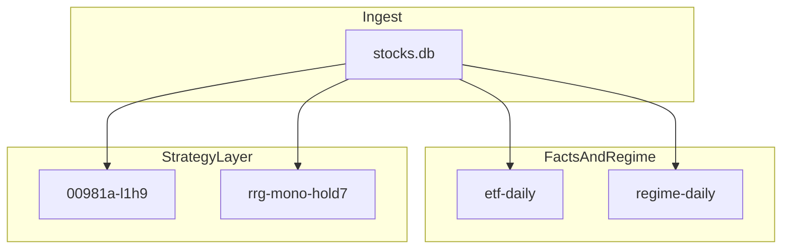

# ETF Holdings Research · Parallel Alpha Tracks

台股 ETF 持股研究 · 本地 **SQLite**（`data/stocks.db`）+ market data ingest + **Facts / Regime daily** + 並行 strategy 研究。

架構：[docs/architecture.md](docs/architecture.md) · 術語：[docs/terminology.md](docs/terminology.md) · 營運：[docs/daily-operations.md](docs/daily-operations.md)

> **免責**：產出僅供個人研究，不構成投資建議。

## Glossary

| Canonical term | 說明 |
|----------------|------|
| **Parallel alpha tracks** | 多軌並行 · no ensemble · 各層 VFP 見 [terminology.md](docs/terminology.md) §1.1 |
| **Facts layer** | 持股 diff 事實 · `etf-daily` · 不選股不評分 |
| **Regime layer** | 四軸 market diagnostic · 非 alpha |
| **Research layer** | 探索主題 · sweep · `config/research.yaml` |
| **Strategy layer** | 採納規格 · screen / backtest · `config/strategy.yaml` |

清障清單：[docs/terminology-audit.md](docs/terminology-audit.md)

## Architecture



| Layer | 設定 · 模組 |
|-------|-------------|
| Data | `sync_*` → `stocks.db` |
| Facts / Regime | `config/strategies.yaml` · `etf_daily_report` · `regime_daily_brief` |
| Strategy | [`config/strategy.yaml`](config/strategy.yaml) · copytrade / VCP / RRG launchd |
| Research | [`config/research.yaml`](config/research.yaml) · sweep / 矩陣 |
| Ex-post | 手動回測 JSON · [evaluation-contract.md](docs/evaluation-contract.md) |
| Execution | Out of scope |

模組分層：[docs/src-map.md](docs/src-map.md)

## Backtest（手動 · `strategy.yaml`）

| 入口 | 內容 |
|------|------|
| [`config/strategy.yaml`](config/strategy.yaml) → `strategies.*.backtest` | 採納規格 · JSON 路徑 |
| [`config/research.yaml`](config/research.yaml) → `topics.*` | 探索 sweep · 矩陣 |
| `scripts/run_factor_validation.py` | VCP 因子 IC 檢定（可選） |
| `scripts/write_copytrade_slot_summary.py` | L1H9 slot JSON 匯出 |

## Quick start

```bash
cd "/path/to/股票研究"
python3 -m venv .venv && source .venv/bin/activate
pip install -r requirements.txt
cp .env.example .env
# 編輯 TEJ_API_KEY、FINMIND_TOKEN
scripts/1630收盤雷達.command
```

```bash
make install      # 首次：venv + requirements.txt
make install-dev  # + ruff / coverage（CI 同款）
make test         # 全量 unittest
make ci           # ruff + test + coverage
```

## Daily reading

| 檔案 | 內容 |
|------|------|
| [`reports/daily/etf-daily/daily_brief.md`](reports/daily/etf-daily/daily_brief.md) | **Facts** · 各檔 ETF 持股變化 |
| [`reports/daily/regime/daily_brief.md`](reports/daily/regime/daily_brief.md) | **Regime** · 四軸市場診斷 |
| `reports/daily/vcp_funnel_specs_daily_brief.md` | VCP Pivot Gate + Coil Close（13:00 launchd） |
| `reports/daily/rrg_mono_daily.md` | RRG mono 收盤確認（16:40 launchd） |
| [`reports/research/00981a-copytrade/`](reports/research/00981a-copytrade/) | L1H9 跟單回測（手動） |

SOP：[docs/daily-operations.md](docs/daily-operations.md) · 產品範圍：[docs/PRD.md](docs/PRD.md)
