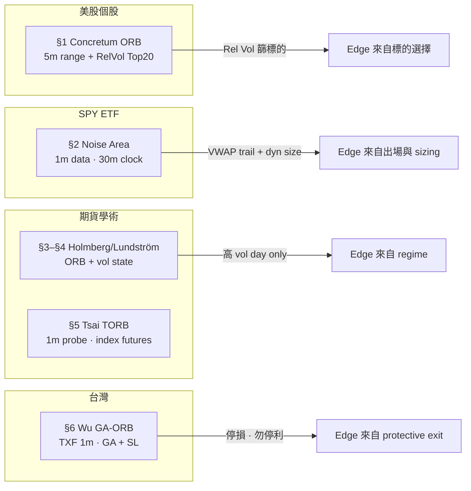

# 1 分 K 專業研究回測文獻彙編 · Backtest Literature Compendium


| Field   | Value                                                                                                          |
| ------- | -------------------------------------------------------------------------------------------------------------- |
| Version | 2026-06-28                                                                                                     |
| Layer   | Research layer（探索參考）· 非 `config/strategy.yaml` 採納規格                                                            |
| Scope   | **僅收錄有公開回測報告或 peer-reviewed 論文**的 intraday 策略；各研究**獨立成章**，不混讀規則或數字                                             |
| 免責      | 原文獻方法論整理；未經本專案回測驗證；樣本、成本、撮合假設各異，不可直接相加或套用台股個股                                                                  |
| 相關      | 方法目錄 `[1m-intraday-strategy-catalog.md](1m-intraday-strategy-catalog.md)` · 本專案驗證結論 `[1分K策略筆記.md](1分K策略筆記.md)` |


---

## 使用說明

1. **一章 = 一篇研究**：進場、出場、成本、樣本、績效表各自獨立；勿把 A 論文的 Sharpe 與 B 論文的年化報酬混算。
2. **1 分 K 角色**：多數論文以 1 分 OHLC(V) 為**資料粒度**或**執行解析度**；訊號週期可能是 5 分 ORB、半小時 momentum 等——每章「時間框架」欄位會標明。
3. **回測步驟**：每章末尾附「可複現步驟 checklist」，盡量對照原文 Section 編號。
4. **台股適用性**：§6–§7 為台指期／TAIEX；§1–§2 為美股；§3–§5 為期貨學術。移植前需重跑 OOS。

---

## 目錄


| §                                                       | 研究                                | 市場                | 資料粒度            | 總報酬／年化（原文）                                            |
| ------------------------------------------------------- | --------------------------------- | ----------------- | --------------- | ----------------------------------------------------- |
| [1](#1-concretum-5-minute-orb--stocks-in-play)          | Concretum 5m ORB + Rel Vol        | 美股 7k+            | 5 分定區 · 可 1 分執行 | **1,637%** total · **41.6%** IRR · Sharpe **2.81**    |
| [2](#2-concretum-spy-intraday-momentum-noise-area)      | Concretum SPY Noise Area momentum | SPY               | **1 分 OHLCV**   | **1,985%** total · **19.6%** annual · Sharpe **1.33** |
| [3](#3-holmberg-et-al-2013-orb-crude-oil)               | Holmberg ORB（原油）                  | 美原油期貨             | 日 OHLC          | 顯著 > 0 · **非全樣本穩健**                                   |
| [4](#4-lundström-et-al-orb--volatility-states)          | ORB × Volatility state            | 原油 + S&P500 期貨    | 日 OHLC          | 高/低波動 state 差 **~200 / ~150 bps/日**                   |
| [5](#5-tsai-et-al-2019-torb)                            | Tsai TORB                         | 五市指數期貨含 **TAIEX** | **1 分 K**       | TAIEX 最佳 **20.28%** 年化                                |
| [6](#6-wu-et-al-2021-ga-orb-txf)                        | Wu GA-ORB                         | **台指期 TXF**       | **1 分 OHLC**    | **9.30%** 年化 · Sharpe **2.50**                        |
| [7](#7-maroy-2025-spy-momentum-improvements)            | Maroy SPY momentum 延伸             | SPY               | 1 分（延伸 §2）      | Sharpe **> 3.0** · 年化 **> 50%**（優化後）                  |
| [A](#appendix-a-stratbase-1m-scalping-cost-stress-test) | StratBase 成本壓力測試                  | BTC/USDT          | 1 分             | 多數模板 **PF < 1**                                       |
| [B](#appendix-b-ict-silver-bullet-am-open-source)       | ICT Silver Bullet AM（開源）          | NQ                | 1 分             | 需自行跑 `backtest.py`                                    |


---

## 1. Concretum — 5-Minute ORB + Stocks in Play

### 1.1 文獻資訊


| 項目  | 內容                                                                                                                                                                                                                             |
| --- | ------------------------------------------------------------------------------------------------------------------------------------------------------------------------------------------------------------------------------ |
| 標題  | *A Profitable Day Trading Strategy For The U.S. Equity Market*                                                                                                                                                                 |
| 作者  | Carlo Zarattini, Andrea Barbon, Andrew Aziz                                                                                                                                                                                    |
| 期間  | 2016-01-01 — 2023-12-31                                                                                                                                                                                                        |
| 宇宙  | > 7,000 檔美股                                                                                                                                                                                                                    |
| 連結  | [PDF](https://concretumgroup.com/wp-content/uploads/2026/02/A-Profitable-Day-Trading-Strategy-For-The-U.S.-Equity-Market.pdf) · [摘要頁](https://concretumgroup.com/a-profitable-day-trading-strategy-for-the-u-s-equity-market/) |


### 1.2 策略假設（原文）

- Opening Range Breakout（ORB，開盤區間突破）：開盤後前 **5 分鐘**（9:30–9:35 ET）供需失衡若延續，日內趨勢可交易。
- **Stocks in Play（當日異常活躍股）**：當日成交量顯著高於近期均量，常由財報、FDA、併購等 fundamental catalyst 驅動。
- **Relative Volume（相對量）**：開盤 5 分鐘成交量相對於過去 14 日同時段均量；原文 Figure 4 顯示 Rel Vol 與 ORB 每筆 PnL（R 單位）正相關。

### 1.3 Base Strategy（§2.1）— 無 Rel Vol 篩選

**標的前篩（每日、PIT）：**

1. 開盤價 > $5
2. 過去 14 日平均日成交量 ≥ 1,000,000 shares
3. 過去 14 日 ATR > $0.50

**Opening Range（5 分）：**

- 區間：9:30–9:35 ET 的 high / low。  
- 若第一根 5 分為 **陽線**（close > open）→ 在 **5-minute high** 掛 **stop buy**。  
- 若 **陰線** → 在 **5-minute low** 掛 **stop sell**。  
- 若 **doji**（open = close）→ **不下單**。

**進場後風控：**

- **Stop loss（停損）**：成交價 ± **10% × 14-day ATR**（per share）。  
- **Profit target（停利）**：若日內未觸停損 → **16:00 ET 收盤平倉**（EOD）。  
- **Position sizing（部位）**：若停損被觸發，該筆虧損 ≤ 該筆配置資金的 **1%**；最大槓桿 **4×**（FINRA 零售券商慣例）。  
- 當日符合篩選且 opening range 有方向的標的組成 **long-short portfolio**。

**回測設定：**


| 參數   | 值                                              |
| ---- | ---------------------------------------------- |
| 初始資金 | $25,000                                        |
| 佣金   | $0.0035 / share（IB Pro Tiered 入門費率，2023-12-31） |
| 滑價   | 原文未單獨列項（含在撮合假設中）                               |


**Base 績效（Table 1）：**


| 指標           | ORB Base | S&P 500 B&H |
| ------------ | -------- | ----------- |
| Total Return | 29%      | 198%        |
| IRR（年化）      | 3.2%     | 14.2%       |
| Volatility   | 6.6%     | 18.3%       |
| Sharpe Ratio | 0.48     | 0.78        |
| Hit Ratio    | 41.4%    | 54.9%       |
| MDD          | 13%      | 34%         |
| Worst Day    | -0.8%    | -10.9%      |
| Alpha        | 3.3%     | 0%          |
| Beta         | 0.01     | 1.00        |


### 1.4 Enhanced Strategy（§4）— ORB + Relative Volume

在 Base 篩選上**追加**：

1. Opening range **Relative Volume ≥ 100%**
2. 僅交易當日 Rel Vol **Top 20** 檔

**Relative Volume 公式（原文 Eq.）：**

```
RelativeVolume_{t,j} = ORVolume_{t,j} / ( (1/14) × Σ_{i=1}^{14} ORVolume_{t-i,j} )
```

其中 `ORVolume_{t,j}` = 股票 j 在第 t 日開盤前 5 分鐘成交量。

進場、停損、EOD 出場、1% risk sizing、4× 槓桿上限 — **與 Base 相同**。

**Enhanced 績效（Table 2）：**


| 指標           | ORB + Rel Vol | ORB Base | S&P 500 |
| ------------ | ------------- | -------- | ------- |
| Total Return | **1,637%**    | 29%      | 198%    |
| IRR          | **41.6%**     | 3.2%     | 14.2%   |
| Volatility   | 14.8%         | 6.6%     | 18.3%   |
| Sharpe Ratio | **2.81**      | 0.48     | 0.78    |
| Hit Ratio    | 48.4%         | 41.4%    | 54.9%   |
| MDD          | 12%           | 13%      | 34%     |
| Worst Day    | -1.61%        | -0.8%    | -10.9%  |
| Alpha        | **35.8%**     | 3.3%     | 0%      |
| Beta         | 0.00          | 0.01     | 1.00    |


- $25,000 初始 → 約 **$435,000**（net of commission）。  
- 原文強調：參數具 **economic rationale**，非事後 grid search；但仍需 OOS 驗證。

**Rel Vol 分組（Figure 4，每筆期望 PnL）：**


| Relative Volume | 平均 PnL（R） |
| --------------- | --------- |
| < 100%          | -0.02R    |
| ≥ 100%          | +0.08R    |
| > 30×（3,000%）   | +0.38R    |


### 1.5 其他時間框架（§5，Table 3）

同 §4 規則，僅 opening range 改為 15 / 30 / 60 分鐘；Rel Vol 在對應前 n 分鐘計算。


| 策略                    | Total Return | IRR       | Sharpe   | MDD |
| --------------------- | ------------ | --------- | -------- | --- |
| **5m-ORB + Rel Vol**  | **1,637%**   | **41.6%** | **2.81** | 12% |
| 15m-ORB + Rel Vol     | 272%         | 17.4%     | 1.43     | 11% |
| 30m-ORB + Rel Vol     | 21%          | 2.3%      | 0.21     | 35% |
| 60m-ORB + Rel Vol     | 39%          | 4.1%      | 0.40     | 21% |
| COMBO（等權 5/15/30/60m） | 234%         | 15.8%     | 1.99     | 7%  |


### 1.6 回測複現步驟（對照原文）

```
[資料]
□ 取得 2016–2023 美股 1 分（或 5 分）OHLCV；能還原 9:30–9:35 ET opening range
□ 計算每檔 14-day ADV、14-day ATR

[每日 9:35 ET 後]
□ 篩選：open > $5 · ADV14 ≥ 1M · ATR14 > $0.50
□ 計算 Rel Vol（5 分 OR volume / 14 日均 OR volume）
□ Enhanced：Rel Vol ≥ 100% · 取 Top 20
□ 判斷 5 分 K 方向 → stop order @ range high 或 low（doji 跳過）

[成交後]
□ Stop loss = entry ± 10% × ATR14
□ 未觸停損 → 16:00 ET 市價平倉
□ Size：停損 = 1% of allocated capital · max leverage 4×

[成本]
□ Commission $0.0035/share 雙向

[輸出]
□ 日報酬序列 → Total/IRR/Sharpe/MDD/Hit/Alpha/Beta
□ 對照 S&P 500 buy-and-hold
```

---

## 2. Concretum — SPY Intraday Momentum（Noise Area）

### 2.1 文獻資訊


| 項目  | 內容                                                                                                                                           |
| --- | -------------------------------------------------------------------------------------------------------------------------------------------- |
| 標題  | *Beat the Market: An Effective Intraday Momentum Strategy for S&P500 ETF (SPY)*                                                              |
| 作者  | Carlo Zarattini, Andrew Aziz, Andrea Barbon                                                                                                  |
| 期間  | 2007-05 — 2024-04（IQFeed 1 分資料）                                                                                                              |
| 標的  | SPY · VIX（regime 分析）                                                                                                                         |
| 連結  | [PDF](https://concretumgroup.com/wp-content/uploads/2026/02/Beat-the-Market.pdf) · [RePEc](https://ideas.repec.org/p/chf/rpseri/rp2497.html) |


### 2.2 核心概念 — Noise Area（雜訊區）

價格在 **Noise Area（供需均衡區）** 內 → 不持倉。  
突破 **Upper Boundary** → 異常買壓 → 做多；跌破 **Lower Boundary** → 做空。

**邊界計算（day t，時刻 HH:MM）— 原文 §3 Steps 1–4：**

1. 對過去 14 日，每 day t−i、同一時段 9:30→HH:MM，計算自開盤絕對位移：
  `move_{t-i,9:30→HH:MM} = Close_{t-i,HH:MM} / Open_{t-i,9:30} − 1`
2. 對每個 HH:MM，取 14 日平均：
  `σ_{t,9:30→HH:MM} = (1/14) Σ move_{t-i,9:30→HH:MM}`
3. 初版邊界（含 overnight gap 調整）：
  ```
   UpperBound = max(Open_{t,9:30}, Close_{t-1,16:00}) × (1 + σ)
   LowerBound = min(Open_{t,9:30}, Close_{t-1,16:00}) × (1 − σ)
  ```
4. **Volatility Multiplier（VM）** 擴寬/縮窄 Noise Area（§4.4）：
  ```
   UpperBound = max(Open_{t,9:30}, Close_{t-1,16:00}) × (1 + VM × σ)
   LowerBound = min(Open_{t,9:30}, Close_{t-1,16:00}) × (1 − VM × σ)
  ```
   正文主結果用 **VM = 1**；Figure 9 顯示 VM ≈ 1.5 時 risk-adjusted 可能更佳。

### 2.3 進出場規則（Base → Refined）

**Base model（§3）：**


| 規則         | 內容                                                      |
| ---------- | ------------------------------------------------------- |
| 進場時點       | 僅 **HH:00 與 HH:30** 評估（半小時 bar），非 tick 即時               |
| 進場條件       | 價格 > UpperBound → long；< LowerBound → short             |
| 出場         | 收盤 16:00 平倉；或穿越**對側**邊界 → 平倉並反向開倉                       |
| Stop（Base） | 對側 Noise Area 邊界作 trailing stop                         |
| 部位         | 每日初 `Shares = AUM_{t-1} / Open_{t,9:30}`（100% notional） |


**Refinement A — Current band stop（§4）：**

- Long trailing stop = **Upper Boundary**（非對側）  
- 例：2022-01-20 虧損由 -2.19% 改善至 -0.31%

**Refinement B — VWAP + Current band（§4，Table 2 主策略）：**

```
Long  TrailingStop = max(UpperBound, VWAP)
Short TrailingStop = min(LowerBound, VWAP)
```

- VWAP 僅用 **regular trading hours** 資料（另文 [5]）。  
- 2022-01-20 案例：含 VWAP 後 13:00 平倉 → 接近 break-even。

**Refinement C — Dynamic sizing（§4，Table 3 最終版）：**

- 目標日波動 **σ_target = 2%**  
- `Shares_t = AUM_{t-1} × min(4, σ_target / σ_SPY,t) / Open_{t,9:30}`  
- `σ_SPY,t` = 過去 14 日 SPY 日報酬標準差  
- 最大槓桿 **4×**

### 2.4 回測設定


| 參數                               | 值                         |
| -------------------------------- | ------------------------- |
| 初始資金                             | $100,000                  |
| 資料                               | IQFeed **1-minute OHLCV** |
| 佣金                               | $0.0035 / share           |
| 滑價                               | $0.001 / share            |
| 工具                               | Matlab R2023a             |
| 約 20% 交易日享較低佣金（月量 > 300k shares） |                           |


### 2.5 績效表（原文 Table 1–3）


| 版本             | Stop                        | Size    | Total Return | IRR       | Vol   | Sharpe   | Hit | MDD | Alpha     |
| -------------- | --------------------------- | ------- | ------------ | --------- | ----- | -------- | --- | --- | --------- |
| Momentum       | Opp.Band                    | 100%    | 178%         | 6.2%      | 10.9% | 0.61     | 54% | 21% | 7.1%      |
| Momentum       | **Curr.Band + VWAP**        | 100%    | 380%         | 9.7%      | 7.7%  | **1.24** | 43% | 12% | 9.9%      |
| Momentum       | **Curr.Band + VWAP + Dyn.** | dynamic | **1,985%**   | **19.6%** | 14.3% | **1.33** | 43% | 25% | **19.6%** |
| SPY Buy & Hold | —                           | 100%    | 227%         | 7.2%      | 20.2% | 0.45     | 54% | 56% | —         |


**單筆極值（Table 4）：** 最佳單日 **+9.1%** · 最差 **−2.9%**  
**回歸：** Alpha **19.6%** 高度顯著 · Beta 略 < 0  

**子樣本（§5）：**

- VIX@open > 40 → Sharpe 約 **3.50**（樣本少、分散大）  
- 週三–五獲利統計顯著 · 週一不顯著（與 ORB 論文 Monday effect 不一致）

### 2.6 回測複現步驟

```
[資料]
□ SPY + VIX：2007-05 起 1 分 OHLCV（IQFeed 或等價）
□ 僅 RTH 09:30–16:00 ET

[每日迴圈]
□ 09:30 記 Open；用前 14 日同時段 move 算 σ_{t,HH:MM}
□ 含 gap：Upper/Lower 用 max/min(Open, PrevClose)
□ 每 HH:00、HH:30：
    - 若 price > UpperBound → long
    - 若 price < LowerBound → short
□ Trailing stop（依版本）：
    v1 對側邊界 · v2 max(UB,VWAP) / min(LB,VWAP)
□ 16:00 強制平倉
□ Dynamic size：Shares ∝ min(4, 0.02/σ_SPY14d)

[成本]
□ $0.0035/share commission + $0.001 slippage
□ 可重跑 Figure 10 佣金敏感度

[輸出]
□ 權益曲線 · Sharpe · MDD · Hit · VIX regime 分組
```

---

## 3. Holmberg et al. (2013) — ORB · Crude Oil

### 3.1 文獻資訊


| 項目  | 內容                                                                          |
| --- | --------------------------------------------------------------------------- |
| 標題  | *Assessing the profitability of intraday opening range breakout strategies* |
| 期刊  | Finance Research Letters, 10(1), 27–33                                      |
| 作者  | Ulf Holmberg, Carl Lönnbark, Christian Lundström                            |
| 資料  | 美原油期貨 CSI · 1983-03-30 — 2011-01-26                                         |
| 連結  | [PDF](http://www.econ.umu.se/ueslpnr/ues845.pdf)                            |


### 3.2 策略規則

**ORB 邏輯（Crabel 1990）：** 開盤價上下 **threshold ρ** 突破 → 日內動量延續 → **收盤平倉**。

**Threshold 標定（normal distribution tail）：**

- 令 α = tail probability（如 10%, 5%, 1%, 0.5%, 0.1%）  
- ρ = 使當日 |return| 落在 α 尾部的 **百分比位移**（由歷史 close-to-open 等統計推出）  
- **Long**：日 high 觸及 `Open × (1 + ρ)` → 在 threshold 成交 · 收盤平倉  
- **Short**：日 low 觸及 `Open × (1 − ρ)` → 同上

**假設（理想化）：**

- 完美成交於 threshold · 零 spread · 零佣金  
- 分 long / short **獨立**評估（非 Long Strangle）

### 3.3 回測方法

- Bootstrap（Brock et al. 1992 精神）檢定 **R̄ > 0**  
- 全樣本 + 三段子期間：1983–1992 · 1992–2001 · **2001–2011**

### 3.4 績效（Table 2 摘錄 — Full sample, Long, α = 0.5%）


| 指標           | 值                   |
| ------------ | ------------------- |
| ρ            | 1.8680%             |
| 交易數 N        | 141                 |
| 勝率 freq.     | 60.28%              |
| 平均報酬 R̄_long | **0.3108%** / trade |
| p-value      | 0.0002              |


**α 越緊（尾端越小）→ 勝率與 R̄ 上升，但 N 下降**（Figure 3）。

**穩健性結論（原文 Abstract）：**

- 全樣本 ORB **顯著優於零**  
- **子樣本不穩健**：正報酬**主要來自 2001-10-12 — 2011-01-26** 高波動段  
- ORB 本質上 **long volatility** 方向策略

### 3.5 回測複現步驟

```
□ 日線 O/H/L/C 原油連續或 roll 邏輯對齊 CSI
□ 估 close-to-open 分布 → 對每 α 算 ρ
□ Long：若 High ≥ Open×(1+ρ) → ret = Close/Open - 1 - 1（log 版見原文）
□ Short：若 Low ≤ Open×(1-ρ) → 類推
□ Bootstrap 檢定 H0: E[ret]=0
□ 分子期間重跑 · 對照 2001–2011 子樣本
```

---

## 4. Lundström et al. — ORB × Volatility States

### 4.1 文獻資訊


| 項目  | 內容                                                                       |
| --- | ------------------------------------------------------------------------ |
| 標題  | *Day trading returns across volatility states*                           |
| 作者  | Christian Lundström, Carl Lönnbark, Ulf Holmberg                         |
| 資料  | 原油期貨 1991+ · **S&P 500 期貨**                                              |
| 方法  | ORB **Long Strangle** + 波動 decile 分組                                     |
| 連結  | [PDF](https://www.diva-portal.org/smash/get/diva2:732318/FULLTEXT02.pdf) |


### 4.2 策略規則（ORB Long Strangle）

同時掛：

- Long stop @ `Open + δ`（δ = range，log return %）  
- Short stop @ `Open − δ`

**三種結果（Eq. 4）：**

1. 僅觸上軌 → 持有多至收盤
2. 僅觸下軌 → 持有空至收盤
3. **雙向皆觸** → 虧損 `−2δ` · **當日停止交易**

Stop loss：對側 threshold（最大虧 `-2δ`）。

**測試 δ：** {0.5%, 1.0%, 1.5%, 2.0%}

**Volatility state：** 以**前一日絕對日報酬**分 10 decile（1 = 最低波 · 10 = 最高波）。

### 4.3 主要發現（Figures 6–13）


| 現象                              | 原油                 | S&P 500 期貨     |
| ------------------------------- | ------------------ | -------------- |
| Vol state ≤ 3                   | 日均 ORB 報酬 **顯著為負** | 同左             |
| Vol state ≥ 7                   | 日均 ORB 報酬 **顯著為正** | 同左             |
| State 10 vs State 1 日均差（δ=0.5%） | **~200 bps/日**     | **~150 bps/日** |
| 更大 δ                            | 差距**更大**           | 同左             |


**實務含意（§5）：**

- 長期獲利可能需要 **每天交易** 或 **只在高波動日交易**  
- 交易者**無法事前確知** vol state → 需 vol 預測或以 **大 δ 本身** 作 vol filter（Crabel/Williams/Fisher 作法）

### 4.4 回測複現步驟

```
□ 日 O/H/L/C：原油 + ES 期貨長序列
□ 對每 δ 實作 Long Strangle 日報酬（Eq. 4）
□ 以 lag-1 |daily return| 分 10 decile
□ 各 state 跑 regression Eq.(5) · Newey-West HAC
□ 畫 state 1–10 平均日報酬（bp）· 95% CI
□ 切分子樣本對照 HLL(2013) 2001–2011 段
```

---

## 5. Tsai et al. (2019) — TORB

### 5.1 文獻資訊


| 項目  | 內容                                                                                      |
| --- | --------------------------------------------------------------------------------------- |
| 標題  | *Assessing the Profitability of Timely Opening Range Breakout on Index Futures Markets* |
| 期刊  | IEEE Access, vol. 7, 32061–32071                                                        |
| 作者  | Yi-Cheng Tsai, Mu-En Wu, Jia-Hao Syu, et al.                                            |
| 期間  | **2003 — 2013**                                                                         |
| 市場  | E-mini DJIA · S&P500 · NASDAQ · **HSI · TAIEX**                                         |
| 連結  | [DOI](https://doi.org/10.1109/access.2019.2899177)                                      |


### 5.2 TORB 規則

**Timely ORB（TORB）** 用 **1 分 K** 在開盤活躍時段定義區間：


| 符號  | 意義                          |
| --- | --------------------------- |
| t_b | 活躍時段起點 = **現貨開盤**           |
| t_p | **Probe time（探測終點）** — 可調參數 |
| t_e | 活躍時段終點 = **現貨收盤**           |


**阻力 / 支撐：**

- Resistance = max(P_{t_b}, …, P_{t_p})  
- Support = min(P_{t_b}, …, P_{t_p})

**訊號（t_p < t < t_e）：**

```
若 P_t > Resistance → Buy
若 P_t < Support    → Sell
```

持倉至 **t_e 當日平倉**。含 **transaction costs**（原文 footnote 3）。

**活躍時段（§IV-A）：** 對齊各指數**現貨**開收盤（PMMV/PMVR 峰值驗證）。


| 市場        | 現貨開收（論文）                               |
| --------- | -------------------------------------- |
| 美股 E-mini | 8:30 — 15:00 ET                        |
| HSI       | 10:00 — 16:00                          |
| **TAIEX** | **9:00 — 13:30**（期貨另有 8:45 / 13:45 峰值） |


### 5.3 最佳 Probe time（Table 6 摘要）


| 市場            | 最佳 t_p    | 備註                             |
| ------------- | --------- | ------------------------------ |
| E-mini DJIA   | **4 分**   | 美系偏短                           |
| E-mini S&P500 | **1 分**   |                                |
| E-mini NASDAQ | **1 分**   | 最佳 TORB 年化 **17.51%**          |
| HSI           | **151 分** | 午休結構                           |
| **TAIEX**     | **37 分**  | **年化 20.28%** · p = **1×10⁻⁴** |


**全市場：** 最佳 TORB 年化均 **> 8%** · p < **3%**  
**2003–2007 vs 2007–2013** 子期：表現一致（TRB 日線版**無**一致顯著）

### 5.4 TAIEX 附加研究（§IV-C）

- 2006-07-01 — 2013-12-31 台指期**逐筆**資料  
- TORB 訊號與**法人**淨買超同向 · 與**散戶**反向  
- 外資機構 breakout 後相關最強

### 5.5 回測複現步驟

```
[資料]
□ 五市指數期貨 1 分 K · 2003–2013
□ 對齊現貨 active hours

[對每個 t_p 候選]
□ 算 Resistance/Support = [t_b, t_p] high/low
□ 掃描 t_p < t < t_e：突破進場 · t_e 平倉
□ 扣除交易成本

[統計]
□ 平均年化報酬 · t-test H0: return=0 · 交易次數
□ 畫 probe time 曲線（Figure 7–13 格式）
□ TAIEX：t_p=37 對照 20.28% 基準
□ 子期 2003–07 / 2007–13 穩健性
```

---

## 6. Wu et al. (2021) — GA-ORB · 台指期

### 6.1 文獻資訊


| 項目  | 內容                                                                                   |
| --- | ------------------------------------------------------------------------------------ |
| 標題  | *Evolutionary ORB-based model with protective closing strategies*                    |
| 期刊  | Knowledge-Based Systems, 2021                                                        |
| 作者  | Jia-Hao Syu, Mu-En Wu, Shin-Huah Lee, Jan-Ming Ho                                    |
| 商品  | **台指期 TXF**                                                                          |
| 期間  | **2007-11-01 — 2018-12-31**                                                          |
| 資料  | **1 分 OHLC**（TAIFEX）· ~10⁶ bars                                                      |
| 連結  | [ScienceDirect](https://www.sciencedirect.com/science/article/pii/S0950705121000320) |


### 6.2 策略元件

#### A. 原始 ORB（Benchmark）

- Opening range（原文 §2.1：**開盤後 15–30 分**區間 high/low = h, l）  
- 突破 h → long · 跌破 l → short  
- 日內平倉 · **無** threshold 調整 · **無** protective closing

#### B. TA_ORB — Threshold Adjusting（Syu et al. 前置）

```
B_u = h + ε1 × σ
B_l = l + ε2 × σ
```

- σ = opening range 內價格標準差（**逐日變動**）  
- ε1, ε2 = 閾值調整係數（GA 優化）

#### C. Protective Closing

**Stop-loss（推薦）：**

- SL threshold = `T_SL × (B_u − B_l)`  
- T_SL ∈ {1/3, 2/3, 1, ∞}（∞ = 不啟用）

**Take-profit（原文不推薦）：**

- TP = `T_TP × (B_u − B_l)` · RDD ∈ {1/3, 2/3, 1, ∞}  
- 觸 TP 後若回撤 > RDD × max unrealized gain → 平倉  
- **Table 5：SLTP 嚴重傷害績效** — 「do not recommend take-profit」

#### D. GAORB 框架


| GA 參數             | 設定                                          |
| ----------------- | ------------------------------------------- |
| Population        | 25                                          |
| Crossover P_cross | 80%                                         |
| Mutation P_mutate | 5%                                          |
| 終止                | 100 代 **或** 50 代無改善                         |
| Fitness           | **Return**（GA_Ret）或 **Sharpe**（GA_Sharpe）   |
| Walk-forward      | **前 2 月 train → 下 1 月 test** · 每月 slide     |
| ε 搜尋              | [−σ, σ] step σ/32 · 64 值 · 6-bit 編碼         |
| 損益單位              | **點數**（1 點 = 200 NTD）· 固定 **1 口** · 不計保證金槓桿 |


### 6.3 績效表（原文 Table 3–5）

**無 protective closing（Table 3）：**


| 模型        | Total profit (pts) | 年化     | Win rate | Sharpe | PF    | MDD (pts) |
| --------- | ------------------ | ------ | -------- | ------ | ----- | --------- |
| Benchmark | 6,579              | 6.520% | 50.475%  | 1.473  | 1.095 | 2,638     |
| GA_Ret    | 8,141              | 8.068% | 51.067%  | 1.810  | 1.118 | 1,824     |
| GA_Sharpe | 8,380              | 8.305% | 51.304%  | 1.865  | 1.122 | 1,780     |


**+ Stop-loss（Table 4 — 原文推薦 GA_Sharpe_SL）：**


| 模型               | Total profit | 年化         | Win rate | Sharpe    | PF    | MDD       |
| ---------------- | ------------ | ---------- | -------- | --------- | ----- | --------- |
| Benchmark        | 6,579        | 6.520%     | 50.475%  | 1.473     | 1.095 | 2,638     |
| GA_Ret_SL        | 9,154        | 9.071%     | 42.756%  | 2.302     | 1.158 | 1,401     |
| **GA_Sharpe_SL** | **9,388**    | **9.303%** | 39.017%  | **2.495** | 1.177 | **1,336** |


- 年化 +2.667% vs benchmark · Sharpe +0.926 · **MDD 約減半**  
- 2018 貿易戰：SL 版仍正報酬 · 無 SL 版大虧

**+ Stop-loss + Take-profit（Table 5 — 不推薦）：**

| GA_Sharpe_SLTP | 年化 4.051% · Sharpe 1.320 · 低於 GA_Sharpe_SL |

### 6.4 回測複現步驟

```
[資料]
□ TXF 1 分 OHLC · 2007-11 — 2018-12

[Benchmark ORB]
□ 開盤後 15–30 分定 h,l · 突破進場 · 收盤平倉

[GAORB 每月]
□ Train = 前 2 月 · Test = 次月
□ GA 優化 ε1,ε2,T_SL,(T_TP,RDD) · fitness = Sharpe 或 Return
□ Test 月套用最佳染色體

[Protective]
□ SL = T_SL × (Bu−Bl) · 僅 SL 版
□ 對照 SLTP 驗證原文「停利有害」結論

[輸出]
□ 累積點數 · 年化 · Sharpe · MDD · 與 TXF 價格曲線並圖
```

---

## 7. Maroy (2025) — SPY Momentum 延伸

### 7.1 文獻資訊


| 項目  | 內容                                                                                                        |
| --- | --------------------------------------------------------------------------------------------------------- |
| 標題  | *Improvements to Intraday Momentum Strategies Using Parameter Optimization and Different Exit Strategies* |
| 作者  | Ákos Maróy                                                                                                |
| 基礎  | 延伸 §2 Zarattini et al. (2024) Noise Area 框架                                                               |
| 連結  | [SSRN 5095349](https://ssrn.com/abstract=5095349)                                                         |


### 7.2 方法（摘要）

- 對 **Noise boundary** 全系參數做 optimization  
- 測試多種 **exit**：VWAP · VWAP & Ladder · Ladder  
- **最佳組合（原文 Abstract）：** Sharpe **> 3.0** · 年化 **> 50%**（vs §2 baseline 19.6% / 1.33）

### 7.3 注意

- 為 **in-sample optimization** 延伸 · 需獨立 OOS / WFO 再驗  
- 未在本文重列完整參數表 — 實作前應讀 SSRN 全文 Table

---

## Appendix A. StratBase — 1m Scalping 成本壓力測試

> **非 peer-reviewed** · 用於說明「純 1 分指標 scalping」在 realistic costs 下多數失效。


| 項目  | 內容                                                                                  |
| --- | ----------------------------------------------------------------------------------- |
| 來源  | [StratBase 1-Minute Scalping](https://stratbase.ai/en/blog/scalping-1-minute-chart) |
| 標的  | BTC/USDT · tick-derived 1s 執行                                                       |
| 成本  | 手續費 **0.075%/邊** · 滑價 **0.02%/筆** · **1s 執行延遲**                                     |


| 策略                    | 規則摘要                              | 勝率  | Net PF   | 日均 expectancy |
| --------------------- | --------------------------------- | --- | -------- | ------------- |
| VWAP/SR Bounce        | 限價 @ VWAP/POC · TP 0.4% · SL 0.2% | 58% | **1.31** | **+0.12%/日**  |
| Session Open Momentum | 開盤 4h 動量                          | 54% | 1.14     | +0.08%/日      |
| EMA 9/21 + RSI(7)     | 交叉 + RSI>50 · TP 0.25% · SL 0.15% | 48% | **0.94** | **−0.04%/日**  |


---

## Appendix B. ICT Silver Bullet AM — 開源回測


| 項目   | 內容                                                                                                          |
| ---- | ----------------------------------------------------------------------------------------------------------- |
| repo | [hindsight-finance/silver-bullet-am-session](https://github.com/hindsight-finance/silver-bullet-am-session) |
| 標的   | NQ · **1 分 K**                                                                                              |
| 輸出   | `report.html` · `trades.csv`                                                                                |


**規則（strategy / README）：**

1. **交易窗**：10:00–11:00 ET only
2. **Reference range**：9:00 整點 K 的 high / low
3. **Sweep**：10:00–11:00 內掃過 range 一側
4. **Displacement**：掃過後需 aggressive 位移 K 回到 range 內
5. **Entry**：Fair Value Gap / Order Block / Breaker Block
6. **Stop**：sweep 外 · **Target**：range 對側 · **3R → stop 移至 BE**
7. **Risk**：1% / trade · 11:00 前無 setup → skip

**回測步驟：**

```bash
git clone https://github.com/hindsight-finance/silver-bullet-am-session.git
cd silver-bullet-am-session
# 需 nq_1m.parquet（ET 時間戳 1 分 OHLC）
python backtest.py
# → report.html, trades.csv
```

> 原文 `strategy.md` 未附 aggregate Sharpe/年化；第三方站自報數字**不納入**上文績效表。

---

## 跨研究對照（僅結構 · 不混算報酬）




---

## 與本專案 `1分K策略筆記` 的關係


| 外部研究共通點                        | 本專案 Part B/C 驗證                              |
| ------------------------------ | -------------------------------------------- |
| 標的 / session / vol 篩選          | `opening_spike` F3T · `combo_spike` 需定池      |
| ORB / 動量延續                     | `opening_spike` OOS +0.40pp 進場 ✓             |
| 通用 VWAP / 指標 mean-reversion 進場 | `vwap_reclaim` **−0.97pp** ✗                 |
| 停利過早                           | Wu：**take-profit 有害** · I36 fade 作**出場**而非追進 |


---

## 參考文獻（完整引用）

1. Zarattini, C., Barbon, A., Aziz, A. (2024/2026). *A Profitable Day Trading Strategy For The U.S. Equity Market*. Concretum Research.
2. Zarattini, C., Aziz, A., Barbon, A. (2024). *Beat the Market: An Effective Intraday Momentum Strategy for S&P500 ETF (SPY)*. Swiss Finance Institute RP 24-97.
3. Holmberg, U., Lönnbark, C., Lundström, C. (2013). Assessing the profitability of intraday opening range breakout strategies. *Finance Research Letters*, 10(1), 27–33.
4. Lundström, C., Lönnbark, C., Holmberg, U. Day trading returns across volatility states. Umeå Economic Studies.
5. Tsai, Y.-C., Wu, M.-E., Syu, J.-H., et al. (2019). Assessing the Profitability of Timely Opening Range Breakout on Index Futures Markets. *IEEE Access*, 7, 32061–32071.
6. Syu, J.-H., Wu, M.-E., Lee, S.-H., Ho, J.-M. (2021). Evolutionary ORB-based model with protective closing strategies. *Knowledge-Based Systems*.
7. Maróy, Á. (2025). Improvements to Intraday Momentum Strategies Using Parameter Optimization and Different Exit Strategies. SSRN 5095349.
8. Crabel, T. (1990). *Day Trading with Short Term Price Patterns and Opening Range Breakout*.

---

*Document maintainer: Research layer · 更新時請同步檢查 `docs/terminology.md` 對外術語。*