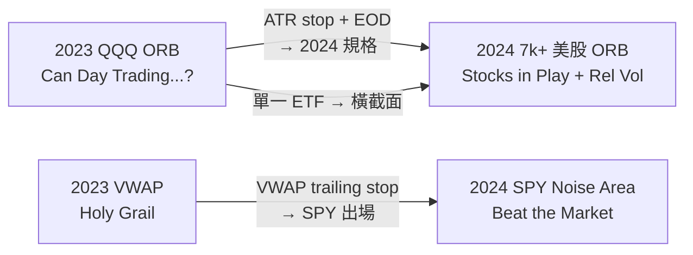

# Carlo Zarattini 研究彙編 · Concretum Intraday Research


| Field   | Value                                                                                                                                                                                            |
| ------- | ------------------------------------------------------------------------------------------------------------------------------------------------------------------------------------------------ |
| Version | 2026-06-28                                                                                                                                                                                       |
| Layer   | Research layer（探索參考）· 非 `config/strategy.yaml` 採納規格                                                                                                                                              |
| Scope   | **Carlo Zarattini** 主導或共同撰寫之 Concretum 日內量化回測論文                                                                                                                                                  |
| 免責      | 原文方法論整理；未經本專案回測驗證；樣本、成本、撮合假設各異                                                                                                                                                                   |
| 相關      | `[1m-intraday-strategy-backtest-literature.md](1m-intraday-strategy-backtest-literature.md)` · `[1m-intraday-strategy-catalog.md](1m-intraday-strategy-catalog.md)` · `[1分K策略筆記.md](1分K策略筆記.md)` |


---

## 作者與機構

**Carlo Zarattini** — Concretum Research（Lugano, Switzerland）創辦人；曾任 BlackRock 量化分析師（volatility / trend-following）；Imperial College London & USI Lugano 量化金融雙碩；R-Candles.com 共同創辦人。

**常見合作者：**


| 作者                | 機構                                                | 角色                                        |
| ----------------- | ------------------------------------------------- | ----------------------------------------- |
| **Andrew Aziz**   | Peak Capital Trading · Bear Bull Traders          | 日內策略實務 · QQQ/ORB 系列                       |
| **Andrea Barbon** | University of St.Gallen · Swiss Finance Institute | 學術 co-author · 2024 美股 ORB · SPY momentum |


**機構連結：** [Concretum Group](https://concretumgroup.com/) · [Alexandria UNISG](https://www.alexandria.unisg.ch/) · [SSRN Concretum](https://papers.ssrn.com/sol3/papers.cfm?abstract_id=4729284)

---

## 研究脈絡（演進順序）




| 年份   | 論文                                    | 核心貢獻                                                     |
| ---- | ------------------------------------- | -------------------------------------------------------- |
| 2023 | Can Day Trading Really Be Profitable? | 5m ORB on **QQQ/TQQQ**；證明槓桿 ETF 可繞過 4× 限制                |
| 2023 | VWAP The Holy Grail                   | **VWAP 方向**作為獨立 alpha；後續作 SPY 出場元件                       |
| 2024 | A Profitable Day Trading Strategy…    | **7,000+ 美股** + **Relative Volume** + **Stocks in Play** |
| 2024 | Beat the Market (SPY)                 | **Noise Area** 1 分動量 + VWAP trailing + dynamic sizing    |


---

## 論文總覽


| #     | 標題                                                                              | 作者                        | 期間        | 標的         | 主要結果                                                                                | 出處                                                                                                                                                                                                                                                                                |
| ----- | ------------------------------------------------------------------------------- | ------------------------- | --------- | ---------- | ----------------------------------------------------------------------------------- | --------------------------------------------------------------------------------------------------------------------------------------------------------------------------------------------------------------------------------------------------------------------------------- |
| **1** | *A Profitable Day Trading Strategy For The U.S. Equity Market*                  | Zarattini · Barbon · Aziz | 2016–2023 | 7,000+ 美股  | Rel Vol Top 20：**1,637%** total · IRR **41.6%** · Sharpe **2.81** · Alpha **35.8%** | [PDF](https://concretumgroup.com/wp-content/uploads/2026/02/A-Profitable-Day-Trading-Strategy-For-The-U.S.-Equity-Market.pdf) · [SSRN 4729284](https://papers.ssrn.com/sol3/papers.cfm?abstract_id=4729284) · [UNISG](https://www.alexandria.unisg.ch/handle/20.500.14171/122125) |
| **2** | *Can Day Trading Really Be Profitable?*                                         | Zarattini · Aziz          | 2016–2023 | QQQ · TQQQ | QQQ ORB alpha **33%**；TQQQ **1,484%** vs QQQ B&H **169%**                           | [PDF](https://concretumgroup.com/wp-content/uploads/2026/02/Can-Day-Trading-Really-Be-Profitable.pdf) · [SSRN 4416622](https://papers.ssrn.com/sol3/papers.cfm?abstract_id=4416622)                                                                                               |
| **3** | *Volume Weighted Average Price (VWAP) The Holy Grail for Day Trading Systems*   | Zarattini · Aziz          | 2018–2023 | QQQ · TQQQ | QQQ **671%** · Sharpe **2.1** · MDD **9.4%**；TQQQ **8,242%**                        | [摘要頁](https://concretumgroup.com/volume-weighted-average-price-vwap-the-holy-grail-for-day-trading-systems/) · [SSRN 4631351](https://papers.ssrn.com/sol3/papers.cfm?abstract_id=4631351)                                                                                        |
| **4** | *Beat the Market: An Effective Intraday Momentum Strategy for S&P500 ETF (SPY)* | Zarattini · Aziz · Barbon | 2007–2024 | SPY · VIX  | Dynamic + VWAP：**1,985%** total · IRR **19.6%** · Sharpe **1.33**                   | [PDF](https://concretumgroup.com/wp-content/uploads/2026/02/Beat-the-Market.pdf) · [RePEc rp2497](https://ideas.repec.org/p/chf/rpseri/rp2497.html)                                                                                                                               |


---

## 1. A Profitable Day Trading Strategy For The U.S. Equity Market

> **Zarattini, Barbon & Aziz (2024/2026)** — Concretum Research · University of St.Gallen · Swiss Finance Institute

### 1.1 研究問題

- Day trading 能否作為**長期、低相關**收入來源？
- Opening Range Breakout（ORB，開盤區間突破）在**橫截面美股**是否有效？
- **Stocks in Play（當日異常活躍股）** 與 **Relative Volume（相對量）** 能否解釋 ORB edge 來源？

### 1.2 資料


| 項目  | 內容                                           |
| --- | -------------------------------------------- |
| 宇宙  | NYSE + Nasdaq 全部股票 · > 7,000 檔               |
| 期間  | 2016-01-01 — 2023-12-31                      |
| 日線  | CRSP（含下市股 · 無 survivorship bias）             |
| 日內  | IQFeed 1 分/5 分 OHLCV（**未**調整 split/dividend） |
| 工具  | MATLAB R2023a                                |


### 1.3 策略規格

**標的前篩（每日 PIT）：**

1. 開盤價 > $5
2. 14 日 ADV ≥ 1,000,000 shares
3. 14 日 ATR > $0.50

**5 分 Opening Range（9:30–9:35 ET）：**

- 陽線 → stop buy @ range **high**；陰線 → stop sell @ range **low**；doji → 不交易  
- **方向過濾：** 僅順 opening range 方向（與 2023 QQQ 版一致）

**風控（Base 與 Enhanced 相同）：**

- Stop loss = entry ± **10% × 14-day ATR**  
- 未觸停損 → **16:00 ET EOD** 平倉  
- 每筆停損 = 配置資金 **1%** · max leverage **4×**  
- 佣金 **$0.0035/share** · 初始 **$25,000**

**Enhanced（§4）追加：**

1. Opening range **Rel Vol ≥ 100%**
2. 僅交易當日 Rel Vol **Top 20**

```
RelativeVolume_{t,j} = ORVolume_{t,j} / ( (1/14) × Σ_{i=1}^{14} ORVolume_{t-i,j} )
```

### 1.4 績效

**Base（全市場 ORB · Table 1）：**


| 指標           | ORB Base | S&P 500 B&H |
| ------------ | -------- | ----------- |
| Total Return | 29%      | 198%        |
| IRR          | 3.2%     | 14.2%       |
| Sharpe       | 0.48     | 0.78        |
| Alpha        | 3.3%     | 0%          |
| Beta         | 0.01     | 1.00        |
| MDD          | 13%      | 34%         |


**Enhanced（ORB + Rel Vol Top 20 · Table 2）：**


| 指標           | ORB + Rel Vol | ORB Base | S&P 500 |
| ------------ | ------------- | -------- | ------- |
| Total Return | **1,637%**    | 29%      | 198%    |
| IRR          | **41.6%**     | 3.2%     | 14.2%   |
| Sharpe       | **2.81**      | 0.48     | 0.78    |
| Alpha        | **35.8%**     | 3.3%     | 0%      |
| Beta         | 0.00          | 0.01     | 1.00    |
| MDD          | 12%           | 13%      | 34%     |
| Hit Ratio    | 48.4%         | 41.4%    | 54.9%   |


**Rel Vol 分組（Figure 4 · 每筆 PnL in R）：**


| Relative Volume | 平均 PnL |
| --------------- | ------ |
| < 100%          | -0.02R |
| ≥ 100%          | +0.08R |
| > 30×           | +0.38R |


**其他時間框架（§5 · 同 Enhanced 規則）：**


| 策略                    | Total Return | IRR       | Sharpe   | MDD |
| --------------------- | ------------ | --------- | -------- | --- |
| **5m-ORB + Rel Vol**  | **1,637%**   | **41.6%** | **2.81** | 12% |
| 15m                   | 272%         | 17.4%     | 1.43     | 11% |
| 30m                   | 21%          | 2.3%      | 0.21     | 35% |
| 60m                   | 39%          | 4.1%      | 0.40     | 21% |
| COMBO（等權 5/15/30/60m） | 234%         | 15.8%     | 1.99     | 7%  |


### 1.5 關鍵結論

- **全市場機械 ORB 無 edge**（29% << S&P 198%）；edge 來自 **高 Rel Vol 的 Stocks in Play**。  
- Beta ≈ 0 → 與大盤低相關；參數具 economic rationale，非事後 grid search（作者聲稱）。  
- 5 分框架顯著優於 15/30/60 分（原因待研究）。  
- Top 20 集中持倉 → worst day 略差（-1.61% vs -0.8%）。

### 1.6 複現 checklist

```
□ CRSP/IQFeed 2016–2023 美股 1 分或 5 分 OHLCV
□ 每日 9:35 ET：open>$5 · ADV14≥1M · ATR14>$0.50
□ Rel Vol = 5 分 OR volume / 14 日均 OR volume
□ Enhanced：Rel Vol≥100% · Top 20 by Rel Vol
□ 5 分 K 方向 → stop @ high/low · SL=10%ATR · EOD exit
□ Size：1% risk · max 4× leverage · $0.0035/share commission
```

---

## 2. Can Day Trading Really Be Profitable?

> **Zarattini & Aziz (2023)** — SSRN · First version 2023-04 · This version 2025-09

### 2.1 研究問題

- 5m ORB 能否打敗 QQQ buy-and-hold？  
- 券商 **4× 槓桿上限** 是否壓縮 ORB 報酬？  
- **TQQQ（3× leveraged ETF）** 能否替代 unconstrained leverage？

### 2.2 策略規格（與 2024 美股版之差異）


| 維度  | 2023 QQQ 版                                   | 2024 7k+ 美股版                    |
| --- | -------------------------------------------- | ------------------------------- |
| 標的  | QQQ / TQQQ 單一 ETF                            | 7,000+ 橫截面                      |
| 進場  | **第二根 5 分 K 開盤價** market entry               | **stop order @ range high/low** |
| 停損  | 第一根 5 分 **low/high**（= 當日 low/high at entry） | **10% × 14-day ATR**            |
| 停利  | **10R** 或 EOD（先到為準）                          | **EOD only**                    |
| 佣金  | $0.0005/share                                | $0.0035/share                   |
| 期間  | 2016-01-01 — 2023-02-17                      | 2016-01-01 — 2023-12-31         |
| 資料  | Interactive Brokers aggregated               | CRSP + IQFeed                   |


**Position sizing：**

```
Shares = int( min( A × 0.01 / $R , 4 × A / P ) )
```

其中 `$R = |P − StopPrice|`。

### 2.3 績效（Table 2 · 原文）


| 策略           | Total Return | 年化  | Vol | Sharpe | MDD |
| ------------ | ------------ | --- | --- | ------ | --- |
| **ORB TQQQ** | **1,484%**   | 48% | 39% | 1.19   | 28% |
| ORB QQQ      | 676%         | 33% | 29% | 1.13   | 22% |
| B&H QQQ      | 169%         | 15% | 23% | 0.73   | 36% |
| B&H TQQQ     | 438%         | 27% | 69% | 0.69   | 82% |


**回歸：** ORB QQQ alpha **33%**（p=0.0025）· beta ≈ 0 · Win rate **24%** · avg **0.13R/trade**

**槓桿約束影響（Figure 4）：**

- 無槓桿限制 QQQ ORB → **1,630%**（≈2× 有约束版）  
- **60%** 交易日部位被 4× cap 壓縮 ~40%  
- TQQQ 僅 **10%** 交易日受 cap 影響

### 2.4 參數敏感度（§4 · TQQQ）

- **最佳組合（Figure 7–8）：** stop = **5% × 14-day ATR** · profit target = **EOD**（無固定 R target）  
- 該規格 TQQQ 總報酬 **9,350%** · alpha **93%** — 作者警告大帳戶 slippage 風險  
- → 此 ATR + EOD 規格成為 **2024 美股 ORB 的標準風控**

### 2.5 關鍵結論

- 簡化 ORB on QQQ **可獲利且低 beta**；TQQQ 解決 leverage cap。  
- 低 win rate（24%）+ 高 payoff asymmetry（10R cap）→ 依賴少數大贏家。  
- §4 驗證「**cut losses short, let profits run**」：緊 ATR stop + EOD 優於 10R target。

---

## 3. Volume Weighted Average Price (VWAP) The Holy Grail for Day Trading Systems

> **Zarattini & Aziz (2023)** — SSRN · Posted 2023-12-04

### 3.1 研究問題

- VWAP 能否作為**系統化日內方向**核心訊號？  
- 與 SMA(9/20/100/200) 相比是否有優勢？  
- VWAP 應視為**完整系統**還是**其他框架的元件**？

### 3.2 策略規格


| 規則  | 內容                                                       |
| --- | -------------------------------------------------------- |
| 資料  | **1 分** intraday OHLCV                                   |
| 標的  | QQQ · TQQQ                                               |
| 進場  | close **>** VWAP → **long**；close **<** VWAP → **short** |
| 出場  | **EOD 強制平倉**（無隔夜）                                        |
| 期間  | 2018-01-02 — 2023-09-28                                  |
| 初始  | $25,000 · net of commissions                             |


> 作者明確表示：這**不是**完整 trading system，而是 **fast alpha / confirmation / dynamic trailing stop** 的 building block。

### 3.3 績效

**QQQ VWAP trend：**


| 指標           | VWAP Strategy              | QQQ B&H |
| ------------ | -------------------------- | ------- |
| Total Return | **671%** ($25k → $192,656) | 126%    |
| Sharpe       | **2.1**                    | 0.7     |
| MDD          | **9.4%**                   | 37%     |


**TQQQ 同規則：**


| 指標           | 值                           |
| ------------ | --------------------------- |
| Total Return | **8,242%** ($25k → ~$2.09M) |
| 年化           | ~**116%**                   |
| MDD          | 與 QQQ B&H 相當                |


**Benchmark 比較：** VWAP 優於 SMA9/20/100/200 同邏輯回測（原文 §）。

### 3.4 與 SPY 論文的銜接

Beat the Market（§4）將 VWAP 用作 **trailing stop**：

```
Long:  TrailingStop = max(UpperBound, VWAP)
Short: TrailingStop = min(LowerBound, VWAP)
```

VWAP 論文結論：standalone 高 turnover；作為 **出場/refinement** 更有效。

### 3.5 外部質疑（獨立複現）

- [Seth Lingafeldt · LinkedIn critique](https://www.linkedin.com/pulse/bear-bull-traders-paper-holy-grail-so-fast-seth-lingafeldt-2o3cf)：QuantConnect 複現交易次數與績效不一致；質疑 data / fill 假設。  
- 研究用途：應以 **VWAP 作 filter/stop 元件** 驗證，而非直接照搬高頻 flip 系統。

---

## 4. Beat the Market: SPY Intraday Momentum (Noise Area)

> **Zarattini, Aziz & Barbon (2024)** — Swiss Finance Institute RP 24-97

### 4.1 研究問題

- 能否用 **Noise Area（雜訊區）** 偵測 SPY 日內供需失衡？  
- VWAP trailing + dynamic sizing 能否提升 risk-adjusted return？

### 4.2 核心概念 — Noise Area

價格在 Noise Area 內 → 不持倉。突破 **Upper Boundary** → long；跌破 **Lower Boundary** → short。

**邊界（day t，時刻 HH:MM · 14 日 rolling）：**

1. `move_{t-i} = Close_{t-i,HH:MM} / Open_{t-i,9:30} − 1`
2. `σ = (1/14) Σ move`
3. `UpperBound = max(Open_t, Close_{t-1}) × (1 + VM × σ)`
4. `LowerBound = min(Open_t, Close_{t-1}) × (1 − VM × σ)`

**Volatility Multiplier VM = 1**（主結果）；Figure 9 暗示 VM ≈ 1.5 可能更佳。

### 4.3 進出場演進


| 版本             | 進場                      | Trailing stop               | Sizing                                       |
| -------------- | ----------------------- | --------------------------- | -------------------------------------------- |
| Base           | HH:00 / HH:30 評估 · 突破邊界 | 對側邊界                        | 100% notional                                |
| + Current band | 同上                      | 同側邊界                        | 100%                                         |
| **+ VWAP**     | 同上                      | max(UB,VWAP) / min(LB,VWAP) | 100%                                         |
| **+ Dynamic**  | 同上                      | VWAP + current band         | `min(4, σ_target/σ_SPY) × AUM` · σ_target=2% |


- 16:00 ET 強制平倉；穿越對側邊界可反向開倉（Base 版）。

### 4.4 回測設定


| 參數  | 值                                    |
| --- | ------------------------------------ |
| 期間  | 2007-05 — 2024-04                    |
| 資料  | IQFeed **1-minute OHLCV** · RTH only |
| 初始  | $100,000                             |
| 佣金  | $0.0035/share                        |
| 滑價  | $0.001/share                         |


### 4.5 績效（原文 Table 1–3）


| 版本                   | Total Return | IRR       | Sharpe   | MDD | Alpha     |
| -------------------- | ------------ | --------- | -------- | --- | --------- |
| Base momentum        | 178%         | 6.2%      | 0.61     | 21% | 7.1%      |
| + VWAP stop          | 380%         | 9.7%      | 1.24     | 12% | 9.9%      |
| **+ Dynamic sizing** | **1,985%**   | **19.6%** | **1.33** | 25% | **19.6%** |
| SPY B&H              | 227%         | 7.2%      | 0.45     | 56% | —         |


**子樣本：** VIX@open > 40 → Sharpe ~**3.50**（樣本少）；週三–五顯著 · 週一不顯著。

### 4.6 複現 checklist

```
□ SPY 1 分 OHLCV 2007-05 起 · RTH 09:30–16:00 ET
□ 每 HH:00/HH:30：算 14 日同時段 σ → Upper/Lower Bound（含 gap）
□ price > UB → long · price < LB → short
□ TrailingStop = max(UB, VWAP) long / min(LB, VWAP) short
□ Dynamic size：Shares ∝ min(4, 0.02/σ_SPY14d)
□ 16:00 平倉 · $0.0035 comm + $0.001 slippage
```

---

## 五、四篇論文橫向對照


| 維度            | #1 美股 ORB         | #2 QQQ ORB              | #3 VWAP       | #4 SPY Noise        |
| ------------- | ----------------- | ----------------------- | ------------- | ------------------- |
| **訊號來源**      | 5m range breakout | 5m direction + entry    | price vs VWAP | Noise Area breakout |
| **標的篩選**      | Rel Vol Top 20    | 無（單一 ETF）               | 無             | 無（SPY only）         |
| **停損**        | 10% ATR           | range low/high → 5% ATR | 隱含（VWAP flip） | band / VWAP trail   |
| **停利**        | EOD               | 10R → EOD               | EOD           | EOD / band cross    |
| **槓桿**        | 4× + 1% risk      | 4× · TQQQ workaround    | 未強調           | dynamic up to 4×    |
| **Beta**      | ≈ 0               | ≈ 0                     | —             | < 0                 |
| **最佳 Sharpe** | **2.81**          | 1.13–1.19               | **2.1**       | 1.33                |
| **1 分 K 角色**  | 執行/5 分定區          | 5 分定區                   | **每 1 分評估**   | **每 1 分算 bound**    |


**共通方法論：**

- Matlab 回測 · IB 佣金假設 · FINRA 4× 槓桿  
- EOD 平倉 · 無隔夜  
- Alpha 回歸 vs benchmark · 強調低 market beta  
- 參數選擇標榜 economic rationale

---

## 六、與本專案之關係


| Concretum 發現                   | 本專案 `1分K策略筆記`                 |
| ------------------------------ | ----------------------------- |
| ORB + vol/catalyst 篩選          | `opening_spike` OOS +0.40pp ✓ |
| Rel Vol / Stocks in Play       | 待 Part C Phase 2 path-gate 驗證 |
| VWAP 作 standalone 進場           | `vwap_reclaim` **−0.97pp** ✗  |
| VWAP 作出場/trailing              | I36 fade 邏輯部分呼應               |
| EOD + 緊 stop · 無固定 take-profit | 與 Wu TXF 結論一致                 |


**移植台股前必做：** 重跑 OOS · 台股交易成本 · 9:00 開盤時段 · 個股流動性篩選。

---

## 七、閱讀與後續研究建議

1. **入門路徑：** #2 QQQ ORB → #1 美股 Rel Vol → #3 VWAP → #4 SPY Noise Area
2. **深入 #1：** 對照 Holmberg (2013) · Lundström (2017) 波動 regime · Tsai (2019) TAIEX
3. **對照組：** Barber-Odean 台灣 day trader · Chague (2020) 巴西 97%
4. **獨立驗證：** CXO Advisory 評述 · ORB Setups 117 萬筆回測 · QuantConnect 複現 VWAP

---

## 參考文獻（Zarattini 系列）

1. Zarattini, C., Barbon, A., & Aziz, A. (2024). *A Profitable Day Trading Strategy For The U.S. Equity Market*. Concretum Research. [PDF](https://concretumgroup.com/wp-content/uploads/2026/02/A-Profitable-Day-Trading-Strategy-For-The-U.S.-Equity-Market.pdf) · [SSRN 4729284](https://papers.ssrn.com/sol3/papers.cfm?abstract_id=4729284)
2. Zarattini, C., & Aziz, A. (2023). *Can Day Trading Really Be Profitable?* SSRN. [PDF](https://concretumgroup.com/wp-content/uploads/2026/02/Can-Day-Trading-Really-Be-Profitable.pdf) · [SSRN 4416622](https://papers.ssrn.com/sol3/papers.cfm?abstract_id=4416622)
3. Zarattini, C., & Aziz, A. (2023). *Volume Weighted Average Price (VWAP) The Holy Grail for Day Trading Systems*. SSRN. [摘要](https://concretumgroup.com/volume-weighted-average-price-vwap-the-holy-grail-for-day-trading-systems/) · [SSRN 4631351](https://papers.ssrn.com/sol3/papers.cfm?abstract_id=4631351)
4. Zarattini, C., Aziz, A., & Barbon, A. (2024). *Beat the Market: An Effective Intraday Momentum Strategy for S&P500 ETF (SPY)*. Swiss Finance Institute RP 24-97. [PDF](https://concretumgroup.com/wp-content/uploads/2026/02/Beat-the-Market.pdf) · [RePEc rp2497](https://ideas.repec.org/p/chf/rpseri/rp2497.html)

---

*Document maintainer: Research layer · 更新時請同步 `[1m-intraday-strategy-backtest-literature.md](1m-intraday-strategy-backtest-literature.md)` §1–§2。*