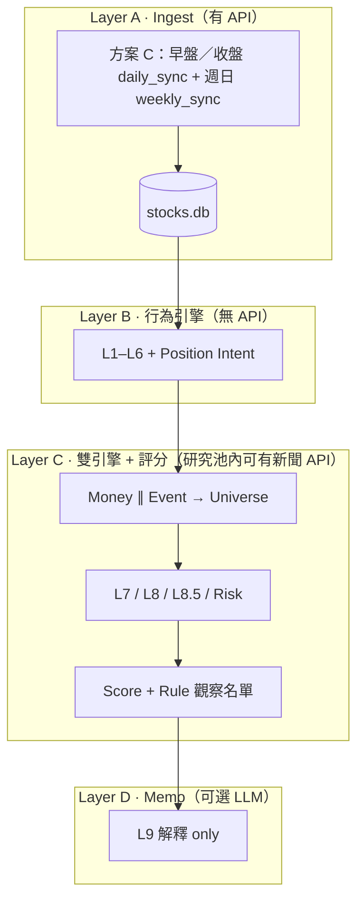
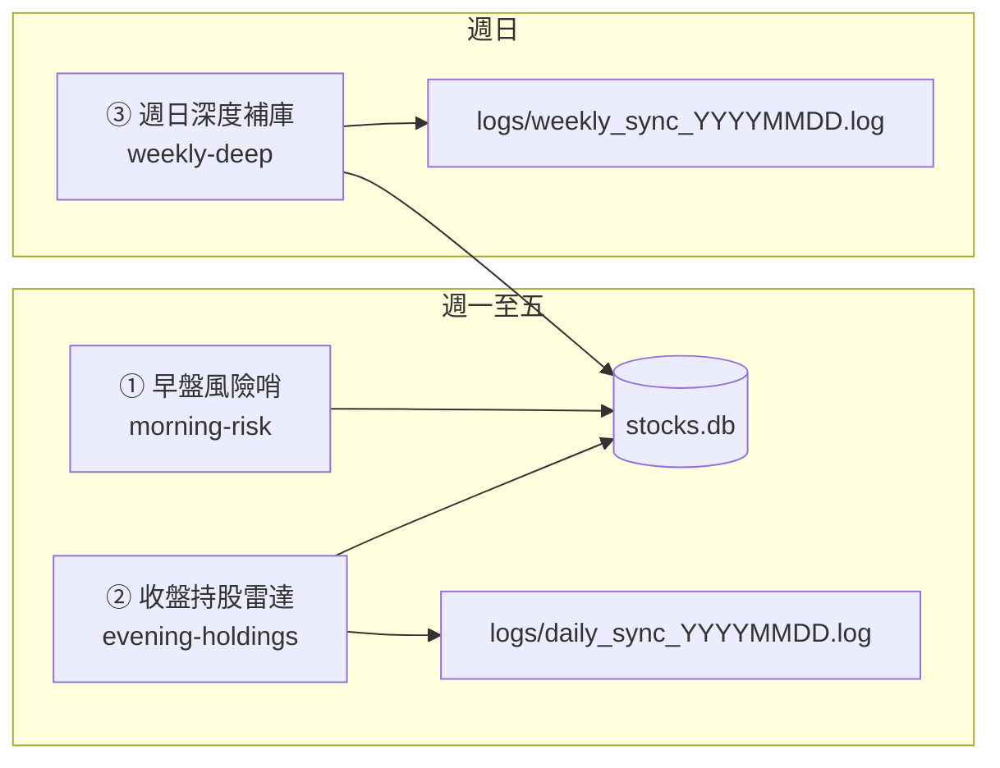
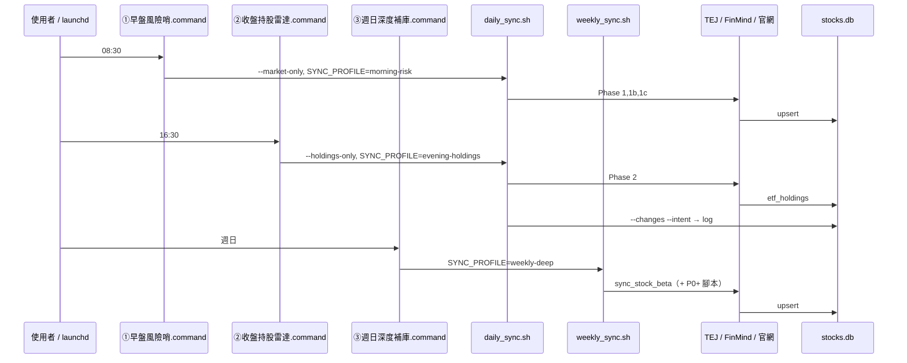
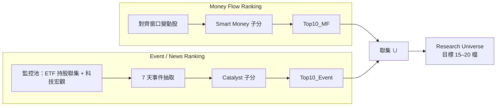
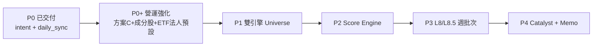

# PRD：ETF 持股研究 → 投資決策引擎

| 欄位 | 內容 |
|------|------|
| 版本 | 0.3 |
| 狀態 | Draft（P0 + **方案 C 排程**已實作；P0+～P4 待開發） |
| 專案路徑 | `/Users/jackm4/Documents/ETF/股票研究` |
| 相關文件 | [README.md](./README.md)（索引）、[daily-operations.md](./daily-operations.md)（速查）、[architecture.md](./architecture.md)（五層總表；正文以本 PRD 為準） |
| 最後更新 | 2026-06 |
| 程式路徑 | Python 模組在 **`src/`**；同步入口在 **`scripts/`**（見 [architecture.md](./architecture.md) 專案目錄） |

---

## 1. 摘要

本專案從 **「ETF 持股變化工具」** 演進為 **「機構式投資決策引擎」**。  
已完成 **資金行為層**（What / How much / Who / Rotation / 意圖）；下一階段優先補 **Why（催化）**、**預期差（Expectation）**、**五維 Investment Score + 規則觀察名單**，而非再增加行為標籤。

**設計原則**

1. **Ingest 與 Analyze 分離**：`daily_sync` 批次打 API 寫入 SQLite；研究／評分／Memo **預設只讀 DB**。
2. **Event + Money 雙引擎**：Smart Money 排名與 Catalyst 排名 **平行**，聯集成研究池（約 15–20 檔），避免「加碼少但事件大」的標的被漏掉（如台積電法說、CoWoS、法案）。
3. **AI 解釋、規則決策**：評級／觀察名單由 **Rule Engine** 產生；LLM 僅撰寫 Bull/Bear/理由，**不得**輸出 BUY/HOLD/TRIM。

**營運架構（預設）**：**方案 C · 三段排程**——① 早盤風險哨、② 收盤持股雷達、③ 週日深度補庫（見 **§5.2**）。待開發項目集中於 **§22 改造清單**。

---

## 2. 問題陳述

### 2.1 現有能力（約 82–88 分：量化研究 / 經理人雛形）

| 維度 | 狀態 | 說明 |
|------|------|------|
| What | ✅ | 加減碼、新進、出清（`shares` 差分） |
| How much | ✅ | `flow`、`grow`、`Δwt`（pp） |
| Consensus | ✅ L2 | 加權共識分（非僅 `etf_add >= 2`） |
| Rotation | ✅ L3 | 主題流量矩陣（跨 ETF 對齊日） |
| Conviction | ✅ L4 | 橫截面 z-score |
| Portfolio Role | ✅ L5 | 相對核心（`weight_rank` / top decile） |
| Theme | ✅ L6 | 靜態 `THEME_BY_STOCK` |
| Position Intent | ✅ | 決策表 → 註解主句 |

**已實作模組（參考）**：`src/signal_engine.py`、`position_intent.py`、`comment_engine.py`、`investment_themes.py`；`src/sync_etf_holdings.py --changes --intent`；`scripts/daily_sync.sh`（`PYTHONPATH=src`）末尾 `--intent`。

### 2.2 缺口（阻礙「每日 10 萬～100 萬」下單決策）

| 缺口 | 例證 | 後果 |
|------|------|------|
| **Why** | 2330 註解僅「輪動加碼」未回答 GB300 / CoWoS / 法案 / CapEx / 財報 | 敘述漂亮但資訊量低 |
| **Event 與 Money 單通道** | 技嘉加碼 100% 排前、台積電加碼 0.16% 排後 | 漏研究當日真正事件驅動標的 |
| **Fundamental 過淺** | 僅 PE/ROE 水平 | 無法表達「比市場預期好/差」 |
| **AI 評級** | LLM 輸出 BUY/HOLD 不穩定 | 不適合實盤決策 |

---

## 3. 目標與非目標

### 3.1 目標（Must Have）

| ID | 目標 |
|----|------|
| G1 | **雙引擎研究池**：Money Flow Top10 ∪ Event Top10 → Research Universe（15–20 檔） |
| G2 | **L7 Catalyst**：7 天新聞 → 結構化催化（taxonomy + 關聯度 + 信心度） |
| G3 | **L8.5 Expectation**：預期差、營收加速度（YoY/QoQ/MoM），批次入庫 |
| G4 | **Score Engine**：五維子分 + Investment Score（0–100）+ 規則觀察名單 A/B/候補/跳過 |
| G5 | **L9 Memo**：僅對觀察名單內 Top10（by Investment Score）生成解釋性備忘錄 |
| G6 | **可追溯**：分數、規則版本、資料 `as_of_date` 寫入 DB 或報告 metadata |

### 3.2 非目標（Out of Scope · 本 PRD 階段）

- 自動下單、**富邦 Neo API**／券商個人帳戶同步、部位管理系統
- 全市場 2000 檔每日全量新聞 + 全量 LLM
- Memo 時逐檔重查 TEJ API
- 再新增 10+ 行為標籤（L1–L6 凍結擴充，僅調參）
- LLM 直接產出 BUY/HOLD/TRIM/目標價

---

## 4. 使用者與場景

| 角色 | 場景 | 產出 |
|------|------|------|
| 本人 | **① 早盤風險哨**（週一至五 **08:30**） | TEJ 日線、**TSM ADR / 科技風險**；可選 ETF 法人 → `stocks.db` |
| 本人 | **② 收盤持股雷達**（週一至五 **16:30**） | 官網持股 + `--changes --intent` → `logs/daily_sync_YYYYMMDD.log` |
| 本人 | **③ 週日深度補庫**（週日 **20:00**） | Beta；P0+ 後併入基本面、成分股批次 → `logs/weekly_sync_YYYYMMDD.log` |
| 本人 | 重跑研究、不抓 API | 僅讀 `stocks.db`（未來含 score） |
| 本人 | 偶發全量（相容） | `ETF每日同步.command` = ①+② 一次跑完（除錯用） |
| 自動化（本機） | 三個 `.command` 以 Mac **`launchd`** 定時觸發（或手動雙擊） | 資料與 log 均在專案內：`data/stocks.db`、`logs/`；備份建議 Time Machine 或複製 `data/` |

**非本階段場景**：富邦 Neo 個人帳戶倉位、盤中 `intraday_monitor`（**不納入**三段排程）。

---

## 5. 系統架構

### 5.1 三層總覽



### 5.2 方案 C：三段排程架構（預設營運）

將 **Ingest** 依「決策時點」拆成三支獨立排程，避免 08:30 一次跑完卻拿不到當日持股、或 16:30 才補 ADR 的時序錯位。三支排程各有 **中文名**、**英文 slug**（寫入 log 的 `SYNC_PROFILE`）、**入口 `.command`**。

| # | 中文名 | slug | 建議時間 | 入口 | 底層指令 |
|---|--------|------|----------|------|----------|
| ① | **早盤風險哨** | `morning-risk` | 週一至五 08:25–08:40 | `scripts/ETF早盤風險哨.command` | `daily_sync.sh --market-only --quiet` |
| ② | **收盤持股雷達** | `evening-holdings` | 週一至五 16:30–18:00 | `scripts/ETF收盤持股雷達.command` | `daily_sync.sh --holdings-only --quiet` |
| ③ | **週日深度補庫** | `weekly-deep` | 週日 20:00 | `scripts/ETF週日深度補庫.command` | `weekly_sync.sh` |



**Mac 排程**：為三個 `.command` 各建一條 `launchd`（或手動雙擊）；**不要**在 `daily_sync` 內用「今天是否週日」自動混跑週任務，以免平日誤觸長時間 API。

**相容入口**：`scripts/ETF每日同步.command` → `daily_sync.sh --quiet`（全量，無 `SYNC_PROFILE`），僅建議除錯或遷移期使用。



#### 5.2.1 Phase 對照（`daily_sync` / `weekly_sync`）

| Phase | 腳本 | ① 早盤 | ② 收盤 | ③ 週日 | API | 寫 DB / 輸出 |
|-------|------|:------:|:------:|:------:|-----|-------------|
| 1 | `query_stock_prices.py` | ✅ | — | — | TEJ | `daily_bars` |
| 1b | `sync_etf_signal.py` | opt | — | — | FinMind | `etf_daily_signal_snapshot`（**預設 SKIP**） |
| 1c | `sync_tech_risk_context.py` | ✅ | — | — | Yahoo+FinMind | `tech_risk_daily_snapshot` |
| 2 | `sync_etf_holdings.py` ×4 | — | ✅ | — | 官網 | `etf_holdings` |
| 3 | `--changes --intent` | — | ✅ | — | **無** | log only |
| W1 | `sync_stock_beta.py` | — | — | ✅ | FinMind/Yahoo | `stock_beta` |
| W2 | `sync_fundamentals.py`（規劃） | — | — | ✅ | FinMind/TEJ | L8/L8.5 表 |
| W3 | `sync_stock_market_daily.py`（規劃） | — | — | ✅ | FinMind | 成分股價+法人 |
| 4–7 | Score / Catalyst / Memo（規劃） | — | — | — | 讀 DB | 併入 **② 收盤** 後段（`RUN_*`） |

Phase 4～7 仍由 **② 收盤持股雷達** 在收盤後觸發（讀當日 DB），**不**併入 ① 早盤。

### 5.3 每日營運：跑幾支、週同步放哪？

| 問題 | 方案 C（v0.3 預設） |
|------|---------------------|
| 每天要點幾次？ | **平日 2 次**（①+②）；**週日 1 次**（③） |
| 背後幾支 Python？ | ① 約 3～4；② 約 5～6；③ 1～3（隨 P0+ 增加） |
| Beta / 基本面誰跑？ | **僅 ③ 週日深度補庫**（`weekly_sync.sh`），不在 `daily_sync` 內自動判斷 |
| 分析時再打 API？ | ❌ Score / intent 只讀 DB |
| log 怎麼分？ | ①② 同日追加 `daily_sync_YYYYMMDD.log`（行首含 `排程=morning-risk` 等）；③ 獨立 `weekly_sync_YYYYMMDD.log` |

**程式分類**

| 類別 | 排程 | 目的 | 打 API？ |
|------|------|------|----------|
| A1 | ① 早盤風險哨 | 基準日線 + 科技風險（+ 可選 ETF 法人） | ✅ |
| A2 | ② 收盤持股雷達 | 官網持股寫 DB | ✅ |
| B | ② 收盤持股雷達 | changes / intent /（未來）score | ❌ |
| C | ③ 週日深度補庫 | Beta、L8/L8.5、成分股批次 | ✅ |
| D | — | `intraday_monitor` | 可選；**不納入**方案 C |

### 5.4 資料預載：更新頻率與現況

| 資料 | 更新頻率 | 現況 | 規劃 |
|------|----------|------|------|
| 官網 ETF 持股 | 每交易日 1 次 | ✅ daily_sync #2 | 官網未更新 → Skip |
| TEJ ETF/指數日線 | 每交易日 1 次 | ✅ #1 | 早上常為 **T-1** K |
| 科技風險 **含 TSM ADR** | 每交易日 ≥1 次 | ✅ #1c | 開盤前決策用 |
| ETF 三大法人 | 每交易日 1 次 | 🔶 腳本有、**預設關** | `.env` `ENABLE_FINMIND_SIGNAL=1` |
| 成分股收盤 + 法人 | 每交易日 1 次 | ❌ | `sync_stock_market_daily.py` |
| Beta | 每週 1 次 | ✅ **③ 週日深度補庫** | `weekly_sync.sh` |
| 月營收 / PER / 財報 | 每週～公告後 | ❌ | `sync_fundamentals.py` |
| L7 新聞 | 按需 / 每日 Universe | ❌ | `catalyst_engine.py` |
| **禁止** | — | — | Memo/Score 時逐檔 TEJ；全市場 2000 檔每日拉 |

**監控池（成分股 FinMind）**：7 檔 ETF 持股**聯集**（約 80～150 檔），或 Research Universe 擴至 50～100；**勿**全市場。

### 5.5 Mac 排程建議（台灣時間）

| 排程 | 建議觸發 | 看什麼 |
|------|----------|--------|
| **① 早盤風險哨** | 週一至五 **08:30** | `tech_risk_daily_snapshot`、TSM ADR；**不**依賴當日官網持股 |
| **② 收盤持股雷達** | 週一至五 **16:30** | `logs/daily_sync_*.log` 內 `--changes --intent`；TEJ/官網較接近當日 |
| **③ 週日深度補庫** | 週日 **20:00** | Beta；P0+ 後基本面與成分股法人 |

| 不建議 | 原因 |
|--------|------|
| 僅盤中跑 ② | 持股/K 常未定型 |
| 僅 08:30 跑全量 `ETF每日同步` 當唯一決策 | changes 多為 T-1；應改 **①+②** |
| 把 ③ 塞進平日 `daily_sync` | 拉長 API、與開盤決策無關 |

**TSM ADR**：僅在 **①** 的 Phase 1c 執行（失敗 log WARN）。詳見 **§19**。

### 5.6 ETF 法人 vs 成分股法人

| 層級 | 資料 | 狀態 |
|------|------|------|
| ETF（00981A 等） | `etf_daily_signal_snapshot` | 有程式；建議開 env |
| 成分股（2330 等） | 驗證「ETF 加碼 vs 市場籌碼」 | **規劃** `stock_institutional_daily` |

---


## 6. 訊號層級定義（L1–L9）

| 層級 | 名稱 | 職責 | 實作狀態 |
|------|------|------|----------|
| L1 | Flow | 交易現象：Δ股、flow、action | ✅ |
| L2 | Consensus | 加權共識（z_flow + z_Δwt） | ✅ |
| L3 | Rotation | 主題間資金流 | ✅（需對齊 cohort） |
| L4 | Conviction | 加碼力度橫截面 | ✅ |
| L5 | Portfolio Role | CORE / THEMATIC / SATELLITE（相對排名） | ✅ |
| L6 | Theme | 產業背景 | ✅ 靜態表 |
| — | Position Intent | 主意圖（MAINTAIN_CORE、ROTATION_PLAY…） | ✅ |
| L7 | Catalyst | 結構化催化事件（Why） | 📋 規劃 |
| L8 | Fundamental | 財務水準（PE、ROE…） | 📋 規劃 |
| L8.5 | Expectation | 預期差、營收加速度 | 📋 規劃 |
| — | Risk 子分 | beta、`tech_risk` | 🔶 部分（beta 有表） |
| L9 | Memo | 敘事；**不評級** | 📋 規劃 |

**Comment 優先序**：L5 Intent + L7 > L8.5 > L2/L3 > L6 > L1（L1 不主導主句）。

---

## 7. 雙引擎：Research Universe

### 7.1 流程



### 7.2 合併規則

- `Universe = Top10_MF ∪ Top10_Event`（依 `stock_id` 去重）。
- 單檔保留雙通道來源標記：`from_money` / `from_event` / `both`。
- **禁止**僅用 Smart Money Top10 作為唯一研究入口。

### 7.3 範例

| stock_id | Smart Money 排名 | Event 排名 | 進池原因 |
|----------|------------------|------------|----------|
| 2376 | 高 | 中 | Money |
| 2330 | 中低 | 高 | **Event**（法說 / CoWoS / 法案） |
| 6223 | 中 | 高 | Event（HBM 測試等） |

---

## 8. L7 Catalyst Engine

### 8.1 原則

| 做法 | 說明 |
|------|------|
| ✅ | 僅對 **Research Universe** 抓最近 **7 天**新聞 |
| ✅ | 固定 **Catalyst Taxonomy**（枚舉），LLM 填結構化欄位 |
| ✅ | 輸出 `explains_etf_add`：HIGH / MED / LOW / NONE |
| ❌ | 持股池全檔每日搜新聞 |
| ❌ | 無 taxonomy 的自由摘要 |
| ❌ | Memo 時逐檔 TEJ |

### 8.2 Catalyst Taxonomy（對應研究問題）

| 代碼 | 類別 | 例 |
|------|------|-----|
| `PRODUCT_CYCLE` | 產品週期 / 出貨 | GB200、拉貨 |
| `SUPPLY_CHAIN` | 供應鏈 | CoWoS、封裝產能 |
| `POLICY` | 政策法規 | 美國出口、補貼 |
| `CAPX` | 資本支出 | CapEx 上修 |
| `EARNINGS` | 財報法說 | EPS、指引 |
| `SELL_SIDE` | 法人報告 | 升評、目標價 |
| `VALUATION` | 估值敘事 | 本益比區間 |

### 8.3 輸出 Schema（`catalyst_events` 表 · 規劃）

```yaml
stock_id: string
event_date: date
catalyst_type: enum  # 見 8.2
headline: string      # ≤80 字
polarity: BULL | BEAR | NEUTRAL
explains_etf_add: HIGH | MED | LOW | NONE
confidence: 0-100
sources: json         # [{title, date, url}]
ingested_at: iso8601
```

### 8.4 LLM Prompt 邊界（摘要）

- 角色：台股基金經理研究助理。
- 輸入：股票清單（≤20）、已有 ETF 訊號（JSON）、新聞摘要（已過濾）。
- 任務：每檔 0–2 個最重要事件；不得臆測無來源事實。
- **禁止**輸出投資評級。

---

## 9. L8 Fundamental & L8.5 Expectation

### 9.1 L8 Fundamental（水準）

- 資料來源：**批次** sync → `stock_fundamental`（規劃）。
- 欄位例：`pe`, `pb`, `roe`, `dividend_yield`, `market_cap`, `as_of_date`。
- 用途：子分 **Fundamental 15%**；非單獨決策。

### 9.2 L8.5 Expectation（預期差 · 核心）

| 指標 | 說明 | 分數邏輯 |
|------|------|----------|
| Expectation Gap | 實際 vs consensus（EPS/營收） | 優於預期 ↑；遜於預期 ↓ |
| 營收 YoY | 同比 | 搭配加速度 |
| 營收 QoQ / MoM | 环比 | **加速** ↑；減速 ↓ |
| 指引修訂 | 法說上修/下修 | 上修 ↑ |

**反例（必須支援）**

- ROE 34% 但 consensus 38% → **利空**（Expectation ↓）。
- ROE 15% 但 consensus 8% → **利多**（Expectation ↑）。

### 9.3 資料表（規劃）

- `stock_fundamental`：截面財務。
- `stock_consensus`：市場共識預期。
- `stock_financial_history`：季營收/EPS 序列（算加速度）。

**同步頻率**：建議每週 1 次（或財報季加密），**非**每日 50 檔 TEJ 查詢。

---

## 10. Score Engine & Rule Rating

### 10.1 五維子分（各 0–100）

| 子分 | 權重 | 主要輸入 |
|------|------|----------|
| Smart Money | **30%** | L2–L5、L4 conviction、L3 rotation 強度；L1 flow 權重低 |
| Catalyst | **25%** | L7 事件強度 × confidence × explains_etf_add |
| Expectation | **20%** | L8.5 預期差、加速度 |
| Fundamental | **15%** | L8 水準 + 歷史分位（可選） |
| Risk | **10%** | `stock_beta`、`tech_risk_daily_snapshot`、波動 |

### 10.2 Investment Score

```text
investment_score =
    0.30 * smart_money
  + 0.25 * catalyst
  + 0.20 * expectation
  + 0.15 * fundamental
  + 0.10 * risk
```

結果：**0–100**，保留一位小數；寫入 `investment_scores`（規劃）並附 `score_version`、`as_of_date`。

### 10.3 Smart Money 子分（規劃公式方向）

```text
smart_money_raw =
    norm(conviction_score)
  + norm(consensus_score)
  + norm(rotation_pair_score)   # 若 ROTATION_IN/OUT
  + role_weight(CORE > THEMATIC > SATELLITE)
smart_money = scale_0_100(smart_money_raw)
```

### 10.4 Rule Rating（觀察名單 · 程式決定）

| 條件（初版，可調參） | 觀察名單 |
|----------------------|----------|
| `investment_score >= 85` 且 `catalyst >= 70` | **A** |
| `75 <= investment_score < 85` | **B** |
| `65 <= investment_score < 75` | **候補（CANDIDATE）** |
| `investment_score < 65` | **SKIP（不研究）** |

- **禁止** LLM 覆寫觀察名單。
- Memo **僅**處理 A 內依 `investment_score` 排序之 **Top10**。

### 10.5 報告輸出範例

```text
2330 台積電 | Investment Score 84.7 | 觀察名單 B

Smart Money     92
Catalyst        85
Expectation     78
Fundamental     88
Risk            70

[Memo — 規則評級已在上方，AI 不重複評級]
Bull Case：…
Bear Case：…
與 ETF 加碼關聯：…
```

---

## 11. L9 Investment Memo

| 項目 | 規格 |
|------|------|
| 觸發 | `RUN_MEMO=1` 且已完成 Score Engine |
| 輸入 | 結構化 JSON：五維分、L7 events、L8/L8.5、L1–L6 摘要、`tech_risk` 一列 |
| 輸出 | Markdown：`reports/YYYYMMDD_memo.md`（路徑可調） |
| AI 任務 | ① 理由條列 ② Bull ③ Bear ④ 與 ETF 行為一致性說明 |
| AI 禁止 | BUY/HOLD/TRIM、目標價、部位% |

---

## 12. 資料架構

### 12.1 現有表（`stock_db.py`）

- `daily_bars`、`etf_holdings`、`etf_holdings_meta`
- `etf_daily_signal_snapshot`（可選）
- `stock_beta`、`tech_risk_daily_snapshot`
- `intraday_*`（盤中；**不納入每日一鍵**，維持獨立腳本）

### 12.2 規劃新增表

| 表名 | 用途 | 同步腳本（規劃） |
|------|------|------------------|
| `stock_daily_bars` | 成分股收盤 | `sync_stock_market_daily.py` |
| `stock_institutional_daily` | 成分股三大法人 | 同上 |
| `catalyst_events` | L7 結構化事件 | `catalyst_engine.py` |
| `stock_fundamental` | L8 | `sync_fundamentals.py` |
| `stock_consensus` | L8.5 預期 | `sync_fundamentals.py` 或 TEJ 批次 |
| `stock_financial_history` | L8.5 加速度 | 同上 |
| `investment_scores` | 每日五維 + 總分 + watchlist | `score_engine.py` |
| `research_memos` | L9 正文 + metadata | `investment_memo.py` |
| `sync_meta`（可選） | 上次週 sync 時間 | `daily_sync.sh` 內建 |

### 12.3 API 使用政策

| 時機 | TEJ | FinMind | 官網持股 | 新聞 | LLM |
|------|-----|---------|----------|------|-----|
| daily_sync Phase 1–2 | ✅ 批次 | 可選 | ✅ | ❌ | ❌ |
| 週 sync 基本面 | ✅ 批次 | 可選 | ❌ | ❌ | ❌ |
| Score Engine | ❌ | ❌ | ❌ | ❌ | ❌ |
| Catalyst（Universe only） | ❌ | ❌ | ❌ | ✅ ≤20 檔 | ✅ 結構化 |
| Memo Top10 | ❌ | ❌ | ❌ | ❌ | ✅ 敘事 |

---

## 13. 模組與檔案規劃

| 模組 | 檔案 | 狀態 |
|------|------|------|
| 行為訊號 | `src/signal_engine.py` | ✅ |
| 意圖 / L2 | `src/position_intent.py` | ✅ |
| 註解 | `src/comment_engine.py` | ✅ |
| 主題 | `src/investment_themes.py` | ✅ 持續擴充 |
| ETF 法人 | `src/sync_etf_signal.py` | ✅（預設關） |
| 科技風險 / TSM ADR | `src/sync_tech_risk_context.py` | ✅ |
| 成分股市場 | `src/sync_stock_market_daily.py` | 📋 P0+ |
| 研究池 | `src/research_universe.py` | 📋 P1 |
| 事件排名 | `src/event_ranking.py` | 📋 P1 |
| 催化 | `src/catalyst_engine.py` | 📋 P4 |
| 基本面 sync | `src/sync_fundamentals.py` | 📋 P3 |
| 預期 | `src/expectation_engine.py` | 📋 P3 |
| 評分 | `src/score_engine.py` | 📋 P2 |
| 備忘錄 | `src/investment_memo.py` | 📋 P4 |
| 日線 | `src/query_stock_prices.py` | ✅ |
| 持股 | `src/sync_etf_holdings.py` | ✅ |
| DB | `src/stock_db.py` | ✅ |
| 週期排程 | `scripts/weekly_sync.sh`（③） | ✅ |
| Beta | `src/sync_stock_beta.py` | ✅ |
| 同步編排 | `scripts/daily_sync.sh` | ✅ |

**CLI / `.env`（現有 + 規劃）**

```bash
# 現有
TEJ_API_KEY=...
FINMIND_TOKEN=...
ENABLE_FINMIND_SIGNAL=1      # 建議開：ETF 三大法人寫 DB

# 規劃
RUN_STOCK_MARKET_SYNC=1      # 成分股價+法人（持股聯集）
RUN_SCORE_ENGINE=0           # Universe + 五維分
RUN_MEMO=0                   # Top10 敘事 only
# 週任務請用 ③ 週日深度補庫（weekly_sync.sh），勿依賴 daily_sync 自動週判斷
CATALYST_NEWS_DAYS=7
RESEARCH_UNIVERSE_MAX=20
STOCK_UNIVERSE_MODE=holdings_union   # holdings_union | research_pool
```

---

## 14. 實施路線圖



| 階段 | 交付物 | 驗收 |
|------|--------|------|
| **P0** | `--intent`、對齊 cohort、L2–L6；log 含 intent | ✅ 已交付 |
| **P0+** | 見 **§22**（成分股 DB、Score 併入 ②、env 文件化） | **方案 C 三排程**可 daily 使用；③ 自動跑 beta |
| **P1** | `research_universe.py` + `event_ranking.py` | 2330 不因 MF 漏 Event |
| **P2** | `score_engine.py` + `investment_scores` | 規則觀察名單穩定 |
| **P3** | `sync_fundamentals` + `expectation_engine` | 預期差反例通過 |
| **P4** | `catalyst_engine` + `investment_memo` | 無 LLM 評級 |

---

## 15. 成功指標

| 指標 | 目標 |
|------|------|
| 研究池覆蓋 | 當日重大事件股（人工抽樣 5 日）≥80% 進 Universe |
| 評分穩定性 | 同 DB 快照重跑，Investment Score 差異 <0.1 |
| API 成本 | 每日新聞請求 ≤25 次（Universe+緩衝） |
| 決策可用性 | 觀察名單 A ≤10 檔；每檔有 ≥3 條可驗證理由（含 L7 或 L8.5） |
| 下單輔助 | 使用者主觀：能否回答「為什麼今天值得看」 |

---

## 16. 風險與緩解

| 風險 | 緩解 |
|------|------|
| ETF snapshot 日不對齊 | 最大對齊 cohort（已實作）；報告標註未納入 ETF |
| 新聞雜訊 | Taxonomy + 白名單來源 + 每檔最多 2 事件 |
| LLM 幻覺 | 必須帶 `sources`；無來源則 `confidence` 上限 40 |
| 基本面資料缺 | Expectation 降權或標 `DATA_MISSING` |
| 過度依賴 AI 評級 | Rule Engine 唯一評級；Code Review 禁止 Memo 輸出評級字樣 |

---

## 17. 開放問題

1. **新聞源**：工商時事 / 鉅亨 / RSS / 第三方 API？需選一個主源 + 快取策略。
2. **consensus 來源**：TEJ 是否已購財報預測模組？若無，FinMind 或 CSV 匯入？
3. **Event Ranking 是否含宏觀**：僅個股 vs 含「半導體指數/TSM」觸發連結持股？
4. **00982A 等日期落後 ETF**：Universe 是否允許第二 cohort 單獨跑 Event？
5. **觀察名單 A 的 `catalyst >= 70`**：是否改為「Event 通道進池即免門檻」？

---

## 18. 附錄 A：排程與 `daily_sync.sh` / `weekly_sync.sh`

### 18.1 方案 C 指令對照

| 排程 | `SYNC_PROFILE` | 指令 |
|------|----------------|------|
| ① 早盤風險哨 | `morning-risk` | `daily_sync.sh --market-only --quiet` |
| ② 收盤持股雷達 | `evening-holdings` | `daily_sync.sh --holdings-only --quiet` |
| ③ 週日深度補庫 | `weekly-deep` | `weekly_sync.sh` |
| 全量（相容） | （空） | `daily_sync.sh --quiet` |

### 18.2 `daily_sync.sh` 步驟（① / ② / 全量）

| 序 | 步驟 | ① 早盤 | ② 收盤 | 全量 |
|----|------|:------:|:------:|:----:|
| 0 | 載入 `.env` | ✅ | ✅ | ✅ |
| 1 | `query_stock_prices.py` | ✅ | — | ✅ |
| 2 | `sync_etf_signal.py` 或 SKIP | opt | — | opt |
| 3 | `sync_tech_risk_context.py` | ✅ | — | ✅ |
| 4–7 | 四源 `sync_etf_holdings` | — | ✅ | ✅ |
| 8 | `--changes --intent` → log | — | ✅ | ✅ |
| （P0+） | `sync_stock_market_daily` | — | opt `RUN_*` | opt |
| （P2+） | `score_engine` / `investment_memo` | — | opt | opt |

### 18.3 `weekly_sync.sh`（③）

| 序 | 步驟 | 現況 |
|----|------|------|
| 1 | `sync_stock_beta.py --sync-db` | ✅ |
| 2 | `sync_fundamentals.py` | 腳本存在時執行（規劃） |
| 3 | `sync_stock_market_daily.py` | 腳本存在時執行（規劃） |

**旗標**：`--holdings-only`、`--market-only`、`--quiet`；log 行首 `排程=<slug>`（由 `.command` 設定 `SYNC_PROFILE`）。

---

## 19. 附錄 B：開盤前風險決策（TSM ADR）

| 欄位（`tech_risk_daily_snapshot`） | 用途 |
|-----------------------------------|------|
| `tsm_daily_return_pct` | 美股上一交易日 ADR 漲跌；大跌 → 當日降低科技股新倉意願 |
| `sox_daily_return_pct` / `semi_benchmark` | 半導體板塊情緒 |
| `tx_gap_pct` | 台指期相對現貨 gap（資料缺時見 `notes`） |
| `session_date` / `us_trade_date` | 對照台股／美股交易日 |

**規則範例（Score Risk 子分或獨立 gate，規劃）**：`tsm_daily_return_pct < -2%` → Risk 子分下调或「科技交易暫緩」旗標（**非** LLM 決策）。

---

## 20. 附錄 C：詞彙表

| 詞彙 | 定義 |
|------|------|
| 對齊 cohort | 共用同一 `prev→curr` 的 ETF 子集 |
| Smart Money | 資金行為綜合子分，非單一 flow |
| Research Universe | MF Top10 ∪ Event Top10 |
| Investment Score | 五維加權總分 |
| 觀察名單 A/B/C | Rule Engine 輸出，非 LLM 評級 |
| TSM ADR | Yahoo `TSM` → `daily_bars.code=TSM_ADR` |
| 成分股法人 | FinMind `TaiwanStockInstitutionalInvestorsBuySell`，規劃表 |
| 方案 C | ①早盤風險哨 + ②收盤持股雷達 + ③週日深度補庫 |
| 早盤風險哨 | slug `morning-risk`；`--market-only` |
| 收盤持股雷達 | slug `evening-holdings`；`--holdings-only` |
| 週日深度補庫 | slug `weekly-deep`；`weekly_sync.sh` |

---

## 22. 改造清單（一併實作 · 與 PRD 同步）

以下為 **P0+～P4** 預計程式與 `daily_sync` 變更，開發時以此為 checklist（單次或分 PR 均可）。

### 22.1 P0+ 營運與資料底層（優先）

| # | 項目 | 說明 |
|---|------|------|
| 1 | `stock_db.py` schema | 新增 `stock_daily_bars`、`stock_institutional_daily` |
| 2 | `sync_stock_market_daily.py` | universe = `load_etf_constituent_watchlist`；FinMind 價+法人；lookback 30～90 日 |
| 3 | `daily_sync.sh` | Phase 1d：`RUN_STOCK_MARKET_SYNC=1` 時執行；log 摘要筆數 |
| 4 | 週期排程 | ✅ `weekly_sync.sh` + `ETF週日深度補庫.command`；**不**在 `daily_sync` 內自動週判斷 |
| 5 | `.env.example` / skill 更新 | 🔶 `.env.example` 已補範本；launchd plist 範例仍待寫 |
| 6 | `holdings_research` / intent | （可選）報告附「外資同日買賣」當成分股表有資料 |
| 7 | 預設建議 | 文件建議開 ETF 法人；**不**強制改 code 預設以免 403 |

### 22.2 P1 雙引擎

| # | 項目 |
|---|------|
| 8 | `research_universe.py`：Top10 MF ∪ Top10 Event |
| 9 | `event_ranking.py`：7 日事件分（可先 stub + 手動 JSON） |
| 10 | `daily_sync`：`RUN_SCORE_ENGINE=0` 時仍可印 Universe 清單 |

### 22.3 P2 Score

| # | 項目 |
|---|------|
| 11 | `score_engine.py` + `investment_scores` 表 |
| 12 | Rule 觀察名單 A/B/C；寫入 log |
| 13 | Risk 子分接入 `tech_risk` + `stock_beta` |

### 22.4 P3 基本面 / 預期

| # | 項目 |
|---|------|
| 14 | `sync_fundamentals.py`（FinMind PER、月營收、財報） |
| 15 | `expectation_engine.py`（預期差、加速度） |
| 16 | 併入 `scripts/weekly_sync.sh`（③ 週日深度補庫） |

### 22.5 P4 催化與 Memo

| # | 項目 |
|---|------|
| 17 | `catalyst_engine.py` + `catalyst_events` |
| 18 | `investment_memo.py`；`RUN_MEMO=1`；輸出 `reports/` |
| 19 | LLM 輸出審計：禁止 BUY/HOLD/TRIM 字樣 |

### 22.6 明確不做（本輪）

- 富邦 Neo API、個人帳戶倉位對照  
- `intraday_monitor` 併入 daily_sync  
- 全市場 2000 檔每日 FinMind  
- LLM 產出觀察名單或評級  

---

## 23. 修訂紀錄

| 版本 | 日期 | 說明 |
|------|------|------|
| 0.3 | 2026-06 | **方案 C** 為預設：①早盤風險哨、②收盤持股雷達、③週日深度補庫；`weekly_sync.sh` 與三個 `.command` |
| 0.2 | 2026-06 | 併入每日營運、執行時點、TSM ADR、資料頻率、週排程規劃、§22 改造清單、成分股/ETF 法人區分 |
| 0.1 | 2026-06 | 初版：雙引擎、L8.5、Score Engine、Rule 觀察名單、Memo 邊界 |
