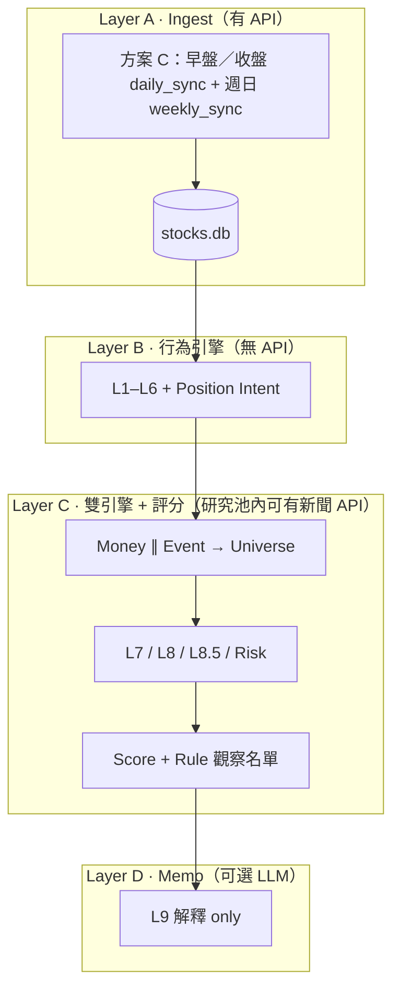
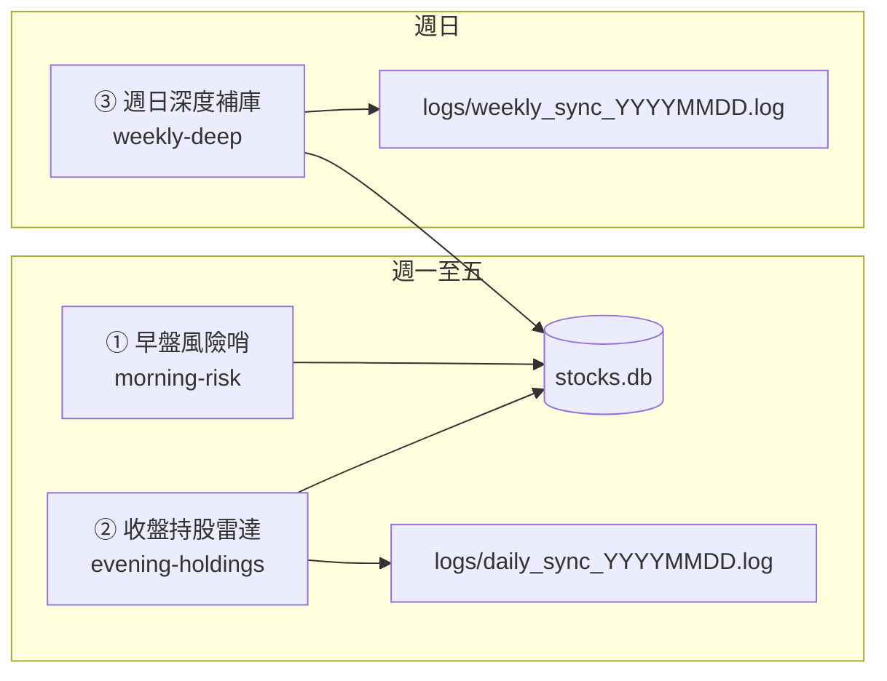
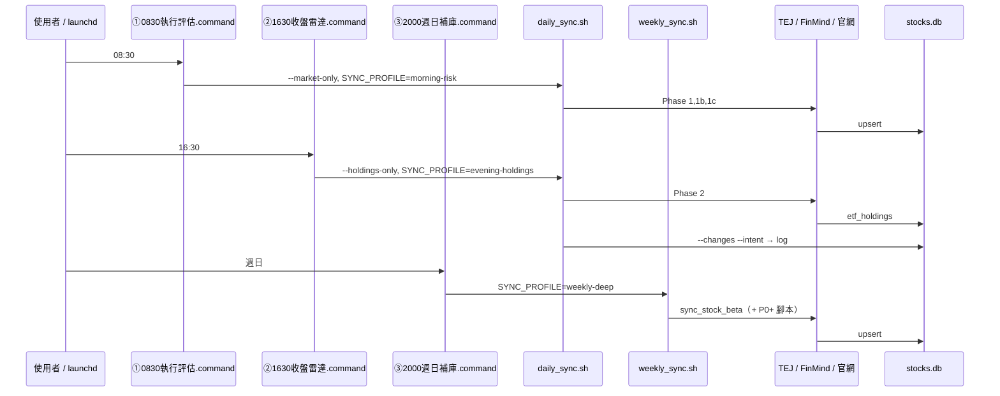
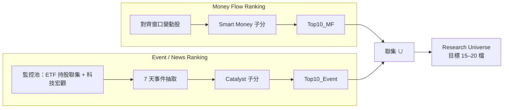
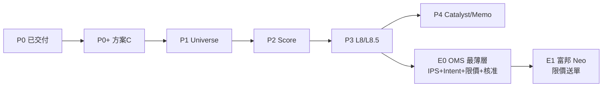

# PRD：ETF 持股研究 → 投資決策引擎

| 欄位 | 內容 |
|------|------|
| 版本 | 0.5 |
| 狀態 | Draft（P0～P3 + ④ 已交付；**E0 v0.1 已實作**；**E0.2 執行評估** 見 [execution-eval-PRD.md](./execution-eval-PRD.md)；P4 opt） |
| 專案路徑 | `/Users/jackm4/Documents/ETF/股票研究` |
| 相關文件 | [README.md](./README.md)（索引）、[daily-operations.md](./daily-operations.md)（速查）、[architecture.md](./architecture.md)（五層總表）、[signal-review-PRD.md](./signal-review-PRD.md)（④ 策略回顧）、[execution-eval-PRD.md](./execution-eval-PRD.md)（**① 執行評估 E0.2**；正文以本 PRD 為準） |
| 最後更新 | 2026-06 |
| 程式路徑 | Python 模組在 **`src/`**；同步入口在 **`scripts/`**（見 [architecture.md](./architecture.md) 專案目錄） |

---

## 1. 摘要

本專案從 **「ETF 持股變化工具」** 演進為 **「機構式投資決策引擎」**。  
已完成 **資金行為層**（What / How much / Who / Rotation / 意圖）；下一階段優先補 **Why（催化）**、**預期差（Expectation）**、**五維綜合研究評分 + 規則觀察名單**，而非再增加行為標籤。

**設計原則**

1. **Ingest 與 Analyze 分離**：`daily_sync` 批次打 API 寫入 SQLite；研究／評分／Memo **預設只讀 DB**。
2. **Event + Money 雙引擎**：Smart Money 排名與 Catalyst 排名 **平行**，聯集成研究池（約 15–20 檔），避免「加碼少但事件大」的標的被漏掉（如台積電法說、CoWoS、法案）。
3. **AI 解釋、規則決策**：評級／觀察名單由 **Rule Engine** 產生；LLM 僅撰寫 Bull/Bear/理由，**不得**輸出 BUY/HOLD/TRIM。

**營運架構（預設）**：**方案 C · 三段 ingest（①②③）+ ④ 策略回顧**（analytics 只讀；見 **§5.2**、[signal-review-PRD.md](./signal-review-PRD.md)）。**執行層**下一階段為 **§21 Execution v0.1**（OMS 最薄層 · 不接券商）。剩餘項見 **§22 改造清單**。

---

## 2. 問題陳述

### 2.1 現有能力（約 82–88 分：量化研究 / 經理人雛形）

| 維度 | 狀態 | 說明 |
|------|------|------|
| What | ✅ | 加減碼、新進、出清（`shares` 差分） |
| How much | ✅ | `flow`、`grow`、`Δwt`（pp） |
| Consensus | ✅ L2 | 加權共識分（非僅 `etf_add >= 2`） |
| Rotation | ✅ L3 | 主題流量矩陣（跨 ETF 對齊日） |
| Conviction | ✅ L4 | 橫截面 z-score |
| Portfolio Role | ✅ L5 | 相對核心（`weight_rank` / top decile） |
| Theme | ✅ L6 | 靜態 `THEME_BY_STOCK` |
| Position Intent | ✅ | 決策表 → 註解主句 |

**已實作模組（參考）**：`src/signal_engine.py`、`position_intent.py`、`comment_engine.py`、`investment_themes.py`；`src/sync_etf_holdings.py --changes --intent`；`scripts/daily_sync.sh`（`PYTHONPATH=src`）末尾 `--intent`。

### 2.2 缺口（阻礙「每日 10 萬～100 萬」下單決策）

| 缺口 | 例證 | 後果 |
|------|------|------|
| **Why** | 2330 註解僅「輪動加碼」未回答 GB300 / CoWoS / 法案 / CapEx / 財報 | 敘述漂亮但資訊量低 |
| **Event 與 Money 單通道** | 技嘉加碼 100% 排前、台積電加碼 0.16% 排後 | 漏研究當日真正事件驅動標的 |
| **Fundamental 過淺** | 僅 PE/ROE 水平 | 無法表達「比市場預期好/差」 |
| **AI 評級** | LLM 輸出 BUY/HOLD 不穩定 | 不適合實盤決策 |

---

## 3. 目標與非目標

### 3.1 目標（Must Have）

| ID | 目標 |
|----|------|
| G1 | **雙引擎研究池**：Money Flow Top10 ∪ Event Top10 → Research Universe（15–20 檔） |
| G2 | **L7 Catalyst**：7 天新聞 → 結構化催化（taxonomy + 關聯度 + 信心度） |
| G3 | **L8.5 Expectation**：預期差、營收加速度（YoY/QoQ/MoM），批次入庫 |
| G4 | **Score Engine**：五維子分 + 綜合研究評分（0–100）+ 規則觀察名單（首要觀察／一般觀察／候選／不列入） |
| G5 | **L9 Memo**：僅對觀察名單內 Top10（by 綜合研究評分）生成解釋性備忘錄 |
| G6 | **可追溯**：分數、規則版本、資料 `as_of_date` 寫入 DB 或報告 metadata |

### 3.2 非目標（Out of Scope · 本 PRD 階段）

- **E1 之後**：富邦 Neo API 自動送單、券商個人帳戶同步、成交回寫閉環（見 **§21.2**）
- 盤中 `intraday_monitor` 併入排程、VWAP/TWAP、即時改價
- 全市場 2000 檔每日全量新聞 + 全量 LLM
- Memo 時逐檔重查 TEJ API
- 再新增 10+ 行為標籤（L1–L6 凍結擴充，僅調參）
- LLM 直接產出 BUY/HOLD/TRIM/目標價

### 3.3 下一階段目標（E0 · Must Have）

| ID | 目標 | 見章節 |
|----|------|--------|
| E0-1 | **IPS**（投資政策）靜態檔：單檔／主題上限、不追價條件 | §21.3 |
| E0-2 | **兩種價格時點**：收盤 `suggested_ntd`；早盤 `ref_price` | §21.4 |
| E0-3 | **Order Intent** + **規則參考買入價**（benchmark；禁止 AI 喊價） | §21.5 |
| E0-4 | **Pre-trade check**：TSM ADR、回避 bucket、sync 健康、IPS 違規 | §21.7 |
| E0-5 | **Approval gate**：開盤前一鍵 `approved`（不接券商） | §21.8 |
| E0-6 | **開盤執行政策**：參考價 ≥ 開盤 → 市價；參考價 < 開盤 → 限價掛單 | §21.6 |

---

## 4. 使用者與場景

| 角色 | 場景 | 產出 |
|------|------|------|
| 本人 | **① 執行評估**（週一至五 **08:30**；原早盤風險哨） | TEJ 日線、**TSM ADR / 科技風險** + **執行快照評估**；詳見 [execution-eval-PRD.md](./execution-eval-PRD.md) |
| 本人 | **② 收盤持股雷達**（週一至五 **16:30**） | 官網持股 + `--changes --intent` → `logs/daily_sync_YYYYMMDD.log` |
| 本人 | **③ 週日深度補庫**（週日 **20:00**） | Beta；P0+ 後併入基本面、成分股批次 → `logs/weekly_sync_YYYYMMDD.log` |
| 本人 | 重跑研究、不抓 API | 僅讀 `stocks.db`（未來含 score） |
| 自動化（本機） | 三個 `.command` 以 Mac **`launchd`** 定時觸發（或手動雙擊） | 資料與 log 均在專案內：`data/stocks.db`、`logs/`；備份建議 Time Machine 或複製 `data/` |

**E0（規劃）**：② 收盤定 **建議金額** 與型態；① 早盤定 **參考買入價** 並 Pre-trade → 一鍵核准 → 09:00 依 **開盤執行政策**（§21.6）於券商 **市價或限價**（仍人工，E1 自動）。

**非 E0 場景**：富邦 Neo API 送單（**E1**）、盤中 `intraday_monitor` 併入排程。

---

## 5. 系統架構

### 5.1 三層總覽



### 5.2 方案 C：三段排程架構（預設營運）

將 **Ingest** 依「決策時點」拆成三支獨立排程，避免 08:30 一次跑完卻拿不到當日持股、或 16:30 才補 ADR 的時序錯位。三支排程各有 **中文名**、**英文 slug**（寫入 log 的 `SYNC_PROFILE`）、**入口 `.command`**。

| # | 中文名 | slug | 建議時間 | 入口 | 底層指令 |
|---|--------|------|----------|------|----------|
| ① | **執行評估**（原早盤風險哨） | `execution-eval`（alias `morning-risk`） | 週一至五 08:25–08:40 | `scripts/0830執行評估.command` | `daily_sync.sh --market-only --execution-eval` |
| ② | **收盤持股雷達** | `evening-holdings` | 週一至五 16:30–18:00 | `scripts/1630收盤雷達.command` | `daily_sync.sh --holdings-only --quiet` |
| ③ | **週日深度補庫** | `weekly-deep` | 週日 20:00 | `scripts/2000週日補庫.command` | `weekly_sync.sh` |
| ④ | **策略回顧** | `signal-review` | 隨時 | `scripts/策略回顧.command` | `signal_review.py`（見 [signal-review-PRD.md](./signal-review-PRD.md)） |



**Mac 排程**：為三個 `.command` 各建一條 `launchd`（或手動雙擊）；**不要**在 `daily_sync` 內用「今天是否週日」自動混跑週任務，以免平日誤觸長時間 API。



#### 5.2.1 Phase 對照（`daily_sync` / `weekly_sync`）

| Phase | 腳本 | ① 早盤 | ② 收盤 | ③ 週日 | API | 寫 DB / 輸出 |
|-------|------|:------:|:------:|:------:|-----|-------------|
| 1 | `query_stock_prices.py` | ✅ | — | — | TEJ（FinMind 備援） | `daily_bars` |
| 1b | `sync_etf_signal.py` | opt | — | — | FinMind | `etf_daily_signal_snapshot`（**預設 SKIP**） |
| 1c | `sync_tech_risk_context.py` | ✅ | — | — | Yahoo+FinMind | `tech_risk_daily_snapshot` |
| 2 | `sync_etf_holdings.py` ×4 | — | ✅ | — | 官網 | `etf_holdings` |
| 2b | `sync_stock_market_daily.py` | — | opt | opt | FinMind | `stock_daily_bars`、`stock_institutional_daily`（`RUN_STOCK_MARKET_SYNC=1`） |
| 3 | `--changes --intent` + `sync_flow_events` | — | ✅ | — | **無** | log + **`flow_events`** |
| W1 | `sync_stock_beta.py` | — | — | ✅ | FinMind/Yahoo | `stock_beta` |
| W2 | `sync_fundamentals.py` | — | — | ✅ | FinMind/TEJ | `stock_fundamental` 等 |
| W3 | `sync_stock_market_daily.py` batch | — | opt | ✅ | FinMind | 成分股 90 日 deep |
| 4–7 | `pipeline_evening.py`（Score / Catalyst / Memo） | — | opt | — | 讀 DB | 併入 **② 收盤** 後段（`RUN_*`） |

Phase 4～7 仍由 **② 收盤持股雷達** 在收盤後觸發（讀當日 DB），**不**併入 ① 早盤。

### 5.3 每日營運：跑幾支、週同步放哪？

| 問題 | 方案 C（v0.3 預設） |
|------|---------------------|
| 每天要點幾次？ | **平日 2 次**（①+②）；**週日 1 次**（③） |
| 背後幾支 Python？ | ① 約 3～4；② 約 5～6；③ 1～3（隨 P0+ 增加） |
| Beta / 基本面誰跑？ | **僅 ③ 週日深度補庫**（`weekly_sync.sh`），不在 `daily_sync` 內自動判斷 |
| 分析時再打 API？ | ❌ Score / intent 只讀 DB |
| log 怎麼分？ | ①② 同日追加 `daily_sync_YYYYMMDD.log`（行首含 `排程=morning-risk` 等）；③ 獨立 `weekly_sync_YYYYMMDD.log` |

**程式分類**

| 類別 | 排程 | 目的 | 打 API？ |
|------|------|------|----------|
| A1 | ① 早盤風險哨 | 基準日線 + 科技風險（+ 可選 ETF 法人） | ✅ |
| A2 | ② 收盤持股雷達 | 官網持股寫 DB | ✅ |
| B | ② 收盤持股雷達 | changes / intent /（未來）score | ❌ |
| C | ③ 週日深度補庫 | Beta、L8/L8.5、成分股批次 | ✅ |
| D | — | `intraday_monitor` | 可選；**不納入**方案 C |

### 5.4 資料預載：更新頻率與現況

| 資料 | 更新頻率 | 現況 | 規劃 |
|------|----------|------|------|
| 官網 ETF 持股 | 每交易日 1 次 | ✅ daily_sync #2 | 官網未更新 → Skip |
| TEJ ETF/指數日線 | 每交易日 1 次 | ✅ #1 | 早上常為 **T-1** K |
| 科技風險 **含 TSM ADR** | 每交易日 ≥1 次 | ✅ #1c | 開盤前決策用 |
| ETF 三大法人 | 每交易日 1 次 | 🔶 腳本有、**預設關** | `.env` `ENABLE_FINMIND_SIGNAL=1` |
| 成分股收盤 + 法人 | 每交易日 1 次（`RUN_STOCK_MARKET_SYNC=1`） | ✅ ② incremental / ③ batch | `sync_stock_market_daily.py` |
| Beta | 每週 1 次 | ✅ **③ 週日深度補庫** | `weekly_sync.sh` |
| 月營收 / PER / 財報 | 每週～公告後 | ✅ ③ | `sync_fundamentals.py` |
| L7 新聞 / 催化 | 按需 / Universe | 🔶 opt | `catalyst_engine.py`（`RUN_CATALYST_ENGINE` / `RUN_NEWS_SYNC`） |
| ETF Flow 快照 | 每交易日 1 次（② intent 後） | ✅ | `sync_flow_events.py` → `flow_events` |
| **禁止** | — | — | Memo/Score 時逐檔 TEJ；全市場 2000 檔每日拉 |

**監控池（成分股 FinMind）**：7 檔 ETF 持股**聯集**（約 80～150 檔），或 Research Universe 擴至 50～100；**勿**全市場。

### 5.5 Mac 排程建議（台灣時間）

| 排程 | 建議觸發 | 看什麼 |
|------|----------|--------|
| **① 早盤風險哨** | 週一至五 **08:30** | `tech_risk_daily_snapshot`、TSM ADR；**不**依賴當日官網持股 |
| **② 收盤持股雷達** | 週一至五 **16:30** | `logs/daily_sync_*.log` 內 `--changes --intent`；TEJ/官網較接近當日 |
| **③ 週日深度補庫** | 週日 **20:00** | Beta；P0+ 後基本面與成分股法人 |

| 不建議 | 原因 |
|--------|------|
| 僅盤中跑 ② | 持股/K 常未定型 |
| 僅 08:30 跑全量 `daily_sync` 當唯一決策 | changes 多為 T-1；應改 **①+②** |
| 把 ③ 塞進平日 `daily_sync` | 拉長 API、與開盤決策無關 |

**TSM ADR**：僅在 **①** 的 Phase 1c 執行（失敗 log WARN）。詳見 **§19**。

### 5.6 ETF 法人 vs 成分股法人

| 層級 | 資料 | 狀態 |
|------|------|------|
| ETF（00981A 等） | `etf_daily_signal_snapshot` | 有程式；建議開 env |
| 成分股（2330 等） | 驗證「ETF 加碼 vs 市場籌碼」 | **規劃** `stock_institutional_daily` |

---


## 6. 訊號層級定義（L1–L9）

| 層級 | 名稱 | 職責 | 實作狀態 |
|------|------|------|----------|
| L1 | Flow | 交易現象：Δ股、flow、action | ✅ |
| L2 | Consensus | 加權共識（z_flow + z_Δwt） | ✅ |
| L3 | Rotation | 主題間資金流 | ✅（需對齊 cohort） |
| L4 | Conviction | 加碼力度橫截面 | ✅ |
| L5 | Portfolio Role | CORE / THEMATIC / SATELLITE（相對排名） | ✅ |
| L6 | Theme | 產業背景 | ✅ 靜態表 |
| — | Position Intent | 主意圖（MAINTAIN_CORE、ROTATION_PLAY…） | ✅ |
| L7 | Catalyst | 結構化催化事件（Why） | 📋 規劃 |
| L8 | Fundamental | 財務水準（PE、ROE…） | 📋 規劃 |
| L8.5 | Expectation | 預期差、營收加速度 | 📋 規劃 |
| — | Risk 子分 | beta、`tech_risk` | 🔶 部分（beta 有表） |
| L9 | Memo | 敘事；**不評級** | 📋 規劃 |

**Comment 優先序**：L5 Intent + L7 > L8.5 > L2/L3 > L6 > L1（L1 不主導主句）。

---

## 7. 雙引擎：Research Universe

### 7.1 流程



### 7.2 合併規則

- `Universe = Top10_MF ∪ Top10_Event`（依 `stock_id` 去重）。
- 單檔保留雙通道來源標記：`from_money` / `from_event` / `both`。
- **禁止**僅用 Smart Money Top10 作為唯一研究入口。

### 7.3 範例

| stock_id | Smart Money 排名 | Event 排名 | 進池原因 |
|----------|------------------|------------|----------|
| 2376 | 高 | 中 | Money |
| 2330 | 中低 | 高 | **Event**（法說 / CoWoS / 法案） |
| 6223 | 中 | 高 | Event（HBM 測試等） |

---

## 8. L7 Catalyst Engine

### 8.1 原則

| 做法 | 說明 |
|------|------|
| ✅ | 僅對 **Research Universe** 抓最近 **7 天**新聞 |
| ✅ | 固定 **Catalyst Taxonomy**（枚舉），LLM 填結構化欄位 |
| ✅ | 輸出 `explains_etf_add`：HIGH / MED / LOW / NONE |
| ❌ | 持股池全檔每日搜新聞 |
| ❌ | 無 taxonomy 的自由摘要 |
| ❌ | Memo 時逐檔 TEJ |

### 8.2 Catalyst Taxonomy（對應研究問題）

| 代碼 | 類別 | 例 |
|------|------|-----|
| `PRODUCT_CYCLE` | 產品週期 / 出貨 | GB200、拉貨 |
| `SUPPLY_CHAIN` | 供應鏈 | CoWoS、封裝產能 |
| `POLICY` | 政策法規 | 美國出口、補貼 |
| `CAPX` | 資本支出 | CapEx 上修 |
| `EARNINGS` | 財報法說 | EPS、指引 |
| `SELL_SIDE` | 法人報告 | 升評、目標價 |
| `VALUATION` | 估值敘事 | 本益比區間 |

### 8.3 輸出 Schema（`catalyst_events` 表 · 規劃）

```yaml
stock_id: string
event_date: date
catalyst_type: enum  # 見 8.2
headline: string      # ≤80 字
polarity: BULL | BEAR | NEUTRAL
explains_etf_add: HIGH | MED | LOW | NONE
confidence: 0-100
sources: json         # [{title, date, url}]
ingested_at: iso8601
```

### 8.4 LLM Prompt 邊界（摘要）

- 角色：台股基金經理研究助理。
- 輸入：股票清單（≤20）、已有 ETF 訊號（JSON）、新聞摘要（已過濾）。
- 任務：每檔 0–2 個最重要事件；不得臆測無來源事實。
- **禁止**輸出投資評級。

---

## 9. L8 Fundamental & L8.5 Expectation

### 9.1 L8 Fundamental（水準）

- 資料來源：**批次** sync → `stock_fundamental`（規劃）。
- 欄位例：`pe`, `pb`, `roe`, `dividend_yield`, `market_cap`, `as_of_date`。
- 用途：子分 **Fundamental 15%**；非單獨決策。

### 9.2 L8.5 Expectation（預期差 · 核心）

| 指標 | 說明 | 分數邏輯 |
|------|------|----------|
| Expectation Gap | 實際 vs consensus（EPS/營收） | 優於預期 ↑；遜於預期 ↓ |
| 營收 YoY | 同比 | 搭配加速度 |
| 營收 QoQ / MoM | 环比 | **加速** ↑；減速 ↓ |
| 指引修訂 | 法說上修/下修 | 上修 ↑ |

**反例（必須支援）**

- ROE 34% 但 consensus 38% → **利空**（Expectation ↓）。
- ROE 15% 但 consensus 8% → **利多**（Expectation ↑）。

### 9.3 資料表（規劃）

- `stock_fundamental`：截面財務。
- `stock_consensus`：市場共識預期。
- `stock_financial_history`：季營收/EPS 序列（算加速度）。

**同步頻率**：建議每週 1 次（或財報季加密），**非**每日 50 檔 TEJ 查詢。

---

## 10. Score Engine & Rule Rating

**現行版本**：`score_version = p4-v2`（`src/score_engine.py`）。  
設計原則：**研究分（加權總分）與進場時機（技術）分離**；事件以產業催化為主，MSCI/指數調整不進 Event Top、不主導催化子分。

### 10.1 加權五維（各 0–100，進綜合研究評分）

| 子分 | 權重 | 主要輸入 |
|------|------|----------|
| **資金籌碼（Smart Money）** | **50%** | 合成子分：`0.55×ETF流向 + 0.45×法人籌碼`（見下） |
| Catalyst | **10%** | L7 **產業**事件（排除 INDEX_REBALANCE/MSCI）；confidence 上限 |
| Expectation | **15%** | L8.5 預期差、共識修正 |
| Fundamental | **15%** | L8 基本面水準 |
| Risk | **10%** | `stock_beta`、`tech_risk_daily_snapshot`（β、TSM ADR 等） |

**不進加權**：**價位分（Timing）** — 由價位型態（突破／拉回／觀望／乖離過大／暫不進場＋量價齊揚）與觀察名單閘門處理，避免「技術 20%」把強勢股誤殺。

#### 資金籌碼分量

| 分量 | 計算 | 說明 |
|------|------|------|
| ETF流向 `flow` | conviction + consensus + rotation + role；非加碼 cap 35 | L2–L5 ETF 行為 |
| 法人籌碼 `chip` | 籌碼標籤 + 三大法人淨買微調 | ETF×外資×投信 |

```text
smart_money = 0.55 * flow + 0.45 * chip
```

### 10.2 綜合研究評分（p4-v2）

```text
investment_score =
    0.50 * smart_money
  + 0.10 * catalyst
  + 0.15 * expectation
  + 0.15 * fundamental
  + 0.10 * risk
```

結果：**0–100**，保留一位小數；寫入 `investment_scores` 並附 `score_version`、`as_of_date`。  
`metadata_json` 另存 `flow_score`、`chip_score`、`timing_score`、`entry_signal`、`entry_tags`。

### 10.3 價位型態與風控（不進綜合評分）

| 機制 | 用途 |
|------|------|
| 價位型態 + **量價齊揚** | 開盤前觀察名單、建議部位、風控 overlay |
| **乖離過大**（Universe P75 + 絕對下限 12%） | 價位型態；無量價齊揚時觀察名單 **封頂一般觀察**（非不列入） |
| **暫不進場**（ETF 減碼） | 風控覆寫，非純技術型態 |
| `risk_gate`（如 TSM_ADR_LT_-2PCT） | 旗標 + 建議部位縮放 |

**價位型態存值（中文）**：突破／拉回／觀望／乖離過大／暫不進場；附加 tag：量價齊揚。

### 10.4 Rule Rating（觀察名單 · 程式決定）

| 條件（p4-v2） | 觀察名單（DB 存值） |
|----------------|---------------------|
| `investment_score >= 75` 且 `smart_money >= 72`，且非暫不進場 | **首要觀察** |
| `investment_score >= 65` | **一般觀察** |
| `investment_score >= 55` | **候選** |
| 其餘或暫不進場 | **不列入** |

- **禁止** LLM 覆寫觀察名單；**禁止**以 Catalyst≥70 綁架首要觀察（避免 MSCI 週污染）。
- Memo **僅**處理首要觀察內依 `investment_score` 排序之 **Top10**。

### 10.5 開盤前延伸（收盤寫入）

| 表 | 內容 |
|----|------|
| `pm_watchlist` | 隔日等級：**觀察／突破／回避**；早盤只讀；**乖離過大 + 高籌碼（外資、投信同步買超／外資買超或 chip≥70）→ 觀察** |
| `portfolio_weights` | 部位分／風險分／建議權重％；`PORTFOLIO_CAPITAL_NTD` 預設 100000 |
| `RUN_EXPORT_AI_BUNDLE` | 收盤寫入 `reports/YYYYMMDD_research_context.json` + `ai_bundle.md`（外部 LLM 提示詞；不寫回 watchlist） |

**籌碼標籤（中文）**：外資、投信同步買超／外資買超／法人中性／外資賣超背離／籌碼背離／同步賣超。

**舊 DB 遷移**（英文 enum → 中文存值）：

```bash
PYTHONPATH=src .venv/bin/python src/migrate_market_labels.py --db data/stocks.db
# 先預覽：加 --dry-run
```

### 10.6 版本對照

| 版本 | 加權 | 備註 |
|------|------|------|
| p3（PRD 初稿） | 30/25/20/15/10 SM/Cat/Exp/Fun/Risk | 事件權重偏高 |
| p4-v1（已汰） | 35/25/20/10/10 資金/籌碼/技術/事件/基本 | 技術進總分、無 Expectation/Risk 維 |
| **p4-v2（現行）** | **50/10/15/15/10** SM/Cat/Exp/Fun/Risk | 資金+籌碼合成 SM；技術僅閘門 |

### 10.7 報告輸出範例

```text
2330 台積電 | 綜合研究評分 78.5 | 觀察名單 一般觀察 | 價位型態 突破

資金籌碼  85   ETF流向 89   法人籌碼 80   預期差 72   基本面 68   風險面 70   價位分 88
籌碼標籤 外資買超

[Memo — 規則評級已在上方，AI 不重複評級]
```

---

## 11. L9 Investment Memo

| 項目 | 規格 |
|------|------|
| 觸發 | `RUN_MEMO=1` 且已完成 Score Engine |
| 輸入 | 結構化 JSON：五維分、L7 events、L8/L8.5、L1–L6 摘要、`tech_risk` 一列 |
| 輸出 | Markdown：`reports/YYYYMMDD_memo.md`（路徑可調） |
| AI 任務 | ① 理由條列 ② Bull ③ Bear ④ 與 ETF 行為一致性說明 |
| AI 禁止 | BUY/HOLD/TRIM、目標價、部位% |

---

## 12. 資料架構

### 12.1 現有表（`stock_db.py`）

- `daily_bars`、`etf_holdings`、`etf_holdings_meta`
- `etf_daily_signal_snapshot`（可選）
- `stock_beta`、`tech_risk_daily_snapshot`
- **`stock_daily_bars`**、**`stock_institutional_daily`**（FinMind；`sync_stock_market_daily.py`）
- **`stock_fundamental`**（`sync_fundamentals.py`）
- **`flow_events`**（`sync_flow_events.py` · ② intent 後）
- **`investment_scores`**、**`pm_watchlist`**、**`portfolio_weights`**（`score_engine.py` / `portfolio_engine.py`）
- `intraday_*`（盤中；**不納入每日一鍵**，維持獨立腳本）

### 12.2 規劃／可選表

| 表名 | 用途 | 同步腳本 | 狀態 |
|------|------|----------|------|
| `order_intents` | E0 待核准訂單草稿（見 §21.4～§21.6） | `order_intent_engine.py` | ✅ E0 |
| `catalyst_events` | L7 結構化事件 | `catalyst_engine.py` | 🔶 opt |
| `stock_consensus` | L8.5 預期 | `sync_fundamentals.py` 或 TEJ 批次 | 📋 |
| `stock_financial_history` | L8.5 加速度 | 同上 | 📋 |
| `research_memos` | L9 正文 + metadata | `investment_memo.py` | 🔶 `RUN_MEMO=0` 預設 |
| `sync_meta`（可選） | 上次週 sync 時間 | `daily_sync.sh` 內建 | 📋 |

### 12.3 API 使用政策

| 時機 | TEJ | FinMind | 官網持股 | 新聞 | LLM |
|------|-----|---------|----------|------|-----|
| daily_sync Phase 1–2 | ✅ 批次 | 可選 | ✅ | ❌ | ❌ |
| 週 sync 基本面 | ✅ 批次 | 可選 | ❌ | ❌ | ❌ |
| Score Engine | ❌ | ❌ | ❌ | ❌ | ❌ |
| Catalyst（Universe only） | ❌ | ❌ | ❌ | ✅ ≤20 檔 | ✅ 結構化 |
| Memo Top10 | ❌ | ❌ | ❌ | ❌ | ✅ 敘事 |

---

## 13. 模組與檔案規劃

| 模組 | 檔案 | 狀態 |
|------|------|------|
| 行為訊號 | `src/signal_engine.py` | ✅ |
| 意圖 / L2 | `src/position_intent.py` | ✅ |
| 註解 | `src/comment_engine.py` | ✅ |
| 主題 | `src/investment_themes.py` | ✅ 持續擴充 |
| ETF 法人 | `src/sync_etf_signal.py` | ✅（預設關） |
| 科技風險 / TSM ADR | `src/sync_tech_risk_context.py` | ✅ |
| 成分股市場 | `src/sync_stock_market_daily.py` | ✅ |
| Flow 快照 | `src/sync_flow_events.py` | ✅ |
| Flow 歸因 | `src/flow_attribution.py` | ✅ v0.3 |
| 策略回顧 | `src/signal_review.py` | ✅ v0.3 |
| 研究池 | `src/research_universe.py` | ✅ P1 |
| 事件排名 | `src/event_ranking.py` | ✅ P1 |
| 催化 | `src/catalyst_engine.py` | 🔶 P4 opt |
| 基本面 sync | `src/sync_fundamentals.py` | ✅ P3 |
| 預期 | `src/expectation_engine.py` | ✅ P3 |
| 評分 | `src/score_engine.py` | ✅ P2 |
| 投組權重 | `src/portfolio_engine.py`、`pm_watchlist.py` | ✅ |
| 收盤編排 | `src/pipeline_evening.py` | ✅ |
| 備忘錄 | `src/investment_memo.py` | 🔶 P4 opt |
| 日線 | `src/query_stock_prices.py` | ✅（TEJ + FinMind 備援） |
| 持股 | `src/sync_etf_holdings.py` | ✅ |
| DB | `src/stock_db.py` | ✅ |
| 週期排程 | `scripts/weekly_sync.sh`（③） | ✅ |
| Beta | `src/sync_stock_beta.py` | ✅ |
| 同步編排 | `scripts/daily_sync.sh` | ✅ |
| IPS 載入 | `src/investment_policy.py` | ✅ E0 |
| 規則參考價 | `src/rule_limit_price.py` | ✅ E0 |
| 開盤政策 | `src/open_execution_policy.py` | ✅ E0 |
| Pre-trade | `src/pre_trade_check.py` | ✅ E0 |
| 訂單意圖 | `src/order_intent_engine.py` | ✅ E0 |

**CLI / `.env`（現有 + 規劃）**

```bash
# 現有
TEJ_API_KEY=...
FINMIND_TOKEN=...
ENABLE_FINMIND_SIGNAL=1      # 建議開：ETF 三大法人寫 DB

# 收盤建議（見 daily-operations.md）
RUN_STOCK_MARKET_SYNC=1      # 成分股價+法人（持股聯集）
RUN_SCORE_ENGINE=1           # Universe + 五維分 + pm_watchlist
RUN_EXPORT_AI_BUNDLE=1       # JSON + 外部 LLM 提示詞
RUN_MEMO=0                   # Top10 敘事（預設關）
# 週任務請用 ③ 週日深度補庫（weekly_sync.sh），勿依賴 daily_sync 自動週判斷
CATALYST_NEWS_DAYS=7
RESEARCH_UNIVERSE_MAX=20
STOCK_UNIVERSE_MODE=holdings_union   # holdings_union | research_pool

# E0（規劃）
RUN_ORDER_INTENT=0                 # ① 早盤產 order_intents 草稿
ORDER_INTENT_REQUIRE_APPROVAL=1    # 須明確 --approve 才標 approved
```

---

## 14. 實施路線圖



| 階段 | 交付物 | 驗收 |
|------|--------|------|
| **P0** | `--intent`、對齊 cohort、L2–L6；log 含 intent | ✅ 已交付 |
| **P0+** | 見 **§22**（成分股 DB、Score 併入 ②、env 文件化） | ✅ 可 daily 使用 |
| **P1** | `research_universe.py` + `event_ranking.py` | ✅ |
| **P2** | `score_engine.py` + `investment_scores` | ✅ |
| **P3** | `sync_fundamentals` + `expectation_engine` | ✅ |
| **P4** | `catalyst_engine` + `investment_memo` | 🔶 腳本已有；預設關 |
| **④ v0.3** | `flow_events` + `flow_attribution` + Signal Review §0 | ✅ |
| **E0** | 見 **§21**（IPS、Order Intent、規則限價、Pre-trade、Approval） | 📋 1～2 sprint；**不接券商** |
| **E1** | 富邦 Neo API：ROD 限價送單 + 成交回寫 | 📋 E0 完成後 |

---

## 15. 成功指標

| 指標 | 目標 |
|------|------|
| 研究池覆蓋 | 當日重大事件股（人工抽樣 5 日）≥80% 進 Universe |
| 評分穩定性 | 同 DB 快照重跑，綜合研究評分差異 <0.1 |
| API 成本 | 每日新聞請求 ≤25 次（Universe+緩衝） |
| 決策可用性 | 觀察名單 A ≤10 檔；每檔有 ≥3 條可驗證理由（含 L7 或 L8.5） |
| 下單輔助 | 使用者主觀：能否回答「為什麼今天值得看」 |
| E0 執行草稿 | 開盤前 5 分鐘內可讀懂「掛什麼價、幾張、為何被擋」 |

---

## 16. 風險與緩解

| 風險 | 緩解 |
|------|------|
| ETF snapshot 日不對齊 | 最大對齊 cohort（已實作）；報告標註未納入 ETF |
| 新聞雜訊 | Taxonomy + 白名單來源 + 每檔最多 2 事件 |
| LLM 幻覺 | 必須帶 `sources`；無來源則 `confidence` 上限 40 |
| 基本面資料缺 | Expectation 降權或標 `DATA_MISSING` |
| 過度依賴 AI 評級 | Rule Engine 唯一評級；Code Review 禁止 Memo 輸出評級字樣 |

---

## 17. 開放問題

1. **新聞源**：工商時事 / 鉅亨 / RSS / 第三方 API？需選一個主源 + 快取策略。
2. **consensus 來源**：TEJ 是否已購財報預測模組？若無，FinMind 或 CSV 匯入？
3. **Event Ranking 是否含宏觀**：僅個股 vs 含「半導體指數/TSM」觸發連結持股？
4. **00982A 等日期落後 ETF**：Universe 是否允許第二 cohort 單獨跑 Event？
5. **觀察名單 A 的 `catalyst >= 70`**：是否改為「Event 通道進池即免門檻」？

---

## 18. 附錄 A：排程與 `daily_sync.sh` / `weekly_sync.sh`

### 18.1 方案 C 指令對照

| 排程 | `SYNC_PROFILE` | 指令 |
|------|----------------|------|
| ① 早盤風險哨 | `morning-risk` | `daily_sync.sh --market-only --quiet` |
| ② 收盤持股雷達 | `evening-holdings` | `daily_sync.sh --holdings-only --quiet` |
| ③ 週日深度補庫 | `weekly-deep` | `weekly_sync.sh` |

### 18.2 `daily_sync.sh` 步驟（① / ②）

| 序 | 步驟 | ① 早盤 | ② 收盤 |
|----|------|:------:|:------:|
| 0 | 載入 `.env` | ✅ | ✅ |
| 1 | `query_stock_prices.py` | ✅ | — |
| 2 | `sync_etf_signal.py` 或 SKIP | opt | — |
| 3 | `sync_tech_risk_context.py` | ✅ | — |
| 4–7 | 四源 `sync_etf_holdings` | — | ✅ |
| 8 | `--changes --intent` → log | — | ✅ |
| （P0+） | `sync_stock_market_daily` | — | opt `RUN_*` |
| （P2+） | `score_engine` / `investment_memo` | — | opt |

### 18.3 `weekly_sync.sh`（③）

| 序 | 步驟 | 現況 |
|----|------|------|
| 1 | `sync_stock_beta.py --sync-db` | ✅ |
| 2 | `sync_fundamentals.py` | 腳本存在時執行（規劃） |
| 3 | `sync_stock_market_daily.py` | 腳本存在時執行（規劃） |

**旗標**：`--holdings-only`、`--market-only`、`--quiet`；log 行首 `排程=<slug>`（由 `.command` 設定 `SYNC_PROFILE`）。

---

## 19. 附錄 B：開盤前風險決策（TSM ADR）

| 欄位（`tech_risk_daily_snapshot`） | 用途 |
|-----------------------------------|------|
| `tsm_daily_return_pct` | 美股上一交易日 ADR 漲跌；大跌 → 當日降低科技股新倉意願 |
| `sox_daily_return_pct` / `semi_benchmark` | 半導體板塊情緒 |
| `tx_gap_pct` | 台指期相對現貨 gap（資料缺時見 `notes`） |
| `session_date` / `us_trade_date` | 對照台股／美股交易日 |

**規則範例（Score Risk 子分或獨立 gate，規劃）**：`tsm_daily_return_pct < -2%` → Risk 子分下调或「科技交易暫緩」旗標（**非** LLM 決策）。

---

## 20. 附錄 C：詞彙表

| 詞彙 | 定義 |
|------|------|
| 對齊 cohort | 共用同一 `prev→curr` 的 ETF 子集 |
| Smart Money | 資金籌碼合成子分（ETF流向 + 法人籌碼） |
| Research Universe | MF Top10 ∪ Event Top10 |
| 綜合研究評分 | 五維加權總分（0–100） |
| 觀察名單 | 首要觀察／一般觀察／候選／不列入；Rule Engine 輸出，非 LLM 評級 |
| 隔日等級 | 觀察／突破／回避（`pm_watchlist.pm_bucket`） |
| 價位型態 | 突破／拉回／觀望／乖離過大／暫不進場；tag：量價齊揚 |
| 籌碼標籤 | 外資、投信同步買超／外資買超／法人中性／外資賣超背離／籌碼背離／同步賣超 |
| TSM ADR | Yahoo `TSM` → `daily_bars.code=TSM_ADR` |
| 成分股法人 | FinMind → `stock_institutional_daily` |
| ETF Flow 快照 | `flow_events`（② intent 後；§0 只讀） |
| 方案 C | ①早盤風險哨 + ②收盤持股雷達 + ③週日深度補庫 + ④策略回顧 |
| 早盤風險哨 | slug `morning-risk`；`--market-only` |
| 收盤持股雷達 | slug `evening-holdings`；`--holdings-only` |
| 週日深度補庫 | slug `weekly-deep`；`weekly_sync.sh` |
| IPS | `data/investment_policy.yaml`；單檔／主題上限與不追價規則 |
| Order Intent | `order_intents` 表；狀態 `draft`→`blocked`→`approved` |
| 規則限價 | `benchmark_type`：昨收／MA20／前高；禁止 LLM 目標價 |
| Pre-trade | TSM ADR gate、`pm_bucket=回避`、`entry_signal=暫不進場`、sync 健康 |
| 開盤執行政策 | `ref_price >= open` → 市價 ROD；`ref_price < open` → 限價 ROD |
| Approval gate | 開盤前一鍵 `--approve`；未核准不得進 E1 送單 |

---

## 21. Execution v0.1（OMS 最薄層 · Pre-Broker）

> **設計依據**：對齊買方機構最小閉環（Research → Portfolio → **Pre-Trade** → Order Generation → **Approval** → Execution）。  
> **E0 只做前五段最後一步之前的「草稿 + 核准」**；Execution 送單留 **E1（富邦 Neo API）**。  
> **難度**：低～中（新表 + 數個模組）；**Analyze 路徑禁止打行情 API**。

### 21.1 目標與使用者故事

| 故事 | 說明 |
|------|------|
| 收盤後 ② | 寫入 `pm_watchlist`、`portfolio_weights`：**建議金額** `suggested_ntd`、型態、`pm_bucket`（研究決策） |
| 收盤後（可選） | `--preview` 用當日 K 線試算 **參考買入價** 草稿；**非核准版**，僅供隔日心理準備 |
| 開盤前 08:30 ① | `tech_risk` 更新後，正式產 **Order Intent** + **Pre-trade**（參考買入價以此版為準） |
| 開盤前 08:45 | 閱讀 checklist + `order_intents` → **一鍵核准** → `status=approved` |
| 09:00 開盤 | 對每筆 `approved`：比較 **參考買入價** 與 **開盤價** → 市價或限價（§21.6） |
| 盤中 | 限價分支：ROD 掛單等待回檔；未成交無部位損益。E1 改 API 送單 |

**終態願景**：開盤前僅需一鍵確認；**不無腦追開盤**，但開盤價優於參考價時允許市價上車。

### 21.2 範圍

| In Scope（E0） | Out of Scope（E1+） |
|----------------|---------------------|
| IPS 靜態政策檔 | 富邦 Neo API 送單／撤單 |
| `order_intents` 表 + 報告 | 券商帳戶持倉同步 |
| 規則 **參考買入價**（benchmark 可追溯） | 無條件開盤市價追價、VWAP/TWAP |
| **開盤執行政策**（§21.6）：有利市價／不利限價 | 盤中動態改價、`intraday_monitor` 併入 |
| Pre-trade 硬檢查 | 成交回寫 `execution_fills` |
| CLI `--approve` 核准閘門 | |
| 收盤 `--preview` 參考價預覽（可選） | |

### 21.3 Investment Policy Statement（IPS）

**路徑**：`data/investment_policy.yaml`（或 `.json`；**不入 git 敏感欄位**，提供 `data/investment_policy.example.yaml`）。

**用途**：將 `morning_checklist` 與 Score Risk 中已存在的規則**收斂為可機讀政策**，供 Pre-trade 與 E1 共用。

**建議欄位（YAML 示意）**：

```yaml
version: ips-v1
capital_ntd: 100000          # 可與 Paper 10 萬對齊；E1 前可手動
max_single_weight_pct: 25    # 單檔建議金額上限（佔 capital）
max_theme_weight_pct: 50     # 同主題聚合上限（讀 investment_themes）
exclude_entry_signals: ["暫不進場", "乖離過大"]   # 不產 intent
exclude_pm_buckets: ["回避"]
exclude_chip_tags: ["外資賣超背離", "籌碼背離", "同步賣超"]
tsm_adr_block_new_tech_pct: -2.0   # ADR 低於此 → 擋科技新倉（見 §21.7）
require_evening_sync_ok: true      # ② 當日 pm_watchlist 基準日 = 最近交易日
min_risk_reward: 1.5               # 若有 stop/target（見 §21.5）才檢查
```

**原則**：IPS **只收斂既有規則**，不新增 LLM 或主觀欄位。

**執行政策（併入 IPS 或獨立 `execution_policy` 區塊）**：

```yaml
open_execution_policy: compare_at_open   # E0 核心
open_price_source: auction_0900          # 集合競價 09:00 成交價；E1 可改 first_trade
favorable_open_action: market_rod        # ref_price >= open → 當日 ROD 市價買
unfavorable_open_action: limit_rod       # ref_price <  open → 限價 @ ref_price，整日等待
```

### 21.4 決策時點與兩種價格

系統內有 **兩種不同「價格」**，勿與「建議金額」混淆：

| 種類 | 欄位／產物 | 決策內容 | 主要時點 | 現況 |
|------|------------|----------|----------|------|
| **建議金額** | `portfolio_weights.suggested_ntd` | 這檔配置多少台幣 | **② 收盤** | ✅ 已有 |
| **參考買入價** | `order_intents.ref_price`（= 規則限價） | 願意買的價位（昨收／MA20／前高） | **① 早盤** 正式定案 | 📋 E0 |
| **執行方式** | `order_type_effective` | 市價 ROD 或限價 ROD | **09:00 開盤比對** | 📋 E0 人工／E1 API |

**分工原則**：

1. **前一日收盤**：決定 **做不做、做多少、突破或拉回**（研究層）；不取代隔日風控。
2. **當日早盤風控**：`tech_risk` + IPS + Pre-trade 決定 **能不能做**；並算出 **當日參考買入價** 與股數。
3. **開盤瞬間**：僅對 `approved` 標的，依 §21.6 決定 **市價上車或限價等待**；Pre-trade 擋下的標的不進入比對。

**收盤預覽（可選）**：`order_intent_engine.py --preview` 可讀取與早盤相同之規則限價公式，輸出 `reports/*_order_intents_preview.md`；**不寫入 `approved`**，早盤仍須重跑 `--generate --pre-trade`。

### 21.5 Order Intent

**來源（只讀 DB）**：

- `pm_watchlist`：`pm_bucket ∈ {突破, 觀察}` 且 `entry_signal` 未被 IPS 排除
- `portfolio_weights`：同 `as_of_date`、`suggested_ntd > 0`

**表 `order_intents`（規劃欄位）**：

| 欄位 | 說明 |
|------|------|
| `trade_date` | 意圖交易日（通常 = 執行日） |
| `as_of_date` | 研究基準日（前日收盤 Score） |
| `stock_id` / `stock_name` | 標的 |
| `side` | 固定 `BUY`（E0 僅買入意圖） |
| `ref_price` | **參考買入價**（規則限價，§21.5）；早盤風控後正式定案 |
| `limit_price` | 與 `ref_price` 同值（相容欄位名） |
| `qty` | `floor(suggested_ntd / ref_price)` 整股 |
| `suggested_ntd` | 來自 `portfolio_weights`（**收盤**已定的建議金額） |
| `pm_bucket` / `entry_signal` / `entry_tags_json` | 追溯 |
| `benchmark_type` | `prev_close` / `ma20` / `high_52w` 等 |
| `benchmark_price` | 計算基準價（未含 buffer） |
| `stop_price` / `target_price` | 可選；供 R:R 與 `trade_levels` 對照 |
| `order_type_planned` | 核准時固定 `pending_open`（待開盤比對） |
| `open_price` | 09:00 開盤價（E0 人工填入或 E1 行情） |
| `order_type_effective` | `market_rod` / `limit_rod`（§21.6 產出） |
| `status` | 見下表 |
| `block_reason` | Pre-trade 擋單原因 |
| `ips_version` / `intent_version` | 可追溯 |

**狀態機**：

```text
draft → (pre_trade) → approved | blocked | rejected
approved → (E1 only) → sent → filled | partial | cancelled
```

E0 終點為 `approved`；`rejected` 為人工 CLI 明確拒絕。

**產出**：

- DB upsert `order_intents`
- `reports/YYYYMMDD_order_intents.md`（人讀）
- `reports/YYYYMMDD_order_intents.json`（E1 讀）

### 21.5 規則參考買入價（Rule Limit Price）

**語意**：`ref_price` 為 **買入上限／願意支付的參考價**，供開盤比對（§21.6）與限價掛單使用；**不是** LLM 目標價。

**禁止**：LLM、主觀喊價；計算 `ref_price` 時只讀 **T 日 09:00 前** DB 內最新 `stock_daily_bars`／技術快照（通常 = 前一交易日收盤衍生）。

**輸入**：`stock_context.compute_technical` → `close`、`ma20`、`high_52w`、`dist_from_52w_high_pct`；`entry_signal` 來自 `pm_watchlist`。

| `entry_signal` | `pm_bucket` | benchmark 規則（限價買入） | `benchmark_type` |
|----------------|-------------|---------------------------|------------------|
| 突破 | 突破 | `min(prev_close, high_52w × (1 + buffer))`；buffer 預設 0%～+0.5% | `prev_close` 或 `high_52w` |
| 拉回 | 觀察 | `ma20`（無 MA20 則 `prev_close × (1 - pull_buffer)`） | `ma20` |
| 觀望 | 觀察 | `prev_close × (1 - wait_buffer)`；預設 wait_buffer 0.5%～1% | `prev_close` |
| 乖離過大 | * | **不產 intent**（除非 IPS 明確允許且僅減倉邏輯，E0 不做） | — |
| 暫不進場 | * | **不產 intent** | — |

**停損／目標（可選，延續 `trade_levels` 精神）**：

- `stop_price`：拉回/觀望 → `ma20 × (1 - stop_buffer)` 或前低；突破 → `prev_close × (1 - risk_pct)`
- `target_price`：依 `risk_reward` 由 stop 反推，或 IPS 固定 R:R
- 僅用於 Pre-trade `min_risk_reward` 檢查與報告；**不**作為 LLM 建議

**tick 取整**：台股價格依證交所 tick 規則取整（實作時集中於 `rule_limit_price.py`）。

### 21.6 開盤執行政策（Open Execution Policy）

> **策略摘要**：前日 + 早盤風控決定 **參考買入價**；開盤時不無腦追價——**開盤比參考價便宜則市價買，較貴則限價等**。

僅適用於 `status=approved` 且 `block_reason` 為空之買入 intent：

```text
若 ref_price >= open_price  →  order_type_effective = market_rod   （當日 ROD 市價買）
若 ref_price <  open_price  →  order_type_effective = limit_rod    （限價 @ ref_price，整日等待）
```

| 分支 | 含義 | 風險備註 |
|------|------|----------|
| **市價 ROD** | 開盤價優於或等於參考價 → 先上車 | 仍有競價／滑價；**非**無條件 9:00 追價，需通過 Pre-trade |
| **限價 ROD** | 開盤已高於參考價 → 掛低等回檔 | 未成交則無部位；可能 **踏空** |
| 成交後 | 無論哪個分支 | 買到後仍有價格風險；停損見 `stop_price`／IPS |

**`open_price` 定義（預設）**：台股當日 **09:00 集合競價成交價**（`open_price_source=auction_0900`）。E0 可人工輸入或自券商 App 對照；E1 由行情 API 寫入。

**與 `entry_signal` 一致**：

| 型態 | 參考價通常 | 開盤行為傾向 |
|------|------------|--------------|
| 拉回／觀望 | MA20 或略低昨收 | 多為限價等回檔 |
| 突破 | 昨收／前高附近 | 跳空低開時常走市價分支；強勢高開可能限價踏空 |

**E0 人工 SOP**：核准後於 09:00 對照券商開盤價，依上表選市價或限價下單；可記錄於 `order_intents.open_price` / `order_type_effective` 供事後檢討。

**E1**：`execution_engine` 於開盤後自動比對並送 Neo API（ROD 市價或限價）。

### 21.7 Pre-trade Check

在產生或核准 intent **之前**執行（只讀 DB + IPS + 當日 `tech_risk`）：

| 檢查 | 條件 | 動作 |
|------|------|------|
| 同步健康 | ② 未跑或 `pm_watchlist.as_of_date` 非最近交易日 | 全部 `blocked`；報告 WARN |
| 回避 bucket | `pm_bucket = 回避` | 不產 intent |
| 暫不進場 | `entry_signal = 暫不進場` | 不產 intent |
| 籌碼背離 | `chip_tag ∈ IPS.exclude_chip_tags` | `blocked` |
| TSM ADR | `tsm_daily_return_pct < ips.tsm_adr_block_new_tech_pct` 且標的為科技主題 | 新倉 intent `blocked`（減碼／賣出 E1 再定義） |
| 單檔上限 | `suggested_ntd / capital > max_single_weight_pct` | `blocked` 或裁減 `qty` |
| 主題集中度 | 同日 approved 意圖主題加總 | `blocked` 低優先標的 |
| R:R | `risk_reward < min_risk_reward`（有 stop/target 時） | `blocked` |

**輸出**：每筆 intent `status` + `block_reason`；終端與 `reports/*_order_intents.md` 列出 **可核准 / 已擋 / 需人工略過** 三區。

### 21.8 Approval Gate（一鍵確認）

**時點**：① 早盤風險哨之後（`tech_risk` 已更新），建議 08:35～08:50。

**CLI（規劃）**：

```bash
export PYTHONPATH=src
# 產草稿 + pre-trade（不核准）
.venv/bin/python src/order_intent_engine.py --trade-date today --generate --pre-trade

# 終端摘要後人工確認
.venv/bin/python src/order_intent_engine.py --trade-date today --approve
```

**規則**：

- `--approve` 僅將 `status=draft` 且 `block_reason` 為空之列改為 `approved`
- 存在任一 **sync 不健康** 或 **全域 kill**（IPS）時，`--approve` **失敗退出**（exit ≠ 0）
- 未核准的 intent **不得** 進入 E1 送單佇列

**與現有產物關係**：`morning_checklist.md` 仍為人讀摘要；`order_intents` 為機讀 + 核准紀錄。兩者並存，不互相取代。

### 21.9 排程整合（方案 C）

| 排程 | E0 行為 |
|------|---------|
| ② 收盤 | 寫入 `pm_watchlist` / `portfolio_weights`（**建議金額**）；可選 `--preview` 參考買入價 |
| ① 早盤 | `RUN_ORDER_INTENT=1`：`report_summary --mode morning` **之後** `--generate --pre-trade`（**正式 ref_price**） |
| ① 早盤（人工） | checklist + `order_intents` → `--approve` |
| 09:00（人工／E1） | 開盤比對 → `market_rod` 或 `limit_rod`（§21.6） |
| ④ 策略回顧 | 不變；可加事後統計限價成交率／踏空 |

**正式 intent 與核准在 ①**：收盤僅研究決策 + 可選預覽；**當日 `tech_risk` 須納入後**才算定案參考買入價。

### 21.10 模組與檔案（E0 交付）

| 模組 | 檔案 | 職責 |
|------|------|------|
| IPS | `src/investment_policy.py` | 載入／驗證 YAML |
| 規則限價 | `src/rule_limit_price.py` | `entry_signal` → `limit_price` + benchmark metadata |
| Pre-trade | `src/pre_trade_check.py` | IPS + tech_risk + 集中度 |
| 訂單意圖 | `src/order_intent_engine.py` | 聚合 watchlist/weights、狀態機、`--preview`、CLI |
| 開盤政策 | `src/open_execution_policy.py`（規劃） | `ref_price` vs `open_price` → 市價／限價 |
| Schema | `src/stock_db.py` | `order_intents` DDL + upsert |
| 範例 | `data/investment_policy.example.yaml` | 可提交範本（含 `open_execution_policy`） |
| 入口（可選） | `scripts/0850開盤確認.command` | 包 `--generate` + 互動 `--approve` |

### 21.11 驗收標準（E0）

| # | 驗收 |
|---|------|
| 1 | 從最新 `pm_watchlist` 一鍵產出 `order_intents`，全程 **無行情 API**（算 ref_price） |
| 2 | 每筆 `ref_price` 可追溯 `benchmark_type` + `benchmark_price` |
| 3 | `suggested_ntd` 來自收盤 `portfolio_weights`；`ref_price` 在 **早盤** 產出 |
| 4 | `pm_bucket=回避` / `暫不進場` 不產買入 intent |
| 5 | TSM ADR < -2% 時，科技新倉 intent 為 `blocked`（可設定） |
| 6 | 未執行 `--approve` 時無任何 `approved` 列 |
| 7 | 報告載明 §21.6 分支：每筆 `approved` 標示開盤後應走 `market_rod` 或 `limit_rod`（給定假設開盤價可測） |
| 8 | `reports/*_order_intents.md` 與 DB 一致 |
| 9 | 單元測試：限價規則、pre-trade、approve、開盤比對 |

### 21.12 E0.2 執行評估（規劃 · 詳見專章 PRD）

> **完整規格**：[execution-eval-PRD.md](./execution-eval-PRD.md)  
> **摘要**：① 由「早盤風險哨」更名為 **執行評估**；研究仍於 ② 收盤凍結；執行層支援 **pre_open / auction / open / intraday** 多模式、**同日可重複評估**、試撮價注入與核准保護；Phase 3 可選 risk-based sizing。

| 項目 | E0 v0.1（現行） | E0.2（規劃） |
|------|-----------------|--------------|
| 入口 | `早盤風險.command` | `0830執行評估.command` + `execution_eval.py` |
| 價格世界 | 多為 `last_close` | + `manual_auction` / `open` snapshot |
| 重跑 | upsert 覆寫（含 approved 風險） | 核准保護 + `--preview` / `--force-regenerate` |
| Sizing | Top N 等權 | + 可選 `risk_budget`（ATR／停損距離） |

### 21.13 E1 預留（僅對照，本階段不實作）

- 讀取 `status=approved` → 取得 `open_price` → §21.6 自動送 Neo **ROD 市價或限價**
- 回寫 `execution_orders` / `execution_fills`、`open_price`、`order_type_effective`
- 收盤未成交限價撤單或提醒
- 帳戶現金與持倉對帳（取代 IPS 手動 `capital_ntd`）

---

## 22. 改造清單（一併實作 · 與 PRD 同步）

以下為 **P0+～P4** 程式與 `daily_sync` 變更 checklist；**§13 模組表**為交付現況，本節保留追蹤未完成項（如 launchd plist、`stock_consensus`）。

### 22.1 P0+ 營運與資料底層（優先）

| # | 項目 | 說明 |
|---|------|------|
| 1 | `stock_db.py` schema | 新增 `stock_daily_bars`、`stock_institutional_daily` |
| 2 | `sync_stock_market_daily.py` | universe = `load_etf_constituent_watchlist`；FinMind 價+法人；lookback 30～90 日 |
| 3 | `daily_sync.sh` | Phase 1d：`RUN_STOCK_MARKET_SYNC=1` 時執行；log 摘要筆數 |
| 4 | 週期排程 | ✅ `weekly_sync.sh` + `2000週日補庫.command`；**不**在 `daily_sync` 內自動週判斷 |
| 5 | `.env.example` / skill 更新 | 🔶 `.env.example` 已補範本；launchd plist 範例仍待寫 |
| 6 | `holdings_research` / intent | （可選）報告附「外資同日買賣」當成分股表有資料 |
| 7 | 預設建議 | 文件建議開 ETF 法人；**不**強制改 code 預設以免 403 |

### 22.2 P1 雙引擎

| # | 項目 |
|---|------|
| 8 | `research_universe.py`：Top10 MF ∪ Top10 Event |
| 9 | `event_ranking.py`：7 日事件分（可先 stub + 手動 JSON） |
| 10 | `daily_sync`：`RUN_SCORE_ENGINE=0` 時仍可印 Universe 清單 |

### 22.3 P2 Score

| # | 項目 |
|---|------|
| 11 | `score_engine.py` + `investment_scores` 表 |
| 12 | Rule 觀察名單（首要／一般／候選）；寫入 log |
| 13 | Risk 子分接入 `tech_risk` + `stock_beta` |

### 22.4 P3 基本面 / 預期

| # | 項目 |
|---|------|
| 14 | `sync_fundamentals.py`（FinMind PER、月營收、財報） |
| 15 | `expectation_engine.py`（預期差、加速度） |
| 16 | 併入 `scripts/weekly_sync.sh`（③ 週日深度補庫） |

### 22.5 P4 催化與 Memo

| # | 項目 |
|---|------|
| 17 | `catalyst_engine.py` + `catalyst_events` |
| 18 | `investment_memo.py`；`RUN_MEMO=1`；輸出 `reports/` |
| 19 | LLM 輸出審計：禁止 BUY/HOLD/TRIM 字樣 |

### 22.7 E0 Execution v0.1（OMS 最薄層 · 優先於 E1）

| # | 項目 | 說明 |
|---|------|------|
| 20 | `data/investment_policy.example.yaml` + `investment_policy.py` | IPS 可機讀 |
| 21 | `rule_limit_price.py` | `entry_signal` → benchmark 限價 |
| 22 | `stock_db.py`：`order_intents` 表 | 狀態機 draft/approved/blocked |
| 23 | `order_intent_engine.py` | 聚合 `pm_watchlist` + `portfolio_weights` |
| 24 | `pre_trade_check.py` | TSM ADR、回避、sync 健康、IPS |
| 25 | CLI `--generate` / `--pre-trade` / `--approve` | 開盤前一鍵確認 |
| 26 | `daily_sync.sh` 或 `早盤風險.command` | `RUN_ORDER_INTENT=1` 時串 ① |
| 27 | `reports/*_order_intents.md/json` | 人讀 + E1 預留 |
| 28 | `tests/test_rule_limit_price.py` 等 | 限價、pre-trade、approve |
| 29 | `open_execution_policy.py` | 開盤比對 → `market_rod` / `limit_rod` |
| 30 | `--preview` + `*_order_intents_preview.md` | 收盤可選預覽參考買入價 |
| 31 | IPS `open_execution_policy` 區塊 | 與 §21.6 一致 |

### 22.8 明確不做（E0 本輪）

- 富邦 Neo API、個人帳戶倉位對照（**E1**）  
- `intraday_monitor` 併入 daily_sync  
- 全市場 2000 檔每日 FinMind  
- LLM 產出觀察名單、評級或目標價  

---

## 23. 修訂紀錄

| 版本 | 日期 | 說明 |
|------|------|------|
| 0.5 | 2026-06 | **E0.2**：[execution-eval-PRD.md](./execution-eval-PRD.md) — ① 更名執行評估、多模式重跑、試撮/gap、sizing 路線圖 |
| 0.4 | 2026-06 | **§21 E0**：IPS、兩種價格時點、Order Intent、規則 `ref_price`、**§21.6 開盤執行政策**、Pre-trade、Approval；路線圖 E0/E1 |
| 0.3 | 2026-06 | **方案 C** 四排程；P0+～P3 核心、`flow_events`/§0 v0.3；TEJ+FinMind 日線備援；文件與 `architecture.md` 對齊程式 |
| 0.2 | 2026-06 | 併入每日營運、執行時點、TSM ADR、資料頻率、週排程規劃、§22 改造清單、成分股/ETF 法人區分 |
| 0.1 | 2026-06 | 初版：雙引擎、L8.5、Score Engine、Rule 觀察名單、Memo 邊界 |
