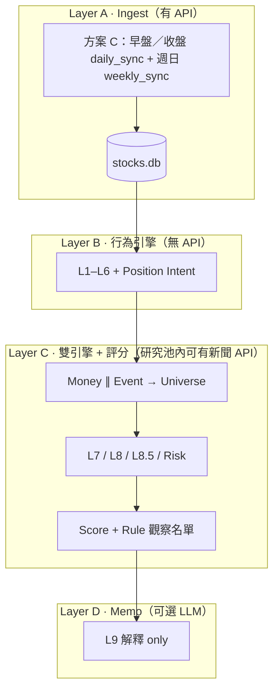
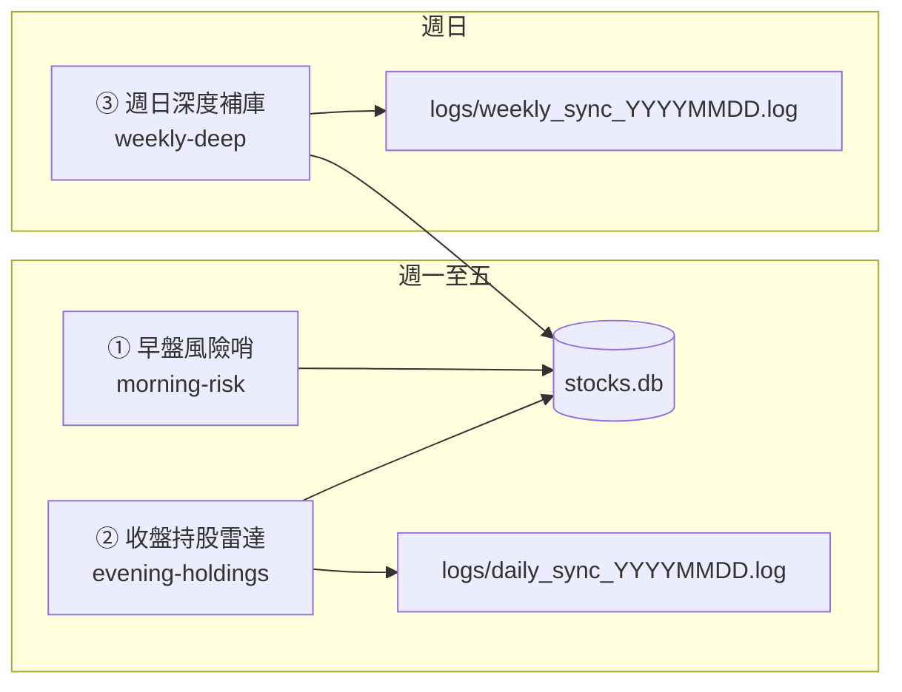
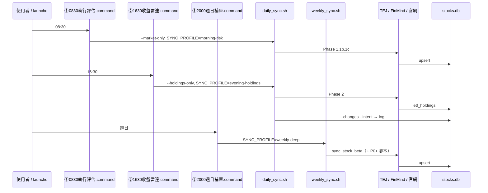
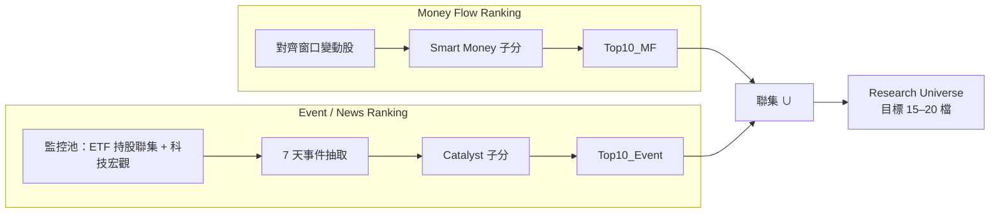
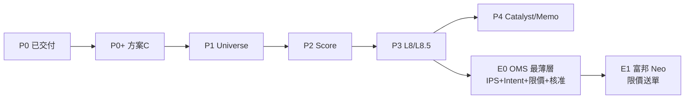
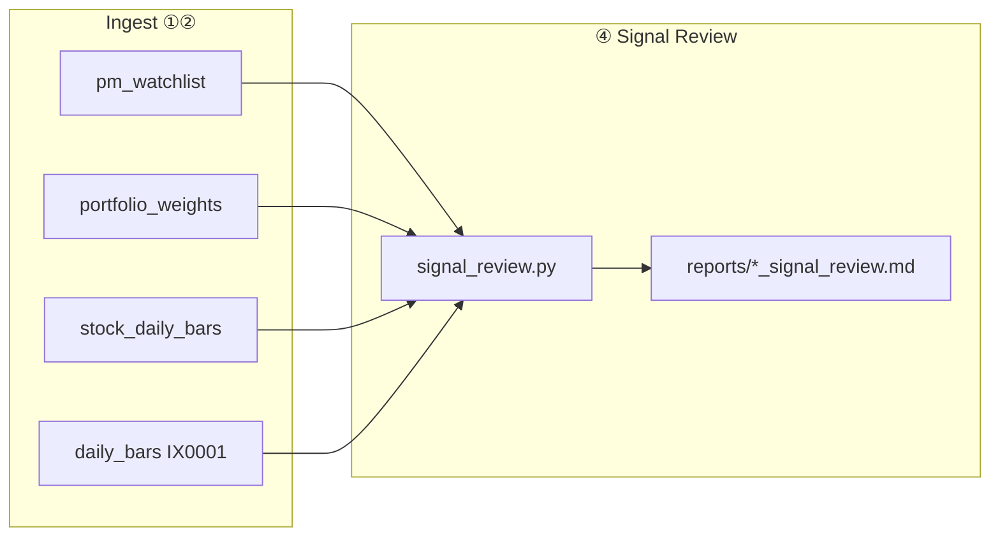
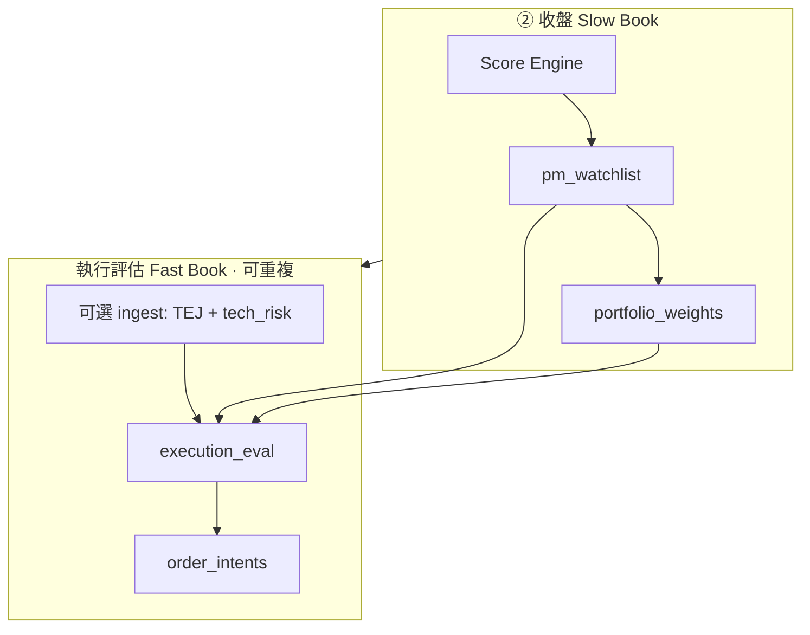

# PRD：ETF 持股研究 → 投資決策引擎

| 欄位 | 內容 |
|------|------|
| 版本 | 0.6 |
| 狀態 | Draft（P0～P3 + ④ + E0.2 已交付；P4 opt） |
| 專案路徑 | `/Users/jackm4/Documents/ETF/股票研究` |
| 相關文件 | [README.md](./README.md)（索引）、[daily-operations.md](./daily-operations.md)（每日 SOP 速查）；**架構／④／E0.2 詳規見本檔 §5.7、§24、§25** |
| 最後更新 | 2026-06 |
| 程式路徑 | Python 模組在 **`src/`**；同步入口在 **`scripts/`**（見 §5.7 專案目錄） |

---

## 1. 摘要

本專案從 **「ETF 持股變化工具」** 演進為 **「機構式投資決策引擎」**。  
已完成 **資金行為層**（What / How much / Who / Rotation / 意圖）；下一階段優先補 **Why（催化）**、**預期差（Expectation）**、**五維綜合研究評分 + 規則觀察名單**，而非再增加行為標籤。

**設計原則**

1. **Ingest 與 Analyze 分離**：`daily_sync` 批次打 API 寫入 SQLite；研究／評分／Memo **預設只讀 DB**。
2. **Event + Money 雙引擎**：Smart Money 排名與 Catalyst 排名 **平行**，聯集成研究池（約 15–20 檔），避免「加碼少但事件大」的標的被漏掉（如台積電法說、CoWoS、法案）。
3. **AI 解釋、規則決策**：評級／觀察名單由 **Rule Engine** 產生；LLM 僅撰寫 Bull/Bear/理由，**不得**輸出 BUY/HOLD/TRIM。

**營運架構（預設）**：**方案 C · 四排程（①②③④）**（analytics 只讀；見 **§5.2**、**§24**）。**執行層** E0 見 **§21**、E0.2 見 **§25**（OMS 最薄層 · 不接券商）。剩餘項見 **§22 改造清單**。

---

## 2. 問題陳述

### 2.1 現有能力（約 82–88 分：量化研究 / 經理人雛形）

| 維度 | 狀態 | 說明 |
|------|------|------|
| What | ✅ | 加減碼、新進、出清（`shares` 差分） |
| How much | ✅ | `flow`、`grow`、`Δwt`（pp） |
| Consensus | ✅ L2 | 加權共識分（非僅 `etf_add >= 2`） |
| Rotation | ✅ L3 | 主題流量矩陣（跨 ETF 對齊日） |
| Conviction | ✅ L4 | 橫截面 z-score |
| Portfolio Role | ✅ L5 | 相對核心（`weight_rank` / top decile） |
| Theme | ✅ L6 | 靜態 `THEME_BY_STOCK` |
| Position Intent | ✅ | 決策表 → 註解主句 |

**已實作模組（參考）**：`src/signal_engine.py`、`position_intent.py`、`comment_engine.py`、`investment_themes.py`；`src/sync_etf_holdings.py --changes --intent`；`scripts/daily_sync.sh`（`PYTHONPATH=src`）末尾 `--intent`。

### 2.2 缺口（阻礙「每日 10 萬～100 萬」下單決策）

| 缺口 | 例證 | 後果 |
|------|------|------|
| **Why** | 2330 註解僅「輪動加碼」未回答 GB300 / CoWoS / 法案 / CapEx / 財報 | 敘述漂亮但資訊量低 |
| **Event 與 Money 單通道** | 技嘉加碼 100% 排前、台積電加碼 0.16% 排後 | 漏研究當日真正事件驅動標的 |
| **Fundamental 過淺** | 僅 PE/ROE 水平 | 無法表達「比市場預期好/差」 |
| **AI 評級** | LLM 輸出 BUY/HOLD 不穩定 | 不適合實盤決策 |

---

## 3. 目標與非目標

### 3.1 目標（Must Have）

| ID | 目標 |
|----|------|
| G1 | **雙引擎研究池**：Money Flow Top10 ∪ Event Top10 → Research Universe（15–20 檔） |
| G2 | **L7 Catalyst**：7 天新聞 → 結構化催化（taxonomy + 關聯度 + 信心度） |
| G3 | **L8.5 Expectation**：預期差、營收加速度（YoY/QoQ/MoM），批次入庫 |
| G4 | **Score Engine**：五維子分 + 綜合研究評分（0–100）+ 規則觀察名單（首要觀察／一般觀察／候選／不列入） |
| G5 | **L9 Memo**：僅對觀察名單內 Top10（by 綜合研究評分）生成解釋性備忘錄 |
| G6 | **可追溯**：分數、規則版本、資料 `as_of_date` 寫入 DB 或報告 metadata |

### 3.2 非目標（Out of Scope · 本 PRD 階段）

- **E1 之後**：富邦 Neo API 自動送單、券商個人帳戶同步、成交回寫閉環（見 **§21.2**）
- 盤中 `intraday_monitor` 併入排程、VWAP/TWAP、即時改價
- 全市場 2000 檔每日全量新聞 + 全量 LLM
- Memo 時逐檔重查 TEJ API
- 再新增 10+ 行為標籤（L1–L6 凍結擴充，僅調參）
- LLM 直接產出 BUY/HOLD/TRIM/目標價

### 3.3 下一階段目標（E0 · Must Have）

| ID | 目標 | 見章節 |
|----|------|--------|
| E0-1 | **IPS**（投資政策）靜態檔：單檔／主題上限、不追價條件 | §21.3 |
| E0-2 | **兩種價格時點**：收盤 `suggested_ntd`；早盤 `ref_price` | §21.4 |
| E0-3 | **Order Intent** + **規則參考買入價**（benchmark；禁止 AI 喊價） | §21.5 |
| E0-4 | **Pre-trade check**：TSM ADR、回避 bucket、sync 健康、IPS 違規 | §21.7 |
| E0-5 | **Approval gate**：開盤前一鍵 `approved`（不接券商） | §21.8 |
| E0-6 | **開盤執行政策**：參考價 ≥ 開盤 → 市價；參考價 < 開盤 → 限價掛單 | §21.6 |

---

## 4. 使用者與場景

| 角色 | 場景 | 產出 |
|------|------|------|
| 本人 | **① 執行評估**（週一至五 **08:30**；原早盤風險哨） | TEJ 日線、**TSM ADR / 科技風險** + **執行快照評估**；詳見 **§25** |
| 本人 | **② 收盤持股雷達**（週一至五 **16:30**） | 官網持股 + `--changes --intent` → `logs/daily_sync_YYYYMMDD.log` |
| 本人 | **③ 週日深度補庫**（週日 **20:00**） | Beta；P0+ 後併入基本面、成分股批次 → `logs/weekly_sync_YYYYMMDD.log` |
| 本人 | 重跑研究、不抓 API | 僅讀 `stocks.db`（未來含 score） |
| 自動化（本機） | 三個 `.command` 以 Mac **`launchd`** 定時觸發（或手動雙擊） | 資料與 log 均在專案內：`data/stocks.db`、`logs/`；備份建議 Time Machine 或複製 `data/` |

**E0（已實作 v0.1；E0.2 見 §25）**：② 收盤定 **建議金額** 與型態；① 早盤定 **參考買入價** 並 Pre-trade → 一鍵核准 → 09:00 依 **開盤執行政策**（§21.6）於券商 **市價或限價**（仍人工，E1 自動）。

**非 E0 場景**：富邦 Neo API 送單（**E1**）、盤中 `intraday_monitor` 併入排程。

---

## 5. 系統架構

### 5.1 三層總覽



### 5.2 方案 C：三段排程架構（預設營運）

將 **Ingest** 依「決策時點」拆成三支獨立排程，避免 08:30 一次跑完卻拿不到當日持股、或 16:30 才補 ADR 的時序錯位。三支排程各有 **中文名**、**英文 slug**（寫入 log 的 `SYNC_PROFILE`）、**入口 `.command`**。

| # | 中文名 | slug | 建議時間 | 入口 | 底層指令 |
|---|--------|------|----------|------|----------|
| ① | **執行評估**（原早盤風險哨） | `execution-eval`（alias `morning-risk`） | 週一至五 08:25–08:40 | `scripts/0830執行評估.command` | `daily_sync.sh --market-only --execution-eval` |
| ② | **收盤持股雷達** | `evening-holdings` | 週一至五 16:30–18:00 | `scripts/1630收盤雷達.command` | `daily_sync.sh --holdings-only --quiet` |
| ③ | **週日深度補庫** | `weekly-deep` | 週日 20:00 | `scripts/2000週日補庫.command` | `weekly_sync.sh` |
| ④ | **策略回顧** | `signal-review` | 隨時 | `scripts/策略回顧.command` | `signal_review.py`（見 **§24**） |



**Mac 排程**：為三個 `.command` 各建一條 `launchd`（或手動雙擊）；**不要**在 `daily_sync` 內用「今天是否週日」自動混跑週任務，以免平日誤觸長時間 API。



#### 5.2.1 Phase 對照（`daily_sync` / `weekly_sync`）

| Phase | 腳本 | ① 早盤 | ② 收盤 | ③ 週日 | API | 寫 DB / 輸出 |
|-------|------|:------:|:------:|:------:|-----|-------------|
| 1 | `query_stock_prices.py` | ✅ | — | — | TEJ（FinMind 備援） | `daily_bars` |
| 1b | `sync_etf_signal.py` | opt | — | — | FinMind | `etf_daily_signal_snapshot`（**預設 SKIP**） |
| 1c | `sync_tech_risk_context.py` | ✅ | — | — | Yahoo+FinMind | `tech_risk_daily_snapshot` |
| 2 | `sync_etf_holdings.py` ×4 | — | ✅ | — | 官網 | `etf_holdings` |
| 2b | `sync_stock_market_daily.py` | — | opt | opt | FinMind | `stock_daily_bars`、`stock_institutional_daily`（`RUN_STOCK_MARKET_SYNC=1`） |
| 3 | `--changes --intent` + `sync_flow_events` | — | ✅ | — | **無** | log + **`flow_events`** |
| W1 | `sync_stock_beta.py` | — | — | ✅ | FinMind/Yahoo | `stock_beta` |
| W2 | `sync_fundamentals.py` | — | — | ✅ | FinMind/TEJ | `stock_fundamental` 等 |
| W3 | `sync_stock_market_daily.py` batch | — | opt | ✅ | FinMind | 成分股 90 日 deep |
| 4–7 | `pipeline_evening.py`（Score / Catalyst / Memo） | — | opt | — | 讀 DB | 併入 **② 收盤** 後段（`RUN_*`） |

Phase 4～7 仍由 **② 收盤持股雷達** 在收盤後觸發（讀當日 DB），**不**併入 ① 早盤。

### 5.3 每日營運：跑幾支、週同步放哪？

| 問題 | 方案 C（v0.3 預設） |
|------|---------------------|
| 每天要點幾次？ | **平日 2 次**（①+②）；**週日 1 次**（③） |
| 背後幾支 Python？ | ① 約 3～4；② 約 5～6；③ 1～3（隨 P0+ 增加） |
| Beta / 基本面誰跑？ | **僅 ③ 週日深度補庫**（`weekly_sync.sh`），不在 `daily_sync` 內自動判斷 |
| 分析時再打 API？ | ❌ Score / intent 只讀 DB |
| log 怎麼分？ | ①② 同日追加 `daily_sync_YYYYMMDD.log`（行首含 `排程=morning-risk` 等）；③ 獨立 `weekly_sync_YYYYMMDD.log` |

**程式分類**

| 類別 | 排程 | 目的 | 打 API？ |
|------|------|------|----------|
| A1 | ① 早盤風險哨 | 基準日線 + 科技風險（+ 可選 ETF 法人） | ✅ |
| A2 | ② 收盤持股雷達 | 官網持股寫 DB | ✅ |
| B | ② 收盤持股雷達 | changes / intent /（未來）score | ❌ |
| C | ③ 週日深度補庫 | Beta、L8/L8.5、成分股批次 | ✅ |
| D | — | `intraday_monitor` | 可選；**不納入**方案 C |

### 5.4 資料預載：更新頻率與現況

| 資料 | 更新頻率 | 現況 | 規劃 |
|------|----------|------|------|
| 官網 ETF 持股 | 每交易日 1 次 | ✅ daily_sync #2 | 官網未更新 → Skip |
| TEJ ETF/指數日線 | 每交易日 1 次 | ✅ #1 | 早上常為 **T-1** K |
| 科技風險 **含 TSM ADR** | 每交易日 ≥1 次 | ✅ #1c | 開盤前決策用 |
| ETF 三大法人 | 每交易日 1 次 | 🔶 腳本有、**預設關** | `.env` `ENABLE_FINMIND_SIGNAL=1` |
| 成分股收盤 + 法人 | 每交易日 1 次（`RUN_STOCK_MARKET_SYNC=1`） | ✅ ② incremental / ③ batch | `sync_stock_market_daily.py` |
| Beta | 每週 1 次 | ✅ **③ 週日深度補庫** | `weekly_sync.sh` |
| 月營收 / PER / 財報 | 每週～公告後 | ✅ ③ | `sync_fundamentals.py` |
| L7 新聞 / 催化 | 按需 / Universe | 🔶 opt | `catalyst_engine.py`（`RUN_CATALYST_ENGINE` / `RUN_NEWS_SYNC`） |
| ETF Flow 快照 | 每交易日 1 次（② intent 後） | ✅ | `sync_flow_events.py` → `flow_events` |
| **禁止** | — | — | Memo/Score 時逐檔 TEJ；全市場 2000 檔每日拉 |

**監控池（成分股 FinMind）**：7 檔 ETF 持股**聯集**（約 80～150 檔），或 Research Universe 擴至 50～100；**勿**全市場。

### 5.5 Mac 排程建議（台灣時間）

| 排程 | 建議觸發 | 看什麼 |
|------|----------|--------|
| **① 早盤風險哨** | 週一至五 **08:30** | `tech_risk_daily_snapshot`、TSM ADR；**不**依賴當日官網持股 |
| **② 收盤持股雷達** | 週一至五 **16:30** | `logs/daily_sync_*.log` 內 `--changes --intent`；TEJ/官網較接近當日 |
| **③ 週日深度補庫** | 週日 **20:00** | Beta；P0+ 後基本面與成分股法人 |

| 不建議 | 原因 |
|--------|------|
| 僅盤中跑 ② | 持股/K 常未定型 |
| 僅 08:30 跑全量 `daily_sync` 當唯一決策 | changes 多為 T-1；應改 **①+②** |
| 把 ③ 塞進平日 `daily_sync` | 拉長 API、與開盤決策無關 |

**TSM ADR**：僅在 **①** 的 Phase 1c 執行（失敗 log WARN）。詳見 **§19**。

### 5.6 ETF 法人 vs 成分股法人

| 層級 | 資料 | 狀態 |
|------|------|------|
| ETF（00981A 等） | `etf_daily_signal_snapshot` | 有程式；建議開 env |
| 成分股（2330 等） | 驗證「ETF 加碼 vs 市場籌碼」 | ✅ `stock_institutional_daily`（`RUN_STOCK_MARKET_SYNC=1`） |

---


## 6. 訊號層級定義（L1–L9）

| 層級 | 名稱 | 職責 | 實作狀態 |
|------|------|------|----------|
| L1 | Flow | 交易現象：Δ股、flow、action | ✅ |
| L2 | Consensus | 加權共識（z_flow + z_Δwt） | ✅ |
| L3 | Rotation | 主題間資金流 | ✅（需對齊 cohort） |
| L4 | Conviction | 加碼力度橫截面 | ✅ |
| L5 | Portfolio Role | CORE / THEMATIC / SATELLITE（相對排名） | ✅ |
| L6 | Theme | 產業背景 | ✅ 靜態表 |
| — | Position Intent | 主意圖（MAINTAIN_CORE、ROTATION_PLAY…） | ✅ |
| L7 | Catalyst | 結構化催化事件（Why） | 🔶 opt（`RUN_CATALYST_ENGINE=0`） |
| L8 | Fundamental | 財務水準（PE、ROE…） | ✅ `stock_fundamental` |
| L8.5 | Expectation | 預期差、營收加速度 | ✅ `expectation_engine.py` |
| — | Risk 子分 | beta、`tech_risk` | 🔶 部分（beta 有表） |
| L9 | Memo | 敘事；**不評級** | 🔶 opt（`RUN_MEMO=0`） |

**Comment 優先序**：L5 Intent + L7 > L8.5 > L2/L3 > L6 > L1（L1 不主導主句）。

---

## 7. 雙引擎：Research Universe

### 7.1 流程



### 7.2 合併規則

- `Universe = Top10_MF ∪ Top10_Event`（依 `stock_id` 去重）。
- 單檔保留雙通道來源標記：`from_money` / `from_event` / `both`。
- **禁止**僅用 Smart Money Top10 作為唯一研究入口。

### 7.3 範例

| stock_id | Smart Money 排名 | Event 排名 | 進池原因 |
|----------|------------------|------------|----------|
| 2376 | 高 | 中 | Money |
| 2330 | 中低 | 高 | **Event**（法說 / CoWoS / 法案） |
| 6223 | 中 | 高 | Event（HBM 測試等） |

---

## 8. L7 Catalyst Engine

### 8.1 原則

| 做法 | 說明 |
|------|------|
| ✅ | 僅對 **Research Universe** 抓最近 **7 天**新聞 |
| ✅ | 固定 **Catalyst Taxonomy**（枚舉），LLM 填結構化欄位 |
| ✅ | 輸出 `explains_etf_add`：HIGH / MED / LOW / NONE |
| ❌ | 持股池全檔每日搜新聞 |
| ❌ | 無 taxonomy 的自由摘要 |
| ❌ | Memo 時逐檔 TEJ |

### 8.2 Catalyst Taxonomy（對應研究問題）

| 代碼 | 類別 | 例 |
|------|------|-----|
| `PRODUCT_CYCLE` | 產品週期 / 出貨 | GB200、拉貨 |
| `SUPPLY_CHAIN` | 供應鏈 | CoWoS、封裝產能 |
| `POLICY` | 政策法規 | 美國出口、補貼 |
| `CAPX` | 資本支出 | CapEx 上修 |
| `EARNINGS` | 財報法說 | EPS、指引 |
| `SELL_SIDE` | 法人報告 | 升評、目標價 |
| `VALUATION` | 估值敘事 | 本益比區間 |

### 8.3 輸出 Schema（`catalyst_events` 表 · 規劃）

```yaml
stock_id: string
event_date: date
catalyst_type: enum  # 見 8.2
headline: string      # ≤80 字
polarity: BULL | BEAR | NEUTRAL
explains_etf_add: HIGH | MED | LOW | NONE
confidence: 0-100
sources: json         # [{title, date, url}]
ingested_at: iso8601
```

### 8.4 LLM Prompt 邊界（摘要）

- 角色：台股基金經理研究助理。
- 輸入：股票清單（≤20）、已有 ETF 訊號（JSON）、新聞摘要（已過濾）。
- 任務：每檔 0–2 個最重要事件；不得臆測無來源事實。
- **禁止**輸出投資評級。

---

## 9. L8 Fundamental & L8.5 Expectation

### 9.1 L8 Fundamental（水準）

- 資料來源：**批次** sync → `stock_fundamental`（規劃）。
- 欄位例：`pe`, `pb`, `roe`, `dividend_yield`, `market_cap`, `as_of_date`。
- 用途：子分 **Fundamental 15%**；非單獨決策。

### 9.2 L8.5 Expectation（預期差 · 核心）

| 指標 | 說明 | 分數邏輯 |
|------|------|----------|
| Expectation Gap | 實際 vs consensus（EPS/營收） | 優於預期 ↑；遜於預期 ↓ |
| 營收 YoY | 同比 | 搭配加速度 |
| 營收 QoQ / MoM | 环比 | **加速** ↑；減速 ↓ |
| 指引修訂 | 法說上修/下修 | 上修 ↑ |

**反例（必須支援）**

- ROE 34% 但 consensus 38% → **利空**（Expectation ↓）。
- ROE 15% 但 consensus 8% → **利多**（Expectation ↑）。

### 9.3 資料表（規劃）

- `stock_fundamental`：截面財務。
- `stock_consensus`：市場共識預期。
- `stock_financial_history`：季營收/EPS 序列（算加速度）。

**同步頻率**：建議每週 1 次（或財報季加密），**非**每日 50 檔 TEJ 查詢。

---

## 10. Score Engine & Rule Rating

**現行版本**：`score_version = p4-v2`（`src/score_engine.py`）。  
設計原則：**研究分（加權總分）與進場時機（技術）分離**；事件以產業催化為主，MSCI/指數調整不進 Event Top、不主導催化子分。

### 10.1 加權五維（各 0–100，進綜合研究評分）

| 子分 | 權重 | 主要輸入 |
|------|------|----------|
| **資金籌碼（Smart Money）** | **50%** | 合成子分：`0.55×ETF流向 + 0.45×法人籌碼`（見下） |
| Catalyst | **10%** | L7 **產業**事件（排除 INDEX_REBALANCE/MSCI）；confidence 上限 |
| Expectation | **15%** | L8.5 預期差、共識修正 |
| Fundamental | **15%** | L8 基本面水準 |
| Risk | **10%** | `stock_beta`、`tech_risk_daily_snapshot`（β、TSM ADR 等） |

**不進加權**：**價位分（Timing）** — 由價位型態（突破／拉回／觀望／乖離過大／暫不進場＋量價齊揚）與觀察名單閘門處理，避免「技術 20%」把強勢股誤殺。

#### 資金籌碼分量

| 分量 | 計算 | 說明 |
|------|------|------|
| ETF流向 `flow` | conviction + consensus + rotation + role；非加碼 cap 35 | L2–L5 ETF 行為 |
| 法人籌碼 `chip` | 籌碼標籤 + 三大法人淨買微調 | ETF×外資×投信 |

```text
smart_money = 0.55 * flow + 0.45 * chip
```

### 10.2 綜合研究評分（p4-v2）

```text
investment_score =
    0.50 * smart_money
  + 0.10 * catalyst
  + 0.15 * expectation
  + 0.15 * fundamental
  + 0.10 * risk
```

結果：**0–100**，保留一位小數；寫入 `investment_scores` 並附 `score_version`、`as_of_date`。  
`metadata_json` 另存 `flow_score`、`chip_score`、`timing_score`、`entry_signal`、`entry_tags`。

### 10.3 價位型態與風控（不進綜合評分）

| 機制 | 用途 |
|------|------|
| 價位型態 + **量價齊揚** | 開盤前觀察名單、建議部位、風控 overlay |
| **乖離過大**（Universe P75 + 絕對下限 12%） | 價位型態；無量價齊揚時觀察名單 **封頂一般觀察**（非不列入） |
| **暫不進場**（ETF 減碼） | 風控覆寫，非純技術型態 |
| `risk_gate`（如 TSM_ADR_LT_-2PCT） | 旗標 + 建議部位縮放 |

**價位型態存值（中文）**：突破／拉回／觀望／乖離過大／暫不進場；附加 tag：量價齊揚。

### 10.4 Rule Rating（觀察名單 · 程式決定）

| 條件（p4-v2） | 觀察名單（DB 存值） |
|----------------|---------------------|
| `investment_score >= 75` 且 `smart_money >= 72`，且非暫不進場 | **首要觀察** |
| `investment_score >= 65` | **一般觀察** |
| `investment_score >= 55` | **候選** |
| 其餘或暫不進場 | **不列入** |

- **禁止** LLM 覆寫觀察名單；**禁止**以 Catalyst≥70 綁架首要觀察（避免 MSCI 週污染）。
- Memo **僅**處理首要觀察內依 `investment_score` 排序之 **Top10**。

### 10.5 開盤前延伸（收盤寫入）

| 表 | 內容 |
|----|------|
| `pm_watchlist` | 隔日等級：**觀察／突破／回避**；早盤只讀；**乖離過大 + 高籌碼（外資、投信同步買超／外資買超或 chip≥70）→ 觀察** |
| `portfolio_weights` | 部位分／風險分／建議權重％；`PORTFOLIO_CAPITAL_NTD` 預設 100000 |
| `RUN_EXPORT_AI_BUNDLE` | 收盤寫入 `reports/YYYYMMDD_research_context.json` + `ai_bundle.md`（外部 LLM 提示詞；不寫回 watchlist） |

**籌碼標籤（中文）**：外資、投信同步買超／外資買超／法人中性／外資賣超背離／籌碼背離／同步賣超。

**舊 DB 遷移**（英文 enum → 中文存值）：

```bash
PYTHONPATH=src .venv/bin/python src/migrate_market_labels.py --db data/stocks.db
# 先預覽：加 --dry-run
```

### 10.6 版本對照

| 版本 | 加權 | 備註 |
|------|------|------|
| p3（PRD 初稿） | 30/25/20/15/10 SM/Cat/Exp/Fun/Risk | 事件權重偏高 |
| p4-v1（已汰） | 35/25/20/10/10 資金/籌碼/技術/事件/基本 | 技術進總分、無 Expectation/Risk 維 |
| **p4-v2（現行）** | **50/10/15/15/10** SM/Cat/Exp/Fun/Risk | 資金+籌碼合成 SM；技術僅閘門 |

### 10.7 報告輸出範例

```text
2330 台積電 | 綜合研究評分 78.5 | 觀察名單 一般觀察 | 價位型態 突破

資金籌碼  85   ETF流向 89   法人籌碼 80   預期差 72   基本面 68   風險面 70   價位分 88
籌碼標籤 外資買超

[Memo — 規則評級已在上方，AI 不重複評級]
```

---

## 11. L9 Investment Memo

| 項目 | 規格 |
|------|------|
| 觸發 | `RUN_MEMO=1` 且已完成 Score Engine |
| 輸入 | 結構化 JSON：五維分、L7 events、L8/L8.5、L1–L6 摘要、`tech_risk` 一列 |
| 輸出 | Markdown：`reports/YYYYMMDD_memo.md`（路徑可調） |
| AI 任務 | ① 理由條列 ② Bull ③ Bear ④ 與 ETF 行為一致性說明 |
| AI 禁止 | BUY/HOLD/TRIM、目標價、部位% |

---

## 12. 資料架構

### 12.1 現有表（`stock_db.py`）

- **Raw**：`daily_bars`、`etf_holdings`、`etf_holdings_meta`、`etf_daily_signal_snapshot`（opt）、`stock_daily_bars`、`stock_institutional_daily`、`stock_fundamental`、`stock_consensus`、`stock_financial_history`、`stock_beta`、`tech_risk_daily_snapshot`、`morning_risk_snapshot`
- **Signal**：`flow_events`、`catalyst_events`（opt）
- **Score / Portfolio**：`investment_scores`、`pm_watchlist`、`portfolio_weights`
- **Execution**：`order_intents`、`execution_eval_runs`
- **Analytics**：`signal_review_runs`、`signal_outcomes`、`signal_paper_days`、`signal_paper_horizons`
- **Memo / 其他**：`research_memos`（opt）、`portfolio_books`、`portfolio_positions`
- **盤中**：`intraday_*`（**不納入方案 C**）

### 12.2 規劃／可選表

| 表名 | 用途 | 同步腳本 | 狀態 |
|------|------|----------|------|
| `order_intents` | E0 待核准訂單草稿（見 §21.4～§21.6） | `order_intent_engine.py` | ✅ E0 |
| `catalyst_events` | L7 結構化事件 | `catalyst_engine.py` | 🔶 opt |
| `stock_consensus` | L8.5 預期 | `sync_fundamentals.py` | ✅ |
| `stock_financial_history` | L8.5 加速度 | 同上 | ✅ |
| `research_memos` | L9 正文 + metadata | `investment_memo.py` | 🔶 `RUN_MEMO=0` 預設 |
| `analytics_performance` 等 | 績效對帳 | — | 📋 未建 |
| `sync_meta`（可選） | 上次週 sync 時間 | `daily_sync.sh` 內建 | 📋 |

### 12.3 API 使用政策

| 時機 | TEJ | FinMind | 官網持股 | 新聞 | LLM |
|------|-----|---------|----------|------|-----|
| daily_sync Phase 1–2 | ✅ 批次 | 可選 | ✅ | ❌ | ❌ |
| 週 sync 基本面 | ✅ 批次 | 可選 | ❌ | ❌ | ❌ |
| Score Engine | ❌ | ❌ | ❌ | ❌ | ❌ |
| Catalyst（Universe only） | ❌ | ❌ | ❌ | ✅ ≤20 檔 | ✅ 結構化 |
| Memo Top10 | ❌ | ❌ | ❌ | ❌ | ✅ 敘事 |

### 12.4 資料表分層（寫入者／讀取者）

| 層 | 表（要點） | 寫入 | 讀取 |
|----|-----------|------|------|
| Raw | `daily_bars`、`etf_holdings`、`stock_daily_bars`、`stock_fundamental`… | ①②③ ingest | Research / Analytics |
| Signal | `flow_events`；L1–L6 以 log／記憶體為主 | ② intent 後 | Research、④ |
| Score | `investment_scores` | ② Score Engine | Portfolio、①、④ |
| Portfolio | `pm_watchlist`、`portfolio_weights` | ② 收盤 | ①、④ |
| Execution | `order_intents`、`execution_eval_runs` | ① E0.2 | 人工／E1 預留 |
| Analytics | `signal_review_runs`、`signal_outcomes`、`signal_paper_*` | ④ | ④ 渲染 report |
| Memo | `research_memos`、`catalyst_events`（opt） | ② opt | 敘事 only |

**Analytics 持久化（v0.3+）**：④ 計算後寫入 `signal_review_*`；`reports/*_signal_review.md` 由 DB 渲染（`--render-only` 可重跑）。

---

## 13. 模組與檔案規劃

| 模組 | 檔案 | 狀態 |
|------|------|------|
| 行為訊號 | `src/signal_engine.py` | ✅ |
| 意圖 / L2 | `src/position_intent.py` | ✅ |
| 註解 | `src/comment_engine.py` | ✅ |
| 主題 | `src/investment_themes.py` | ✅ 持續擴充 |
| ETF 法人 | `src/sync_etf_signal.py` | ✅（預設關） |
| 科技風險 / TSM ADR | `src/sync_tech_risk_context.py` | ✅ |
| 成分股市場 | `src/sync_stock_market_daily.py` | ✅ |
| Flow 快照 | `src/sync_flow_events.py` | ✅ |
| Flow 歸因 | `src/flow_attribution.py` | ✅ v0.3 |
| 策略回顧 | `src/signal_review.py` | ✅ v0.3 |
| 研究池 | `src/research_universe.py` | ✅ P1 |
| 事件排名 | `src/event_ranking.py` | ✅ P1 |
| 催化 | `src/catalyst_engine.py` | 🔶 P4 opt |
| 基本面 sync | `src/sync_fundamentals.py` | ✅ P3 |
| 預期 | `src/expectation_engine.py` | ✅ P3 |
| 評分 | `src/score_engine.py` | ✅ P2 |
| 投組權重 | `src/portfolio_engine.py`、`pm_watchlist.py` | ✅ |
| 收盤編排 | `src/pipeline_evening.py` | ✅ |
| 備忘錄 | `src/investment_memo.py` | 🔶 P4 opt |
| 日線 | `src/query_stock_prices.py` | ✅（TEJ + FinMind 備援） |
| 持股 | `src/sync_etf_holdings.py` | ✅ |
| DB | `src/stock_db.py` | ✅ |
| 週期排程 | `scripts/weekly_sync.sh`（③） | ✅ |
| Beta | `src/sync_stock_beta.py` | ✅ |
| 同步編排 | `scripts/daily_sync.sh` | ✅ |
| IPS 載入 | `src/investment_policy.py` | ✅ E0 |
| 規則參考價 | `src/rule_limit_price.py` | ✅ E0 |
| 開盤政策 | `src/open_execution_policy.py` | ✅ E0 |
| Pre-trade | `src/pre_trade_check.py` | ✅ E0 |
| 訂單意圖 | `src/order_intent_engine.py` | ✅ E0 |
| 執行評估 E0.2 | `src/execution_eval.py` | ✅ |

**CLI / `.env`（現有 + 規劃）**

```bash
# 現有
TEJ_API_KEY=...
FINMIND_TOKEN=...
ENABLE_FINMIND_SIGNAL=1      # 建議開：ETF 三大法人寫 DB

# 收盤建議（見 daily-operations.md）
RUN_STOCK_MARKET_SYNC=1      # 成分股價+法人（持股聯集）
RUN_SCORE_ENGINE=1           # Universe + 五維分 + pm_watchlist
RUN_EXPORT_AI_BUNDLE=1       # JSON + 外部 LLM 提示詞
RUN_MEMO=0                   # Top10 敘事（預設關）
# 週任務請用 ③ 週日深度補庫（weekly_sync.sh），勿依賴 daily_sync 自動週判斷
CATALYST_NEWS_DAYS=7
RESEARCH_UNIVERSE_MAX=20
STOCK_UNIVERSE_MODE=holdings_union   # holdings_union | research_pool

# E0（規劃）
RUN_ORDER_INTENT=0                 # ① 早盤產 order_intents 草稿
ORDER_INTENT_REQUIRE_APPROVAL=1    # 須明確 --approve 才標 approved
```

---

## 14. 實施路線圖



| 階段 | 交付物 | 驗收 |
|------|--------|------|
| **P0** | `--intent`、對齊 cohort、L2–L6；log 含 intent | ✅ 已交付 |
| **P0+** | 見 **§22**（成分股 DB、Score 併入 ②、env 文件化） | ✅ 可 daily 使用 |
| **P1** | `research_universe.py` + `event_ranking.py` | ✅ |
| **P2** | `score_engine.py` + `investment_scores` | ✅ |
| **P3** | `sync_fundamentals` + `expectation_engine` | ✅ |
| **P4** | `catalyst_engine` + `investment_memo` | 🔶 腳本已有；預設關 |
| **④ v0.3** | `flow_events` + `flow_attribution` + Signal Review §0 | ✅ |
| **E0** | 見 **§21**（IPS、Order Intent、規則限價、Pre-trade、Approval） | 📋 1～2 sprint；**不接券商** |
| **E1** | 富邦 Neo API：ROD 限價送單 + 成交回寫 | 📋 E0 完成後 |

---

## 15. 成功指標

| 指標 | 目標 |
|------|------|
| 研究池覆蓋 | 當日重大事件股（人工抽樣 5 日）≥80% 進 Universe |
| 評分穩定性 | 同 DB 快照重跑，綜合研究評分差異 <0.1 |
| API 成本 | 每日新聞請求 ≤25 次（Universe+緩衝） |
| 決策可用性 | 觀察名單 A ≤10 檔；每檔有 ≥3 條可驗證理由（含 L7 或 L8.5） |
| 下單輔助 | 使用者主觀：能否回答「為什麼今天值得看」 |
| E0 執行草稿 | 開盤前 5 分鐘內可讀懂「掛什麼價、幾張、為何被擋」 |

---

## 16. 風險與緩解

| 風險 | 緩解 |
|------|------|
| ETF snapshot 日不對齊 | 最大對齊 cohort（已實作）；報告標註未納入 ETF |
| 新聞雜訊 | Taxonomy + 白名單來源 + 每檔最多 2 事件 |
| LLM 幻覺 | 必須帶 `sources`；無來源則 `confidence` 上限 40 |
| 基本面資料缺 | Expectation 降權或標 `DATA_MISSING` |
| 過度依賴 AI 評級 | Rule Engine 唯一評級；Code Review 禁止 Memo 輸出評級字樣 |

---

## 17. 開放問題

1. **新聞源**：工商時事 / 鉅亨 / RSS / 第三方 API？需選一個主源 + 快取策略。
2. **consensus 來源**：TEJ 是否已購財報預測模組？若無，FinMind 或 CSV 匯入？
3. **Event Ranking 是否含宏觀**：僅個股 vs 含「半導體指數/TSM」觸發連結持股？
4. **00982A 等日期落後 ETF**：Universe 是否允許第二 cohort 單獨跑 Event？
5. **觀察名單 A 的 `catalyst >= 70`**：是否改為「Event 通道進池即免門檻」？

---

## 18. 附錄 A：排程與 `daily_sync.sh` / `weekly_sync.sh`

### 18.1 方案 C 指令對照

| 排程 | `SYNC_PROFILE` | 指令 |
|------|----------------|------|
| ① 早盤風險哨 | `morning-risk` | `daily_sync.sh --market-only --quiet` |
| ② 收盤持股雷達 | `evening-holdings` | `daily_sync.sh --holdings-only --quiet` |
| ③ 週日深度補庫 | `weekly-deep` | `weekly_sync.sh` |

### 18.2 `daily_sync.sh` 步驟（① / ②）

| 序 | 步驟 | ① 早盤 | ② 收盤 |
|----|------|:------:|:------:|
| 0 | 載入 `.env` | ✅ | ✅ |
| 1 | `query_stock_prices.py` | ✅ | — |
| 2 | `sync_etf_signal.py` 或 SKIP | opt | — |
| 3 | `sync_tech_risk_context.py` | ✅ | — |
| 4–7 | 四源 `sync_etf_holdings` | — | ✅ |
| 8 | `--changes --intent` → log | — | ✅ |
| （P0+） | `sync_stock_market_daily` | — | opt `RUN_*` |
| （P2+） | `score_engine` / `investment_memo` | — | opt |

### 18.3 `weekly_sync.sh`（③）

| 序 | 步驟 | 現況 |
|----|------|------|
| 1 | `sync_stock_beta.py --sync-db` | ✅ |
| 2 | `sync_fundamentals.py` | 腳本存在時執行（規劃） |
| 3 | `sync_stock_market_daily.py` | 腳本存在時執行（規劃） |

**旗標**：`--holdings-only`、`--market-only`、`--quiet`；log 行首 `排程=<slug>`（由 `.command` 設定 `SYNC_PROFILE`）。

---

## 19. 附錄 B：開盤前風險決策（TSM ADR）

| 欄位（`tech_risk_daily_snapshot`） | 用途 |
|-----------------------------------|------|
| `tsm_daily_return_pct` | 美股上一交易日 ADR 漲跌；大跌 → 當日降低科技股新倉意願 |
| `sox_daily_return_pct` / `semi_benchmark` | 半導體板塊情緒 |
| `tx_gap_pct` | 台指期相對現貨 gap（資料缺時見 `notes`） |
| `session_date` / `us_trade_date` | 對照台股／美股交易日 |

**規則範例（Score Risk 子分或獨立 gate，規劃）**：`tsm_daily_return_pct < -2%` → Risk 子分下调或「科技交易暫緩」旗標（**非** LLM 決策）。

---

## 20. 附錄 C：詞彙表

| 詞彙 | 定義 |
|------|------|
| 對齊 cohort | 共用同一 `prev→curr` 的 ETF 子集 |
| Smart Money | 資金籌碼合成子分（ETF流向 + 法人籌碼） |
| Research Universe | MF Top10 ∪ Event Top10 |
| 綜合研究評分 | 五維加權總分（0–100） |
| 觀察名單 | 首要觀察／一般觀察／候選／不列入；Rule Engine 輸出，非 LLM 評級 |
| 隔日等級 | 觀察／突破／回避（`pm_watchlist.pm_bucket`） |
| 價位型態 | 突破／拉回／觀望／乖離過大／暫不進場；tag：量價齊揚 |
| 籌碼標籤 | 外資、投信同步買超／外資買超／法人中性／外資賣超背離／籌碼背離／同步賣超 |
| TSM ADR | Yahoo `TSM` → `daily_bars.code=TSM_ADR` |
| 成分股法人 | FinMind → `stock_institutional_daily` |
| ETF Flow 快照 | `flow_events`（② intent 後；§0 只讀） |
| 方案 C | ①早盤風險哨 + ②收盤持股雷達 + ③週日深度補庫 + ④策略回顧 |
| 早盤風險哨 | slug `morning-risk`；`--market-only` |
| 收盤持股雷達 | slug `evening-holdings`；`--holdings-only` |
| 週日深度補庫 | slug `weekly-deep`；`weekly_sync.sh` |
| IPS | `data/investment_policy.yaml`；單檔／主題上限與不追價規則 |
| Order Intent | `order_intents` 表；狀態 `draft`→`blocked`→`approved` |
| 規則限價 | `benchmark_type`：昨收／MA20／前高；禁止 LLM 目標價 |
| Pre-trade | TSM ADR gate、`pm_bucket=回避`、`entry_signal=暫不進場`、sync 健康 |
| 開盤執行政策 | `ref_price >= open` → 市價 ROD；`ref_price < open` → 限價 ROD |
| Approval gate | 開盤前一鍵 `--approve`；未核准不得進 E1 送單 |

---

## 21. Execution v0.1（OMS 最薄層 · Pre-Broker）

> **設計依據**：對齊買方機構最小閉環（Research → Portfolio → **Pre-Trade** → Order Generation → **Approval** → Execution）。  
> **E0 只做前五段最後一步之前的「草稿 + 核准」**；Execution 送單留 **E1（富邦 Neo API）**。  
> **難度**：低～中（新表 + 數個模組）；**Analyze 路徑禁止打行情 API**。

### 21.1 目標與使用者故事

| 故事 | 說明 |
|------|------|
| 收盤後 ② | 寫入 `pm_watchlist`、`portfolio_weights`：**建議金額** `suggested_ntd`、型態、`pm_bucket`（研究決策） |
| 收盤後（可選） | `--preview` 用當日 K 線試算 **參考買入價** 草稿；**非核准版**，僅供隔日心理準備 |
| 開盤前 08:30 ① | `tech_risk` 更新後，正式產 **Order Intent** + **Pre-trade**（參考買入價以此版為準） |
| 開盤前 08:45 | 閱讀 checklist + `order_intents` → **一鍵核准** → `status=approved` |
| 09:00 開盤 | 對每筆 `approved`：比較 **參考買入價** 與 **開盤價** → 市價或限價（§21.6） |
| 盤中 | 限價分支：ROD 掛單等待回檔；未成交無部位損益。E1 改 API 送單 |

**終態願景**：開盤前僅需一鍵確認；**不無腦追開盤**，但開盤價優於參考價時允許市價上車。

### 21.2 範圍

| In Scope（E0） | Out of Scope（E1+） |
|----------------|---------------------|
| IPS 靜態政策檔 | 富邦 Neo API 送單／撤單 |
| `order_intents` 表 + 報告 | 券商帳戶持倉同步 |
| 規則 **參考買入價**（benchmark 可追溯） | 無條件開盤市價追價、VWAP/TWAP |
| **開盤執行政策**（§21.6）：有利市價／不利限價 | 盤中動態改價、`intraday_monitor` 併入 |
| Pre-trade 硬檢查 | 成交回寫 `execution_fills` |
| CLI `--approve` 核准閘門 | |
| 收盤 `--preview` 參考價預覽（可選） | |

### 21.3 Investment Policy Statement（IPS）

**路徑**：`data/investment_policy.yaml`（或 `.json`；**不入 git 敏感欄位**，提供 `data/investment_policy.example.yaml`）。

**用途**：將 `morning_checklist` 與 Score Risk 中已存在的規則**收斂為可機讀政策**，供 Pre-trade 與 E1 共用。

**建議欄位（YAML 示意）**：

```yaml
version: ips-v1
capital_ntd: 100000          # 可與 Paper 10 萬對齊；E1 前可手動
max_single_weight_pct: 25    # 單檔建議金額上限（佔 capital）
max_theme_weight_pct: 50     # 同主題聚合上限（讀 investment_themes）
exclude_entry_signals: ["暫不進場", "乖離過大"]   # 不產 intent
exclude_pm_buckets: ["回避"]
exclude_chip_tags: ["外資賣超背離", "籌碼背離", "同步賣超"]
tsm_adr_block_new_tech_pct: -2.0   # ADR 低於此 → 擋科技新倉（見 §21.7）
require_evening_sync_ok: true      # ② 當日 pm_watchlist 基準日 = 最近交易日
min_risk_reward: 1.5               # 若有 stop/target（見 §21.5）才檢查
```

**原則**：IPS **只收斂既有規則**，不新增 LLM 或主觀欄位。

**執行政策（併入 IPS 或獨立 `execution_policy` 區塊）**：

```yaml
open_execution_policy: compare_at_open   # E0 核心
open_price_source: auction_0900          # 集合競價 09:00 成交價；E1 可改 first_trade
favorable_open_action: market_rod        # ref_price >= open → 當日 ROD 市價買
unfavorable_open_action: limit_rod       # ref_price <  open → 限價 @ ref_price，整日等待
```

### 21.4 決策時點與兩種價格

系統內有 **兩種不同「價格」**，勿與「建議金額」混淆：

| 種類 | 欄位／產物 | 決策內容 | 主要時點 | 現況 |
|------|------------|----------|----------|------|
| **建議金額** | `portfolio_weights.suggested_ntd` | 這檔配置多少台幣 | **② 收盤** | ✅ 已有 |
| **參考買入價** | `order_intents.ref_price`（= 規則限價） | 願意買的價位（昨收／MA20／前高） | **① 早盤** 正式定案 | 📋 E0 |
| **執行方式** | `order_type_effective` | 市價 ROD 或限價 ROD | **09:00 開盤比對** | 📋 E0 人工／E1 API |

**分工原則**：

1. **前一日收盤**：決定 **做不做、做多少、突破或拉回**（研究層）；不取代隔日風控。
2. **當日早盤風控**：`tech_risk` + IPS + Pre-trade 決定 **能不能做**；並算出 **當日參考買入價** 與股數。
3. **開盤瞬間**：僅對 `approved` 標的，依 §21.6 決定 **市價上車或限價等待**；Pre-trade 擋下的標的不進入比對。

**收盤預覽（可選）**：`order_intent_engine.py --preview` 可讀取與早盤相同之規則限價公式，輸出 `reports/*_order_intents_preview.md`；**不寫入 `approved`**，早盤仍須重跑 `--generate --pre-trade`。

### 21.5 Order Intent

**來源（只讀 DB）**：

- `pm_watchlist`：`pm_bucket ∈ {突破, 觀察}` 且 `entry_signal` 未被 IPS 排除
- `portfolio_weights`：同 `as_of_date`、`suggested_ntd > 0`

**表 `order_intents`（規劃欄位）**：

| 欄位 | 說明 |
|------|------|
| `trade_date` | 意圖交易日（通常 = 執行日） |
| `as_of_date` | 研究基準日（前日收盤 Score） |
| `stock_id` / `stock_name` | 標的 |
| `side` | 固定 `BUY`（E0 僅買入意圖） |
| `ref_price` | **參考買入價**（規則限價，§21.5）；早盤風控後正式定案 |
| `limit_price` | 與 `ref_price` 同值（相容欄位名） |
| `qty` | `floor(suggested_ntd / ref_price)` 整股 |
| `suggested_ntd` | 來自 `portfolio_weights`（**收盤**已定的建議金額） |
| `pm_bucket` / `entry_signal` / `entry_tags_json` | 追溯 |
| `benchmark_type` | `prev_close` / `ma20` / `high_52w` 等 |
| `benchmark_price` | 計算基準價（未含 buffer） |
| `stop_price` / `target_price` | 可選；供 R:R 與 `trade_levels` 對照 |
| `order_type_planned` | 核准時固定 `pending_open`（待開盤比對） |
| `open_price` | 09:00 開盤價（E0 人工填入或 E1 行情） |
| `order_type_effective` | `market_rod` / `limit_rod`（§21.6 產出） |
| `status` | 見下表 |
| `block_reason` | Pre-trade 擋單原因 |
| `ips_version` / `intent_version` | 可追溯 |

**狀態機**：

```text
draft → (pre_trade) → approved | blocked | rejected
approved → (E1 only) → sent → filled | partial | cancelled
```

E0 終點為 `approved`；`rejected` 為人工 CLI 明確拒絕。

**產出**：

- DB upsert `order_intents`
- `reports/YYYYMMDD_order_intents.md`（人讀）
- `reports/YYYYMMDD_order_intents.json`（E1 讀）

### 21.5 規則參考買入價（Rule Limit Price）

**語意**：`ref_price` 為 **買入上限／願意支付的參考價**，供開盤比對（§21.6）與限價掛單使用；**不是** LLM 目標價。

**禁止**：LLM、主觀喊價；計算 `ref_price` 時只讀 **T 日 09:00 前** DB 內最新 `stock_daily_bars`／技術快照（通常 = 前一交易日收盤衍生）。

**輸入**：`stock_context.compute_technical` → `close`、`ma20`、`high_52w`、`dist_from_52w_high_pct`；`entry_signal` 來自 `pm_watchlist`。

| `entry_signal` | `pm_bucket` | benchmark 規則（限價買入） | `benchmark_type` |
|----------------|-------------|---------------------------|------------------|
| 突破 | 突破 | `min(prev_close, high_52w × (1 + buffer))`；buffer 預設 0%～+0.5% | `prev_close` 或 `high_52w` |
| 拉回 | 觀察 | `ma20`（無 MA20 則 `prev_close × (1 - pull_buffer)`） | `ma20` |
| 觀望 | 觀察 | `prev_close × (1 - wait_buffer)`；預設 wait_buffer 0.5%～1% | `prev_close` |
| 乖離過大 | * | **不產 intent**（除非 IPS 明確允許且僅減倉邏輯，E0 不做） | — |
| 暫不進場 | * | **不產 intent** | — |

**停損／目標（可選，延續 `trade_levels` 精神）**：

- `stop_price`：拉回/觀望 → `ma20 × (1 - stop_buffer)` 或前低；突破 → `prev_close × (1 - risk_pct)`
- `target_price`：依 `risk_reward` 由 stop 反推，或 IPS 固定 R:R
- 僅用於 Pre-trade `min_risk_reward` 檢查與報告；**不**作為 LLM 建議

**tick 取整**：台股價格依證交所 tick 規則取整（實作時集中於 `rule_limit_price.py`）。

### 21.6 開盤執行政策（Open Execution Policy）

> **策略摘要**：前日 + 早盤風控決定 **參考買入價**；開盤時不無腦追價——**開盤比參考價便宜則市價買，較貴則限價等**。

僅適用於 `status=approved` 且 `block_reason` 為空之買入 intent：

```text
若 ref_price >= open_price  →  order_type_effective = market_rod   （當日 ROD 市價買）
若 ref_price <  open_price  →  order_type_effective = limit_rod    （限價 @ ref_price，整日等待）
```

| 分支 | 含義 | 風險備註 |
|------|------|----------|
| **市價 ROD** | 開盤價優於或等於參考價 → 先上車 | 仍有競價／滑價；**非**無條件 9:00 追價，需通過 Pre-trade |
| **限價 ROD** | 開盤已高於參考價 → 掛低等回檔 | 未成交則無部位；可能 **踏空** |
| 成交後 | 無論哪個分支 | 買到後仍有價格風險；停損見 `stop_price`／IPS |

**`open_price` 定義（預設）**：台股當日 **09:00 集合競價成交價**（`open_price_source=auction_0900`）。E0 可人工輸入或自券商 App 對照；E1 由行情 API 寫入。

**與 `entry_signal` 一致**：

| 型態 | 參考價通常 | 開盤行為傾向 |
|------|------------|--------------|
| 拉回／觀望 | MA20 或略低昨收 | 多為限價等回檔 |
| 突破 | 昨收／前高附近 | 跳空低開時常走市價分支；強勢高開可能限價踏空 |

**E0 人工 SOP**：核准後於 09:00 對照券商開盤價，依上表選市價或限價下單；可記錄於 `order_intents.open_price` / `order_type_effective` 供事後檢討。

**E1**：`execution_engine` 於開盤後自動比對並送 Neo API（ROD 市價或限價）。

### 21.7 Pre-trade Check

在產生或核准 intent **之前**執行（只讀 DB + IPS + 當日 `tech_risk`）：

| 檢查 | 條件 | 動作 |
|------|------|------|
| 同步健康 | ② 未跑或 `pm_watchlist.as_of_date` 非最近交易日 | 全部 `blocked`；報告 WARN |
| 回避 bucket | `pm_bucket = 回避` | 不產 intent |
| 暫不進場 | `entry_signal = 暫不進場` | 不產 intent |
| 籌碼背離 | `chip_tag ∈ IPS.exclude_chip_tags` | `blocked` |
| TSM ADR | `tsm_daily_return_pct < ips.tsm_adr_block_new_tech_pct` 且標的為科技主題 | 新倉 intent `blocked`（減碼／賣出 E1 再定義） |
| 單檔上限 | `suggested_ntd / capital > max_single_weight_pct` | `blocked` 或裁減 `qty` |
| 主題集中度 | 同日 approved 意圖主題加總 | `blocked` 低優先標的 |
| R:R | `risk_reward < min_risk_reward`（有 stop/target 時） | `blocked` |

**輸出**：每筆 intent `status` + `block_reason`；終端與 `reports/*_order_intents.md` 列出 **可核准 / 已擋 / 需人工略過** 三區。

### 21.8 Approval Gate（一鍵確認）

**時點**：① 早盤風險哨之後（`tech_risk` 已更新），建議 08:35～08:50。

**CLI（規劃）**：

```bash
export PYTHONPATH=src
# 產草稿 + pre-trade（不核准）
.venv/bin/python src/order_intent_engine.py --trade-date today --generate --pre-trade

# 終端摘要後人工確認
.venv/bin/python src/order_intent_engine.py --trade-date today --approve
```

**規則**：

- `--approve` 僅將 `status=draft` 且 `block_reason` 為空之列改為 `approved`
- 存在任一 **sync 不健康** 或 **全域 kill**（IPS）時，`--approve` **失敗退出**（exit ≠ 0）
- 未核准的 intent **不得** 進入 E1 送單佇列

**與現有產物關係**：`morning_checklist.md` 仍為人讀摘要；`order_intents` 為機讀 + 核准紀錄。兩者並存，不互相取代。

### 21.9 排程整合（方案 C）

| 排程 | E0 行為 |
|------|---------|
| ② 收盤 | 寫入 `pm_watchlist` / `portfolio_weights`（**建議金額**）；可選 `--preview` 參考買入價 |
| ① 早盤 | `RUN_ORDER_INTENT=1`：`report_summary --mode morning` **之後** `--generate --pre-trade`（**正式 ref_price**） |
| ① 早盤（人工） | checklist + `order_intents` → `--approve` |
| 09:00（人工／E1） | 開盤比對 → `market_rod` 或 `limit_rod`（§21.6） |
| ④ 策略回顧 | 不變；可加事後統計限價成交率／踏空 |

**正式 intent 與核准在 ①**：收盤僅研究決策 + 可選預覽；**當日 `tech_risk` 須納入後**才算定案參考買入價。

### 21.10 模組與檔案（E0 交付）

| 模組 | 檔案 | 職責 |
|------|------|------|
| IPS | `src/investment_policy.py` | 載入／驗證 YAML |
| 規則限價 | `src/rule_limit_price.py` | `entry_signal` → `limit_price` + benchmark metadata |
| Pre-trade | `src/pre_trade_check.py` | IPS + tech_risk + 集中度 |
| 訂單意圖 | `src/order_intent_engine.py` | 聚合 watchlist/weights、狀態機、`--preview`、CLI |
| 開盤政策 | `src/open_execution_policy.py`（規劃） | `ref_price` vs `open_price` → 市價／限價 |
| Schema | `src/stock_db.py` | `order_intents` DDL + upsert |
| 範例 | `data/investment_policy.example.yaml` | 可提交範本（含 `open_execution_policy`） |
| 入口（可選） | `scripts/0850開盤確認.command` | 包 `--generate` + 互動 `--approve` |

### 21.11 驗收標準（E0）

| # | 驗收 |
|---|------|
| 1 | 從最新 `pm_watchlist` 一鍵產出 `order_intents`，全程 **無行情 API**（算 ref_price） |
| 2 | 每筆 `ref_price` 可追溯 `benchmark_type` + `benchmark_price` |
| 3 | `suggested_ntd` 來自收盤 `portfolio_weights`；`ref_price` 在 **早盤** 產出 |
| 4 | `pm_bucket=回避` / `暫不進場` 不產買入 intent |
| 5 | TSM ADR < -2% 時，科技新倉 intent 為 `blocked`（可設定） |
| 6 | 未執行 `--approve` 時無任何 `approved` 列 |
| 7 | 報告載明 §21.6 分支：每筆 `approved` 標示開盤後應走 `market_rod` 或 `limit_rod`（給定假設開盤價可測） |
| 8 | `reports/*_order_intents.md` 與 DB 一致 |
| 9 | 單元測試：限價規則、pre-trade、approve、開盤比對 |

### 21.12 E0.2 執行評估（規劃 · 詳見專章 PRD）

> **完整規格**：**§25**（本檔附錄 E）  
> **摘要**：① 由「早盤風險哨」更名為 **執行評估**；研究仍於 ② 收盤凍結；執行層支援 **pre_open / auction / open / intraday** 多模式、**同日可重複評估**、試撮價注入與核准保護；Phase 3 可選 risk-based sizing。

| 項目 | E0 v0.1（現行） | E0.2（規劃） |
|------|-----------------|--------------|
| 入口 | `早盤風險.command` | `0830執行評估.command` + `execution_eval.py` |
| 價格世界 | 多為 `last_close` | + `manual_auction` / `open` snapshot |
| 重跑 | upsert 覆寫（含 approved 風險） | 核准保護 + `--preview` / `--force-regenerate` |
| Sizing | Top N 等權 | + 可選 `risk_budget`（ATR／停損距離） |

### 21.13 E1 預留（僅對照，本階段不實作）

- 讀取 `status=approved` → 取得 `open_price` → §21.6 自動送 Neo **ROD 市價或限價**
- 回寫 `execution_orders` / `execution_fills`、`open_price`、`order_type_effective`
- 收盤未成交限價撤單或提醒
- 帳戶現金與持倉對帳（取代 IPS 手動 `capital_ntd`）

---

## 22. 改造清單（一併實作 · 與 PRD 同步）

以下為 **P0+～P4** 程式與 `daily_sync` 變更 checklist；**§13 模組表**為交付現況，本節保留追蹤未完成項（如 launchd plist、`stock_consensus`）。

### 22.1 P0+ 營運與資料底層（優先）

| # | 項目 | 說明 |
|---|------|------|
| 1 | `stock_db.py` schema | 新增 `stock_daily_bars`、`stock_institutional_daily` |
| 2 | `sync_stock_market_daily.py` | universe = `load_etf_constituent_watchlist`；FinMind 價+法人；lookback 30～90 日 |
| 3 | `daily_sync.sh` | Phase 1d：`RUN_STOCK_MARKET_SYNC=1` 時執行；log 摘要筆數 |
| 4 | 週期排程 | ✅ `weekly_sync.sh` + `2000週日補庫.command`；**不**在 `daily_sync` 內自動週判斷 |
| 5 | `.env.example` / skill 更新 | 🔶 `.env.example` 已補範本；launchd plist 範例仍待寫 |
| 6 | `holdings_research` / intent | （可選）報告附「外資同日買賣」當成分股表有資料 |
| 7 | 預設建議 | 文件建議開 ETF 法人；**不**強制改 code 預設以免 403 |

### 22.2 P1 雙引擎

| # | 項目 |
|---|------|
| 8 | `research_universe.py`：Top10 MF ∪ Top10 Event |
| 9 | `event_ranking.py`：7 日事件分（可先 stub + 手動 JSON） |
| 10 | `daily_sync`：`RUN_SCORE_ENGINE=0` 時仍可印 Universe 清單 |

### 22.3 P2 Score

| # | 項目 |
|---|------|
| 11 | `score_engine.py` + `investment_scores` 表 |
| 12 | Rule 觀察名單（首要／一般／候選）；寫入 log |
| 13 | Risk 子分接入 `tech_risk` + `stock_beta` |

### 22.4 P3 基本面 / 預期

| # | 項目 |
|---|------|
| 14 | `sync_fundamentals.py`（FinMind PER、月營收、財報） |
| 15 | `expectation_engine.py`（預期差、加速度） |
| 16 | 併入 `scripts/weekly_sync.sh`（③ 週日深度補庫） |

### 22.5 P4 催化與 Memo

| # | 項目 |
|---|------|
| 17 | `catalyst_engine.py` + `catalyst_events` |
| 18 | `investment_memo.py`；`RUN_MEMO=1`；輸出 `reports/` |
| 19 | LLM 輸出審計：禁止 BUY/HOLD/TRIM 字樣 |

### 22.7 E0 Execution v0.1（OMS 最薄層 · 優先於 E1）

| # | 項目 | 說明 |
|---|------|------|
| 20 | `data/investment_policy.example.yaml` + `investment_policy.py` | IPS 可機讀 |
| 21 | `rule_limit_price.py` | `entry_signal` → benchmark 限價 |
| 22 | `stock_db.py`：`order_intents` 表 | 狀態機 draft/approved/blocked |
| 23 | `order_intent_engine.py` | 聚合 `pm_watchlist` + `portfolio_weights` |
| 24 | `pre_trade_check.py` | TSM ADR、回避、sync 健康、IPS |
| 25 | CLI `--generate` / `--pre-trade` / `--approve` | 開盤前一鍵確認 |
| 26 | `daily_sync.sh` 或 `早盤風險.command` | `RUN_ORDER_INTENT=1` 時串 ① |
| 27 | `reports/*_order_intents.md/json` | 人讀 + E1 預留 |
| 28 | `tests/test_rule_limit_price.py` 等 | 限價、pre-trade、approve |
| 29 | `open_execution_policy.py` | 開盤比對 → `market_rod` / `limit_rod` |
| 30 | `--preview` + `*_order_intents_preview.md` | 收盤可選預覽參考買入價 |
| 31 | IPS `open_execution_policy` 區塊 | 與 §21.6 一致 |

### 22.8 明確不做（E0 本輪）

- 富邦 Neo API、個人帳戶倉位對照（**E1**）  
- `intraday_monitor` 併入 daily_sync  
- 全市場 2000 檔每日 FinMind  
- LLM 產出觀察名單、評級或目標價  

---


---

## 24. 附錄 D：策略回顧（④ Signal Review）

> 層級：Analytics（只讀 DB）· 入口：`scripts/策略回顧.command` · 底層：`src/signal_review.py`

### D.1. 摘要

**④ 策略回顧**為方案 C 第四支排程：在 **不修改** ② 收盤持股雷達的前提下，對過去 **7 個 signal-days** 的 `pm_watchlist` / `portfolio_weights` 做 **事後歸因（ex post signal evaluation）**。

v0.2 範圍：

- **Track 1 · Signal Attribution**：分桶表現、橫截面 IC、風控子集（R1–R5）
- **§2b Paper Portfolio**：**單一 10 萬、每日全換、T+1 close-to-close**
- **§2c Paper 持有天數曲線**：**方案 A 全窗口** — 每個 signal-day 一列，**H+1～H+5** 同一買入日（T 收盤）持有至 T+k 收盤

**v0.3 新增**：

- **§0 ETF Flow Attribution**：只讀 `flow_events` 快照（**不 replay** intent 規則）
- **Boss Gate**：H+3 / H+5 加碼組 CAPM α（敘述性通過／未通過）
- **Coverage Table**：Expected vs Available（Survivor Bias 警示）
- **Random Baseline**：**Fixed Seed Random Control**（`BASELINE_RANDOM_SEED=42` + `event_date`）

**不做（v0.3）**：有狀態持倉模擬（Track 2）、自動改 Score 權重、API 同步、塞進 `pipeline_evening.py`。

---

### D.1b  v0.3 Flow Events 快照（Phase 0 · ② 寫入）

| 欄位 | 說明 |
|------|------|
| `event_date` / `prev_date` | 對齊 cohort 當日 |
| `stock_id` / `stock_name` | 標的 |
| `net_side` | add / reduce / mixed |
| `consensus` | STRONG / WEAK / SINGLE / FALSE |
| `intent` | BUILD_THEMATIC、ROTATION_PLAY、TRIM_CORE… |
| `conviction` | conviction_score |
| `implied_flow_ntd` | flow_ntd_total |
| `etf_count` | 參與 ETF 數 |
| **`source_etfs`** | **pipe 分隔**，例 `00929\|00940`（供 v0.4 單 ETF 歸因） |
| `flow_version` | `flow-v1` |

- **寫入時機**：② `print_cross_etf_flow_intent_report` 結尾（`sync_flow_events.persist_flow_events`）
- **讀取原則**：④ `flow_attribution` **只讀表**；日後 intent 規則變更不得改寫歷史列

### Baseline Method

| 方法 | 設定 |
|------|------|
| Random Control | `seed = SHA256(f"{BASELINE_RANDOM_SEED}:{event_date}")` |
| 原則 | 同資料重跑，Random 列必須完全一致 |

### Catalyst（v0.3 停權）

- `WEIGHT_CATALYST = 0`：`investment_score` 不計 catalyst 權重
- **保留** `catalyst` 子分寫入 `investment_scores`（未來 Catalyst Attribution）

---

### D.2. 問題與目標

### 2.1 問題

①② 產出 **前瞻** 訊號（隔日 watchlist、建議配置），但缺少 **訊號事後量測** 閉環，無法回答：

- 「突破」桶隔日是否優於大盤？
- 風控規則（乖離過大、暫不進場）是否有效？
- 若每日依 `portfolio_weights` 配置 10 萬、T+1 全平，本週損益多少？

### 2.2 目標

| 目標 | 量測 |
|------|------|
| 訊號品質 | 分桶 Mean α、IC、單調性 |
| 模擬損益 | Paper Portfolio 7 日累計 NTD |
| 策略迭代證據 | 固定模板報告；樣本不足時 **不建議** 改 rule |

### 2.3 非目標

- 真實券商倉位 / Live Book P&L
- 交易成本、滑價、稅
- LLM 決策或自動調參
- 7 天累加不賣（持倉堆疊至 70 萬）

---

### D.3. 學理依據

| 框架 | 出處／概念 | 本 PRD 對應 |
|------|------------|-------------|
| **Information Coefficient (IC)** | Grinold & Kahn, *Active Portfolio Management* | `investment_score` vs T+1 α 的 Spearman ρ |
| **Event Study** | MacKinlay (1997) | 訊號日 T，量測 T+1 異常報酬 |
| **Portfolio Sort** | Fama-French 因子建構 | 依 `pm_bucket` 分組平均 α |
| **Monotonicity** | 因子單調性檢視 | 突破 ≥ 觀察 ≥ 回避（敘述性） |
| **Paper / Shadow Portfolio** | 無 execution 時的 rule backtest | §2b 每日全換 10 萬；§2c 同權重 H+1～H+5 曲線 |
| **Data Mining 警示** | Harvey, Liu & Zhu (2016) | 樣本 < 20 signal-days 不輸出「建議改 rule」 |

**報告標籤**：**Signal Book · Gross · No transaction costs**（非 Live P&L）。

---

### D.4. 方案 C+ 排程定位

| # | 名稱 | 時間 | 性質 |
|---|------|------|------|
| ① | 早盤風險哨 | 平日 08:30 | ingest + 前瞻 |
| ② | 收盤持股雷達 | 平日 16:30 | ingest + 前瞻 |
| ③ | 週日深度補庫 | 週日 20:00 | ingest（慢資料） |
| **④** | **策略回顧** | **隨時** | **analytics（只讀）** |

- 觸發：手動雙擊 `.command`；建議每週至少一次（非硬性 launchd）。
- 不依賴 ③；缺資料則優雅略過，exit 0。



---

### D.5. 輸入／輸出

### 5.1 輸入（只讀 `stocks.db`）

| 表 | 用途 |
|----|------|
| `pm_watchlist` | 訊號：分桶、評分、entry、chip（T 日） |
| `portfolio_weights` | Paper：`suggested_ntd`、`portfolio_weight_pct`（T 日） |
| `stock_daily_bars` | 個股 T、T+1 close |
| `daily_bars`（`IX0001`） | 基準 T、T+1 close |
| `tech_risk_daily_snapshot`（可選） | R4 regime 分層 |

**前置**：② 已跑且 `RUN_SCORE_ENGINE=1`；`RUN_STOCK_MARKET_SYNC=1` 才有成分股 T+1。缺則單筆 skip。

### 5.2 參數

| 參數 | 預設 |
|------|------|
| `--lookback-trading-days` | `7`（最近 7 個 **有 pm_watchlist 的 as_of_date**） |
| `--score-version` | `p4-v2` |
| `--as-of` | 今日（窗口終點） |
| `--capital-ntd` | `100000`（`PORTFOLIO_CAPITAL_NTD` 同義） |

### 5.3 輸出

| 產物 | 說明 |
|------|------|
| **`signal_review_runs`** / **`signal_outcomes`** / **`signal_paper_*`** | DB 權威（累積） |
| `reports/YYYYMMDD_signal_review.md` | 由 DB 渲染之人讀報告 |
| `logs/signal_review_YYYYMMDD.log` | 執行 log |
| 終端 | 固定結構摘要（≤30 行） |

CLI：`--render-only` 略過重算，從 DB 最新 run 渲染。

---

### D.6. 量測定義

### 6.1 交易日對齊

- **訊號日** `T` = `pm_watchlist.as_of_date`
- **決策日** = T+1（下一個在 `stock_daily_bars` 與 `daily_bars` 皆存在的交易日）
- **持有期**：T close → T+1 close

### 6.2 報酬與 Alpha（並列）

| 符號 | 定義 |
|------|------|
| \(R_i\) | 個股 \((P_{T+1}-P_T)/P_T\) |
| \(R_m\) | IX0001 同窗口報酬 |
| \(\beta_i\) | `stock_beta`（缺值 **β=1**；估計 vs ^TWII） |
| **raw excess** | \(R_i - R_m\) |
| **CAPM α** | \(R_i - \beta_i R_m\) |

Paper 組合：**β_port** = Σ(`suggested_ntd`×β)/deployed；**CAPM α NTD** = P&L − capital×β_port×R_m。

### 6.3 分桶彙總（`pm_bucket`）

每組：**N、Mean raw、Mean CAPM α、Median CAPM α、CAPM Hit Rate**；IC 用 **CAPM α**。

**敘述性假設**（N≥5 才判定，否則標「樣本不足」）：

- H1：Mean α(突破) ≥ Mean α(觀察) ≥ Mean α(回避)
- H2：突破組 Mean α > 0
- H3：回避組 Mean α ≤ 觀察組

### 6.4 橫截面 IC

每個 T，當日 watchlist 上 Spearman(`investment_score`, `alpha_i`)；報告 Mean IC、IC>0 日比例。

### 6.5 風控子集（R1–R5）

| ID | 條件 | 檢驗 |
|----|------|------|
| R1 | `entry_signal = 乖離過大` | vs 突破組 α |
| R2 | `chip_tag = 外資賣超背離` | vs 同桶 |
| R3 | `pm_bucket = 回避` | Mean α ≤ 0 或 ≤ 大盤 |
| R4 | TSM ADR < −2% 的 session | 科技池 vs 非 regime 日 |
| R5 | L2 假共識 `consensus_level = FALSE` 且 `net_side = add` | vs 非 FALSE |

**R5 資料來源（v0.1）**：`consensus_level` **未持久化**；回顧時對每個 T **replay** `signal_engine` + `position_intent`（只讀 `etf_holdings`）。該日缺 T−1/T 持股 → 該日 R5 skip。

**v0.2（規劃）**：Score Engine 寫入 `investment_scores.metadata_json` 的 `consensus_level`。

### 6.6 出場統計（v0.1 輕量、無狀態機）

統計窗口內 **`暫不進場` / `回避` / weight→0** 次數，及該類標的 T+1 α 摘要（呼應賣出訊號，不實作 Paper Book）。

---

### D.7. §2b Paper Portfolio（已認可）

### 7.1 模型

**單一 10 萬、每日全換、T+1 close-to-close**

| 步驟 | 規則 |
|------|------|
| 輸入 | `portfolio_weights`（`as_of_date=T`，`suggested_ntd > 0`） |
| 投入 | 當日實際投入 = \(\sum_i \text{suggested\_ntd}_i\)（通常 ≤ 100,000；餘額視為現金） |
| 持有 | T close → T+1 close |
| 當日損益 | \(\text{P\&L}_T = \sum_i \text{suggested\_ntd}_i \times R_i\) |
| 當日報酬 | \(\text{P\&L}_T / \text{deployed}_T\)（deployed = 當日 suggested_ntd 加總；若 0 則 P&L=0） |
| 7 日累計 | \(\sum_T \text{P\&L}_T\) |
| 基準 | 每日 **100,000 × \(R_m\)** 加總（IX0001 滿倉假設） |
| 超額 | Paper 累計 P&L − Benchmark 累計 P&L |

**禁止表述**：「70 萬本金報酬率」（7 日 turnover 名義 70 萬 ≠ 同時持倉）。

**隱含賣出**：每日全換 = T+1 收盤全部平倉，隔日依新 `portfolio_weights` 再配；不在目標內 = 不持有過夜。

### 7.2 後備

若某日缺 `portfolio_weights`：該日 Paper 列 skip；Track 1 分桶仍可用 `pm_watchlist` 等權近似（報告註明）。

### 7.3 報告表格

```markdown
### D.§2b Paper Portfolio（10 萬 · 每日全換 · T+1）

> Signal Book · 1-day hold · Gross · No costs

| signal-day | 投入 (NTD) | 當日損益 | 當日報酬 | 基準報酬 | alpha |
|------------|------------|----------|----------|----------|-------|
| 2026-06-03 | 85,000     | +1,200   | +1.41%   | +0.52%   | +890  |
| …          | …          | …        | …        | …        | …     |
| **7 日累計** | —        | **+X**   | **+Y% avg** | **+Z%** | **+W NTD** |
```

- **+Y% avg** = 有投入日的 `P&L_T / deployed_T` 算術平均
- 同期現金閒置部分不計入報酬分母

### 7.4 §2c Paper 持有天數曲線（方案 A · 全窗口）

**目的**：ETF 持股非純短線；在 **不改 §2b** 的前提下，對每個 signal-day 量測 **同一組 `portfolio_weights`** 若持有至 H+1…H+5 的損益曲線，供 PM 判斷「訊號是否值得多拿幾天」。

#### 模型

| 項目 | 規則 |
|------|------|
| 買入日 | signal-day **T**（與 §2b 同日 `portfolio_weights`） |
| 買入價 | **T 收盤** |
| 賣出價（H+k） | **T+k 收盤**（k = 1, 2, 3, 4, 5） |
| 權重 | 當日 `suggested_ntd`（與 §2b 相同投入） |
| 每格損益 | \(\text{P\&L}_{T,k} = \sum_i \text{suggested\_ntd}_i \times R_{i,T\to T+k}\) |
| 每格報酬 | \(\text{P\&L}_{T,k} / \text{deployed}_T\) |
| 基準 α | 每格 `P&L − 100,000 × R_m(T→T+k)`（IX0001） |

**與 §2b 關係**：同一 signal-day 的 **H+1** 應與 §2b 當日列一致（皆為 `compute_paper_hold(T, T+1)`）。§2b 是「每日獨立實驗、隔日全換」；§2c 是「同一買入日、多持有天數對照」，**不累加** 7 日 × 5 格為 35 筆同時持倉。

**缺資料**：若 `stock_daily_bars` 無 T+k 交易日 → 該格 `—`（`skip_no_date`）；缺 weights → 整列 `—`。

#### 報告表格

```markdown
### D.§2c Paper 持有天數曲線（10 萬 · 全窗口 · 同一買入日）

> 買入：T 收盤 · 賣出：T+k 收盤 · Gross · 每格：損益 NTD / 報酬%

| signal-day | 投入 (NTD) | H+1 | H+2 | H+3 | H+4 | H+5 |
|------------|------------|-----|-----|-----|-----|-----|
| 2026-06-03 | 85,000     | +1,200 / +1.41% | +2,100 / +2.47% | … | … | — |
| …          | …          | …   | …   | …   | …   | …   |

**窗口平均**
- H+1 平均報酬 +X.XX%（N=7 列）
- …
```

- 終端摘要印 **最新 signal-day** 的 H+1…H+5 報酬%
- **窗口平均** = 各 H+k 有 complete 列之 `return_pct` 算術平均

---

### D.8. 報告完整結構

```markdown
# Signal Attribution Report（窗口：…）

> Signal Book · 非 Live P&L · Score p4-v2 · 基準 IX0001

### D.§1 資料覆蓋
### D.§2 分桶表現（Portfolio Sort）
### D.§3 Monotonicity 檢視
### D.§4 橫截面 IC
### D.§5 風控規則子集（R1–R5）
### D.§6 異常個案（Top ±α）
### D.§2b Paper Portfolio（10 萬 · 每日全換 · T+1）
### D.§2c Paper 持有天數曲線（10 萬 · 全窗口 · 同一買入日）
### D.§7 出場訊號統計（輕量）
### D.§8 策略調整備忘（人工）
  - [ ] 樣本 < 20 signal-days：不建議改 rule
### D.§9 參考文獻（見本 PRD §3）
```

§8 程式只印 checkbox，**不**自動建議改 `score_engine`。

---

### D.9. 執行流程

```
1. 雙擊 策略回顧.command
2. signal_review.py --lookback-trading-days 7
3. 列舉最近 7 個 distinct pm_watchlist.as_of_date（≤ as_of）
4. 對每個 T：載入訊號、解析 T+1、計算 R_i、α_i、§2b Paper P&L、§2c H+1～H+5 曲線
5. 彙總 IC、分桶、R1–R5（R5 replay signal）
6. 寫 reports/YYYYMMDD_signal_review.md + log
7. exit 0（無資料亦成功）
```

耗時目標：< 5 秒（純 SQLite）。

---

### D.10. 邊界與限制

| 限制 | 說明 |
|------|------|
| 小樣本 | 每週約 5 日 × 每桶 ≤8 檔；統計檢定力弱 |
| 多重檢定 | 同窗口多條 rule，僅敘述、不報 p-value |
| 無交易成本 | alpha / Paper P&L 為 gross |
| 無 execution | 無法量測「是否照做」 |
| 前視偏差 | 嚴禁用 T+1 資料回寫 T 日 score |

---

### D.11. 驗收標準

| # | 條件 |
|---|------|
| 1 | 零 API；只讀 DB |
| 2 | 認可之 Paper 模型：§7 公式與表格 |
| 3 | 基準 IX0001；T+1 close-to-close |
| 4 | 7 signal-days 窗口 |
| 5 | 無 pm_watchlist 時優雅說明 |
| 6 | 缺 T+1 K 線單筆 skip |
| 7 | 樣本 < 20 signal-days 預設「不建議改 rule」 |
| 8 | 單元測試：alpha、IC、Paper P&L、分桶 |

---

### D.12. 模組邊界

| 模組 | 關係 |
|------|------|
| `pipeline_evening.py` | **不掛鉤** |
| `daily_sync.sh` / `weekly_sync.sh` | **不掛鉤** |
| `operational_brief.py` | R1–R5 語意對齊 |
| `portfolio_engine.py` | 讀 `portfolio_weights` |
| `score_engine.py` | `SCORE_VERSION` 一致 |

---

### D.13. 後續擴展（Out of Scope v0.1）

| 項目 | 說明 |
|------|------|
| Track 2 · 有狀態 10 萬 Paper Book | 連續持倉至出場訊號；≥3 週資料後評估 |
| ~~`signal_outcomes` 表~~ | ✅ 已實作（`signal_review_runs` / `signal_outcomes` / `signal_paper_*`） |
| `consensus_level` 寫入 metadata | 簡化 R5 |
| Formal bootstrap | 樣本 > 60 signal-days |
| Live Book 對帳 | 需 Execution Layer |

---

### D.14. 已確認決策

| 項目 | 決策 |
|------|------|
| 基準 | **IX0001** |
| 持有期（Track 1 / §2b） | **T+1 close-to-close** |
| §2c 持有曲線 | **H+1～H+5**，同一 T 收盤買入（方案 A 全窗口） |
| 窗口 | **7 個 signal-days** |
| Paper 模型 | **§2b** 單一 10 萬每日全換；**§2c** 同權重多 horizon |
| R5 | v0.1 **replay signal_engine** |
| 報告命名 | `reports/YYYYMMDD_signal_review.md` |
| 收盤雷達 | **不修改** |

---

### D.15. 參考文獻

1. Grinold, R. & Kahn, R. — *Active Portfolio Management*
2. MacKinlay, A. C. (1997) — Event Studies in Economics and Finance
3. Fama, E. & French, K. — Portfolio sorts / factor construction
4. Perold, A. (1988) — Implementation Shortfall
5. Harvey, Liu & Zhu (2016) — …and the Cross-Section of Expected Returns
6. Campbell, Lo & MacKinlay — *The Econometrics of Financial Markets*

---

### D.16. 實作清單（§22 對照）

| # | 項目 | 狀態 |
|---|------|------|
| 1 | `PRD.md §24` | ✅ |
| 2 | `src/signal_review.py` | ✅ |
| 3 | `scripts/策略回顧.command` | ✅ |
| 4 | `tests/test_signal_review.py`（含 §2c horizon） | ✅ |
| 5 | `daily-operations.md` ④ 速查 | ✅ |
| 6 | PRD §5.7 Analytics ④ | ✅ |
| 7 | §2c Paper 持有天數曲線（v0.2） | ✅ |
| 8 | `flow_events` 表 + `sync_flow_events.py`（含 `source_etfs`） | ✅ |
| 9 | `flow_attribution.py` + §0 報告（Coverage · Fixed Seed · Boss Gate） | ✅ |
| 10 | `WEIGHT_CATALYST=0`（保留 catalyst 子分） | ✅ |
| 11 | `tests/test_sync_flow_events.py` · `tests/test_flow_attribution.py` | ✅ |

---

## 25. 附錄 E：執行評估 E0.2（① Execution Evaluation）

> 層級：Execution（Pre-Broker）· 入口：`scripts/0830執行評估.command` · 底層：`src/execution_eval.py`  
> 與 **§21 E0 v0.1** 互補：擴充評估模式、重跑語意、試撮快照；不推翻 IPS / Order Intent / Approval。

### E.0. 交易日一頁 SOP（先讀這節）

> 本節給「每天要下單的人」；細節見 §5～§11。  
> **記一句話**：② 收盤決定 **做誰、上限多少**；① 執行評估決定 **今天這個價格下掛多少、幾張、能不能做**。

### 0.1 兩種價格（勿混淆）

| 種類 | 欄位 | 誰決定 | 何時定 | 用途 |
|------|------|--------|--------|------|
| **建議金額** | `portfolio_weights.suggested_ntd` | 收盤 Score + Top N 等權 | **② 16:30** | 這檔最多配置多少台幣（上限） |
| **參考買入價** | `order_intents.ref_price` | 規則限價 + 執行快照 | **① 08:30～09:00**（可重跑） | 願意掛的價；開盤比對 §21.6 |

研究基準日 = `as_of_date`（昨收盤 Score 日）。執行日 = `trade_date`（今天）。

### 0.2 兩種 gap（勿混淆）

| 名稱 | 來源 | 用途 |
|------|------|------|
| **總經 gap** | `tech_risk_daily_snapshot.tx_gap_pct`（台指期 vs 現貨） | 隔夜風險、折讓微調、TSM 科技 gate |
| **個股開盤 gap** | `snapshot_price / db_prev_close - 1`（試撮或 09:00 開盤） | Phase 2 縮 `qty`、`size_scale`、極端 gap block |

### 0.3 平日時間軸（週一至五）

| 時間 | 動作 | 入口 | `evaluation_mode` | 跑 ingest？ | 寫 DB？ | 會改研究？ |
|------|------|------|-------------------|-------------|---------|------------|
| **② 16:30** | 收盤持股雷達 | `1630收盤雷達.command` | — | ✅ 持股+Score | `pm_watchlist`、`portfolio_weights` | **是**（凍結 `as_of_date`） |
| **08:25–08:40** | 執行評估（初稿） | `0830執行評估.command` | `pre_open` | ✅ TEJ + `tech_risk` | `order_intents`、主報告 | **否** |
| **08:45–08:59** | 試撮後重算（建議） | `0845試撮重算.command` | `auction` | ❌ 輕量 | 更新 `order_intents` | **否** |
| **08:50–08:55** | 閱讀 + 核准 | `0850開盤確認.command` 或 `--approve` | — | ❌ | `status=approved` | **否** |
| **09:00–09:05** | 開盤執行方式 | `--mode open --apply-open --prices ...` | `open` | ❌ | `open_price`、`order_type_effective` | **否** |
| **09:05+（可選）** | 未成交檢查 | `0905盤中預覽.command` | `intraday` | ❌ | 預設 **不**寫 DB | **否** |
| **② 後（可選）** | 隔日心理預演 | `--preview` / `preview_close` | `preview_close` | ❌ | 僅 preview 報告 | **否** |

**人工必做**（系統不取代）：08:50 對照券商試撮輸入 `--prices`；09:00 於券商下 ROD 市價或限價。

### 0.4 單一入口（Phase 1 目標）

| 用途 | 命令 |
|------|------|
| 排程初稿 | `execution_eval.py --mode pre_open --persist`（內含 `report_summary`） |
| 試撮重算 | `execution_eval.py --mode auction --prices 2330=2310,... --persist` |
| 開盤比對 | `execution_eval.py --mode open --apply-open --prices ...` |
| 核准 | `execution_eval.py --approve`（封裝現 `order_intent_engine --approve`） |

`order_intent_engine.py` 保留為內部模組；**使用者只記 `execution_eval.py`**。

### 0.5 報告哪一份算數？

| 優先 | 檔案 | 讀者 |
|------|------|------|
| **1（人讀主報告）** | `reports/YYYYMMDD_execution_eval.md` | 每日執行決策 |
| 2（表格／E1） | `reports/YYYYMMDD_order_intents.md` | 與 DB 一致之 intent 明細 |
| 3（08:50 批次，可選） | `reports/YYYYMMDD_execution_eval_auction.md` | 試撮重算留痕 |
| 輔助 | `reports/YYYYMMDD_morning_checklist.md` | Checklist；與主報告並存 |

DB 真相來源：`order_intents`（`trade_date` 當日最新 upsert）。

### 0.6 重跑與核准（底線）

- **已 `approved`**：預設禁止 `--persist` 覆寫 → 用 `--preview` 或明確 `--force-regenerate` 後 **必須重新 `--approve`**。
- **研究不變**：同日重跑 N 次只改執行快照，**不**重算 Score / Top5。

---

### E.1. 摘要

**執行評估**將原「早盤風險哨」從 **單次、昨收世界** 的開盤前報告，升級為 **可重複執行的執行快照評估器（Execution Snapshot Evaluator）**：

- **研究層（Slow Book）**：維持 **② 收盤** 凍結 — `pm_watchlist`、`portfolio_weights`（Top N 等權、風控池）**不在每次評估時重算**。
- **執行層（Fast Book）**：**① 或任意時點** — 依 **當下報價快照** + IPS + `tech_risk` 重算 `ref_price`、`qty`、Pre-trade、開盤策略；可 **同日多次** upsert `order_intents`。

**核心命題**：投資決策在收盤已定；**執行風險**在開盤前與成交前才顯現（gap、試撮、ADR 環境）。執行評估回答的是：**「以現在這個價格世界，這筆還做不做、掛多少、買幾張？」**

**與 E0 v0.1 關係**：不推翻 §21 IPS / Order Intent / Pre-trade / Approval / §21.6 開盤政策；**擴充**價格時點、CLI、排程命名與重跑語意。

---

### E.2. 問題陳述

### 2.1 現況痛點（E0 v0.1 · 早盤風險哨）

| 痛點 | 現象 | 後果 |
|------|------|------|
| **命名窄化** | 產品名稱綁定「早盤」「風險哨」 | 使用者 08:50 試撮、10:30 未成交重算時，語意與入口不清 |
| **價格世界固定** | `ref_price` 多數來自 **前一交易日收盤** 技術 anchor | Gap 日限價與 R:R 脫節；終端數字需人工腦內重算 |
| **單次執行假設** | 早報與 `daily_sync --market-only` 綁定 | 重跑需記憶 `order_intent_engine` CLI；與輕量評估混用重型 ingest |
| **Sizing 靜態** | `suggested_ntd` = 等權 20% × capital；`qty = floor(ntd/ref)` | ATR／停損距離只影響 **折讓** 與 R:R 檢查，**不**反推部位 |
| **核准後覆寫** | `--generate` upsert 會把 `approved` 打回 `draft/blocked` | 同日多次評估缺乏安全閘門 |

### 2.2 使用者已驗證的工作流（應正式納入規格）

1. **08:30** — 隔夜 `tech_risk` + 昨收限價 **初稿**
2. **08:45–08:50** — 試撮／gap 對照 → **重算或縮 size**（現為人工）
3. **09:00** — 開盤價 → §21.6 市價或限價
4. **盤中（可選）** — 未成交限價是否仍合理（1–3 筆風格偶爾需要）

### 2.3 目標陳述

| ID | 目標 |
|----|------|
| EE-1 | 將 ① 正式更名為 **執行評估**，slug `execution-eval` |
| EE-2 | 提供 **單一 CLI** 支援多 **evaluation_mode**（見 §5） |
| EE-3 | 支援 **同日可重複執行**（idempotent upsert + 核准保護） |
| EE-4 | 區分 **重型 ingest**（TEJ/tech_risk 同步）與 **輕量評估**（只讀 DB + 可選報價輸入） |
| EE-5 | Phase 2+：試撮／開盤價注入，重算 `ref_price`、`qty`、R:R |
| EE-6 | Phase 3+（可選）：risk-based sizing（每筆風險預算 ÷ 停損距離，cap 於等權上限） |

### 2.4 非目標（本 PRD 階段）

- 收盤 **Score Engine** 重算（仍屬 ②）
- 新聞 API、LLM 喊價、自動送單（E1）
- 高頻盤中策略、`intraday_monitor` 併入主排程（可選餵價來源，非 Must）
- 賣出／減碼 intent 閉環（另立 PRD 片段；本階段仍以 **BUY intent** 為主）
- 券商試撮官方 API 保證可用（Phase 2 允許 **人工輸入價格檔**）

---

### E.3. 設計原則

1. **Slow / Fast 分離**：研究凍結於 `as_of_date`；執行評估只改 **執行快照**（`evaluated_at`、`price_source`、`ref_price`）。
2. **規則決策、AI 不解釋價格**：`ref_price` 仍由 `rule_limit_price` + IPS；LLM 不得介入。
3. **Fail-closed**：sync 不健康、IPS 違規 → `blocked`；不 silent fallback 到市價追價。
4. **可追溯**：每次評估寫入 `eval_run_id` 或 `synced_at` + `evaluation_mode` + `price_snapshot_json`（見 §8）。
5. **可重跑、可審計**：報告與 DB 一致；重跑行為在 §9 明文化。
6. **最小 diff 演進**：Phase 1 以 **重新命名 + CLI 統一** 為主；試撮與 risk sizing 分 Phase 交付。

---

### E.4. 使用者與場景

| 角色 | 場景 | 模式 | 產出 |
|------|------|------|------|
| 本人 | 週一至五 **08:30** 排程 | `pre_open` + 可選 `ingest` | `tech_risk` 更新 + 執行評估報告 |
| 本人 | **08:50** 試撮後手動重跑 | `auction` + `--prices` | 更新 `order_intents` / 終端摘要 |
| 本人 | **09:00** 開盤確認 | `open` + `--apply-open` | `order_type_effective` |
| 本人 | 盤中未成交檢查 | `intraday` + `--prices` | 預覽或 `--preview` 不覆寫核准 |
| 本人 | 收盤後心理預演 | `preview_close` | `*_order_intents_preview.md`（既有） |

**交易風格對齊**：

- 每日 1–3 筆 ↔ Top 5 等權常僅 2–3 檔有權重
- 持有數日～一週 ↔ 不需盤中高頻；`intraday` 為 **可選** 模式
- ETF 聰明錢 ↔ `as_of_date` 研究不變；評估只問「今天這個價格還做不做」

---

### E.5. 評估模式（evaluation_mode）

| 模式 | 代碼 | 典型時點 | 預設報價來源 | 寫 DB | 說明 |
|------|------|----------|--------------|-------|------|
| 開盤前（初稿） | `pre_open` | 08:25–08:40 | `last_close` | 是 | 等同現行早盤；含可選 ingest |
| 集合競價 | `auction` | 08:45–08:59 | `manual_auction` / `finmind_tick`（Phase 2） | 是 | **試撮價** 注入；gap 門檻可縮 `qty` |
| 開盤 | `open` | 09:00–09:05 | `auction_0900` / `manual_open` | 是 | 產出 §21.6 `market_rod` / `limit_rod` |
| 盤中 | `intraday` | 09:05–13:30 | `manual_last` / `finmind_tick`（opt） | 預設 preview | 未成交檢查；預設不覆寫 `approved` |
| 收盤預覽 | `preview_close` | ② 後 | `last_close` | 否 | 沿用 `--preview` |

### 5.1 報價來源（price_source）

| 代碼 | 說明 | Phase |
|------|------|-------|
| `last_close` | `stock_daily_bars` 最新收盤 + 技術衍生 | 1（現行） |
| `manual_auction` | CLI `--prices 2330=2310,6223=5850` 試撮 | 2 |
| `manual_open` | CLI 開盤價（同現 `--open-price`） | 1（已有） |
| `manual_last` | 盤中使用者輸入最後價 | 2 |
| `finmind_tick` | FinMind 快照（需 token；失敗 fallback manual） | 3（opt） |

### 5.2 價格如何進入 `ref_price` 計算

**Phase 1（`last_close`）** — 維持現行 `rule_limit_price.compute_ref_price`：

- anchor 來自 `as_of_date` 收盤衍生技術（`db_prev_close`、`ma20`、`high_52w`）。
- 折讓含 ATR／beta；**總經 gap** 用 `tech_risk.tx_gap_pct`（非個股試撮 gap）。

**Phase 2（`auction` / `open` / `finmind_tick`）** — **執行錨點**與 **結構性停損** 分離（本 PRD **定案**，實作不得二選一）：

| 項目 | 規則 | 是否隨試撮／開盤價變動 |
|------|------|------------------------|
| `db_prev_close` | `stock_daily_bars` 於 `as_of_date` 收盤 | ❌ 固定 |
| `ma20` / `high_52w` | `compute_technical` 於 `as_of_date` | ❌ 固定 |
| **結構性 `stop_price`** | 同 §21.5／`rule_limit_price`（見 §5.3） | ❌ **不**隨 snapshot 平移 |
| **進場 anchor 中的昨收項** | 型態若用 `prev_close` 計 anchor → 改為 `snapshot_price` | ✅ |
| **`ref_price`** | `round_tick(anchor_eff × (1 - discount%))`；`anchor_eff` 依型態（§5.3） | ✅ |
| **`target_price`** | `ref + (ref - stop) × min_risk_reward`（stop 固定） | ✅ 隨 ref 重算 |
| **個股 `open_gap_pct`** | `(snapshot / db_prev_close - 1) × 100` | — 僅用於縮倉／block |
| **`qty`** | `floor(suggested_ntd × size_scale / ref)` | ✅ |

```text
# Phase 2 共通前置
snapshot_price := --prices 或行情 API
open_gap_pct := (snapshot_price / db_prev_close - 1) × 100

若 open_gap_pct >= ips.gap_block_new_entry_pct → status = blocked（可選，預設關）
若 |open_gap_pct| > ips.max_open_gap_pct → size_scale *= ips.gap_size_multiplier

# ref / stop / target（見 §5.3 定案表）
ref_price, stop_price, target_price := compute_execution_prices(...)

# Pre-trade R:R 用「新 ref + 固定 stop」
risk_reward := (target_price - ref_price) / (ref_price - stop_price)
```

**ADR 環境縮放（Phase 2）** — 不取代 `tech_risk` 既有 TSM 擋科技新倉；另增 **portfolio 級** `size_scale`：

- `tsm_daily_return_pct < -2%` 且科技主題 → 已存在 per-intent **block**（維持）
- 可選：`ips.adr_weak_size_scale: 0.7` 對 **已 draft** 標的統一縮 `qty`（不 block）

### 5.3 停損／目標定案（`auction` · `open` · 含 `intraday` 預覽）

> **設計理由**：停損代表 **研究當下接受的結構風險**（MA20、昨收風險帶），不應因試撮瞬間上跳而下移；否則 gap 日會虛增 R:R、放大部位。進場價 `ref` 可隨 snapshot 調整，**停損錨在 `as_of_date` 技術位**。

| `entry_signal` | `anchor_eff`（算 `ref`） | `stop_price`（固定 · 來自 `as_of_date`） | `benchmark_type` 標註 |
|----------------|--------------------------|------------------------------------------|-------------------------|
| **突破** | `min(snapshot_price, high_52w × (1 + breakout_buffer%))` | `db_prev_close × (1 - breakout_risk%)` | `snapshot` 或 `high_52w` |
| **拉回** | `ma20`（有）否則 `snapshot_price` | `ma20 × (1 - stop_buffer%)`；無 MA20 則 `db_prev_close × (1 - stop_buffer%)` | `ma20` 或 `prev_close` |
| **觀望** | `snapshot_price` | `db_prev_close × (1 - stop_buffer%)` | `snapshot` |

**`ref_price` 折讓**：仍用 `compute_limit_discount_pct`；其中 `tx_gap_pct` 用 **總經** `tech_risk`；可另傳 `open_gap_pct` 作執行層微調（Phase 2 opt，預設 0）。

**邊界**：

- 若 `ref_price <= stop_price` → `blocked`，原因 `ref<=stop（gap/快照）`。
- 若 `risk_reward < min_risk_reward` → `blocked`（現行 Pre-trade）。
- **盤中 `intraday` 預覽**：同公式；`snapshot_price` = 手動最後價；**不**改 `approved` 列。

**與 Phase 1 差異摘要**：

```text
pre_open:     prev_close 在 anchor 中 = db_prev_close
auction/open: prev_close 在 anchor 中 = snapshot_price（僅限上表「昨收項」）
stop/target:  兩模式皆用 db_prev_close / ma20（as_of_date），stop 不跟 snapshot 走
```

---

### E.6. 系統架構

### 6.1 兩時鐘（不變）



### 6.2 模組邊界（目標態）

| 模組 | 檔案（規劃） | 職責 |
|------|--------------|------|
| **執行評估入口** | `src/execution_eval.py` | CLI、`evaluation_mode`、報告、編排 |
| **意圖建構** | `src/order_intent_engine.py` | 聚合 watchlist/weights → `IntentDraft`（內部） |
| **規則限價** | `src/rule_limit_price.py` | anchor + 折讓；擴充 `snapshot_price` 參數 |
| **Pre-trade** | `src/pre_trade_check.py` | IPS、sync、R:R、主題集中度 |
| **開盤政策** | `src/open_execution_policy.py` | §21.6 |
| **IPS** | `src/investment_policy.py` | 新增 gap／sizing 欄位（§7） |
| **終端摘要** | `src/report_summary.py` | `--mode execution-eval`（取代 `morning` alias） |
| **Checklist** | `src/operational_brief.py` | 併入評估結論列 |

**`build_morning_execution_context` 更名** → `build_execution_context(..., mode, price_snapshot)`（向後 alias）。

### 6.3 排程與腳本（方案 C · ① 更新）

| 項目 | 現行 | 目標 |
|------|------|------|
| 顯示名稱 | 早盤風險哨 | **執行評估（開盤前）** |
| slug | `morning-risk` | `execution-eval`（**保留 alias 一版**） |
| 腳本 | `scripts/早盤風險.command`（已移除） | `scripts/0830執行評估.command` |
| daily_sync | `--market-only --morning-report` | `--market-only --execution-eval`（`--morning-report` alias） |
| 輕量重跑 | 無專用入口 | `execution_eval.py --mode auction --prices ...` **不**跑 TEJ 全量 |

### 6.4 與 `daily_sync` 的關係

| 命令 | ingest | 評估 |
|------|--------|------|
| `0830執行評估.command`（排程） | ✅ Phase 1 TEJ + tech_risk | ✅ `pre_open` |
| `execution_eval.py --mode auction` | ❌ | ✅ 僅評估 |
| `execution_eval.py --mode intraday --preview` | ❌ | ✅ 不寫 DB |
| `0850開盤確認.command` | ❌ | ✅ `open` + approve 互動 |

---

### E.7. IPS 擴充（`investment_policy.yaml`）

在既有 E0 欄位上 **新增**（向後相容預設值）：

```yaml
# --- 執行評估 E0.2 ---
evaluation_defaults:
  default_mode: pre_open
  allow_intraday_overwrite_approved: false   # 盤中預設不覆寫核准

gap_controls:
  max_open_gap_pct: 3.0          # |試撮/昨收-1| 超過 → 觸發縮倉或 WARN
  gap_block_new_entry_pct: 8.0   # 極端 gap → blocked（可選）
  gap_size_multiplier: 0.5       # 觸發 max_open_gap 時 qty *= 此係數
  adr_weak_size_scale: 1.0       # 1.0 = 不額外縮；0.7 = TSM 弱勢縮倉（非 block 時）

sizing:
  mode: equal_cap                # equal_cap | risk_budget（Phase 3）
  equal_position_weight_pct: 20
  max_daily_positions: 5
  risk_budget_pct_per_trade: 1.0 # risk_budget 模式：每筆 NAV 風險%
  use_stop_distance_for_qty: false  # Phase 3 啟用
```

**原則**：IPS 仍只收斂 **可機讀規則**；不引入主觀欄位。

---

### E.8. 資料模型

### 8.1 `order_intents` 擴充欄位（Phase 1～2）

| 欄位 | 型別 | 說明 |
|------|------|------|
| `evaluation_mode` | TEXT | `pre_open` / `auction` / `open` / `intraday` |
| `price_source` | TEXT | §5.1 |
| `price_snapshot` | REAL | 評估時使用的標的價格（試撮/開盤/最後） |
| `price_snapshot_json` | TEXT | 可選；完整 `--prices` 與 gap 診斷 |
| `size_scale` | REAL | 1.0 或 gap/ADR 縮放後係數 |
| `eval_run_id` | TEXT | UUID 或 `YYYYMMDDTHHMMSS` 批次 id |

既有欄位語意不變：`as_of_date` = 研究基準日；`trade_date` = 執行日。

### 8.2 可選：`execution_eval_runs` 表（Phase 2 · 審計）

| 欄位 | 說明 |
|------|------|
| `eval_run_id` | PK |
| `trade_date` | 執行日 |
| `evaluation_mode` | 模式 |
| `created_at` | UTC ISO |
| `ingest_ran` | 是否跑過 TEJ/tech_risk |
| `summary_json` | draft/blocked/approved 計數 |
| `report_path` | `reports/...` |

**用途**：同日多次評估留痕；**不**取代 `order_intents` 最新態（仍以 upsert 最新執行快照為準）。

---

### E.9. 重複執行與核准語意

### 9.1 Upsert 規則

- PK 不變：`(stock_id, trade_date, intent_version)`
- 每次 `--generate`（非 preview）更新 `ref_price`、`qty`、`status`、`synced_at`、`evaluation_mode`

### 9.2 核准保護（Must Have · Phase 1）

| 條件 | 行為 |
|------|------|
| 存在 `status=approved` 且 `--generate` 無 `--force` | **拒絕覆寫**；exit ≠ 0；提示用 `--preview` 或 `--force-regenerate` |
| `--force-regenerate` | 僅允許 `pre_open` / `auction`；將 `approved` → `draft` 並要求 **重新 --approve** |
| `intraday` + 預設 | 僅 `--preview` 輸出終端與 `*_preview.md` |
| `--approve` | 仍僅 `draft` 且無 `block_reason` → `approved` |

### 9.3 與報告產物

| 檔案 | 時機 |
|------|------|
| `reports/YYYYMMDD_execution_eval.md` | 每次評估主報告（取代僅 `order_intents` 單一名稱可並存） |
| `reports/YYYYMMDD_order_intents.md` | 與 DB 一致之 intent 表（保留 E1 相容） |
| `reports/YYYYMMDD_execution_eval_auction.md` | 可選；08:50 批次 |

---

### E.10. CLI 規格

### 10.1 主命令

```bash
export PYTHONPATH=src

# 排程等價（pre_open + 報告）
.venv/bin/python src/execution_eval.py --mode pre_open --persist

# 08:50 試撮（輕量、不 ingest）
.venv/bin/python src/execution_eval.py --mode auction \
  --prices 2330=2310,6223=5810,1303=105 \
  --persist

# 開盤後更新執行方式
.venv/bin/python src/execution_eval.py --mode open --apply-open \
  --prices 2330=2320,6223=5790

# 盤中預覽（不寫 DB、不動 approved）
.venv/bin/python src/execution_eval.py --mode intraday \
  --prices 6223=5750 --preview

# 核准（不變）
.venv/bin/python src/order_intent_engine.py --trade-date today --approve
# 或併入 execution_eval.py --approve（Phase 1 可轉發）
```

### 10.2 `daily_sync.sh` 旗標

| 現行 | 目標 |
|------|------|
| `--morning-report` | `--execution-eval`（alias `--morning-report`） |
| `MORNING_REPORT=1` | `EXECUTION_EVAL=1`（alias） |
| `SYNC_PROFILE=morning-risk` | `SYNC_PROFILE=execution-eval` |

### 10.3 環境變數

| 變數 | 預設 | 說明 |
|------|------|------|
| `RUN_ORDER_INTENT` | `1` | 評估後 persist `order_intents` |
| `RUN_EXECUTION_EVAL_INGEST` | `1` | 排程時跑 TEJ+tech_risk；手動 auction 設 `0` |
| `EXECUTION_EVAL_MODE` | `pre_open` | 排程預設模式 |

---

### E.11. 終端報告結構（`report_summary --mode execution-eval`）

1. **執行快照標頭** — `evaluated_at`、`evaluation_mode`、`price_source`、`as_of_date`
2. **隔夜風險** — `tech_risk_daily_snapshot`（ingest 後）
3. **研究摘要（只讀）** — `pm_watchlist` 桶別計數
4. **部位摘要** — Top N 等權
5. **建議掛單** — `✓ 建議掛單` / `✗ 風控略過`（E0 現行 UX）
6. **Gap 診斷（Phase 2）** — 試撮 vs 昨收、是否觸發 `size_scale`
7. **Checklist** — `operational_brief` 嵌入評估結論

---

### E.12. Sizing 路線圖（與 ATR／停損）

### 12.1 現況（Phase 0）

- `suggested_ntd` = `capital × equal_position_weight_pct`（Top N）
- ATR → **僅** `compute_limit_discount_pct`
- `stop_price` → R:R 檢查；**不**影響 `qty`

### 12.2 Phase 3：`risk_budget` 模式（可選 IPS）

```text
risk_ntd = capital × risk_budget_pct_per_trade / 100
per_share_risk = ref_price - stop_price
qty_risk = floor(risk_ntd / per_share_risk)
qty_cap  = floor(suggested_ntd_equal / ref_price)
qty      = min(qty_risk, qty_cap)
```

**專業合理性**：短波段 1–3 筆風格常固定 **每筆風險 0.5–1% NAV**；等權 20% 作 **上限 cap** 避免小停損距離過度槓桿。

### 12.3 與評估模式聯動

- `auction` / `open` 重算時 **必須** 用新 `ref_price` 與 `stop` 重算 `qty_risk`（若啟用 risk_budget）

---

### E.13. 學理與業界對照

| 概念 | 對照 | 本 PRD |
|------|------|--------|
| **Slow / Fast book** | Buy-side 研究部 vs 交易台 | 收盤研究 / 執行評估 |
| **Pre-trade compliance** | OMS hard checks | `pre_trade_check` + IPS |
| **Implementation shortfall** | 決策價 vs 成交價 | `price_snapshot` vs `ref_price` 留痕 |
| **Volatility sizing** | Risk parity / ATR sizing | Phase 3 `risk_budget` |
| **Opening auction** | 集合競價資訊優勢 | `auction` mode |

---

### E.14. 實作分期

### Phase 1 — 更名與統一入口（1 sprint）

- [x] `docs`、腳本、`SYNC_PROFILE` 更名；保留 alias
- [x] `execution_eval.py` 封裝現 `order_intent_engine` + `report_summary` morning 段落
- [x] `report_summary --mode execution-eval`；`morning` deprecated alias
- [x] 核准保護：`--generate` 不覆寫 `approved` 除非 `--force-regenerate`
- [x] `order_intents` 新增 `evaluation_mode`、`price_source`、`eval_run_id`（可 NULL）
- [x] 測試：核准保護、模式 pre_open 與現行早盤輸出一致

### Phase 2 — 試撮與 gap 縮放（1 sprint）

- [x] `--prices` 注入 `auction` / `open`
- [x] IPS `gap_controls`
- [x] `size_scale` 套用於 `qty`
- [x] 報告 Gap 診斷區塊
- [x] `execution_eval_runs` 審計表（可選）

### Phase 3 — Risk-based sizing（0.5 sprint）

- [x] IPS `sizing.mode=risk_budget`
- [x] 單元測試：停損距離極小/極大邊界

### Phase 4 — 行情 API（opt）

- [x] FinMind tick 餵 `auction`（失敗 fallback manual）
- [x] 與 `intraday_monitor` 共用 price adapter；**不**併入每日排程

---

### E.15. 驗收標準

| # | 驗收 |
|---|------|
| 1 | ① 排程顯示 **執行評估**；log 含 `排程=execution-eval` |
| 2 | `execution_eval.py --mode pre_open` 與現行早盤風險哨 **輸出等價**（回歸測試） |
| 3 | `auction` 模式 **不** 觸發 TEJ 90 天同步（輕量 &lt; 5s 級） |
| 4 | 同日 `auction` 重跑 2 次，`order_intents.ref_price` 隨 `--prices` 更新 |
| 5 | 已 `approved` 時 `--generate` 預設失敗；`--preview` 成功 |
| 6 | 報告含 `evaluation_mode`、`price_source`、`evaluated_at` |
| 7 | §21.6 開盤政策在 `open` 模式行為不變 |
| 8 | `signal_review` 不受影響（仍只讀 `as_of_date` 研究） |

---

### E.16. 風險與緩解

| 風險 | 緩解 |
|------|------|
| 試撮價與 09:00 成交偏離大 | 報告標註 snapshot 時點；09:00 再跑 `open` |
| 覆寫核准導致誤下單 | §9.2 核准保護 + `--force` 顯式 |
| FinMind 限流 | 預設 manual；API opt-in |
| 命名遷移混淆 | 舊腳本轉發一版 + `daily-operations` 對照表 |

---

### E.17. 文件與程式遷移清單

| 檔案 | 動作 |
|------|------|
| PRD §25（附錄 E） | ✅ 併入本檔 |
| PRD §5.7 / §24 | ✅ 併入本檔（原 architecture / signal-review） |
| `docs/daily-operations.md` | 操作速查更新 |
| `scripts/0830執行評估.command` | 新增主入口 ✅ |
| `scripts/早盤風險.command` | 已移除（僅保留 `0830執行評估.command`）✅ |
| `scripts/daily_sync.sh` | flag / log 文案 |
| `src/execution_eval.py` | 新增 |
| `src/report_summary.py` | mode 更名 |
| `tests/test_execution_eval.py` | 新增 |

---

### E.18. 詞彙表

| 詞彙 | 定義 |
|------|------|
| 執行評估 | Execution Evaluation；Fast Book 快照評估 |
| 研究基準日 | `as_of_date`；收盤 Score 凍結日 |
| 執行快照價 | `price_snapshot`；試撮/開盤/手動價 |
| 參考買入價 | `ref_price`；規則限價上限 |
| 早盤風險哨 | **Deprecated** 顯示名；指 Phase 1 前之 ① |

---

### E.19. 版本紀錄

| 版本 | 日期 | 說明 |
|------|------|------|
| 0.2 | 2026-06 | **§0 交易日 SOP**；**§5.3 停損定案**（結構性 stop + 快照 anchor） |
| 0.1 | 2026-06 | 初版：更名、多模式、重跑語意、試撮/gap、sizing 路線圖 |

---

### E.20. 參考文獻

- Grinold & Kahn, *Active Portfolio Management* — IC、部位 sizing
- Almgren & Chriss — implementation shortfall 思維（執行價 vs 決策價）
- 本專案 [PRD.md §21](./PRD.md) — E0 v0.1 基線

## 23. 修訂紀錄

| 版本 | 日期 | 說明 |
|------|------|------|
| 0.6 | 2026-06 | **文件 B 方案**：`architecture` / `signal-review-PRD` / `execution-eval-PRD` 併入本檔 §5.7、§24、§25；保留 `daily-operations.md` |
| 0.5 | 2026-06 | **E0.2** + ④ `signal_review_*` DB 持久化；① 執行評估、多模式重跑 |
| 0.4 | 2026-06 | **§21 E0**：IPS、兩種價格時點、Order Intent、規則 `ref_price`、**§21.6 開盤執行政策**、Pre-trade、Approval；路線圖 E0/E1 |
| 0.3 | 2026-06 | **方案 C** 四排程；P0+～P3 核心、`flow_events`/§0 v0.3；TEJ+FinMind 日線備援；文件與 `architecture.md` 對齊程式 |
| 0.2 | 2026-06 | 併入每日營運、執行時點、TSM ADR、資料頻率、週排程規劃、§22 改造清單、成分股/ETF 法人區分 |
| 0.1 | 2026-06 | 初版：雙引擎、L8.5、Score Engine、Rule 觀察名單、Memo 邊界 |
