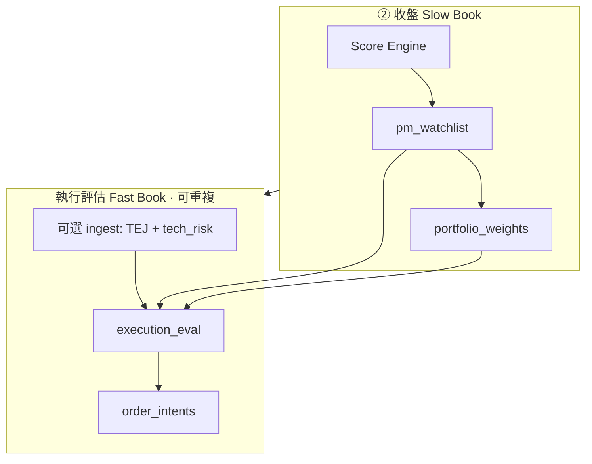

# PRD：① 執行評估（Execution Evaluation · E0.2）

| 欄位 | 內容 |
|------|------|
| 版本 | 0.2 |
| 狀態 | **Draft（規格）** — 取代原「早盤風險哨」命名與邊界；實作分 Phase 1～4 |
| 層級 | Execution Layer（Pre-Broker · 只讀研究 + 可選輕量行情） |
| 取代 | ① **早盤風險哨**（slug `morning-risk`）→ **執行評估**（slug `execution-eval`） |
| 相關文件 | [PRD.md](./PRD.md) §21 E0、[architecture.md](./architecture.md)、[daily-operations.md](./daily-operations.md)、[signal-review-PRD.md](./signal-review-PRD.md) |
| 交易風格錨點 | 每日 **1–3 筆**、持有 **數日～一週**、以 **ETF 聰明錢** 為研究主軸 |
| 最後更新 | 2026-06 |

---

## 0. 交易日一頁 SOP（先讀這節）

> 本節給「每天要下單的人」；細節見 §5～§11。  
> **記一句話**：② 收盤決定 **做誰、上限多少**；① 執行評估決定 **今天這個價格下掛多少、幾張、能不能做**。

### 0.1 兩種價格（勿混淆）

| 種類 | 欄位 | 誰決定 | 何時定 | 用途 |
|------|------|--------|--------|------|
| **建議金額** | `portfolio_weights.suggested_ntd` | 收盤 Score + Top N 等權 | **② 16:30** | 這檔最多配置多少台幣（上限） |
| **參考買入價** | `order_intents.ref_price` | 規則限價 + 執行快照 | **① 08:30～09:00**（可重跑） | 願意掛的價；開盤比對 §21.6 |

研究基準日 = `as_of_date`（昨收盤 Score 日）。執行日 = `trade_date`（今天）。

### 0.2 兩種 gap（勿混淆）

| 名稱 | 來源 | 用途 |
|------|------|------|
| **總經 gap** | `tech_risk_daily_snapshot.tx_gap_pct`（台指期 vs 現貨） | 隔夜風險、折讓微調、TSM 科技 gate |
| **個股開盤 gap** | `snapshot_price / db_prev_close - 1`（試撮或 09:00 開盤） | Phase 2 縮 `qty`、`size_scale`、極端 gap block |

### 0.3 平日時間軸（週一至五）

| 時間 | 動作 | 入口 | `evaluation_mode` | 跑 ingest？ | 寫 DB？ | 會改研究？ |
|------|------|------|-------------------|-------------|---------|------------|
| **② 16:30** | 收盤持股雷達 | `1630收盤雷達.command` | — | ✅ 持股+Score | `pm_watchlist`、`portfolio_weights` | **是**（凍結 `as_of_date`） |
| **08:25–08:40** | 執行評估（初稿） | `0830執行評估.command` | `pre_open` | ✅ TEJ + `tech_risk` | `order_intents`、主報告 | **否** |
| **08:45–08:59** | 試撮後重算（建議） | `0845試撮重算.command` | `auction` | ❌ 輕量 | 更新 `order_intents` | **否** |
| **08:50–08:55** | 閱讀 + 核准 | `0850開盤確認.command` 或 `--approve` | — | ❌ | `status=approved` | **否** |
| **09:00–09:05** | 開盤執行方式 | `--mode open --apply-open --prices ...` | `open` | ❌ | `open_price`、`order_type_effective` | **否** |
| **09:05+（可選）** | 未成交檢查 | `0905盤中預覽.command` | `intraday` | ❌ | 預設 **不**寫 DB | **否** |
| **② 後（可選）** | 隔日心理預演 | `--preview` / `preview_close` | `preview_close` | ❌ | 僅 preview 報告 | **否** |

**人工必做**（系統不取代）：08:50 對照券商試撮輸入 `--prices`；09:00 於券商下 ROD 市價或限價。

### 0.4 單一入口（Phase 1 目標）

| 用途 | 命令 |
|------|------|
| 排程初稿 | `execution_eval.py --mode pre_open --persist`（內含 `report_summary`） |
| 試撮重算 | `execution_eval.py --mode auction --prices 2330=2310,... --persist` |
| 開盤比對 | `execution_eval.py --mode open --apply-open --prices ...` |
| 核准 | `execution_eval.py --approve`（封裝現 `order_intent_engine --approve`） |

`order_intent_engine.py` 保留為內部模組；**使用者只記 `execution_eval.py`**。

### 0.5 報告哪一份算數？

| 優先 | 檔案 | 讀者 |
|------|------|------|
| **1（人讀主報告）** | `reports/YYYYMMDD_execution_eval.md` | 每日執行決策 |
| 2（表格／E1） | `reports/YYYYMMDD_order_intents.md` | 與 DB 一致之 intent 明細 |
| 3（08:50 批次，可選） | `reports/YYYYMMDD_execution_eval_auction.md` | 試撮重算留痕 |
| 輔助 | `reports/YYYYMMDD_morning_checklist.md` | Checklist；與主報告並存 |

DB 真相來源：`order_intents`（`trade_date` 當日最新 upsert）。

### 0.6 重跑與核准（底線）

- **已 `approved`**：預設禁止 `--persist` 覆寫 → 用 `--preview` 或明確 `--force-regenerate` 後 **必須重新 `--approve`**。
- **研究不變**：同日重跑 N 次只改執行快照，**不**重算 Score / Top5。

---

## 1. 摘要

**執行評估**將原「早盤風險哨」從 **單次、昨收世界** 的開盤前報告，升級為 **可重複執行的執行快照評估器（Execution Snapshot Evaluator）**：

- **研究層（Slow Book）**：維持 **② 收盤** 凍結 — `pm_watchlist`、`portfolio_weights`（Top N 等權、風控池）**不在每次評估時重算**。
- **執行層（Fast Book）**：**① 或任意時點** — 依 **當下報價快照** + IPS + `tech_risk` 重算 `ref_price`、`qty`、Pre-trade、開盤策略；可 **同日多次** upsert `order_intents`。

**核心命題**：投資決策在收盤已定；**執行風險**在開盤前與成交前才顯現（gap、試撮、ADR 環境）。執行評估回答的是：**「以現在這個價格世界，這筆還做不做、掛多少、買幾張？」**

**與 E0 v0.1 關係**：不推翻 §21 IPS / Order Intent / Pre-trade / Approval / §21.6 開盤政策；**擴充**價格時點、CLI、排程命名與重跑語意。

---

## 2. 問題陳述

### 2.1 現況痛點（E0 v0.1 · 早盤風險哨）

| 痛點 | 現象 | 後果 |
|------|------|------|
| **命名窄化** | 產品名稱綁定「早盤」「風險哨」 | 使用者 08:50 試撮、10:30 未成交重算時，語意與入口不清 |
| **價格世界固定** | `ref_price` 多數來自 **前一交易日收盤** 技術 anchor | Gap 日限價與 R:R 脫節；終端數字需人工腦內重算 |
| **單次執行假設** | 早報與 `daily_sync --market-only` 綁定 | 重跑需記憶 `order_intent_engine` CLI；與輕量評估混用重型 ingest |
| **Sizing 靜態** | `suggested_ntd` = 等權 20% × capital；`qty = floor(ntd/ref)` | ATR／停損距離只影響 **折讓** 與 R:R 檢查，**不**反推部位 |
| **核准後覆寫** | `--generate` upsert 會把 `approved` 打回 `draft/blocked` | 同日多次評估缺乏安全閘門 |

### 2.2 使用者已驗證的工作流（應正式納入規格）

1. **08:30** — 隔夜 `tech_risk` + 昨收限價 **初稿**
2. **08:45–08:50** — 試撮／gap 對照 → **重算或縮 size**（現為人工）
3. **09:00** — 開盤價 → §21.6 市價或限價
4. **盤中（可選）** — 未成交限價是否仍合理（1–3 筆風格偶爾需要）

### 2.3 目標陳述

| ID | 目標 |
|----|------|
| EE-1 | 將 ① 正式更名為 **執行評估**，slug `execution-eval` |
| EE-2 | 提供 **單一 CLI** 支援多 **evaluation_mode**（見 §5） |
| EE-3 | 支援 **同日可重複執行**（idempotent upsert + 核准保護） |
| EE-4 | 區分 **重型 ingest**（TEJ/tech_risk 同步）與 **輕量評估**（只讀 DB + 可選報價輸入） |
| EE-5 | Phase 2+：試撮／開盤價注入，重算 `ref_price`、`qty`、R:R |
| EE-6 | Phase 3+（可選）：risk-based sizing（每筆風險預算 ÷ 停損距離，cap 於等權上限） |

### 2.4 非目標（本 PRD 階段）

- 收盤 **Score Engine** 重算（仍屬 ②）
- 新聞 API、LLM 喊價、自動送單（E1）
- 高頻盤中策略、`intraday_monitor` 併入主排程（可選餵價來源，非 Must）
- 賣出／減碼 intent 閉環（另立 PRD 片段；本階段仍以 **BUY intent** 為主）
- 券商試撮官方 API 保證可用（Phase 2 允許 **人工輸入價格檔**）

---

## 3. 設計原則

1. **Slow / Fast 分離**：研究凍結於 `as_of_date`；執行評估只改 **執行快照**（`evaluated_at`、`price_source`、`ref_price`）。
2. **規則決策、AI 不解釋價格**：`ref_price` 仍由 `rule_limit_price` + IPS；LLM 不得介入。
3. **Fail-closed**：sync 不健康、IPS 違規 → `blocked`；不 silent fallback 到市價追價。
4. **可追溯**：每次評估寫入 `eval_run_id` 或 `synced_at` + `evaluation_mode` + `price_snapshot_json`（見 §8）。
5. **可重跑、可審計**：報告與 DB 一致；重跑行為在 §9 明文化。
6. **最小 diff 演進**：Phase 1 以 **重新命名 + CLI 統一** 為主；試撮與 risk sizing 分 Phase 交付。

---

## 4. 使用者與場景

| 角色 | 場景 | 模式 | 產出 |
|------|------|------|------|
| 本人 | 週一至五 **08:30** 排程 | `pre_open` + 可選 `ingest` | `tech_risk` 更新 + 執行評估報告 |
| 本人 | **08:50** 試撮後手動重跑 | `auction` + `--prices` | 更新 `order_intents` / 終端摘要 |
| 本人 | **09:00** 開盤確認 | `open` + `--apply-open` | `order_type_effective` |
| 本人 | 盤中未成交檢查 | `intraday` + `--prices` | 預覽或 `--preview` 不覆寫核准 |
| 本人 | 收盤後心理預演 | `preview_close` | `*_order_intents_preview.md`（既有） |

**交易風格對齊**：

- 每日 1–3 筆 ↔ Top 5 等權常僅 2–3 檔有權重
- 持有數日～一週 ↔ 不需盤中高頻；`intraday` 為 **可選** 模式
- ETF 聰明錢 ↔ `as_of_date` 研究不變；評估只問「今天這個價格還做不做」

---

## 5. 評估模式（evaluation_mode）

| 模式 | 代碼 | 典型時點 | 預設報價來源 | 寫 DB | 說明 |
|------|------|----------|--------------|-------|------|
| 開盤前（初稿） | `pre_open` | 08:25–08:40 | `last_close` | 是 | 等同現行早盤；含可選 ingest |
| 集合競價 | `auction` | 08:45–08:59 | `manual_auction` / `finmind_tick`（Phase 2） | 是 | **試撮價** 注入；gap 門檻可縮 `qty` |
| 開盤 | `open` | 09:00–09:05 | `auction_0900` / `manual_open` | 是 | 產出 §21.6 `market_rod` / `limit_rod` |
| 盤中 | `intraday` | 09:05–13:30 | `manual_last` / `finmind_tick`（opt） | 預設 preview | 未成交檢查；預設不覆寫 `approved` |
| 收盤預覽 | `preview_close` | ② 後 | `last_close` | 否 | 沿用 `--preview` |

### 5.1 報價來源（price_source）

| 代碼 | 說明 | Phase |
|------|------|-------|
| `last_close` | `stock_daily_bars` 最新收盤 + 技術衍生 | 1（現行） |
| `manual_auction` | CLI `--prices 2330=2310,6223=5850` 試撮 | 2 |
| `manual_open` | CLI 開盤價（同現 `--open-price`） | 1（已有） |
| `manual_last` | 盤中使用者輸入最後價 | 2 |
| `finmind_tick` | FinMind 快照（需 token；失敗 fallback manual） | 3（opt） |

### 5.2 價格如何進入 `ref_price` 計算

**Phase 1（`last_close`）** — 維持現行 `rule_limit_price.compute_ref_price`：

- anchor 來自 `as_of_date` 收盤衍生技術（`db_prev_close`、`ma20`、`high_52w`）。
- 折讓含 ATR／beta；**總經 gap** 用 `tech_risk.tx_gap_pct`（非個股試撮 gap）。

**Phase 2（`auction` / `open` / `finmind_tick`）** — **執行錨點**與 **結構性停損** 分離（本 PRD **定案**，實作不得二選一）：

| 項目 | 規則 | 是否隨試撮／開盤價變動 |
|------|------|------------------------|
| `db_prev_close` | `stock_daily_bars` 於 `as_of_date` 收盤 | ❌ 固定 |
| `ma20` / `high_52w` | `compute_technical` 於 `as_of_date` | ❌ 固定 |
| **結構性 `stop_price`** | 同 §21.5／`rule_limit_price`（見 §5.3） | ❌ **不**隨 snapshot 平移 |
| **進場 anchor 中的昨收項** | 型態若用 `prev_close` 計 anchor → 改為 `snapshot_price` | ✅ |
| **`ref_price`** | `round_tick(anchor_eff × (1 - discount%))`；`anchor_eff` 依型態（§5.3） | ✅ |
| **`target_price`** | `ref + (ref - stop) × min_risk_reward`（stop 固定） | ✅ 隨 ref 重算 |
| **個股 `open_gap_pct`** | `(snapshot / db_prev_close - 1) × 100` | — 僅用於縮倉／block |
| **`qty`** | `floor(suggested_ntd × size_scale / ref)` | ✅ |

```text
# Phase 2 共通前置
snapshot_price := --prices 或行情 API
open_gap_pct := (snapshot_price / db_prev_close - 1) × 100

若 open_gap_pct >= ips.gap_block_new_entry_pct → status = blocked（可選，預設關）
若 |open_gap_pct| > ips.max_open_gap_pct → size_scale *= ips.gap_size_multiplier

# ref / stop / target（見 §5.3 定案表）
ref_price, stop_price, target_price := compute_execution_prices(...)

# Pre-trade R:R 用「新 ref + 固定 stop」
risk_reward := (target_price - ref_price) / (ref_price - stop_price)
```

**ADR 環境縮放（Phase 2）** — 不取代 `tech_risk` 既有 TSM 擋科技新倉；另增 **portfolio 級** `size_scale`：

- `tsm_daily_return_pct < -2%` 且科技主題 → 已存在 per-intent **block**（維持）
- 可選：`ips.adr_weak_size_scale: 0.7` 對 **已 draft** 標的統一縮 `qty`（不 block）

### 5.3 停損／目標定案（`auction` · `open` · 含 `intraday` 預覽）

> **設計理由**：停損代表 **研究當下接受的結構風險**（MA20、昨收風險帶），不應因試撮瞬間上跳而下移；否則 gap 日會虛增 R:R、放大部位。進場價 `ref` 可隨 snapshot 調整，**停損錨在 `as_of_date` 技術位**。

| `entry_signal` | `anchor_eff`（算 `ref`） | `stop_price`（固定 · 來自 `as_of_date`） | `benchmark_type` 標註 |
|----------------|--------------------------|------------------------------------------|-------------------------|
| **突破** | `min(snapshot_price, high_52w × (1 + breakout_buffer%))` | `db_prev_close × (1 - breakout_risk%)` | `snapshot` 或 `high_52w` |
| **拉回** | `ma20`（有）否則 `snapshot_price` | `ma20 × (1 - stop_buffer%)`；無 MA20 則 `db_prev_close × (1 - stop_buffer%)` | `ma20` 或 `prev_close` |
| **觀望** | `snapshot_price` | `db_prev_close × (1 - stop_buffer%)` | `snapshot` |

**`ref_price` 折讓**：仍用 `compute_limit_discount_pct`；其中 `tx_gap_pct` 用 **總經** `tech_risk`；可另傳 `open_gap_pct` 作執行層微調（Phase 2 opt，預設 0）。

**邊界**：

- 若 `ref_price <= stop_price` → `blocked`，原因 `ref<=stop（gap/快照）`。
- 若 `risk_reward < min_risk_reward` → `blocked`（現行 Pre-trade）。
- **盤中 `intraday` 預覽**：同公式；`snapshot_price` = 手動最後價；**不**改 `approved` 列。

**與 Phase 1 差異摘要**：

```text
pre_open:     prev_close 在 anchor 中 = db_prev_close
auction/open: prev_close 在 anchor 中 = snapshot_price（僅限上表「昨收項」）
stop/target:  兩模式皆用 db_prev_close / ma20（as_of_date），stop 不跟 snapshot 走
```

---

## 6. 系統架構

### 6.1 兩時鐘（不變）



### 6.2 模組邊界（目標態）

| 模組 | 檔案（規劃） | 職責 |
|------|--------------|------|
| **執行評估入口** | `src/execution_eval.py` | CLI、`evaluation_mode`、報告、編排 |
| **意圖建構** | `src/order_intent_engine.py` | 聚合 watchlist/weights → `IntentDraft`（內部） |
| **規則限價** | `src/rule_limit_price.py` | anchor + 折讓；擴充 `snapshot_price` 參數 |
| **Pre-trade** | `src/pre_trade_check.py` | IPS、sync、R:R、主題集中度 |
| **開盤政策** | `src/open_execution_policy.py` | §21.6 |
| **IPS** | `src/investment_policy.py` | 新增 gap／sizing 欄位（§7） |
| **終端摘要** | `src/report_summary.py` | `--mode execution-eval`（取代 `morning` alias） |
| **Checklist** | `src/operational_brief.py` | 併入評估結論列 |

**`build_morning_execution_context` 更名** → `build_execution_context(..., mode, price_snapshot)`（向後 alias）。

### 6.3 排程與腳本（方案 C · ① 更新）

| 項目 | 現行 | 目標 |
|------|------|------|
| 顯示名稱 | 早盤風險哨 | **執行評估（開盤前）** |
| slug | `morning-risk` | `execution-eval`（**保留 alias 一版**） |
| 腳本 | `scripts/早盤風險.command`（已移除） | `scripts/0830執行評估.command` |
| daily_sync | `--market-only --morning-report` | `--market-only --execution-eval`（`--morning-report` alias） |
| 輕量重跑 | 無專用入口 | `execution_eval.py --mode auction --prices ...` **不**跑 TEJ 全量 |

### 6.4 與 `daily_sync` 的關係

| 命令 | ingest | 評估 |
|------|--------|------|
| `0830執行評估.command`（排程） | ✅ Phase 1 TEJ + tech_risk | ✅ `pre_open` |
| `execution_eval.py --mode auction` | ❌ | ✅ 僅評估 |
| `execution_eval.py --mode intraday --preview` | ❌ | ✅ 不寫 DB |
| `0850開盤確認.command` | ❌ | ✅ `open` + approve 互動 |

---

## 7. IPS 擴充（`investment_policy.yaml`）

在既有 E0 欄位上 **新增**（向後相容預設值）：

```yaml
# --- 執行評估 E0.2 ---
evaluation_defaults:
  default_mode: pre_open
  allow_intraday_overwrite_approved: false   # 盤中預設不覆寫核准

gap_controls:
  max_open_gap_pct: 3.0          # |試撮/昨收-1| 超過 → 觸發縮倉或 WARN
  gap_block_new_entry_pct: 8.0   # 極端 gap → blocked（可選）
  gap_size_multiplier: 0.5       # 觸發 max_open_gap 時 qty *= 此係數
  adr_weak_size_scale: 1.0       # 1.0 = 不額外縮；0.7 = TSM 弱勢縮倉（非 block 時）

sizing:
  mode: equal_cap                # equal_cap | risk_budget（Phase 3）
  equal_position_weight_pct: 20
  max_daily_positions: 5
  risk_budget_pct_per_trade: 1.0 # risk_budget 模式：每筆 NAV 風險%
  use_stop_distance_for_qty: false  # Phase 3 啟用
```

**原則**：IPS 仍只收斂 **可機讀規則**；不引入主觀欄位。

---

## 8. 資料模型

### 8.1 `order_intents` 擴充欄位（Phase 1～2）

| 欄位 | 型別 | 說明 |
|------|------|------|
| `evaluation_mode` | TEXT | `pre_open` / `auction` / `open` / `intraday` |
| `price_source` | TEXT | §5.1 |
| `price_snapshot` | REAL | 評估時使用的標的價格（試撮/開盤/最後） |
| `price_snapshot_json` | TEXT | 可選；完整 `--prices` 與 gap 診斷 |
| `size_scale` | REAL | 1.0 或 gap/ADR 縮放後係數 |
| `eval_run_id` | TEXT | UUID 或 `YYYYMMDDTHHMMSS` 批次 id |

既有欄位語意不變：`as_of_date` = 研究基準日；`trade_date` = 執行日。

### 8.2 可選：`execution_eval_runs` 表（Phase 2 · 審計）

| 欄位 | 說明 |
|------|------|
| `eval_run_id` | PK |
| `trade_date` | 執行日 |
| `evaluation_mode` | 模式 |
| `created_at` | UTC ISO |
| `ingest_ran` | 是否跑過 TEJ/tech_risk |
| `summary_json` | draft/blocked/approved 計數 |
| `report_path` | `reports/...` |

**用途**：同日多次評估留痕；**不**取代 `order_intents` 最新態（仍以 upsert 最新執行快照為準）。

---

## 9. 重複執行與核准語意

### 9.1 Upsert 規則

- PK 不變：`(stock_id, trade_date, intent_version)`
- 每次 `--generate`（非 preview）更新 `ref_price`、`qty`、`status`、`synced_at`、`evaluation_mode`

### 9.2 核准保護（Must Have · Phase 1）

| 條件 | 行為 |
|------|------|
| 存在 `status=approved` 且 `--generate` 無 `--force` | **拒絕覆寫**；exit ≠ 0；提示用 `--preview` 或 `--force-regenerate` |
| `--force-regenerate` | 僅允許 `pre_open` / `auction`；將 `approved` → `draft` 並要求 **重新 --approve** |
| `intraday` + 預設 | 僅 `--preview` 輸出終端與 `*_preview.md` |
| `--approve` | 仍僅 `draft` 且無 `block_reason` → `approved` |

### 9.3 與報告產物

| 檔案 | 時機 |
|------|------|
| `reports/YYYYMMDD_execution_eval.md` | 每次評估主報告（取代僅 `order_intents` 單一名稱可並存） |
| `reports/YYYYMMDD_order_intents.md` | 與 DB 一致之 intent 表（保留 E1 相容） |
| `reports/YYYYMMDD_execution_eval_auction.md` | 可選；08:50 批次 |

---

## 10. CLI 規格

### 10.1 主命令

```bash
export PYTHONPATH=src

# 排程等價（pre_open + 報告）
.venv/bin/python src/execution_eval.py --mode pre_open --persist

# 08:50 試撮（輕量、不 ingest）
.venv/bin/python src/execution_eval.py --mode auction \
  --prices 2330=2310,6223=5810,1303=105 \
  --persist

# 開盤後更新執行方式
.venv/bin/python src/execution_eval.py --mode open --apply-open \
  --prices 2330=2320,6223=5790

# 盤中預覽（不寫 DB、不動 approved）
.venv/bin/python src/execution_eval.py --mode intraday \
  --prices 6223=5750 --preview

# 核准（不變）
.venv/bin/python src/order_intent_engine.py --trade-date today --approve
# 或併入 execution_eval.py --approve（Phase 1 可轉發）
```

### 10.2 `daily_sync.sh` 旗標

| 現行 | 目標 |
|------|------|
| `--morning-report` | `--execution-eval`（alias `--morning-report`） |
| `MORNING_REPORT=1` | `EXECUTION_EVAL=1`（alias） |
| `SYNC_PROFILE=morning-risk` | `SYNC_PROFILE=execution-eval` |

### 10.3 環境變數

| 變數 | 預設 | 說明 |
|------|------|------|
| `RUN_ORDER_INTENT` | `1` | 評估後 persist `order_intents` |
| `RUN_EXECUTION_EVAL_INGEST` | `1` | 排程時跑 TEJ+tech_risk；手動 auction 設 `0` |
| `EXECUTION_EVAL_MODE` | `pre_open` | 排程預設模式 |

---

## 11. 終端報告結構（`report_summary --mode execution-eval`）

1. **執行快照標頭** — `evaluated_at`、`evaluation_mode`、`price_source`、`as_of_date`
2. **隔夜風險** — `tech_risk_daily_snapshot`（ingest 後）
3. **研究摘要（只讀）** — `pm_watchlist` 桶別計數
4. **部位摘要** — Top N 等權
5. **建議掛單** — `✓ 建議掛單` / `✗ 風控略過`（E0 現行 UX）
6. **Gap 診斷（Phase 2）** — 試撮 vs 昨收、是否觸發 `size_scale`
7. **Checklist** — `operational_brief` 嵌入評估結論

---

## 12. Sizing 路線圖（與 ATR／停損）

### 12.1 現況（Phase 0）

- `suggested_ntd` = `capital × equal_position_weight_pct`（Top N）
- ATR → **僅** `compute_limit_discount_pct`
- `stop_price` → R:R 檢查；**不**影響 `qty`

### 12.2 Phase 3：`risk_budget` 模式（可選 IPS）

```text
risk_ntd = capital × risk_budget_pct_per_trade / 100
per_share_risk = ref_price - stop_price
qty_risk = floor(risk_ntd / per_share_risk)
qty_cap  = floor(suggested_ntd_equal / ref_price)
qty      = min(qty_risk, qty_cap)
```

**專業合理性**：短波段 1–3 筆風格常固定 **每筆風險 0.5–1% NAV**；等權 20% 作 **上限 cap** 避免小停損距離過度槓桿。

### 12.3 與評估模式聯動

- `auction` / `open` 重算時 **必須** 用新 `ref_price` 與 `stop` 重算 `qty_risk`（若啟用 risk_budget）

---

## 13. 學理與業界對照

| 概念 | 對照 | 本 PRD |
|------|------|--------|
| **Slow / Fast book** | Buy-side 研究部 vs 交易台 | 收盤研究 / 執行評估 |
| **Pre-trade compliance** | OMS hard checks | `pre_trade_check` + IPS |
| **Implementation shortfall** | 決策價 vs 成交價 | `price_snapshot` vs `ref_price` 留痕 |
| **Volatility sizing** | Risk parity / ATR sizing | Phase 3 `risk_budget` |
| **Opening auction** | 集合競價資訊優勢 | `auction` mode |

---

## 14. 實作分期

### Phase 1 — 更名與統一入口（1 sprint）

- [x] `docs`、腳本、`SYNC_PROFILE` 更名；保留 alias
- [x] `execution_eval.py` 封裝現 `order_intent_engine` + `report_summary` morning 段落
- [x] `report_summary --mode execution-eval`；`morning` deprecated alias
- [x] 核准保護：`--generate` 不覆寫 `approved` 除非 `--force-regenerate`
- [x] `order_intents` 新增 `evaluation_mode`、`price_source`、`eval_run_id`（可 NULL）
- [x] 測試：核准保護、模式 pre_open 與現行早盤輸出一致

### Phase 2 — 試撮與 gap 縮放（1 sprint）

- [x] `--prices` 注入 `auction` / `open`
- [x] IPS `gap_controls`
- [x] `size_scale` 套用於 `qty`
- [x] 報告 Gap 診斷區塊
- [x] `execution_eval_runs` 審計表（可選）

### Phase 3 — Risk-based sizing（0.5 sprint）

- [x] IPS `sizing.mode=risk_budget`
- [x] 單元測試：停損距離極小/極大邊界

### Phase 4 — 行情 API（opt）

- [x] FinMind tick 餵 `auction`（失敗 fallback manual）
- [x] 與 `intraday_monitor` 共用 price adapter；**不**併入每日排程

---

## 15. 驗收標準

| # | 驗收 |
|---|------|
| 1 | ① 排程顯示 **執行評估**；log 含 `排程=execution-eval` |
| 2 | `execution_eval.py --mode pre_open` 與現行早盤風險哨 **輸出等價**（回歸測試） |
| 3 | `auction` 模式 **不** 觸發 TEJ 90 天同步（輕量 &lt; 5s 級） |
| 4 | 同日 `auction` 重跑 2 次，`order_intents.ref_price` 隨 `--prices` 更新 |
| 5 | 已 `approved` 時 `--generate` 預設失敗；`--preview` 成功 |
| 6 | 報告含 `evaluation_mode`、`price_source`、`evaluated_at` |
| 7 | §21.6 開盤政策在 `open` 模式行為不變 |
| 8 | `signal_review` 不受影響（仍只讀 `as_of_date` 研究） |

---

## 16. 風險與緩解

| 風險 | 緩解 |
|------|------|
| 試撮價與 09:00 成交偏離大 | 報告標註 snapshot 時點；09:00 再跑 `open` |
| 覆寫核准導致誤下單 | §9.2 核准保護 + `--force` 顯式 |
| FinMind 限流 | 預設 manual；API opt-in |
| 命名遷移混淆 | 舊腳本轉發一版 + `daily-operations` 對照表 |

---

## 17. 文件與程式遷移清單

| 檔案 | 動作 |
|------|------|
| `docs/execution-eval-PRD.md` | 本檔 ✅ |
| `docs/PRD.md` | §4、§5.2、§21 交叉引用；① 更名說明 |
| `docs/architecture.md` | 排程表 ① 列更新 |
| `docs/daily-operations.md` | 操作速查更新 |
| `scripts/0830執行評估.command` | 新增主入口 ✅ |
| `scripts/早盤風險.command` | 已移除（僅保留 `0830執行評估.command`）✅ |
| `scripts/daily_sync.sh` | flag / log 文案 |
| `src/execution_eval.py` | 新增 |
| `src/report_summary.py` | mode 更名 |
| `tests/test_execution_eval.py` | 新增 |

---

## 18. 詞彙表

| 詞彙 | 定義 |
|------|------|
| 執行評估 | Execution Evaluation；Fast Book 快照評估 |
| 研究基準日 | `as_of_date`；收盤 Score 凍結日 |
| 執行快照價 | `price_snapshot`；試撮/開盤/手動價 |
| 參考買入價 | `ref_price`；規則限價上限 |
| 早盤風險哨 | **Deprecated** 顯示名；指 Phase 1 前之 ① |

---

## 19. 版本紀錄

| 版本 | 日期 | 說明 |
|------|------|------|
| 0.2 | 2026-06 | **§0 交易日 SOP**；**§5.3 停損定案**（結構性 stop + 快照 anchor） |
| 0.1 | 2026-06 | 初版：更名、多模式、重跑語意、試撮/gap、sizing 路線圖 |

---

## 20. 參考文獻

- Grinold & Kahn, *Active Portfolio Management* — IC、部位 sizing
- Almgren & Chriss — implementation shortfall 思維（執行價 vs 決策價）
- 本專案 [PRD.md §21](./PRD.md) — E0 v0.1 基線
