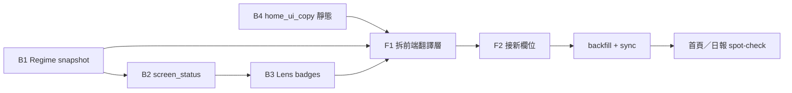

# 首頁／日報文案 · 後端 SSOT 遷移計畫

| 欄位 | 內容 |
|------|------|
| 版本 | 2026-06-23 v1.1 |
| 狀態 | **已同意方向** — 全站納入；先後端、後拆前端翻譯層 |
| 取代 | `readdy-490731/docs/homepage-ui-improvement-plan.md` v1.1 的「前端人話層」做法 |
| 術語 SSOT | [terminology.md](./terminology.md) · 首用 `English term（中文術語）` |
| 架構對齊 | [readdy-view-ready-migration.md](./readdy-view-ready-migration.md) §3 |
| 前端範圍 | `readdy-490731/` — **最小 diff** |

---

## 0. 決策摘要

| 項目 | 做法 |
|------|------|
| 文案風格 | **白話文（學術 English）** — 先給結論與判讀，術語首次出現附英文＋中文（見 terminology §1） |
| SSOT 位置 | **Python 排程產出** → `snapshot_json` / Supabase 欄位；靜態殼層文案放 `src/home_ui_copy.py` |
| 前端角色 | **只渲染**後端欄位；不維護 `plainHomeBadgeLabel`、brief 對照表、KPI 人話 map |
| 翻譯層 | **拆除** `homeUiCopy.ts` · `briefDailyUiCopy.ts` 及 `HighlightBadges` 的 `plainLabels` |
| 結構簡化 | 保留先前 **連結去重**、策略區不貼環境句；不保留前端第二套區塊說明 |

**一句話目標**：讀者看到的每句話，要嘛來自 DB／snapshot，要嘛來自單一 Python copy 模組；React 不再「翻第二次」。

---

## 0.1 全站頁面範圍（是否每一頁都要改？）

**是，全站公開頁都要納入**；但**不是每一頁改動量相同**。原則：

| 層級 | 前端 | 後端 | 說明 |
|------|------|------|------|
| **A 必改** | 拆翻譯層 + 接 snapshot 欄位 | 產出白話雙語欄位 | 有 `homeUiCopy` / `briefDailyUiCopy` 或動態術語 |
| **B 輕改** | 常數改讀 `ui_copy` 同步檔 | `lens_ui_copy.py` / `home_ui_copy.py` | 僅用 `lensUiCopy.ts` 靜態句 |
| **C 內容改** | 幾乎不動元件 | `site_content` markdown | 策略規格、採納報告、關於頁正文 |
| **D 略過** | — | — | redirect、404 |

### 路由 × 改動對照

| 路由 | 頁面 | 層級 | 前端（拆翻譯層） | 後端／內容 |
|------|------|------|------------------|------------|
| `/` | 首頁 | **A** | `page.tsx` · `HeroSection` · `HomeRegimeSection` · `LensHomeSection` · `StrategyScreenStatusBar` | `regime` snapshot · `screen_status` · lens badge · `home_ui_copy` |
| `/briefs/:date` | 合併日報 | **A** | `daily.tsx` · `BriefDailyTOC` · `RegimeContent` · `RRGContent` · `HighlightBadges` | 同上 + brief 區塊 `section_intro_zh`（可選） |
| `/briefs` | 日報列表 | **B** | `list.tsx` 改讀同步常數 | `BRIEF_LIST_INTRO_ZH` → Python |
| `/strategies` | 策略目錄 | **B+C** | `hub.tsx` 殼層句 | `site_content` 卡片 `description_short` |
| `/strategies/:id` | 凍結規格 | **C** | `SiteContentView` 不動 | `supabase/site/strategies/*.md` |
| `/strategies/:id/lineage` | 採納報告 | **C** | 不動 | `research_case_*.md` |
| `/stock-search` | 個股情報 | **B** | 殼層句 | `lens_ui_copy`；報價仍 Yahoo |
| `/about` | 關於 | **B+C** | `ReadingGuide` 殼層 | `site_content` + `home_ui_copy` |
| `/pages/:page_id` | 方法論頁 | **C** | 不動 | `site_content` markdown |
| `/market-environment` | redirect | **D** | — | — |
| `*` | 404 | **D** | — | — |

### 日報子元件（合併在 `/briefs/:date`）

| 元件 | 現用翻譯層 | 遷移後資料來源 |
|------|------------|----------------|
| `BriefDailyTOC` | `briefDailyUiCopy` 全套 | `daily_ui_copy.py` 靜態 + 可選 snapshot |
| `RegimeContent` | `BRIEF_REGIME_*` · `BRIEF_WEINSTEIN_*` · quadrant map | `regime` snapshot `hint_zh` · `overview_plain_zh` · `interpretations` |
| `RRGContent` | `BRIEF_RRG_*` | `rrg` snapshot `display` + Python copy |
| `CopytradeContent` | `lensUiCopy` 為主 | snapshot + copytrade copy |
| `daily.tsx` Lens 區 | `BRIEF_LENS_*` · `plainBriefBadge` | lens `plain_zh` · `daily_ui_copy` |
| `daily.tsx` ETF / VCP 區 | `BRIEF_ETF_*` · `BRIEF_VCP_*` · header map | etf/vcp snapshot 或 `daily_ui_copy` |

### 共用元件

| 元件 | 層級 | 動作 |
|------|------|------|
| `Layout.tsx` | B | nav 標籤若需雙語 → `ui_copy` |
| `HighlightBadges.tsx` | A | 刪 `plainLabels`；顯示 `plain_zh \|\| label_zh` |
| `PitBanner.tsx` | B | 標籤句讀 Python |
| `SiteContentView.tsx` | C | 正文已在 DB；只改 markdown 用詞 |

### Python 模組建議（全站 copy）

```
src/
  lens_ui_copy.py      # 既有 · Lens / 今日亮點 / PIT
  home_ui_copy.py      # 新建 · 首頁殼層
  daily_ui_copy.py     # 新建 · 日報殼層（原 briefDailyUiCopy 內容遷入）
  site_ui_copy.py      # 可選 · 策略目錄 / 關於 / 列表 intro
```

同步：`scripts/resync_readdy_ui_copy.sh` → `readdy-490731/src/lib/uiCopy.generated.ts`（前端**只 import 這一檔**靜態常數）。

**結論**：公開站 **10 個路由裡 8 個要動**（A+B+C）；其中 **2 個重灘（首頁 + 日報）**、其餘多為常數搬 Python 或改 `site_content` 正文。

---

## 1. 現況與問題

### 1.1 已加上的前端層（待拆除）

| 檔案 | 內容 | 問題 |
|------|------|------|
| `readdy-490731/src/lib/homeUiCopy.ts` | Hero、總覽、brief hint、KPI 人話、badge 白話 map | 與 Python SSOT 重複；snapshot 更新時前端不同步 |
| `readdy-490731/src/lib/briefDailyUiCopy.ts` | 日報 TOC、Regime 標題、synopsis 白話標籤 | 同上 |
| `HighlightBadges.tsx` | `plainLabels` / `plainHomeBadgeLabel` | 執行期翻譯 |
| `strategyScreenStatus.ts` | `HOME_STRATEGY_HINT_ZH` fallback | 應只用 `site_content.description_short` |
| `HomeRegimeSection.tsx` | `HOME_REGIME_KPI_HINT_ZH` 疊在圖表上 | 應讀 `home_kpis[].hint_zh` |

### 1.2 後端仍偏術語（應改這裡）

| 欄位 | 產生處 | 現況例 |
|------|--------|--------|
| `interpretations.synopsis` | `regime_interpret.interpret_market_structure` | `IX0001 · Weinstein S2 上升；% above 200-day MA…` |
| `context_line_zh` | `regime_snapshot_json._context_line_zh` | `過熱 · 第 2 階段 · 轉強→領先 1 · RRG 健康 43%` |
| `home_kpis[].label_zh` / `sub_zh` | `regime_snapshot_json._home_kpis` | `200MA 廣度` · `Leading 43% + Improving…` |
| `screen_status.text_zh` | `snapshot_screen_status.py` | `收盤版 1/3` · `無候選` |
| `badges_json[].label_zh` | `stock_daily_lens.build_badges_json` | `RRG improving→leading` |
| `headline_zh` | `lens_ui_copy.format_headline_zh` | 尚可；可補英文術語 |
| `narrative_zh` | lens 列資料 | 依個股而異 |

---

## 2. 文案契約：白話文（學術 English）

### 2.1 句型規則（寫進 `home_ui_copy.py` 模組 docstring）

1. **先結論、後術語**：`目前市場仍偏強，但位置已不低。` → 再列 `Trend posture（趨勢姿態）` 等。
2. **首用雙語**：`Market breadth（市場廣度）94% — 偏熱`；之後同段可只用中文或只用英文縮寫。
3. **策略獨立**：環境句只出現一次；策略 `screen_status` 不混入 Regime 句。
4. **禁止**：前端再建「白話 ↔ 原文」對照表；禁止日報與首頁兩套不同說法。

### 2.2 建議欄位形狀（view-ready）

#### `regime-snapshot-v1` 擴充

```json
{
  "interpretations": {
    "synopsis": "（既有 · 改寫為白話＋雙語）",
    "overview_plain_zh": "目前市場仍偏強，但屬高檔延續而非剛起漲。"
  },
  "context_line_zh": "（保留 · 技術狀態列 · 可略縮）",
  "home_kpis": [
    {
      "key": "breadth_200",
      "label_zh": "Market breadth（市場廣度）",
      "value_zh": "94.4%",
      "sub_zh": "偏熱",
      "hint_zh": "站上長期均線的股票比例；太高通常代表市場偏熱。",
      "tone": "red"
    }
  ]
}
```

- **`overview_plain_zh`**（新）：首頁總覽卡 **主句**；`synopsis` 可保留給日報進階段。
- **`hint_zh`**（新）：KPI 卡下方說明；前端只 render `hint_zh`，不查 map。

#### 策略 brief `screen_status`

```json
{
  "kind": "active",
  "text_zh": "今日 3 檔候選（收盤版）"
}
```

#### Lens `badges_json`

```json
{
  "key": "rrg_change",
  "label_zh": "RRG improving→leading",
  "plain_zh": "Relative rotation（相對輪動）由轉強進入領先象限"
}
```

- 前端顯示 **`plain_zh` 若存在，否則 `label_zh`** — 一行邏輯，不是 map。

#### 靜態殼層（每日不變）

新增 `src/home_ui_copy.py`（與 `lens_ui_copy.py` 並列）：

```python
HOME_HERO_TITLE_ZH = "…"
HOME_SECTION_OVERVIEW_TITLE_ZH = "今天市場總覽"
# …僅區塊標題、CTA、PIT 一句；不含 brief_type map
```

同步方式（二選一，建議 A）：

- **A**：`scripts/resync_readdy_ui_copy.sh` 擴充，產出 `readdy-490731/src/lib/uiCopy.generated.ts`（單檔常數）
- **B**：手動維護 `lensUiCopy.ts` 鏡像（現況；易漂移）

---

## 3. 後端改動清單（主體）

### Phase B1 · Regime 首頁句（優先）

| 任務 | 檔案 | 說明 |
|------|------|------|
| B1.1 | `src/regime_interpret.py` | `interpret_market_structure` 改寫：白話結論 + 雙語術語 |
| B1.2 | `src/regime_snapshot_json.py` | 新增 `overview_plain_zh`；`_context_line_zh` 可保留作技術列 |
| B1.3 | 同上 `_home_kpis` | `label_zh` 雙語化；新增 `hint_zh` |
| B1.4 | `scripts/backfill_supabase_research.py` 或 regime backfill | 重算歷史 `regime_daily` snapshot |

**驗收**：首頁不開前端 map，只顯示 `overview_plain_zh` + `home_kpis[].hint_zh` 即有完整說明。

### Phase B2 · 策略 screen 狀態

| 任務 | 檔案 |
|------|------|
| B2.1 | `src/snapshot_screen_status.py` | 全部 `text_zh` 改口語（含分母語意） |
| B2.2 | `copytrade_snapshot_json.py` · `rrg_snapshot_json.py` · `vcp_snapshot_json.py` | 確認接入新文案 |
| B2.3 | backfill `daily_briefs` | 策略列狀態更新 |

### Phase B3 · 今日亮點

| 任務 | 檔案 |
|------|------|
| B3.1 | `src/stock_daily_lens.py` `build_badges_json` | 每 badge 加 `plain_zh`（或直接把 `label_zh` 改成雙語白話） |
| B3.2 | `src/lens_ui_copy.py` | headline、空狀態句型 |
| B3.3 | `src/supabase_lens_sync.py` | 若 JSON schema 變更，確認同步欄位 |

### Phase B4 · 靜態殼層 + site_content

| 任務 | 檔案 |
|------|------|
| B4.1 | **新建** `src/home_ui_copy.py` | Hero、區塊標題、CTA、brief 區說明（若不放 snapshot） |
| B4.2 | `supabase/site/strategies/*.md` front matter | `description_short` 改白話（雙語） |
| B4.3 | `scripts/sync_site_content_to_supabase.py` | 推送後 `site_content.description_short` 更新 |

### Phase B5 · brief 入口說明（可選）

若不想在前端留 `HOME_BRIEF_HINT_ZH`：

- 在 `src/supabase_research_sync.py` 或 `briefContracts` 的 Python 側 registry 加 `hint_zh`
- 或寫入各 brief snapshot 的 `display.hint_zh`

---

## 4. 前端最小改動（拆除＋接線）

### Phase F1 · 拆除翻譯層

| 動作 | 檔案 |
|------|------|
| **刪除** | `src/lib/homeUiCopy.ts` |
| **刪除** | `src/lib/briefDailyUiCopy.ts` |
| **還原** | `HighlightBadges.tsx` — 移除 `plainLabels` / `plainHomeBadgeLabel` |
| **還原** | `strategyScreenStatus.ts` — 移除 `HOME_STRATEGY_HINT_ZH` |
| **還原** | `HomeRegimeSection.tsx` — 移除 `HOME_REGIME_*`；改讀 `kpi.hint_zh` |
| **簡化** | `page.tsx` — 總覽顯示 `overview_plain_zh`；brief 卡只顯示 `labelZh` + 後端 `hint_zh`（若有） |
| **簡化** | `HeroSection` · `LensHomeSection` · `StrategyScreenStatusBar` — 只 import 靜態常數（來自 `uiCopy.generated.ts` 或 `lensUiCopy.ts`） |

### Phase F2 · 保留的結構（不還原）

下列為 **版面／資訊架構**，與翻譯層無關，**保留**：

- 策略區不顯示 `regimeContext`
- 首頁無 `ReadingGuide`、無頁內重複 footer 連結
- 總覽卡：`overview_plain_zh` 在上、`context_line_zh` 作技術補充（欄位來自後端，非前端拼接語意）
- `LensKpiBar`：`fire_count === 0` 不顯示 — **可保留**（純顯示邏輯）或改後端不推送 0

### Phase F3 · 型別

| 檔案 | 改動 |
|------|------|
| `readdy-490731/src/types/regime.ts` | `RegimeHomeKpi` 加 `hint_zh?`；snapshot 加 `overview_plain_zh?` |
| `readdy-490731/src/hooks/useDailyLens.ts` | badge 型別加 `plain_zh?` |

---

## 5. 執行順序



| 步驟 | 內容 | 誰為主 |
|------|------|--------|
| 1 | B1 Regime `overview_plain_zh` + `hint_zh` | 後端 |
| 2 | B2 `screen_status` 白話 | 後端 |
| 3 | B3 badge `plain_zh` | 後端 |
| 4 | B4 `home_ui_copy.py` + sync 腳本 | 後端 |
| 5 | F1 刪 `homeUiCopy` / `briefDailyUiCopy` | 前端（小） |
| 6 | F2 接線 + 型別 | 前端（小） |
| 7 | backfill regime + briefs + lens | 維運 |

**原則**：每步後端欄位就位後，才刪對應前端 map；避免空窗期。

---

## 6. 驗收

### 6.1 程式

```bash
# 後端
python -m pytest tests/ -k "regime_snapshot or screen_status or lens"  # 若有
python scripts/backfill_supabase_research.py --help  # 確認 regime 可重算

# 前端
cd readdy-490731 && npm run build
rg "homeUiCopy|briefDailyUiCopy|plainHomeBadge" src/  # 應無結果
```

### 6.2 產品

- [ ] 首頁總覽：**不讀前端 map** 也有白話主句（`overview_plain_zh`）
- [ ] 環境 KPI 展開：每卡有 `hint_zh`，無 `HOME_REGIME_KPI_HINT_ZH`
- [ ] 策略列：狀態來自 `screen_status.text_zh`，說明來自 `description_short`
- [ ] 亮點 badge：來自 `plain_zh` 或 `label_zh`，無 `plainHomeBadgeLabel`
- [ ] 全文術語首用符合 terminology §1（抽查 5 處）
- [ ] 策略區仍無環境句重複

---

## 7. 不做的事

- 不新增前端 `homeUiCopy` 第二版（含 map）
- 不用 LLM 即時生成文案（維持 rule-based snapshot）
- 不為此計畫做大範圍 UI 改版（button token、RWD 另案）
- 不合併五策略為單一敘事

---

## 8. 建議 PR 切分

| PR | 範圍 |
|----|------|
| 1 | `feat(regime): overview_plain_zh + home_kpis hint_zh` |
| 2 | `feat(screen): plain-language screen_status text_zh` |
| 3 | `feat(lens): badge plain_zh in build_badges_json` |
| 4 | `feat(copy): home_ui_copy.py + resync script` |
| 5 | `refactor(readdy): remove homeUiCopy translation layer` |
| 6 | `refactor(readdy): daily page — remove briefDailyUiCopy` |
| 7 | `content(site): strategy/about markdown 白話雙語` |

---

## 附錄 A · 前端檔案對照（拆除後）

| 現用翻譯層 | 拆除後資料來源 |
|------------|----------------|
| `HOME_OVERVIEW_*` | `overview_plain_zh` + `home_ui_copy` 標題 |
| `HOME_BRIEF_HINT_ZH` | brief registry `hint_zh` 或省略 |
| `HOME_REGIME_KPI_HINT_ZH` | `home_kpis[].hint_zh` |
| `HOME_STRATEGY_HINT_ZH` | `site_content.description_short` |
| `HOME_BADGE_PLAIN_ZH` | `badges_json[].plain_zh` |
| `BRIEF_*` in briefDailyUiCopy | `home_ui_copy` + snapshot 欄位 |
