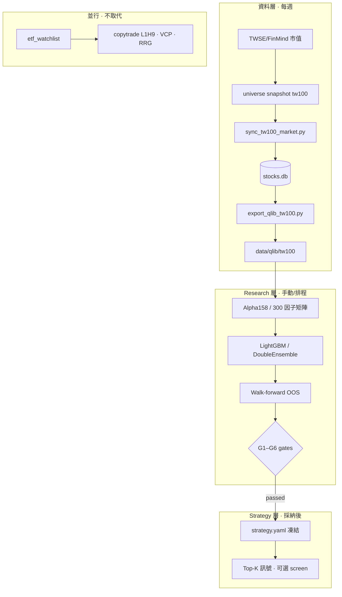

# ML 導入計劃書 · TW100 橫截面選股


| 欄位   | 內容                                                                                                                                     |
| ---- | -------------------------------------------------------------------------------------------------------------------------------------- |
| 版本   | 2026-06-29                                                                                                                             |
| 狀態   | **Living doc** — 對照程式與 `config/` 為準                                                                                                    |
| 層級   | **Research layer only（現階段）** — 手動回測 · 不排 daily/weekly · 成熟後才採納至 Strategy layer                                                         |
| 相關文件 | [architecture.md](./architecture.md) · [terminology.md](./terminology.md) · [00981a-retired-research.md](./00981a-retired-research.md) |


---

## 1. 這份計劃要回答什麼

本文件整理自 2026-06 對話與已落地的 P0 工程，說明：

1. **Machine learning（機器學習）** 對你的 Research OS 有什麼幫助、有什麼幫不上
2. **你現在已完成 vs 仍須做的事**
3. **導入流程與分階段步驟**（對標 TW100 · 固定 ~300 因子 · Qlib 路線）
4. **與現有規則策略（copytrade / VCP / RRG）如何並存**

---

## 2. 你的研究室現在是什麼、ML 要補哪一塊


### 2.1 現況（規則驅動 · 已成熟）

```text
facts（ETF 持股 diff）
  → regime（四軸市場環境 · 非 alpha）
  → research（sweep · 假說 · 拒絕登錄）
  → strategy（L1H9 · VCP · RRG · 已採納規格）
  → order（本機送單 · 可選）
```

你已具備：**PIT 回測**、**graduation gates（G1–G6）**、**IC / ICIR**（`rank_stats.py`）、**slot backtest JSON**。這些是 ML 也需要的**科學方法**，不是 ML 專屬。

### 2.2 ML 要補的一層

```text
特徵矩陣 X（Alpha158 + 台股籌碼因子）
        ↓
   模型 f(X)  ← train / valid / OOS
        ↓
   每日分數 ŷ（橫截面 ranking）
        ↓
   Top-K 選股 / long-short
        ↓
   IC · walk-forward · 採納契約
```

**Machine learning（機器學習）** 在這裡的價值：從歷史資料**自動學出**「哪組特徵組合對未來報酬有排序力」，而不是人手寫死每一條規則。

### 2.3 ML 對你的幫助（務實版）


| 可能幫助                    | 說明                                                               |
| ----------------------- | ---------------------------------------------------------------- |
| **TW100 橫截面 ranking**   | 每日對市值前百排序，產出「相對強弱」分數，可當獨立 research track 或觀察清單                   |
| **因子組合**                | 固定 ~300 因子（Alpha158 + 籌碼 + 交叉）用 LightGBM / DoubleEnsemble 做非線性加權 |
| **Conditional ranking** | 在**已有事件**內排序（例如 copytrade leg 內誰 α 更高）— 比 global binary skip 安全  |
| **與 Regime 分層**         | 用現有 Breadth zone 做 G3 分層驗證，避免 bull/bear 單邊失效                     |


### 2.4 ML 幫不上、或你已試過停損的


| 不要期待                                                                  | 依據                                                                                                |
| --------------------------------------------------------------------- | ------------------------------------------------------------------------------------------------- |
| 取代 L1H9 / VCP / RRG **主訊號**                                           | 你的 edge 來自事件定義與文獻規則，不是全市場 ML                                                                      |
| **Global skip**（「模型說不要跟就整包 skip」）                                     | `qlib-tw-factor` · v8/v9 OOS 不顯著或傷 α → [00981a-retired-research.md](./00981a-retired-research.md) |
| 合併 TW100 + ETF 149 成一池訓練                                              | 宇宙混雜、無法對標文獻、小票噪音大                                                                                 |
| 整包 fork [qlib-tw-trader](https://github.com/Docat0209/qlib-tw-trader) | 社群小、與你 Research OS 採納流程脫節；**借架構、不取代 SSOT**                                                        |


### 2.5 與 microsoft/qlib 的關係

- **[microsoft/qlib](https://github.com/microsoft/qlib)**：引擎（`.bin` 格式 · Alpha158 · 模型 benchmark · 回測 workflow）
- **qlib-tw-trader**：台股應用層範本（TW100 · ~300 因子 · walk-forward）；**不是你曾使用的 repo**
- **你曾用**：自研 `qlib-tw-factor` 研究線（已停損 2026-06-20；DB 表 `qlib_tw_factor_scores` 仍留審計）

---


## 3. 架構決策（已採納）


### 3.1 雙宇宙並行


| Universe ID     | 用途                                      | SSOT                                              |
| --------------- | --------------------------------------- | ------------------------------------------------- |
| `etf_watchlist` | copytrade · VCP · signal radar · 籌碼 K 線 | `load_etf_constituent_watchlist`（不變）              |
| `tw100`         | ML · Alpha158 · 橫截面 ranking             | `[config/universe.yaml](../config/universe.yaml)` |


**不建議**把中小型 ETF 持股併入 TW100 訓練池；ETF 149 維持原軌，ML overlay 只在**訊號交會處**使用（例如 leg 內排序）。

### 3.2 資料雙軌

```text
data/stocks.db（SQLite · 既有 Research OS）
        │
        ├── etf_watchlist 同步（daily_sync · 不變）
        │
        └── tw100 同步（scripts/sync_tw100_market.py）
                    ↓
            scripts/export_qlib_tw100.py
                    ↓
            data/qlib/tw100/（Qlib .bin · ML 專用）
```

**不必**為 ML 放棄 SQLite；Qlib `.bin` 是**額外**特徵矩陣層。

---


## 4. 已完成（P0 · 2026-06-29 前後）


| 項目                                      | 狀態  | 備註                                       |
| --------------------------------------- | --- | ---------------------------------------- |
| `config/universe.yaml`                  | ✅   | tw100 vs etf_watchlist                   |
| `scripts/sync_tw100_market.py`          | ✅   | refresh universe + backfill              |
| `stock_daily_bars.amount` / `adj_close` | ✅   | FinMind ingest 擴充                        |
| `stock_institutional_side_daily`        | ✅   | 法人 buy/sell 分項（供籌碼因子）                    |
| 16 檔 TW100 缺 K 線                        | ✅   | 已 backfill                               |
| 全 TW100（101 檔）400 日 sync                | ✅   | ~266 bars/檔（已升級見 §4.5）              |
| `scripts/export_qlib_tw100.py`          | ✅   | **2796 交易日 · 100 instruments**（2015→2026-06-26） |
| `tests/test_universe_tw100.py`          | ✅   | 5 passed                                 |
| **Phase 0R 基礎資料**（2026-06-29）         | ✅   | 見 §4.5                                    |


### 4.3 術語：「hardened snapshot」與「research topic」是什麼

先前建議「寫進 repo」指的是兩件**不同**的事：

#### A. Hardened snapshot（程式防呆 · 非研究內容）

**問題：** TW100 成分存在 DB 表 `universe_snapshot_meta` / `universe_constituents`。若在**非交易日**或 FinMind 資料不完整時跑 `--refresh-universe`，可能只寫入 1 檔成分；之後 export 會誤用「日期最新但成分殘缺」的快照（2026-06 曾發生 `2026-06-29` 僅 1 檔，需手動刪除）。

**Hardened snapshot** = 在 `src/stock_universe.py` 加規則，例如：

- 成分數 < 95 則**拒絕寫入**或沿用上一個完整 snapshot
- `load_universe_constituents` 取「最新且成分數合格」的快照，而非單純 `ORDER BY date DESC`

**✅ 已實作（2026-06-29）：** `config/universe.yaml` · `min_constituent_count: 95` · `UniverseSnapshotError` · 讀取時略過不合格 snapshot。

#### B. Research topic（研究層登錄 · YAML）✅ 已登錄

Topic ID：`tw100-alpha158-wfa` · 見 `[config/research.yaml](../config/research.yaml)` · split spec `tw100_wfa_504_100` · 回測骨架 `scripts/run_tw100_ml_backtest.py`。

**用途：** 假說與腳本 SSOT、graduation gates 追蹤、**不**代表已採納策略。

### 4.4 要補多少過往資料？

依**研究目標**決定深度；以 2026-06-26 snapshot 為準的 DB 現況：


| 目標                                                       | 每檔最少交易日           | 約略日曆 lookback | 現況                             |
| -------------------------------------------------------- | ----------------- | ------------- | ------------------------------ |
| Alpha158 暖機（60d rolling）                                 | ~60               | ~90 天         | ✅ 全 101 檔足夠                    |
| Baseline Rank IC PoC（70/30 切分）                           | ~120–180 OOS 前需暖機 | ~400 天        | ✅ 可跑骨架；18 檔歷史較短                |
| qlib-tw-trader 單 fold（504 train + 100 valid + 7 embargo） | **611**           | ~900 天        | ⚠️ **18/101 檔不足**（僅 ~266 bars） |
| walk-forward 3y+1y                                       | **~1008**         | ~1500 天       | 83 檔已有 2000+ bars；18 檔需補       |
| 多 fold WFA（2015→今）                                       | 自 2015-01 起       | —             | 83 檔已覆蓋；**補 18 檔即可**           |


**建議（Research 期一次性）：**

```bash
# 只補歷史偏短的 18 檔（或全 TW100 從 2015 重拉）
PYTHONPATH=src .venv/bin/python scripts/sync_tw100_market.py \
  --sync-db --start-date 2015-01-01 \
  --refresh-universe --universe-as-of 2026-06-26 --quiet
```

PoC / 骨架回測：**不必先補** — 現有 266 日 export 窗即可跑 `run_tw100_ml_backtest.py`。  
正式 walk-forward（H-TW100-2）：**先補 18 檔至 ≥611 bars**，再拉長 export `--start` 至 2018 或 2015。

### 4.5 Phase 0R 基礎資料（2026-06-29 完成）

| 項目 | 狀態 | 備註 |
|------|------|------|
| 2015-01-01 → 2026-06-26 K 線 backfill | ✅ | 100 檔 · min 400（7769 上市 2024-11）· max 2796 |
| ETF 排除 0050/0056 | ✅ | `exclude_stock_ids` · snapshot 100 檔 |
| Hardened snapshot | ✅ | `min_constituent_count: 95` |
| Qlib export 全窗 | ✅ | `data/qlib/tw100/` · 2796 calendar days |
| 資料品質 gate | ✅ | `scripts/tools/validate_tw100_data.py` |
| backfill 缺口修復 | ✅ | `market_sync_window` need_old 一次補齊（非 7 日 overlap） |
| **adj_close 復權覆蓋** | ✅ | 同步判定改看 `adj_count_window` · export 輸出 adjusted OHLC |

**已知例外（warning · 不阻擋 Phase 1）：**

| 標的 | 說明 |
|------|------|
| **7769** | 2024-11-01 上市 · 僅 400 bars · 已用完整可用歷史 |
| **2301** | 法人已 backfill 835 rows · Phase 2 再驗 side 完整性 |
| **6446** | 法人 side 稀疏 · OHLCV 已齊 |

**驗證指令：**

```bash
PYTHONPATH=src .venv/bin/python scripts/tools/validate_tw100_data.py --warn-only
# JSON → reports/research/tw100/tw100_data_quality_20260629.json
```

---


### 4.1 已知資料缺口（導入時須知）


| 標的 / 項目                                | 問題                                                             |
| -------------------------------------- | -------------------------------------------------------------- |
| **2301** | 法人資料已部分 backfill（835 rows）；若 Phase 2 籌碼因子仍缺再查 |
| **6446** | 法人 2038 rows · side 稀疏 · Alpha158 OHLCV 已齊 |
| **1101, 2207, 2317, 2884, 3036, 3665** | export 窗內 `amount` 各缺 1 日                                      |
| **非交易日 snapshot**                      | 曾出現 1 檔 corrupt snapshot（`2026-06-29` 已刪）；refresh 邏輯待 hardened |


---


## 4.2 現階段範圍：只做 Research layer 回測

**你的決策（2026-06-29）：** 先專心研究層 — **手動跑回測、產 JSON/報告**；**不**接入 `daily_sync` / launchd；**不**每週更新 TW100 資料，等 walk-forward OOS 與 IC 穩定後再談維運。


| 現階段做                                 | 現階段不做                     |
| ------------------------------------ | ------------------------- |
| 一次性或按需 backfill + export             | 每週固定 sync TW100           |
| Alpha158 / LightGBM walk-forward 回測  | 寫入 `config/strategy.yaml` |
| `config/research.yaml` 登錄 topic + 假說 | 每日 ML 分數 screen / 公開網站    |
| 產物在 `reports/research/tw100/`        | launchd / pipeline 排程     |


**資料凍結建議：** 回測期間固定 `universe-as-of` + export `--start`/`--end`，避免研究中途換宇宙定義。

---


## 5. 你需要做的事（總 checklist）


### Phase 0 — 維運（**延後** · 研究成熟後再開）

> 下列項目在 Phase 1–2 OOS 通過前 **不必** 執行。

- [ ] **P0-1** 週末或收盤後跑 TW100 sync（見 §7 指令）
- [ ] **P0-2** hardened snapshot（見 §4.3）
- [ ] **P0-3** 跑 `export_qlib_tw100.py` 更新 `data/qlib/tw100/`
- [ ] **P0-4** 監控 FinMind quota（與既有 daily_sync 共用 token）
- [ ] **P0-5** `pipeline_scripts.yaml` / launchd 登錄


### Phase 0R — 研究期資料（**現在做** · 手動）

- [x] **P0R-1** TW100 100 檔 + qlib export 2796 日（2015→2026-06-26）
- [x] **P0R-2** 固定 snapshot `2026-06-26` · topic `tw100-alpha158-wfa`
- [x] **P0R-3** `validate_tw100_data.py` 品質 gate（passed · 7769 warning）
- [x] **P0R-4** 2015 起 backfill + ETF 排除 + hardened snapshot
- [x] **P0R-5** `market_sync_window` backfill 缺口修復（避免增量只補 7 日）


### Phase 1 — Alpha158 PoC（Research · 未採納）

- [ ] **P1-0** ✅ 回測骨架 `scripts/run_tw100_ml_backtest.py`（momentum baseline Rank IC）
- [ ] **P1-0b** ✅ Walk-forward 骨架 `scripts/run_tw100_wfa_backtest.py`（504+100+7 · 22 folds）

- [ ] **P1-1** 安裝 Qlib：`requirements-qlib.txt` → `.venv-qlib`（Python 3.11）✅
- [ ] **P1-2** `scripts/qlib_smoke_tw100.py` 驗證 D.features + Alpha158 ✅
- [ ] **P1-3** Alpha158 + LightGBM per-fold WFA — `scripts/run_tw100_alpha158_lgbm_wfa.py` ✅ 骨架
- [ ] **P1-4** 產出 IC / Rank IC / ICIR tear sheet ✅ `run_tw100_wfa_analysis.py` · 2026-06-29
- [ ] **P1-5** **Walk-forward OOS** ✅ 22 folds · tuned LGBM · 2026-06-29
- [ ] **P1-6** 在 `config/research.yaml` 新增 topic — ✅ `tw100-alpha158-wfa` · G1–G3 passed
- [ ] **P1-7** ✅ 月頻 WFA（次月超額 vs IX0001）· `run_tw100_monthly_wfa.py` · 2026-06-30
- [ ] **P1-8** ✅ Phase 1 對照報告 · `tw100_phase1_comparison_20260630.md`


### Phase 2 — 固定 ~300 因子 + 籌碼層

- [ ] **P2-0** ✅ TW100 基本面歷史 backfill · `scripts/sync_tw100_fundamentals.py` · PER 270k rows
- [ ] **P2-0b** ✅ 月頻 mom+fundamental 特徵 · `tw100_fundamental_features.py` · `--feature-set mom_fund`
- [ ] **P2-0c** ✅ Phase 2 對照 · H-TW100-4 PASS（mom+fund IC 0.061 > mom-only 0.051）
- [ ] **P2-1** ✅ TW100 籌碼特徵接入 · `tw100_chip_features.py` · `--feature-set mom_fund_chip`
- [ ] **P2-1b** 籌碼資料覆蓋 99/100 檔（2015+）· 法人 side / 融資券已於 sync_tw100_market 同步
- [ ] **P2-1c** H-TW100-5 FAIL · mom+fund+chip IC 0.017 < mom+fund 0.061 · 見 tw100_phase2_chip_20260630.md
- [ ] **P2-2** export 擴充：institutional side + chip → Qlib `.bin`（可選 · 日頻 Alpha158 路線）
- [ ] **P2-3** 對照 qlib-tw-trader 因子庫（Alpha158 109 + taiwan_chips 107 + interaction + enhanced）
- [ ] **P2-4** **DoubleEnsemble** + Optuna（ICDM 2020 論文設定）
- [ ] **P2-5** Regime 分層（G3）：依 `config/regime.yaml` Breadth zone 切 OOS


### Phase 3 — 採納或拒絕（Strategy layer）

- [ ] **P3-1** 通過 **G2 OOS** · **G4 拒絕登錄** · **G5 frozen spec**
- [ ] **P3-2** 若採納：寫入 `config/strategy.yaml` + `config/strategies.yaml`（新 `strategy_id`，例如 `tw100-ml-top10`）
- [ ] **P3-3** slot backtest JSON → `reports/research/tw100/`
- [ ] **P3-4** 若**不**採納：封存報告（比照 `00981a-retired-research.md`）


### Phase 4 — 與既有策略 overlay（可選 · 高風險）

- [x] **P4-1** 僅在 **copytrade leg 內** 用 ML 分數排序（不做 global skip）→ H-TW100-6 **FAIL**
- [x] **P4-2** 與 RRG watchlist 交集處做 conditional ranking → H-TW100-7 **FAIL**
- [x] **P4-3** 每條 overlay 獨立 OOS · 拒絕登錄理由成文 · `tw100_phase4_overlay_20260630.md`


### Phase 5 — 排程與產品（**研究成熟後**）

- [ ] **P5-1** hardened snapshot 程式防呆
- [ ] **P5-2** `config/pipeline_scripts.yaml` 登錄 sync / export
- [ ] **P5-3** launchd 週末 TW100 sync（併入 `weekly_sync.sh` 或獨立 plist）
- [ ] **P5-4** 每日分數（**不**進公開網站除非另有 PRD）

---


## 6. 導入流程（端到端）




### 6.1 標籤（label）建議

對標 qlib-tw-trader（可寫入 research topic）：

```text
LABEL = Ref($close, -3) / Ref($close, -1) - 1   # 2-day return · T+1→T+3
```

與 copytrade **H9** 不同宇宙、不同問題；勿混用同一 JSON 評估。

### 6.2 評估指標（與現有契約對齊）


| 類型              | 指標                                              |
| --------------- | ----------------------------------------------- |
| Signal-based    | IC · Rank IC · ICIR · IC decay（train→valid→OOS） |
| Portfolio-based | 年化超額 · Sharpe · Max drawdown · turnover         |
| 採納              | `config/research.yaml` graduation_gates G1–G6   |


### 6.3 參考外部 repo（學習用 · 非 SSOT）


| Repo                                                                                                        | 用途                                      |
| ----------------------------------------------------------------------------------------------------------- | --------------------------------------- |
| [microsoft/qlib](https://github.com/microsoft/qlib)                                                         | 引擎 · Alpha158 · qrun workflow           |
| [Docat0209/qlib-tw-trader](https://github.com/Docat0209/qlib-tw-trader)                                     | 台股 TW100 + 300 因子 + walk-forward **範本** |
| [stefan-jansen/machine-learning-for-trading](https://github.com/stefan-jansen/machine-learning-for-trading) | ML4T 教學 · alphalens                     |


---


## 7. 操作指令（現行）

```bash
cd "/Users/jackm4/Documents/ETF/股票研究"

# 載入 .env（FinMind token）
eval "$(PYTHONPATH=src .venv/bin/python -c 'from project_dotenv import shell_export_dotenv; print(shell_export_dotenv())')"

# 0. Qlib 環境（Python 3.11 · 與主 .venv 3.14 分離）
python3.11 -m venv .venv-qlib
.venv-qlib/bin/pip install -r requirements-qlib.txt
# macOS：LightGBM 需 libomp → brew install libomp

# 1. 更新 TW100 成分 + 同步 K 線（Research SSOT 窗）
PYTHONPATH=src .venv/bin/python scripts/sync_tw100_market.py \
  --refresh-universe --universe-as-of 2026-06-26 \
  --sync-db --start-date 2015-01-01 --end-date 2026-06-26 --quiet

# 2. 匯出 Qlib 格式（全窗）
PYTHONPATH=src .venv/bin/python scripts/export_qlib_tw100.py \
  --snapshot-date 2026-06-26 --start 2015-01-01 --end 2026-06-26

# 3. Qlib smoke test（Phase 1 前必跑）
.venv-qlib/bin/python scripts/qlib_smoke_tw100.py --alpha158

# 4b. Alpha158 + LightGBM walk-forward（.venv-qlib · 每 fold ~60s）
.venv-qlib/bin/python scripts/run_tw100_alpha158_lgbm_wfa.py
.venv-qlib/bin/python scripts/run_tw100_alpha158_lgbm_wfa.py --max-folds 2  # debug

# 5. Walk-forward momentum baseline
PYTHONPATH=src .venv/bin/python scripts/run_tw100_wfa_backtest.py

# 5. 資料品質 gate
PYTHONPATH=src .venv/bin/python scripts/tools/validate_tw100_data.py --warn-only

# 6. 測試
PYTHONPATH=src .venv/bin/python -m pytest tests/test_tw100_walk_forward.py tests/test_universe_tw100.py -q

# 替代：透過既有 sync 入口
PYTHONPATH=src .venv/bin/python src/sync_stock_market_daily.py \
  --universe tw100 --sync-db --lookback-days 400
```

---


## 8. 風險與停損條件

在下列情況 **拒絕採納** 或 **停損 topic**（延續 `qlib-tw-factor` 教訓）：

1. OOS IC 均值 ≤ 0 或 ICIR 不穩定（rolling IC 標準差過大）
2. 某 Regime 分層（Breadth zone）**全敗**且無合理解釋
3. 企圖用 ML **global skip** copytrade / VCP 主訊號
4. 樣本外 Sharpe 顯著低於 in-sample，且無成本/宇宙可解釋
5. 與 `00981a-retired-research.md` §10 類似：filter 傷害累計 α 或勝率

---


## 9. 建議時程（個人研究室 · 可調）


| 週    | 目標                              | 交付物                          |
| ---- | ------------------------------- | ---------------------------- |
| W1   | Phase 0 維運 + Qlib 可讀            | export 自動化 · qlib smoke test |
| W2–3 | Phase 1 Alpha158 + LightGBM     | IC 報告 · walk-forward JSON    |
| W4–6 | Phase 2 300 因子 + DoubleEnsemble | 對照 LightGBM 提升與 IC decay     |
| W7+  | Phase 3 採納決策                    | strategy.yaml 或 retired 封存   |
| 可選   | Phase 4 overlay                 | copytrade leg ranking 實驗     |


---


## 10. 修訂紀錄


| 日期         | 變更                                               |
| ---------- | ------------------------------------------------ |
| 2026-06-29 | 初版：對話整理 · P0 完成狀態 · TW100 雙軌 · 分 phase checklist |
| 2026-06-29 | Phase 0R 完成 · 2015 backfill · ETF 排除 · validate gate · qlib 2796 日 |
| 2026-06-29 | ML 驗收：adj_close gate · export 復權 OHLC · sync 跳過邏輯修正 |
| 2026-06-30 | Phase 2 chip · 籌碼特徵 WFA · H-TW100-5 FAIL |


