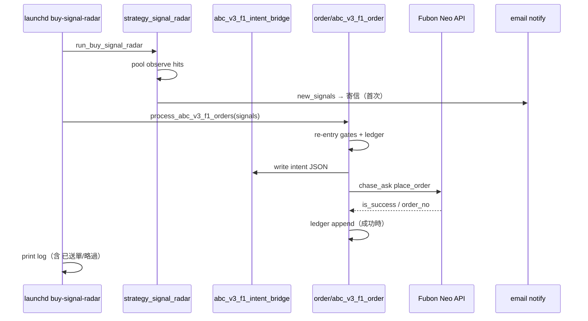

# PRD · Order layer（下單層）完整藍圖

| 欄位 | 內容 |
|------|------|
| 版本 | 1.0 |
| 日期 | 2026-07-09 |
| 狀態 | **Living doc** — 以 `config/order.yaml` · `src/order/` 為準 |
| 上層 PRD | [PRD.md](./PRD.md) §1 下單層 |
| 術語 SSOT | [terminology.md](./terminology.md) §2.5 |
| 架構 | [architecture.md](./architecture.md) · [src-map.md](./src-map.md) §下單層 |
| 盤中減碼 | [intraday-exit-playbook.md](./intraday-exit-playbook.md) |
| Agent 導航 | [agent-brief.md](./agent-brief.md) |

> **免責**：本文件描述本機 infra 與個人研究執行框架；**不**構成投資建議。Order layer **不**進公開網站、**不**暴露券商憑證。

---

## 1. 摘要

Order layer（下單層）是 **Strategy layer（策略層）與富邦 Neo API 之間的本機執行基礎設施**：將 radar / screen 產出的訊號轉為 `order-intent-v1` JSON，經閘門與 re-entry 政策後送單，並以 ledger、log、email 留痕。

**設計原則（避免技術債）**

| 原則 | 說明 |
|------|------|
| **邊界單向** | Strategy **不** import `order`；接線只在 `scripts/`（如 `run_buy_signal_radar.py`） |
| **本機 SSOT** | `config/order.yaml` + `.env`；無第三方 OMS SaaS、無額外註冊 |
| **不 fork 外掛 stack** | 不整包引入 OpenAlgo / Hummingbot；僅借 IA 與 API 契約概念 |
| **最小 live surface** | 優先唯讀 ops snapshot；送單路徑保持既有 Python 模組 |
| **PIT 與 research 對齊** | Re-entry、hold、notional cap 對齊已採納 research event 口径 |

---

## 2. 問題陳述

### 2.1 現況痛點（2026-07-09）

| # | 痛點 | 影響 |
|---|------|------|
| P1 | `place_order` 成功 ≠ 成交 | ledger 過早記「已送」；曝險與通知可能失真 |
| P2 | 通知綁 observe 首次命中 | 送單重試成功可能無第二封 email |
| P3 | 無委託狀態機 | 失敗 / 超時 / 晚成交無統一收斂 |
| P4 | 無 broker reconciliation | 賣出後 local notional 靠 rolling 近似 |
| P5 | 無 ops 後台 | 依 log + 富邦 App 人工查 |
| P6 | intent 失敗仍留檔 | 手動 `submit_intents.py` 可能誤送 placeholder qty |

### 2.2 非問題（刻意不做）

- 多券商 unified API（僅富邦 Neo）
- 公開網站下單
- Ensemble 加權合併多策略成一筆委託
- 取代富邦官方 App 的完整 OMS

---

## 3. 目標與非目標

### 3.1 產品目標

1. **可審計**：每筆 live 意圖有 intent JSON + ledger + log 可追溯。
2. **可恢復**：網路 / API  ambiguous 失敗時，下一 poll 可安全重試、不重複下單。
3. **可觀測**：本機單頁（snapshot 或 HTML）看今日 abc 委託、launchd 健康、開關狀態。
4. **對齊 research**：abc-v3-f1 sleeve 的 hold 3d、re-entry 折扣、rolling cap 與採納規格一致。
5. **零訂閱**：僅富邦 API（既有帳戶）+ 本機 Gmail notify；ops UI 不依赖 Supabase 亦可運作。

### 3.2 非目標（Out of Scope）

| 項目 | 說明 |
|------|------|
| Fork OpenAlgo / Hummingbot | AGPL / Docker 債務過大 |
| 常駐 Flask + Socket.IO 服務 | 除非 semi-auto 核准有明確需求 |
| Phase 3 前自動賣出 abc T+3 | 用戶明確排除；C18 / structural exit 另軌 |
| 公開 Readdy `/ops` 含 live 帳務 | 憑證僅本機 |

### 3.3 成功指標（KPI）

| 指標 | Phase 1 目標 | Phase 2 目標 |
|------|--------------|--------------|
| 送單 duplicate rate | 0（同日同 symbol 誤重送） | 0 |
| ambiguous 失敗後 15 分鐘內收斂 | ≥90% 有明確 terminal 狀態 | ≥99% |
| submit 成功通知覆蓋 | 100%（含重試成功） | 100% |
| ops snapshot 新鮮度 | — | 每 radar poll 或 ≤5 分 |
| 單元測試 | abc re-entry + order gates 全綠 | + lifecycle + snapshot |

---

## 4. 使用者與場景

| 角色 | 場景 |
|------|------|
| **Operator（操作者）** | 盤中收到 observe / 送單 email；本機打開 ops 頁確認委託 |
| **Developer** | 新增 sleeve 時只擴 `order.yaml` + intent bridge，不動 strategy import 鏈 |
| **Research** | 讀 ledger 對照 backtest event，驗證 live 口径 |

**典型日內流程（abc-v3-f1）**



---

## 5. 系統邊界

### 5.1 產品層位置

```
facts → regime → research → strategy (+ order layer 本機)
                              ↓
                    order-intent-v1 JSON
                              ↓
                         src/order/ → Fubon
```

### 5.2 Import 規則（硬邊界）

| 允許 | 禁止 |
|------|------|
| `scripts/*` import `order.*` | `src/strategy_*.py` import `order.fubon_*`（新程式） |
| `strategy_signal_radar` import `abc_v3_f1_intent_bridge`（log 格式化） | Strategy 模組直接 `place_order` |
| Research / backtest 寫 intent JSON | Research import live broker |

### 5.3 設定 SSOT

| 檔案 | 用途 |
|------|------|
| `config/order.yaml` | broker、intent schema、strategy sleeve 參數 |
| `.env` / `.env.example` | 憑證、`ABC_V3_F1_*`、`RUN_*` |
| `config/buy_observation.yaml` | observe pool（Strategy 側；order 只讀 pool_id） |

---

## 6. 現況盤點（As-Is）

### 6.1 模組地圖

| 路徑 | 職責 | 成熟度 |
|------|------|--------|
| `src/order/intent.py` | `order-intent-v1` 契約 | 穩定 |
| `src/order/fubon_session.py` | 登入 · SDK 版本 | 穩定 |
| `src/order/fubon_orders.py` | `place_resolved_order` | 穩定 · 缺 lifecycle |
| `src/order/chase.py` · `chase_runner.py` | 追價撤單重掛 | 穩定 · C18/chase 用 |
| `src/order/abc_v3_f1_*.py` | abc 自動送單 + re-entry | Phase 1 live |
| `src/abc_v3_f1_intent_bridge.py` | Strategy-safe intent 寫入 | 穩定 |
| `scripts/order/submit_intents.py` | 人工 intent 送單 CLI | 穩定 |
| `scripts/run_buy_signal_radar.py` | radar → abc order 接線 | 穩定 |
| `src/order/intraday_exit_gate.py` | 09:05 組合閘門 | advisory |
| `src/order/intraday_structural_exit.py` | S0–S2  structural 減碼 | advisory / dry-run |
| `src/order/holdings_pulse.py` | 持倉 HTML 脈動 | 報告 · 非 OMS |
| `src/order/morning_holdings_brief.py` | 晨間 brief | 報告 |

### 6.2 Live 送單 sleeve（2026-07-09）

| Sleeve | 觸發 | 自動送單 | 上限 |
|--------|------|----------|------|
| **abc-v3-f1-pullback** | buy-signal-radar observe | ✅（env 開） | 5 筆/日 × 2 萬 ≈ 10 萬；單檔 rolling 6 萬 |
| **C18acc / rrg poll** | rrg-c18acc-poll | ❌ intent + 人工 | — |
| **chase_open** | launchd（`schedule.enabled: false`） | 可選 | 已停用 |
| **Minervini / extension** | 月末 / overlay | ❌ intent | — |

### 6.3 資料與產物

| 路徑 | 內容 |
|------|------|
| `reports/order/intents/` | intent JSON（審計） |
| `data/order/abc_v3_f1_ledger.json` | abc 送單 ledger |
| `logs/intraday/launchd_buy-signal-radar.log` | radar + 下單 log |
| `reports/order/snapshots/` | 帳戶 snapshot（若腳本寫入） |

### 6.4 已完成的近期修復

- abc 下單改吃 **當 poll `signals`**（非 dedup `new_signals`），送單失敗可重試。
- `abc_notional_for_symbol` 改 **rolling 20TD** 窗口。

---

## 7. 目標架構（To-Be）

### 7.1 三層執行模型（借 OpenAlgo 概念 · 自實作）

```
┌─────────────────────────────────────────────────────────┐
│  Strategy / Scripts（訊號 · observe · intent 作者）        │
└───────────────────────────┬─────────────────────────────┘
                            │ order-intent-v1 + metadata
┌───────────────────────────▼─────────────────────────────┐
│  Order Policy（閘門 · re-entry · budget · kill switch）   │
│  abc_v3_f1_reentry · config/order.yaml · env             │
└───────────────────────────┬─────────────────────────────┘
                            │ ResolvedOrder + client_intent_id
┌───────────────────────────▼─────────────────────────────┐
│  Broker Adapter（富邦 Neo）                               │
│  fubon_session · fubon_orders · chase_runner             │
│  + OrderLifecycle（poll · reconcile · terminal state）    │
└───────────────────────────┬─────────────────────────────┘
                            │
┌───────────────────────────▼─────────────────────────────┐
│  Audit & Ops（ledger · DB/json state · snapshot · notify）│
└─────────────────────────────────────────────────────────┘
```

### 7.2 委託狀態機（新增 · 核心）

| 狀態 | 說明 | 來源 |
|------|------|------|
| `intent_written` | intent JSON 已寫 | bridge |
| `submitted` | Fubon `is_success` | place_order |
| `working` | 委託中（status 10） | get_order_results |
| `partial` | 部分成交 | filled_qty |
| `filled` | 完全成交（status 50） | get_order_results |
| `cancelled` | 已刪除（30） | get_order_results |
| `failed` | 明確拒絕 / 90 | API message |
| `ambiguous` | 超時未確認 | 需 reconcile |

**規則**

- ledger **filled 才**計入 notional 曝險（或 configurable：submitted vs filled）。
- `ambiguous` → 以 deterministic `client_intent_id` 查單後再決定 retry。

### 7.3 Deterministic intent ID（冪等）

格式建議：

```
{strategy_id}_{session_date}_{poll}_{symbol}
```

- 寫入 intent `metadata.client_intent_id` 與 Fubon `user_def`（或 metadata 檔）。
- 重試 **同一 ID**；禁止每次 new UUID。

### 7.4 Ops snapshot 契約（`order-ops-snapshot-v1`）

**目的**：本機唯讀後台 · 零常駐 server · 可選餵給 readdy `/ops`。

```json
{
  "schema_version": "order-ops-snapshot-v1",
  "as_of": "2026-07-09T13:05:00+08:00",
  "session_date": "2026-07-09",
  "kill_switches": {
    "abc_v3_f1_order_enabled": true,
    "abc_v3_f1_auto_submit": true
  },
  "abc_v3_f1": {
    "daily_entries": 2,
    "daily_budget_used_twd": 40000,
    "ledger_entries_today": [],
    "last_poll_orders": []
  },
  "launchd": {
    "buy_signal_radar_last_tick": "…",
    "jobs_ok": []
  },
  "broker": {
    "connected": false,
    "open_orders_n": null,
    "note": "optional · 需本機 Fubon session"
  }
}
```

**產出**：`reports/order/snapshots/{YYYYMMDD}_ops.json` + 可選靜態 HTML（參考 `holdings_pulse` 模式）。

**UI 路線（推薦）**

1. Python 排程產 snapshot（無新 dependency）
2. 本機開 HTML 或 readdy 唯讀頁（不暴露憑證）
3. **不**引入 Streamlit，除非 Phase 2 驗證後仍缺 UI 再評估

### 7.5 通知解耦

| 事件 | 通道 | 觸發 |
|------|------|------|
| observe 首次命中 | email（現行） | `new_signals` |
| submit 成功 | email **獨立段落或獨立信** | ledger 新增 submitted |
| submit 失敗 | email 或 log 高亮 | status failed / ambiguous |
| filled（可選） | email | lifecycle → filled |

---

## 8. 功能需求（按 Phase）

### Phase 0 · 現行（已完成 baseline）

- [x] `order-intent-v1` + `submit_intents.py`
- [x] abc-v3-f1 auto-submit + re-entry policy
- [x] radar 接線 `run_buy_signal_radar.py`
- [x] P0/P1：signals 重試 + rolling notional
- [x] 單元測試 `tests/test_abc_v3_f1_order.py`

### Phase 1 · Mini-OMS（委託生命週期 · 優先）✅ 2026-07-09

| ID | 需求 | 驗收 |
|----|------|------|
| O1-1 | `client_intent_id` 貫穿 intent / user_def | ✅ |
| O1-2 | submit 後 poll `get_order_results` 更新狀態 | ✅ |
| O1-3 | ambiguous 超時 → 查單再決定 | ✅ `reconcile_before_submit` |
| O1-4 | failed submit 清理或標記 intent | ✅ `submit_status` metadata |
| O1-5 | submit 成功通知（含重試） | ✅ `ABC_V3_F1_SUBMIT=1` |
| O1-6 | notional 以 filled 或 submitted 可配置 | ✅ `lifecycle.notional_basis` |

**不改**：Strategy import 邊界 · 富邦 SDK 版本 · abc re-entry 參數預設。

### Phase 2 · Ops 可觀測（唯讀 · 零訂閱）

| ID | 需求 | 驗收 |
|----|------|------|
| O2-1 | `build_order_ops_snapshot()` | JSON schema v1 穩定 |
| O2-2 | radar 結束或獨立 launchd 寫 snapshot | 檔案時間戳 ≤5 分 |
| O2-3 | 靜態 HTML ops 板（5 屏） | Orders · Ledger · Launchd · Switches · Log tail |
| O2-4 | 整合 `launchd_status_dashboard.sh` 摘要 | 同一 snapshot |
| O2-5 | （可選）readdy `/ops` 讀 snapshot | **不**含 secrets |

**參考 IA（OpenAlgo 五屏 · 不抄 code）**

1. Today orders  
2. Positions / holdings（唯讀 Fubon 或 morning brief）  
3. Kill switches / env  
4. Launchd health  
5. Log tail  

### Phase 3 · 進階（按需 · 非承諾）

| ID | 需求 | 條件 |
|----|------|------|
| O3-1 | abc T+3 13:30 自動出場 | 用戶明確批准 + backtest 對齊 |
| O3-2 | Semi-auto Action Center | 送單前人工核准 UI |
| O3-3 | 週期 broker reconciliation job | 比對 inventory vs ledger |
| O3-4 | C18acc poll 自動送單 | 獨立 sleeve 規格 + 風控 |

### Phase 4 · 明確不做

- Fork OpenAlgo / Hummingbot 後端  
- 多券商 adapter  
- 公開網站 live 下單  
- 替代富邦 App 的全功能 OMS  

---

## 9. 非功能需求

| 類別 | 要求 |
|------|------|
| **安全** | 憑證僅 `.env`；snapshot / HTML **不含** password / cert |
| **可用性** | launchd 下單失敗不 crash radar（現行 `try/except` 保留） |
| **效能** | 單 poll abc hits ≤10 檔；Fubon 連線單 session 串行 |
| **可測** | 新邏輯必須 mock Fubon；不依 live API 跑 CI |
| **可維護** | 新 sleeve = config block + `{sleeve}_order.py` + tests |
| **授權** | 不 copy AGPL 程式碼進 repo；僅參考文件與 IA |
| **成本** | $0 新增 SaaS；富邦 API 沿用既有帳戶 |

---

## 10. 設定與環境變數

### 10.1 `config/order.yaml`（現行 + 規劃）

```yaml
# 現行
strategies:
  abc-v3-f1-pullback:
    budget_twd: 20000
    max_entries_per_day: 5
    reentry: { ... }

# Phase 1 規劃
lifecycle:
  poll_interval_sec: 30
  poll_max_attempts: 10
  ambiguous_timeout_sec: 15
  notional_basis: filled   # filled | submitted

# Phase 2 規劃
ops:
  snapshot_schema: order-ops-snapshot-v1
  snapshot_dir: reports/order/snapshots
  html_enabled: true
```

### 10.2 環境變數（abc）

| 變數 | 預設 | 說明 |
|------|------|------|
| `ABC_V3_F1_ORDER_ENABLED` | 1 | 總開關 |
| `ABC_V3_F1_AUTO_SUBMIT` | 1 | 0 = dry-run intent only |
| `ABC_V3_F1_BUDGET_TWD` | 20000 | 單筆 |
| `ABC_V3_F1_MAX_ENTRIES_DAY` | 5 | 日筆數 |
| `ABC_V3_F1_MAX_NOTIONAL_SYMBOL` | 60000 | rolling cap |
| `RUN_BUY_SIGNAL_EMAIL` | 1 | observe 信 |

---

## 11. 測試策略

| 層級 | 範圍 | 命令 |
|------|------|------|
| 單元 | re-entry · intent · lifecycle 狀態轉換 | `pytest tests/test_abc_v3_f1_order.py` |
| 單元 | intent schema | `pytest tests/test_order_intent.py` |
| 整合 | mock Fubon submit + poll | 新增 `tests/test_order_lifecycle.py` |
| 手動 | dry-run radar | `python scripts/run_buy_signal_radar.py --no-dedup` |
| 手動 | 查委託 | `submit_intents.py --query-orders` |

---

## 12. 風險與緩解

| 風險 | 緩解 |
|------|------|
| 限價掛單未成交以為已買 | Phase 1 lifecycle → filled 才記曝險 |
| 富邦 API 503 重試 duplicate | client_intent_id + 查單 |
| ledger JSON race | atomic write / file lock（低優先） |
| ops UI scope creep | Phase 2 唯讀；送單仍在 Python |
| 術語漂移 |  prose 遵循 terminology §2.5 · §10 |

---

## 13. 里程碑

| 里程碑 | 內容 | 目標 |
|--------|------|------|
| **M0** | abc live baseline + P0/P1 修復 | ✅ 2026-07-09 |
| **M1** | Phase 1 lifecycle + notify 解耦 | T+2 週 |
| **M2** | Phase 2 ops snapshot + HTML | T+4 週 |
| **M3** | Phase 3 評估（出場 / semi-auto） | 依 live 實跑結果 |

---

## 14. 文件與交付物

| 交付 | 路徑 |
|------|------|
| 本 PRD | `docs/order-layer-prd.md` |
| 設定 | `config/order.yaml` |
| 範例 env | `.env.example` |
| 盤中減碼規則 | `docs/intraday-exit-playbook.md` |
| Ops snapshot（Phase 2） | `reports/order/snapshots/*_ops.json` |
| Agent 任務 | `docs/agent-brief.md` → 下單 · Fubon |

---

## 15. 附錄 A · 與外掛 OMS 對照（為何不自建全套）

| 能力 | OpenAlgo | 本 PRD 路線 |
|------|----------|-------------|
| React 後台 | 內建 | snapshot + 靜態 HTML / readdy |
| 30 broker | 內建 | 僅 Fubon adapter |
| Action Center | 內建 | Phase 3 可選 |
| Order lifecycle | 部分 | Phase 1 對齊 mini-OMS |
| 授權 | AGPL | 自研 MIT/ repo 既有 |

---

## 16. 附錄 B · 詞彙

| 用 | 勿用 |
|----|------|
| Order layer（下單層） | 執行層 · `layer: execution` |
| 採納 | 畢業 |
| chase_ask | 模糊「追價」無 price_type |

完整表：[terminology.md](./terminology.md) §7 · §10。

---

## 修訂紀錄

| 版本 | 日期 | 說明 |
|------|------|------|
| 1.0 | 2026-07-09 | 初版：as-is 盤點 + Phase 0–4 藍圖 |
