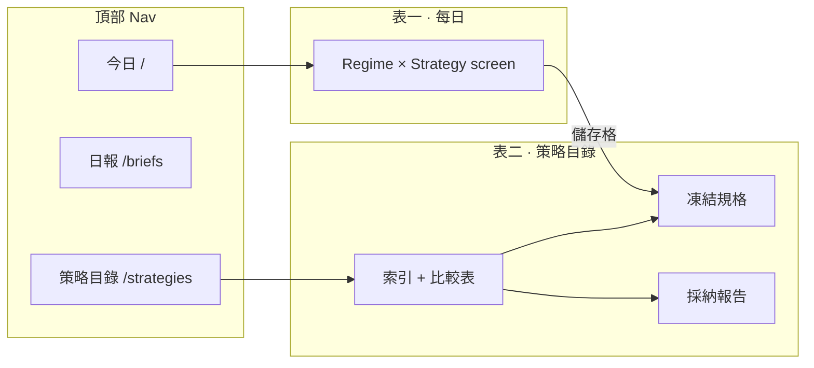
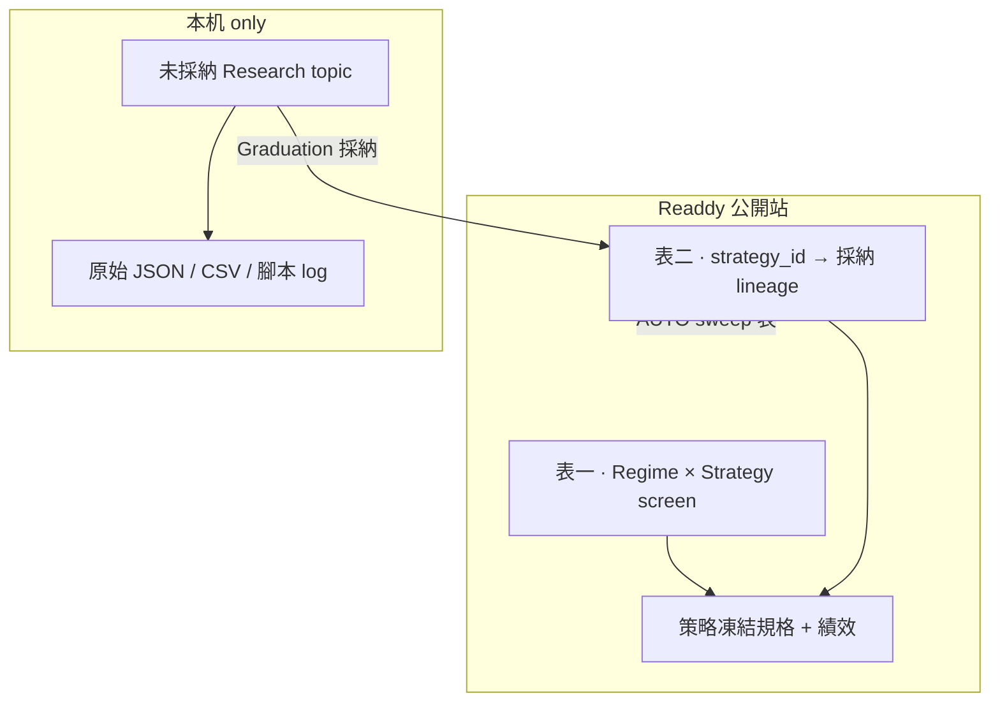
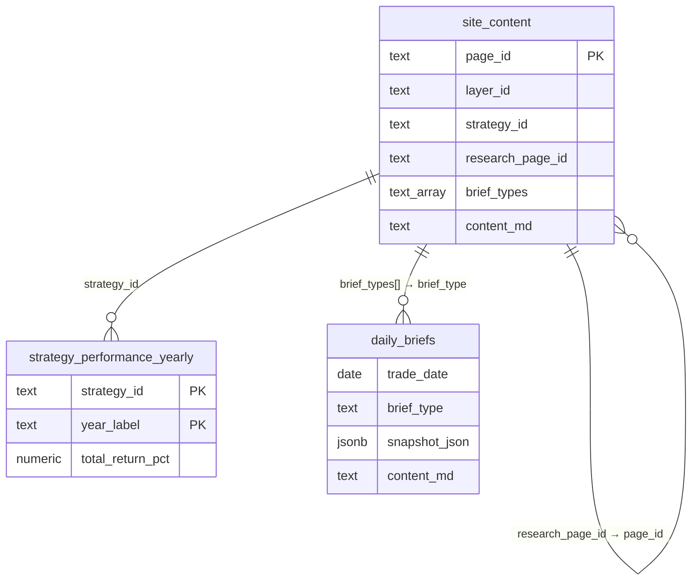
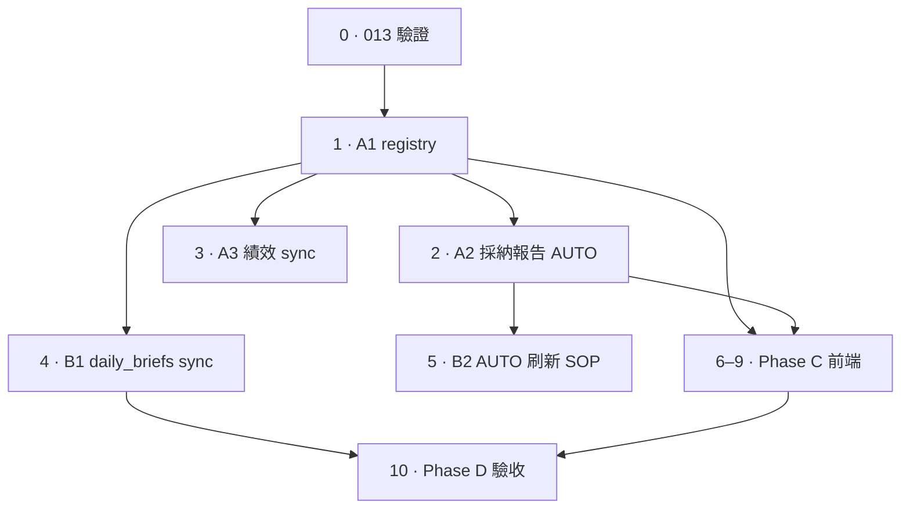

# Readdy 規劃 · 市場環境 × 策略 · 採納 lineage（含 sweep 證明表）

| 欄位 | 內容 |
|------|------|
| 版本 | 2026-06-23 v1.6 |
| 狀態 | **Phase D 待驗收** — 013 ✓ · A1–A3 ✓ · B1 ✓ · Phase C ✓ · site_content 已 sync |
| 延伸 | 公開站主軸「Regime four-axis diagnostic × 已採納 Strategy screen」 |
| 術語 SSOT | [terminology.md](./terminology.md) |
| 策略 SSOT | `config/strategy.yaml` · `config/strategies.yaml` |
| 研究 SSOT | `config/research.yaml` · `reports/research/` |
| 前端 | `readdy-490731/` |

---

## 0. 這份規劃要解決什麼

先前 v3 方向把 **Research layer（研究層）** 整層留在本機，避免公開站變成「研究 OS」。  
但你的補充需求 equally 重要：

> **每一條已採納策略，都要保留「當時怎麼被篩出來、為什麼凍結這些數值」的報告。**

兩者可以並存，關鍵是 **分層 publish**（v1.1 修正：sweep 大表 **保留** 在採納報告內）：

| 內容 | 放哪 | 公開站 |
|------|------|--------|
| **未採納**的探索 topic（因子 sweep、外部對照實驗進行中…） | `config/research.yaml` · `reports/research/` | **否** |
| 獨立 **Research 層** 導航（`layer_research` · 研究案例索引） | `site_content`（`publish_nav: false`） | **否**（避免研究 OS 入口） |
| `vcp_funnel_specs` **日報 brief**（探索漏斗 ≠ 凍結 screen） | `daily_briefs` | **否** |
| **已採納策略的採納報告** · 含 **大 sweep 矩陣 / 分層表**（AUTO 刷新） | 掛在 `strategy_id` 下 | **是** |
| 敘事框架：研究問題 · 採納決策 · 拒絕清單 · 凍結對照 | 同上 | **是** |
| 每日 Regime × Strategy screen | 首頁 · 日報 | **是** |

**v1.0 的錯誤**：把「大 sweep 表」與「研究層 clutter」混為一談。**Sweep 表不是 clutter——它是 Graduation（採納）的統計證明**；讀者需要看到 100 格 L×H、VCP top-25、RRG 廣度分層，才能理解為何凍結 L1H9 而非 L2H20。

一句話產品（修正）：

> **公開站 = 今日市場環境 × 五軌 screen（表一）＋ 每軌凍結規格 ＋ 含完整 sweep 證明表的採納報告（表二）。**

---

## 1. 雙表信息架構（你的 Tab 構想）

### 1.1 表一 · Regime × Strategy（每日閱讀面）

**問題**：今天市場是什麼環境？各軌 screen 狀態如何？

**列（策略軸）**：`strategy_id` — 五軌固定 registry（見 §4）

**行／上下文（環境軸）**：當日 **1 份** Regime 四軸快照（不是 n 個 regime 狀態的笛卡爾積）

| 環境摘要（當日 1 行） | 00981a-l1h9 | rrg-mono-hold7 | vcp-pivot-gate | vcp-coil-close | minervini-sepa-basket |
|----------------------|-------------|----------------|----------------|----------------|----------------------|
| Strong 廣度 · Stage 2 advancing · RRG 健康 44% | 2 訊號 | 1 槽 | 3 候選 | 2 候選 | 月頻 · 無 screen |

- **資料來源**：`regime_daily.snapshot_json` + 各軌 `daily_briefs`（`brief_types`）
- **路由**：儲存格 → `/briefs/{date}/{tab}` 或 `/strategies/{strategy_id}`
- **前端元件**：`StrategyScreenStatusBar`（已規劃／部分實作）

這張表回答 **「環境 × 策略 screen」**，不回答研究過程。

---

### 1.2 表二 · Strategy × Adoption lineage（採納報告 · 含 sweep 證明）

**問題**：這條策略為什麼存在？當初掃了什麼、**統計上**為何選這格、拒絕了哪些相近假說、為何鎖定這組參數？

**主鍵**：`strategy_id`（與 `config/strategy.yaml` · `strategy_performance_yearly` 一致）

每一列 = 一條已採納策略；**點 ID → 進入採納報告（含大表）**。

#### 表二 · 索引（策略目錄層）

| strategy_id | 對外名稱 | 凍結摘要 | 採納日 | 採納報告 |
|-------------|----------|----------|--------|----------|
| `00981a-l1h9` | ETF00981A 跟單策略 | L1 開 · 9 槽 · hold 9 | 2026-06 | [採納報告](#) |
| `rrg-mono-hold7` | RRG 市場輪動圖選股策略 | fresh · 3 槽 · hold 7 | 2026-06 | [採納報告](#) |
| `vcp-pivot-gate` | VCP 突破確認 | near pivot · hold 20 · 5 槽 | 2026-06 | [採納報告](#) |
| `vcp-coil-close` | VCP 訊號收盤 | 訊號日 close · hold 20 | 2026-06 | [採納報告](#) |
| `minervini-sepa-basket` | Minervini SEPA | 月末 Stage 2 籃 · 月頻 | 2026-06-19 | [採納報告](#) |

#### 表二 · 詳情（每策略一頁 · 採納報告契約）

每個 `strategy_id` 一頁 Markdown（**sync 至 Supabase**），結構 = **敘事 + 統計證明表**：

| 章節 | 必答問題 | 是否含大表 | 內容來源 |
|------|----------|------------|----------|
| **1 · 研究問題** | 當初要驗證什麼？ | — | topic · 方法論 |
| **2 · 掃描範圍** | 試過哪些維度？ | 維度說明 | research.yaml |
| **3 · 統計證明（核心）** | 哪一格／哪組參數勝出？ | **是 · AUTO sweep** | 見下表 |
| **4 · 採納決策** | 為何凍結這組值？（含資金模型） | 對照表 | strategy.yaml |
| **5 · 拒絕清單** | 相近假說為何未採納？ | **是 · 假說表** | filter registry |
| **6 · 分環境證據** | Breadth zone 等分層仍成立？ | **是 · 分層表** | RRG 等 |
| **7 · 凍結規格** | 鎖定後怎麼執行？ | — | 鏈回策略頁 |
| **8 · 本機延伸（可選）** | JSON / 腳本 / 更細 CSV | 連結 only | `reports/research/` |

**§3 統計證明 · 各軌 AUTO 區塊（必須公開 sync）**

| strategy_id | AUTO marker | 說服力內容 | Supabase `page_id` |
|-------------|-------------|------------|-------------------|
| `00981a-l1h9` | `AUTO:lxh-matrix` | **100 格 L×H** 累計損益 · 超額 · 勝率 | `research_case_copytrade` |
| `vcp-pivot-gate` | `AUTO:vcp-sweep-top25` | **~864 組 sweep Top 25** · 對照基準 | `research_case_vcp_funnel` |
| `vcp-coil-close` | 同上 + 分軌敘事 | 進場對照 · 不可合併績效 | 同上 · 錨點分節 `#coil-close` |
| `rrg-mono-hold7` | `AUTO:rrg-breadth` | hold／槽位格 · **廣度分區分層** | `research_case_rrg_mono` |
| `minervini-sepa-basket` | 對照實驗表 | vs Antonacci / ADX-RSI 等 | `research_case_minervini_sepa` |

刷新：採納報告內 AUTO 大表由研究腳本產出後 **upsert 至 Supabase `site_content.content_md`**（§7.4 · 無本機 `supabase/site/` 目錄；舊 `sync_site_content_to_supabase.py` 已退役）。

**UI 建議**：大表預設 `<details>` 可展開（如現有 copytrade 案例），但 **內容必須在站上**，不可只寫「見本機 reports」。

**路由**（推薦）：

| URL | 對外 |
|-----|------|
| `/strategies/:strategy_id/lineage` | **採納報告** |

對外中文：**採納報告**（含統計推導表）；不用「研究層 tab」「研究案例索引」。

---

### 1.3 策略目錄 · 命名與路由（v1.2 已簽核）

**決策摘要**：舊稱「策略中心」已廢止；公開站對外統一 **策略目錄**。頂部 nav 直接標 **策略目錄** → `/strategies`（不另開「方法論」主 nav 群組）。長文索引 `strategy_catalog` 併入 hub，不再作第二個公開入口。

#### 1.3.1 對外中文 · 術語對照

| 現行 · Use | 舊名／勿用 · Don't use | 語境 |
|------------|------------------------|------|
| **策略目錄** | 策略中心 · Strategy Center | nav · h1 · breadcrumb · 表二索引 |
| **凍結規格** | — | `/strategies/:id` 預設 tab |
| **採納報告** | 研究案例索引 · 研究層 tab | `/strategies/:id/lineage` |
| **了解方法論** | — | 首頁 Hero 等 **次要 CTA 文案**（仍連 `/strategies`） |
| **今日亮點** | 策略中心收盤情報 · Lens（區塊標題） | 日報首頁 `/` |
| **日報首頁** · **每日三問** | Strategy Hub · 一屏（日報） | `/` — **≠** React `StrategyCatalogPage` 元件 |

**方法論** 不是獨立產品名：僅作「了解整套方法」的 **CTA 修飾語**，或 Regime 日報內「某方法譜系錨點」的連結文字；**nav 標籤一律用策略目錄**。

#### 1.3.2 Canonical 路由（單一入口）

| URL | 對外 | 角色 | SSOT |
|-----|------|------|------|
| `/strategies` | **策略目錄** | 表二索引 · 卡片 · 績效比較表 · 怎麼讀表（長文區塊） | `site_content`（`layer_id=strategy` + `strategy_id`）+ `strategy_performance_yearly` |
| `/strategies/:strategy_id` | **凍結規格** | 規則 · 績效 · 鏈回表一 | Supabase `site_content`（`strategy_id` 列） |
| `/strategies/:strategy_id/lineage` | **採納報告** | 敘事 + AUTO sweep 大表 | `research_page_id` → `site_content` 採納報告列 |
| `/strategies/:strategy_id/research` | （同採納報告或別名） | 可選；v1 以 lineage 為準 | 同上 |
| `/pages/strategy_catalog` | — | **不對外 nav**；長文併入 `/strategies` 後 **301 → `/strategies#…`** | `site_content.page_id = strategy_catalog` |

**`/pages/strategy_catalog` 處置（v1.2）**：

1. `site_content.page_id = strategy_catalog` **保留** 為長文 SSOT（績效對照 · 風險與回撤 · 閱讀導覽 · 怎麼讀這張表）。
2. Readdy `/strategies` hub **底部渲染** 上述章節（自 Supabase 拉 `content_md`）。
3. 站內 markdown 連結 `[策略目錄](strategy_catalog)` → 前端解析為 **`/strategies`**（hash 保留，如 `/strategies#績效對照`）。
4. Regime 日報內原 `/pages/strategy_catalog#…` → 改 **`/strategies#…`**。

**內容 SSOT（v1.2 起）**：`stock_research.site_content` 表 · **無**本機 `supabase/site/` 目錄（已退役；authoring 見 §7.4）。

**站內 MD 連結契約**（Phase C · F12）：`SiteContentView` 須將下列 href 重寫為 React 路由，否則採納報告內導覽會 404：

| MD href | 前端路由 |
|---------|----------|
| `strategy_catalog` · `strategy_catalog#…` | `/strategies` · `/strategies#…` |
| `strategy_00981a_l1h9` 等 `strategy_*` slug | `/strategies/:strategy_id`（由 slug 對照 `site_content.page_id`） |
| `research_case_*` | 不直接公開；讀者經 `/strategies/:id/lineage` |

#### 1.3.3 程式內部命名（對齊、減少混淆）

| 現名 | 建議 | 備註 |
|------|------|------|
| `StrategyHub`（`hub.tsx`） | `StrategyCatalogPage` | 僅內部；**勿**對外稱 Strategy Hub |
| URL `/strategies` | 維持 | slug 合理，不改成 `/catalog` |
| DB comment「策略目錄卡片」 | 維持 | 已對齊 |

#### 1.3.4 與雙表的關係



- **表一** 在 **日報首頁**；策略列儲存格可深連 **凍結規格** 或當日 brief。
- **表二** = **策略目錄** 整區；讀者從 nav 進入，不再經獨立 Research 層或第二個 catalog URL。

#### 1.3.5 前端對齊 checklist（Phase C 驗收）

| # | 項目 | 現況 | 目標 |
|---|------|------|------|
| N1 | 頂部 nav 標籤 | 策略目錄 ✓ | 維持 |
| N2 | footer 連結文字 | 方法論 | 改 **策略目錄** ✓ |
| N3 | Hero CTA | 了解方法論 → `/strategies` | 維持文案；可選副標「策略目錄」 |
| N4 | `StrategyHub` 元件名 | 易與日報首頁混淆 | 改 `StrategyCatalogPage` |
| N5 | `/pages/strategy_catalog` | 仍可达 | redirect + hub 嵌入長文 |
| N6 | `SiteContentView` 內「方法論」tab | 六層靜態頁 | 保留（指 layer_* 方法論說明，≠ nav 策略目錄） |

---

## 2. 與產品分層的關係（修正 v3 邊界）



| 产品层 | 公开形态 | 本规划 |
|--------|----------|--------|
| Regime | 表一环境轴 | ✓ |
| Strategy | 表一策略轴 + 凍結規格 + **採納報告（含 sweep 表）** | ✓ |
| Research | **不**以独立导航层出现 | 探索 topic 留本机；**已採納的 sweep 證明** 挂在 strategy_id |
| Facts | ETF 日報（Copytrade 输入） | 辅助 |
| Order | 关于页说明 | 不公开 |

**Graduation（採納）** 仍是 Research → Strategy 唯一路径；**採納产物分两页 publish**：

1. **凍結規格页** — 规则 + 绩效（`strategy_*.md`）
2. **採納報告页** — 研究問題 + **大 sweep 證明表** + 採納／拒絕敘事（`research_page_id` → 現有 `research_case_*` 或 `strategy_*_lineage.md`）

---

## 3. 数据模型

### 3.1 现有可复用

| 表 / 文件 | 用途 |
|-----------|------|
| `site_content.strategy_id` | 策略 registry 主键 |
| `site_content.research_page_id` | **建议复用为 lineage 页 `page_id`**（改名语义，不删列） |
| `strategy_performance_yearly` | 表二索引的绩效列 |
| `daily_briefs` | 表一 screen 状态 |
| `config/strategy.yaml` | 凍結参数 SSOT |

### 3.2 建议新增（可选 migration 014）

若不想把 lineage 塞进 `site_content` 长文，可增 **结构化摘要表**（P1）：

```sql
-- strategy_adoption_lineage · 每 strategy_id 一行摘要 + JSON 细节
create table if not exists stock_research.strategy_adoption_lineage (
  strategy_id text primary key references ... -- 逻辑 FK 至 strategy.yaml
    references site_content(strategy_id),  -- 或纯 text 对齐
  research_topic_id text not null,         -- config/research.yaml key
  adopted_on date,
  frozen_params jsonb not null,              -- n_slots, hold_days, entry_mode ...
  rejection_summary jsonb,                   -- [{hypothesis, verdict, reason}]
  evidence_paths text[],                     -- 本机 reports 路径（provenance）
  lineage_page_id text,                      -- site_content.page_id
  updated_at timestamptz default now()
);
```

**v1 最小方案（推荐 · 复用现有 AUTO 页）**：

- **不新建**精简版；採納報告全文（含 AUTO 大表）存於 **`site_content`**（`research_page_id` 指向採納報告 `page_id`）
- `site_content.research_page_id` → 指向对应採納報告列
- **维护规则**：`layer_research` 与未採納 topic **不进主导航**；採納報告经 strategy 页 reach
- 前端 `/strategies/:id/lineage` → 读 `research_page_id`，渲染完整 Markdown（含 `<details>` 内大表）

**可选 v2**：结构化摘要表 `strategy_adoption_lineage`（见 §3.2 migration 014）— **整體不會更簡單**，僅目錄卡片欄位可結構化；採納報告全文仍靠 `site_content.content_md`（见 §3.4.5）。

### 3.3 Supabase 表關聯（v1 · 無 FK · 邏輯鍵）

v1 **不新增 table**。關聯靠 `strategy_id` 文字鍵 + `research_page_id` 指標 + `brief_types[]` 陣列；Postgres 層不強制 FK。



| Table | lineage 角色 | 對應 UI |
|-------|-------------|---------|
| **`site_content`** | 策略 registry · 凍結規格 · 採納報告 · 目錄長文 | 策略目錄 · detail tab · `SiteContentView` |
| **`daily_briefs`** | 表一環境軸 + 各軌 screen | 首頁表一 · 日報 tab |
| **`strategy_performance_yearly`** | 表二績效列 | 策略目錄比較表 |

**輔助 table（lineage 不動）**：`stock_daily_highlight` · `daily_highlight_alert` · `stock_signal_hits` · `yahoo_quotes` · `yahoo_daily_bars` · `rrg_universe_scores`。

**一條 `strategy_id` 串聯鏈**：

```
config/strategy.yaml（本機凍結 SSOT）
        ↓ sync 績效
strategy_performance_yearly.strategy_id
        ↕ 同 slug
site_content（layer_id=strategy · strategy_id 有值）
  ├── page_id           → /strategies/:id           凍結規格
  ├── research_page_id  → /strategies/:id/lineage 採納報告（另一列 site_content）
  └── brief_types[]     → daily_briefs.brief_type   表一 screen 狀態
        ↓
表一：regime_daily.snapshot_json + brief → StrategyScreenStatusBar
表二：useStrategies + strategy_performance_yearly → 策略目錄
```

### 3.4 架構層簡化原則（v1.3 簽核）

**決策摘要**：簡化發生在 **架構層（資料關聯 · 路由 · registry）**，**不在渲染層**。`SiteContentView` 仍須渲染含 `<details>` 大表的 Markdown；`briefSnapshot` 仍須依 `brief_type` 解析 screen — 這些複雜度 **保留**。

#### 3.4.1 簡什麼 · 不簡什麼

| 簡化（架構層） | 不簡化（渲染／管線層） |
|----------------|------------------------|
| 單一 registry · 一條 `strategy_id` 線 | Markdown 大表渲染 · 表格橫向 scroll |
| 去掉 Research 主 nav · 少一條平行內容路徑 | `briefSnapshot.ts` 依 `brief_type` 解析 |
| `research_page_id` 指標 · 無獨立 research 路由樹 | AUTO sweep 表刷新管線 |
| v1 不新建 DB table | 採納報告全文長度 · `<details>` TOC |

#### 3.4.2 單一 registry · `useStrategies()`

**一個 hook 驅動三處 UI** — 前端不硬編碼五軌列表：

| 消費方 | 路由／元件 | 讀取欄位 |
|--------|-----------|----------|
| **表二 · 策略目錄** | `/strategies` · `hub.tsx` | 全列 + `useStrategyPerformanceByIds` |
| **表一 · 每日 screen** | `/` · `StrategyScreenStatusBar` | `strategy_id` · `brief_types` · `tab_label_zh` |
| **策略 detail tab** | `/strategies/:id` · `/lineage` | `page_id` · `research_page_id` |

查詢契約（已實作 · 維持）：

```ts
// readdy-490731/src/hooks/useStrategies.ts
.from('site_content')
.select('page_id, strategy_id, title, tab_label_zh, icon, description_short, research_page_id, brief_types, sort_order')
.eq('layer_id', 'strategy')
.not('strategy_id', 'is', null)
.order('sort_order')
```

表一 resolver（已實作 · 維持）：`buildStrategyScreenCells(strategies, briefs)` — 依每列 `brief_types[]` 對當日 `daily_briefs` 取 screen 狀態，**不**在元件內列舉 strategy slug。

#### 3.4.3 去掉 Research 主 nav

| 項目 | v1 做法 |
|------|---------|
| `layer_research` · 研究案例索引 | **不**作公開 nav 入口 |
| `/strategies/:id/research` | redirect → `/lineage`（別名保留即可） |
| 採納報告 reach | 僅 **策略 ID → 採納報告** tab · 目錄卡片第二連結 |
| 未採納 research topic | 留本機 `config/research.yaml` · `reports/research/` |

讀者路徑從「Research 層平行樹」改為「策略目錄 → 單策略 → 採納報告」— **少維護一條內容路由樹**。

#### 3.4.4 新策略 · 零前端硬編碼

新增已採納策略時，**資料面 + 後端 sync 都要擴充**（前端只讀 DB · §3.6 雙源對齊）：

| 步驟 | 動作 | 前端改動 |
|------|------|----------|
| 1 | `site_content` 新增凍結規格列（`layer_id=strategy` · `strategy_id` · `page_id` · frontmatter 欄位） | **無** |
| 2 | 設定 `research_page_id` → 採納報告 `page_id` | **無** |
| 3 | 設定 `brief_types[]` → 對應 `daily_briefs.brief_type` | **無**（表一自動出現；新 brief 型別改 `strategyScreenStatus.ts` + `STRATEGY_SCREEN_META`） |
| 4 | sync `strategy_performance_yearly` | **無** |
| 5 | （可選）採納報告 `site_content` 列含 AUTO 大表 | **無** |

**驗收**：策略目錄卡片數 = `useStrategies().length`；表一列數同上；不許在 router / hub / home 硬編碼 strategy slug 陣列。

#### 3.4.5 v2 可選 · `strategy_adoption_lineage`（P1 · 不建議 v1 做）

| | v1（現行） | v2（可選） |
|---|-----------|-----------|
| table 數 | 不增加 | +1 `strategy_adoption_lineage` |
| 目錄卡片摘要 | `description_short` · 績效表 | 可加 `frozen_params` · `adopted_on` JSON |
| 採納報告全文 | `site_content.content_md` | **仍** `site_content.content_md` |
| 整體複雜度 | 較低 | **不會更簡單** — 多一張表 + sync 腳本 |

**結論**：v2 僅在需要結構化卡片欄位（凍結參數 chip · 採納日 badge）時考慮；**不是** v1 簡化前提。

### 3.5 strategy_id ↔ research topic 映射

| strategy_id | research topic | 採納報告（含 AUTO 大表） |
|-------------|----------------|--------------------------|
| `00981a-l1h9` | `copytrade-hypothesis-matrix` | `research_case_copytrade` · `AUTO:lxh-matrix` |
| `rrg-mono-hold7` | `rrg-mono-breadth-study` | `research_case_rrg_mono` · `AUTO:rrg-breadth` |
| `vcp-pivot-gate` | `chunge-funnel-sweep` | `research_case_vcp_funnel` · `AUTO:vcp-sweep-top25` |
| `vcp-coil-close` | 同上 | 同上 · §Coil Close 分節 |
| `minervini-sepa-basket` | `broad-momentum-sepa` | `research_case_minervini_sepa` |

#### 3.5.1 `rrg-mono-hold7` · 子研究 topic（未採納 · 本机 SSOT）

父策略已凍結；下列 topic **不**改 `config/strategy.yaml`，结论写 `config/research.yaml` · `reports/research/rrg/`。

| research topic | 状态 | 研究冠军 / 稳健对照 | 全样本均超额 · swaps |
|----------------|------|---------------------|----------------------|
| `rrg-mono-score-swap-c` | 已採納 **`rrg-mono-swap-accel`** | **`rrg-mono-swap-accel`（C18acc）** / **C18-dls1** | 5.38%·41 / 5.19%·33 |
| `rrg-mono-swap-exit-b` | active | （模式 B · 左下 + challenger） | 见 topic 注释 |
| `rrg-mono-hold3-tactical` | active | C0 盘中等 | 见 topic 注释 |
| `rrg-lens-score-swap` | active | Phase 1–3 sweep 进行中 | 见 topic 注释 |

**模式 C score swap（2026-06 结论摘要）**

- **骨架**：C0 进场 · `poll_5m` · min_hold=5 · max_hold=10 · fresh mono 全池（不裁 top10）· 每日最多 1 次换仓。
- **Baseline C18**：`sort_key=seg_last` · margin=0.10 · 无 structural gate → **4.89% · 45 swaps**（2024-01-01 ~ 2026-06-22）。
- **Research champion · `rrg-mono-swap-accel`（簡稱 C18acc · 四日加速对称换仓）**：4 日 RRG **越转越快/越转越慢** · **卖**还在变弱且加速为负的最弱腿 · **买** seg_last 门槛 + margin=0.05 后取 **转强最快** · C0 盘中 + 5m poll → **5.38% · 41 swaps**（旧 ID `C18-acc4-05` · `C18-acel3-5-bavg`）。
- **Research stable · C18-dls1**：**4 日位移 down_left** gate · 卖最低 `seg_last` · margin=0.08 → **5.19% · 33 swaps**（swap 更少 · 2025 分年较稳）。
- **买方研究**：买排序改「四日加速最大」+0.07pp；`recent_accel_up` / v·a gate 多为 no-op。
- **稳定性**（`20260624_c18_acc4_dls1_stability.json`）：全样本 **+0.20pp** · 2024 C18acc **+0.79pp** · 2025 dls1 +0.26pp · 子区间 C18acc 胜 **3/5**。
- **Provenance**：`reports/research/rrg/20260624_c18_buy_accel_phase2_sweep.json` 等 · 说明见 `config/research.yaml` · `rrg-mono-score-swap-c`。
- **Graduation**：breadth hold-out **已通过**（`20260624_rrg_mono_swap_accel_breadth_zones.json`）· 已採納 `rrg-mono-swap-accel`（`enabled: false`）。

### 3.6 Registry 雙源對齊（易漏 · 新策略必查）

表一 screen 依 **`site_content.brief_types[]`**（前端）；`daily_briefs.snapshot_json.strategy_id` 依 **`src/supabase_research_sync.py` · `STRATEGY_SCREEN_META`**（後端 sync）。兩處 **must 手動對齊**，無 DB 觸發器。

| 檢查點 | 前端 / DB | 後端 Python |
|--------|-----------|-------------|
| brief → strategy 映射 | `site_content.brief_types[]` | `STRATEGY_SCREEN_META` |
| 五軌 slug SSOT | `config/strategy.yaml` keys | 同上 + `config/strategies.yaml` |
| 績效列 | `strategy_performance_yearly.strategy_id` | `scripts/sync_strategy_performance.py` |

**Minervini 已知例外**：`strategyScreenStatus.ts` 對 `minervini-sepa-basket` 硬編碼「月頻 · 無 screen」；v1 可接受（`brief_types` 為空）。v2 可改 DB 欄位 `screen_cadence: monthly` 移除 slug 硬編碼。

**新 brief 型別**：除 §3.4.4 外，須同步改 `strategyScreenStatus.ts` · `briefContracts.ts` · `STRATEGY_SCREEN_META`（若該 brief 要進表一）。

---

## 4. 五轨 lineage 页 · 内容 checklist

每轨 lineage 页 **必须** 包含（验收用）：

### 4.1 `00981a-l1h9`

- [ ] 敘事：資金模型 · 為何 L1 + hold 9（非矩陣超額最大格）
- [ ] **統計證明**：`AUTO:lxh-matrix` 100 格完整表（可 `<details>` 折叠，**必须 sync**）
- [ ] 拒絕：濾網假說表
- [ ] 凍結：`n_slots=9` · `hold_days=9` · T+1 開

### 4.2 `rrg-mono-hold7`

- [ ] 敘事：hold／槽位採納理由
- [ ] **統計證明**：`AUTO:rrg-breadth` 廣度分區分層表（完整，非摘要）
- [ ] 凍結：`seg_last` · fresh mono · 3 槽 hold 7

**子研究（未採納 · 詳見 §3.5.1 · `config/research.yaml` · `rrg-mono-score-swap-c`）**

- [x] 模式 C score swap：`rrg-mono-swap-accel`（C18acc）vs C18-dls1 分年稳定性（见 `20260624_c18_acc4_dls1_stability.json`）
- [x] breadth hold-out（见 `20260624_rrg_mono_swap_accel_breadth_zones.json`）
- [x] 採納：`rrg-mono-swap-accel` · daily brief（Scheme A）· pipeline · `strategy.yaml`（enabled: false）

### 4.3 `vcp-pivot-gate` / `vcp-coil-close`

- [ ] **統計證明**：`AUTO:vcp-sweep-top25`（~864 組中的 Top 25 + 對照基準）
- [ ] Coil Close：進場對照敘事 · **不可合併績效**
- [ ] 1 段：探索漏斗 `vcp_funnel_specs` vs 凍結 Pivot/Coil 差異
- [ ] 凍結：hold 20 · 5 槽 · pivot 距離帶 / breakout_close vs close

### 4.4 `minervini-sepa-basket`

- [ ] **統計證明**：對照實驗表（Antonacci / ADX-RSI / buy-hold）
- [ ] 凍結：Trend Template 7/7 · 月頻 · Breadth 濾網
- [ ] 無日頻 screen 的原因

---

## 5. 前端 IA（合并 Regime × Strategy + Lineage）

### 5.1 导航（修订 v3 · 對齊 §1.3）

| 顺序 | 标签 | 路由 |
|------|------|------|
| 1 | 今日 | `/` — **表一** Regime × Strategy screen + **今日亮點** |
| 2 | 日報 | `/briefs` · `/briefs/:date/…` |
| 3 | **策略目錄** | `/strategies` — **表二索引**（卡片 · 比較表 · 怎麼讀表長文） |
| 4 | 关于 | `/about` |

**不用**：「策略中心」nav · 「方法論」作頂層 nav 群組 · 獨立 Research 層入口。

**次要 CTA**（footer 亦應對齊）：首頁 Hero「了解方法論」→ `/strategies`；footer 改 **策略目錄** → `/strategies`。

### 5.2 策略详情 · 双 tab（表二详情）

```
/strategies/:strategy_id
├── 凍結規格（default）— 规则 · 绩效 · 链到表一当日 screen
└── 採納報告（lineage）— 敘事 + AUTO sweep 大表 + 拒絕清單
```

**恢复 `/strategies/:id/lineage`**：

- **是** 含 `research_case_*` 全文的採納報告（L×H 矩陣、VCP sweep、RRG 廣度表）
- **不是** 独立 Research 层导航入口
- `layer_research.md` 与「研究案例索引」**仍不 sync**；读者从 **策略 ID → 採納報告** 进入

### 5.3 策略目錄卡片

每张策略卡增加第二链接：

```
[凍結規格]  [採納報告]
```

### 5.4 前端 registry 對照 · 現況 vs 目標（Phase C）

| # | 關聯 | 現況 | 目標 |
|---|------|------|------|
| F1 | 策略 registry | `useStrategies()` ✓ | 維持 · 三處 UI 共用 |
| F2 | 凍結規格 | `/strategies/:id` → `page_id` ✓ | 維持 |
| F3 | 採納報告 | `/lineage` → `research_page_id` ✓ | 維持 |
| F4 | 雙 tab | `StrategyDetailTabs` ✓ | 維持 |
| F5 | 舊 research 路由 | `/research` → redirect ✓ | 維持 |
| F6 | 表一 | `buildStrategyScreenCells` ✓ | 維持 |
| F7 | 目錄長文 | hub **未**嵌入 `strategy_catalog` | hub 底部 `useSiteContent('strategy_catalog')` ✓ |
| F8 | catalog 舊 URL | `/pages/strategy_catalog` 仍可达 | redirect → `/strategies#…` ✓ |
| F9 | Regime 內連結 | 仍 `/pages/strategy_catalog#…` | 改 `/strategies#…` ✓ |
| F10 | 元件命名 | `StrategyHub` | `StrategyCatalogPage`（可選 · 未做） |
| F11 | 硬編碼五軌 | 無（registry 驅動）✓ | 維持 · 新軌只加 DB 列 |
| F12 | MD 站內連結 | `marked` 未重寫 slug | `siteContentMarkdown.ts` + `SiteContentMarkdown` ✓ |

**前端完整對應關聯**：F1–F9 · F11–F12 已就緒；F10 可選 rename。

---

## 6. Regime × Strategy × Lineage 三者的读法

| 读者问题 | 读哪里 |
|----------|--------|
| 今天环境如何？ | 表一环境行 · Regime 日報 |
| 今天哪几轨有 screen？ | 表一策略列 |
| 这条策略规则是什么？ | 策略页 · 凍結規格 |
| 绩效怎么读？ | **策略目錄** `/strategies#怎麼讀這張表`（長文自 `site_content.page_id=strategy_catalog` 嵌入） |
| **為何是 L1H9 而不是 L2H20？** | **採納報告** · §3 **100 格 L×H 表** |
| **864 組 VCP 為何選 Pivot Gate？** | **採納報告** · `AUTO:vcp-sweep-top25` |
| 更細的 JSON / 腳本 log？ | 本机 `reports/research/`（provenance 連結，非替代大表） |

---

## 7. 執行步驟與順序（Runbook）

> **依賴原則**：基礎設施 → 內容/registry → 同步管線 → 前端收尾 → 驗收。  
> **不可跳步**：013 未部署前勿填 registry；registry 未齊前勿驗收 Phase D；F12 未完成前勿驗收採納報告內連結。

### 7.0 前提 · 已完成項

| 項目 | 狀態 | 備註 |
|------|------|------|
| Migration **013** · registry 欄位 | **✓ 已部署** | 經 Supabase SQL Editor 執行 `supabase/migrations/013_site_content_strategy_meta.sql` |
| 前端 registry hook · 表一 · lineage 路由 | **✓** | F1–F6 · F11 |
| 本機 `supabase/site/` MD 目錄 | **退役** | SSOT 改 Supabase；勿恢復雙寫 |
| 舊 sync 腳本 | **退役** | `sync_site_content_to_supabase.py` · `refresh_strategy_site_tables.py` · `src/site_content_sync.py` |

**013 部署後驗證**（SQL Editor · 任一步失敗則停）：

```sql
-- 1) 欄位存在
select column_name
from information_schema.columns
where table_schema = 'stock_research'
  and table_name = 'site_content'
  and column_name in ('strategy_id','research_page_id','brief_types','icon','description_short');

-- 2) 五軌 registry 列（期望 5 列）
select strategy_id, page_id, research_page_id, brief_types
from stock_research.site_content
where layer_id = 'strategy' and strategy_id is not null
order by sort_order;

-- 3) research_page_id 指向存在的 page_id（期望 0 列）
select s.strategy_id, s.research_page_id
from stock_research.site_content s
left join stock_research.site_content r on r.page_id = s.research_page_id
where s.layer_id = 'strategy' and s.strategy_id is not null
  and s.research_page_id is not null and r.page_id is null;
```

**Migration SSOT**：以 repo 根目錄 `supabase/migrations/` 為準（含 013）；`readdy-490731/supabase/migrations/` 僅 FinMind 相關，**不含** 013。

### 7.1 順序總覽

| 步 | Phase | 內容 | 阻塞下游 |
|----|-------|------|----------|
| 0 | 基礎設施 | 013 驗證 · `.env` Supabase 金鑰 | 全部 | **✓** |
| 1 | A1 | 五軌 `site_content` registry 欄位齊全 | 表一 · 目錄 · lineage | **✓** |
| 2 | A2 | 採納報告 `content_md` 含 AUTO 大表 | L1 · L4 | **✓** |
| 3 | A3 | `strategy_performance_yearly` sync | 目錄比較表 | **✓** |
| 4 | B1 | 啟用 `RUN_SUPABASE_RESEARCH_SYNC` | 表一當日 brief | **✓** |
| 5 | B2 | AUTO 大表刷新 SOP（§7.4） | L1 持續有效 | 腳本就緒 |
| 6 | C1 | F7 hub 嵌入 `strategy_catalog` | L6 catalog 唯一入口 | **✓** |
| 7 | C2 | F8 redirect · F9 Regime 連結 · footer | L6 | **✓** |
| 8 | C3 | F12 MD link resolver | 採納報告內導覽 | **✓** |
| 9 | C4 | F10 元件 rename（可選 · 不阻塞上線） | — | — |
| 10 | D | §7.6 驗收清單 | 上線 | **待驗收** |



### 7.2 Phase A · 內容 · registry 資料齊全

**A1 · 五軌 registry**（Supabase Dashboard 或 SQL · 對照 §3.5）

每軌 **凍結規格列**（`layer_id=strategy` · `strategy_id` 非空）必填：

| 欄位 | 範例 `00981a-l1h9` |
|------|---------------------|
| `page_id` | `strategy_00981a_l1h9` |
| `strategy_id` | `00981a-l1h9` |
| `research_page_id` | `research_case_copytrade` |
| `brief_types` | `{copytrade_l1h9}` |
| `description_short` | 卡片摘要一句 |
| `icon` | `ri-bookmark-3-line` |

| strategy_id | research_page_id | brief_types |
|-------------|------------------|-------------|
| `00981a-l1h9` | `research_case_copytrade` | `copytrade_l1h9` |
| `rrg-mono-hold7` | `research_case_rrg_mono` | `rrg_mono_daily`, `rrg_mono_intraday` |
| `rrg-mono-swap-accel` | `research_case_rrg_mono` | `rrg_mono_swap_accel_daily`, `rrg_c18acc_screen` |
| `vcp-pivot-gate` | `research_case_vcp_funnel` | `vcp_pivot_gate` |
| `vcp-coil-close` | `research_case_vcp_funnel` | `vcp_coil_close` |
| `minervini-sepa-basket` | `research_case_minervini_sepa` | `{}` 或 NULL |

**A2 · 採納報告全文**

1. 各 `research_page_id` 列之 `content_md` 含 §4 checklist + AUTO marker 區塊（不可僅寫「見本機 reports」）。
2. 移除「← 研究層」主導航用語；頂部改 `← [策略目錄]` · `[凍結規格]`（slug 連結 · 靠 F12 解析）。
3. VCP 兩軌：同一 `research_case_vcp_funnel` 內以 `#pivot-gate` / `#coil-close` 分節。

**A3 · 績效**

```bash
# 本機
PYTHONPATH=src .venv/bin/python scripts/sync_strategy_performance.py
# 或 daily_close 尾段（.env）
RUN_STRATEGY_PERF_SYNC=1
```

### 7.3 Phase B · 內容管線 · publish 邊界

1. **SSOT**：`stock_research.site_content` · Readdy 只讀 DB（見 [daily-operations.md](./daily-operations.md)）。
2. **publish 邊界**：`layer_research` · 未採納 topic **不**進主 nav；`research_case_*` **要**在 `site_content` 並經 `research_page_id` 掛載。
3. **daily_briefs**（表一）：production `.env` 設 `RUN_SUPABASE_RESEARCH_SYNC=1`（預設 0 · 表一會 stale）。
4. **v1 不新增 table**（§3.4.5）。

### 7.4 Phase B · `site_content` Authoring SOP（取代退役 sync 鏈）

| 情境 | 做法 |
|------|------|
| 敘事 / 凍結規格小改 | Supabase Dashboard → `site_content` → 編輯 `content_md` |
| 首次灌入 / 大量 upsert | SQL Editor · `insert … on conflict (page_id) do update` |
| **AUTO 大表刷新** | ① 本機研究腳本產出 HTML/MD 片段（含 marker 註解）→ ② 貼入或腳本 patch 對應 `page_id` 的 `content_md` → ③ `updated_at = now()` |

**AUTO marker 對照**（刷新時保留 marker 行，僅替換下方表格）：

| marker | page_id |
|--------|---------|
| `AUTO:lxh-matrix` | `research_case_copytrade` |
| `AUTO:vcp-sweep-top25` | `research_case_vcp_funnel` |
| `AUTO:rrg-breadth` | `research_case_rrg_mono` |
| （對照實驗表 · 無固定 marker） | `research_case_minervini_sepa` |

**待實作（P1 · 非 v1 阻塞）**：`scripts/push_site_content_md.py` · `scripts/sync_site_content_to_supabase.py`（已就緒 · 含 013 registry 欄位）— 研究產出 AUTO 表後執行推送。

**勿做**：恢復 `supabase/site/` 為 SSOT；在 git 保留已刪 MD 卻不同步 Supabase（雙源漂移）。

### 7.5 Phase C · 前端 · registry 驅動收尾

**已完成（維持）**：§5.4 F1–F6 · F11 · `/research` → `/lineage`。

**待實作（依序）** — **v1.5 已完成**：

| 序 | ID | 檔案 | 動作 | 狀態 |
|----|-----|------|------|------|
| 1 | F12 | `lib/siteContentMarkdown.ts` · `SiteContentMarkdown.tsx` | MD slug link map | ✓ |
| 2 | F7 | `hub.tsx` · `StrategyCatalogSection` | 底部 catalog 長文 | ✓ |
| 3 | F8 | `pages/page.tsx` | `strategy_catalog` → `/strategies#…` | ✓ |
| 4 | F9 | `RegimeContent.tsx` | `/strategies#…` | ✓ |
| 5 | N2 | `Layout.tsx` footer | **策略目錄** | ✓ |
| 6 | F10 | `hub.tsx` · router | `StrategyCatalogPage` rename | 可選 |

渲染層 **不簡化**：保留 `<details>` · `.table-scroll-wrap`（`index.css`）。

### 7.6 Phase D · 驗收

| # | 验收项 | 怎麼驗 |
|---|--------|--------|
| L1 | 五軌採納報告含 AUTO 大表 | 各 `/strategies/:id/lineage` 展開 `<details>` 見完整表 |
| L2 | 无 Research 主导航 | nav 無研究層；採納報告僅經策略 tab |
| L3 | 表一 10 秒内可答 | `/` 環境行 + 五軌 screen；需 B1 sync 當日 brief |
| L4 | 採納報告含 sweep 證明表 | 同 L1 · 不可僅連本機 |
| L5 | `strategy_id` 全链一致 | §3.6 五源對照 + §7.0 SQL |
| L6 | 策略目錄唯一入口 | `/strategies` 含 catalog 長文；舊 URL redirect |
| L7 | registry 列數一致 | 目錄卡片 = 表一列 = 5（或 config 策略數） |
| L8 | v1 無新 table | 僅 013 欄位 · 邏輯鍵 |
| L9 | 採納報告內連結可用 | F12：`strategy_catalog` · `strategy_*` 不 404 |

---

## 8. 实施计划（Phase 對照 · 詳細步驟見 §7）

§7 Runbook 為 **執行 SSOT**；本節保留 Phase 標籤供簽核對照。

### Phase A · 內容 · registry 資料齊全 → §7.2

### Phase B · 內容管線 · publish 邊界 → §7.3 · §7.4

### Phase C · 前端 · registry 驅動收尾 → §7.5

### Phase D · 验收 → §7.6

---

## 9. 风险与缓解

| 风险 | 缓解 |
|------|------|
| 採納報告页过长 | `<details>` 折叠大表 · 章節 TOC · 手機表格橫向 scroll |
| 读者误以为仍是「研究 OS」 | 无 Research 主导航 · 入口仅 **策略 ID → 採納報告** |
| VCP 两轨共用 topic | 採納報告内分節 · Coil 强调进场对照 |
| sync 与 skip research 冲突 | **只 skip** `layer_research` 主导航；採納報告存 `site_content` |
| `/strategies` 与 `/pages/strategy_catalog` 双入口 | §1.3：hub 嵌入長文 + redirect；F12 連結解析 |
| `StrategyHub` 與日報首頁混淆 | 元件 rename · 術語見 [terminology.md §10](./terminology.md) |
| 誤以 v2 摘要表簡化架構 | v1 不建 `strategy_adoption_lineage`；v2 只結構化卡片、全文仍 MD（§3.4.5） |
| 新策略需改前端多處 | 只加 `site_content` 列 + sync 績效；§3.6 雙源對齊 |
| **內容管線斷裂**（退役 sync 無替代） | §7.4 Authoring SOP；P1 `upsert_site_content_auto.py` |
| **013 未部署 / 欄位缺** | §7.0 驗證 SQL（**已部署** · 仍建議定期跑 A1 查詢） |
| **MD 站內連結 404** | F12 link map · L9 驗收 |
| **`research_page_id` 無 FK** | §7.0 SQL #3 · 手動對照 §3.5 |
| **registry 雙源漂移** | §3.6 · 新策略 checklist |
| **表一 stale** | `RUN_SUPABASE_RESEARCH_SYNC=1` · §7.3 |
| **績效 stale** | `RUN_STRATEGY_PERF_SYNC=1` 或手動 sync · §7.2 A3 |
| **大表 payload / 首屏慢** | `<details>` 預設折疊；v2 可 lazy load |
| **Migration 來源混淆** | 根 repo `supabase/migrations/` 為 SSOT · 非 readdy 子目錄 |

---

## 10. 文件索引

| 路径 | 用途 |
|------|------|
| `config/strategy.yaml` | 凍結参数 · 五軌 slug SSOT |
| `config/research.yaml` | 本机 topic · `graduated_strategy` 链接 |
| `config/strategies.yaml` | 產物路徑 registry |
| Supabase `site_content` | **公開文案 SSOT** · registry · 凍結規格 · 採納報告 · catalog 長文 |
| `src/supabase_research_sync.py` | `daily_briefs` sync · `STRATEGY_SCREEN_META`（§3.6） |
| `scripts/sync_strategy_performance.py` | 分年績效 → `strategy_performance_yearly` |
| `scripts/backfill_supabase_research.py` | 歷史 `daily_briefs` backfill |
| `reports/research/` | 原始 JSON / 腳本 · provenance（不替代公開大表） |
| [daily-operations.md](./daily-operations.md) | 排程 · `RUN_SUPABASE_*` 開關 |
| `readdy-490731/src/hooks/useStrategies.ts` | **單一 registry hook** |
| `readdy-490731/src/lib/strategyScreenStatus.ts` | 表一 resolver |
| `readdy-490731/src/lib/siteContentMarkdown.ts` | MD → HTML · F12 link map |
| `readdy-490731/src/components/SiteContentMarkdown.tsx` | 渲染 + SPA 內链 |
| `readdy-490731/src/components/SiteContentView.tsx` | 凍結規格 / 採納報告 / layer 頁 |
| `readdy-490731/src/pages/strategies/hub.tsx` | 策略目錄 · F7 catalog 嵌入 |
| `readdy-490731/src/pages/strategies/lineage.tsx` | 採納報告 |
| `supabase/migrations/013_site_content_strategy_meta.sql` | **已部署** · registry 欄位 |

| `scripts/sync_site_content_to_supabase.py` | 本機 `supabase/site/` → `site_content` |
| `scripts/push_site_content_md.py` | git HEAD MD → `site_content`（無本機 site/ 時） |

---

## 11. 签核

| 决策 | 建议 |
|------|------|
| **架構簡化層級**（§3.4） | **架構層**（registry · 路由 · 表關聯）簡化；**渲染層**（MD 大表 · brief 解析）不簡化 |
| **單一 registry**（§3.4.2） | `useStrategies()` 驅動目錄 · 表一 · detail tab；禁止硬編碼 strategy slug |
| **Research 主 nav**（§3.4.3） | 去掉；採納報告僅經 `research_page_id` · 策略 detail tab reach |
| **新策略擴充**（§3.4.4） | 加 `site_content` 列 + sync 績效；前端零改（新 brief 型別除外） |
| lineage 路由 | `/strategies/:id/lineage` · 对外「採納報告」 |
| 是否新建 DB 表 | **v1 否** · 仅 `site_content` 逻辑键；**v2 可选** `strategy_adoption_lineage`（不會更簡單 · §3.4.5） |
| 旧 research_case | **保留在 Supabase `site_content`** · 经 `research_page_id` 挂到 strategy · 无独立 Research 导航 |
| 內容 SSOT | Supabase `site_content` only；authoring 見 §7.4（Dashboard / SQL · P1 自動 patch 腳本） |
| **013 migration** | **已部署**（SQL Editor）；驗證 §7.0 |
| **執行順序** | **§7 Runbook** 為 SSOT；Phase A→B→C→D |
| **策略目錄命名**（§1.3） | 对外 **策略目錄**；废弃 **策略中心**；nav 標 **策略目錄** → `/strategies` |
| **catalog 入口** | `/strategies` 唯一；`strategy_catalog` 長文嵌入 hub；`/pages/strategy_catalog` redirect |
| **方法論** | 非 nav 產品名；Hero CTA「了解方法論」可保留；footer 改 **策略目錄** |
| **StrategyHub 元件** | 改 `StrategyCatalogPage`（≠ 日報首頁 deprecated Strategy Hub） |
| **MD 站內連結** | F12 · `SiteContentView` link map · L9 驗收 |

| 角色 | 签核 |
|------|------|
| 产品 | |
| 前端 | |
| 研究 / 内容 | |

---

*v1.6 · A1–A3 · B1 · Phase C 完成 · `site_content` 18 頁已 sync · 待 Phase D 人工驗收（§7.6）。*
