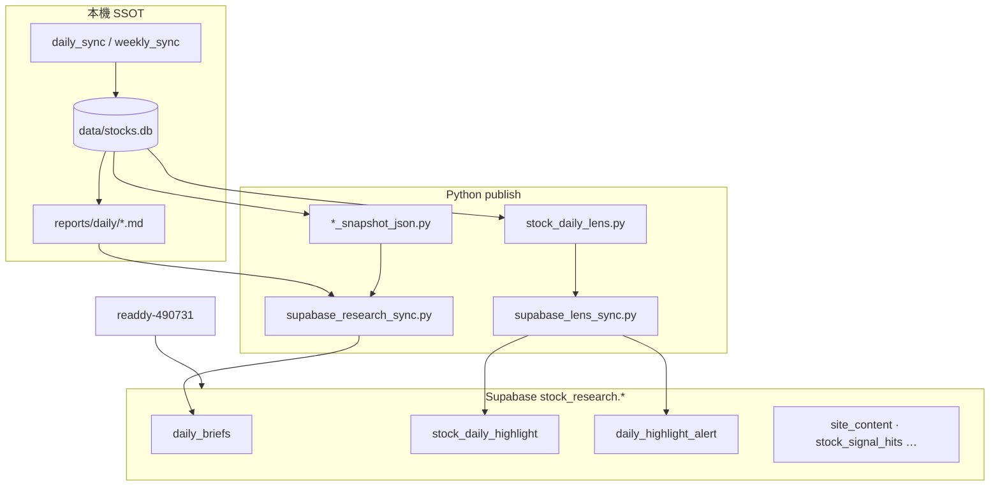

# Readdy 前端瘦身 · view-ready 後端遷移計畫

| 欄位 | 內容 |
|------|------|
| 版本 | 2026-06-23 v1.0 |
| 狀態 | **規劃中** — 待依步驟 0→7 執行 |
| 前端 | `readdy-490731/` |
| 術語 SSOT | [terminology.md](./terminology.md) |
| 相關規劃 | [readdy-regime-strategy-lineage.md](./readdy-regime-strategy-lineage.md) |
| 排程 SOP | [daily-operations.md](./daily-operations.md) |

---

## 0. 這份計畫要解決什麼

Readdy 前端目前承擔了過多 **領域計算、聚合、狀態文案、欄位別名**，與 Python 排程 SSOT 重複維護，且 PIT 一致性難保證。

**目標形態**（不是「砍掉 React」，而是 **責任分層**）：

| 適合後端（Python 排程 + Supabase） | 適合前端（React） |
|-----------------------------------|-------------------|
| Regime 四軸、Lens score、RRG 排名、策略 screen 狀態 | 圖表繪製、Tab、路由、RWD |
| PIT 快照：`snapshot_json` 契約 | loading / error / 空狀態 |
| 中文敘述、KPI 文案、badge 語意 | 表格在已拉回列上的排序／篩選 |
| 每日 batch sync、歷史 backfill 可重播 | 即時報價（Yahoo Edge Function） |

產品本質是 **每日唯讀 brief**（見 `readdy-490731/project_plan.md`），天然適合 **publish-time compute**，不適合把計算拆到瀏覽器。

---

## 1. 資料流：SQLite · Supabase · 前端



| 層 | 技術 | 角色 |
|----|------|------|
| **SQLite** `data/stocks.db` | 本機 | 唯一計算 SSOT：日線、持股、RRG、VCP、廣度 |
| **Markdown** `reports/daily/` | 本機 | 人類可讀日報；`daily_briefs` sync 的觸發條件（檔案存在才 upsert） |
| **Supabase** | 雲端 Postgres | 網站唯讀發布層；`snapshot_json` 在 sync 當下從 SQLite **現算** |

**特殊迴路**：Lens delta 計算時，前一日清單從 **Supabase** `stock_daily_highlight` 讀回（`load_supabase_highlight_for_date`），非 SQLite。今日 highlight **列**不寫回 SQLite，只 push Supabase；SQLite 僅快取 `lens_daily_alert`。

---

## 2. 範圍外（本計畫不處理）

| 項目 | 說明 |
|------|------|
| **Yahoo 每 15 分鐘報價** | `yahoo_quotes` · Edge Function cron · `useYahooQuote.ts` — **暫時不理**，維持現狀 |
| **靜態圖取代 Recharts** | 圖表仍由前端繪製 `chart_series` |
| **`site_content` 大改** | 方法論頁已是 view-ready（`content_md`） |
| **新產品層 / 下單層** | 見 terminology §產品層 |

---

## 3. 理想終態（view-ready 契約）

### 3.1 `daily_highlight_alert`（Lens 日摘要）

前端 **只讀一列**，不再拉全表 `stock_daily_highlight` 做 count。

```json
{
  "trade_date": "2026-06-20",
  "total_count": 53,
  "fire_count": 2,
  "delta_new_count": 4,
  "consensus_add_count": 1,
  "headline_zh": "…",
  "items_json": [ "…" ],
  "computed_at": "…"
}
```

- `items_json`：首頁／日報精選預覽 SSOT（取代 client `isPositiveSignal` + slice）
- 文案 SSOT：`src/lens_ui_copy.py`（前端 `lensUiCopy.ts` 僅留純 UI 標籤，或 codegen）

### 3.2 `stock_daily_highlight`（監控清單列）

| 現況問題 | 終態 |
|----------|------|
| 前端 shim `lens_score` ← `highlight_score` | 前端直接用 `highlight_score` |
| 前端 shim `delta_new_to_lens` | 直接用 `delta_new_to_watchlist` |
| 前端推 `badges_json` | 可選欄位 `badges_json: [{ "key", "label_zh", "tone" }]` |
| 前端 `featured_rank` 篩選 | 可選欄位 `featured_rank`（1–10 為日報精選；null 為清單內其餘） |

列表 **篩選／排序**（全部 / 今日異動 / 持續關注）仍可在前端對已拉回列操作。

### 3.3 `daily_briefs.snapshot_json` — 策略 screen

各策略 snapshot（`copytrade-daily-v1` · `rrg-mono-daily-v1` · `vcp-daily-v1`）統一加：

```json
{
  "screen_status": {
    "kind": "active | empty | monthly | missing",
    "text_zh": "收盤版 3 檔"
  }
}
```

首頁 **表一** 讀 `site_content` 策略 registry + 當日各 brief 的 `screen_status`，**刪** `strategyScreenStatus.ts` 的 resolve switch。

### 3.4 `regime-snapshot-v1` — 首頁環境卡

在既有 `interpretations` · `display` 上擴充：

```json
{
  "context_line_zh": "過熱 · 第 2 階段上升 · RRG 健康 52%",
  "home_kpis": [
    { "key": "breadth_200", "label_zh": "200MA 廣度", "value_zh": "94.4%", "sub_zh": "過熱", "tone": "red" },
    { "key": "trend_stage", "label_zh": "大盤階段", "value_zh": "Stage 2", "sub_zh": "上升", "tone": "green" }
  ],
  "minervini": {
    "checklist_items": [{ "criterion_zh": "…", "desc_zh": "…", "pass": true }]
  }
}
```

前端 **刪** `extractKPIsFromSnapshot` · `formatRegimeContextLine` · `RegimeContent.buildChecklistFromSnapshot`。

### 3.5 VCP snapshot

`vcp_snapshot_json.py` 的 `BRIEF_TYPE_SPECS` **已**依 `brief_type` 過濾 variants；前端 **刪** `filterVcpVariantsForBrief`，直接渲染 `snapshot.variants`。

---

## 4. 可直接刪除的 dead code（步驟 6）

以下檔案 **無任何 import**，可安全刪除：

| 檔案 | 說明 |
|------|------|
| `readdy-490731/src/pages/home/components/LatestBriefSection.tsx` | 未被 `home/page.tsx` 引用 |
| `readdy-490731/src/pages/home/components/IndicatorShowcase.tsx` | 同上 |
| `readdy-490731/src/pages/home/components/MethodologyPreview.tsx` | 同上 |
| `readdy-490731/src/pages/home/components/LayerIntro.tsx` | 同上 |
| `readdy-490731/src/hooks/useMarketAlert.ts` | 無引用；廣度分級邏輯若將來需要，應在 `regime_snapshot_json.py` |

刪除後執行：`cd readdy-490731 && npm run build`（或 `tsc -b`）確認無殘留引用。

---

## 5. 執行順序（0 → 7）

原則：**每步 = 後端加欄位 → migration → sync/backfill → 前端改讀 → 刪前端計算 → 測試**。

### 步驟 0 · 前置（建議先做）

| 動作 | 檔案 / 指令 |
|------|-------------|
| 確認 Supabase migration 已部署 | `supabase/migrations/`（root 與 `readdy-490731/supabase/` 對齊） |
| 確認 `.env` 開關 | `RUN_SUPABASE_RESEARCH_SYNC=1` · `RUN_SUPABASE_LENS_SYNC=1` |
| 建立本計畫跟蹤 | 本文件 §6 勾選表 |

---

### 步驟 1 · 刪欄位 shim，統一 DB 欄位名

**目標**：前端與 Python 共用 `highlight_score` · `delta_new_to_watchlist`（術語 SSOT）。

| 層 | 改動 |
|----|------|
| **前端** | `useDailyLens.ts`：刪 map shim；`StockDailyLens` 型別改欄位名；`daily.tsx` · `LensHomeSection.tsx` 改用 `highlight_score` |
| **後端（可選清）** | `supabase_lens_sync.py` `_normalize_highlight_row` 若僅為相容可保留一版，最終刪 |
| **Supabase** | 無（migration 010 已改名） |
| **測試** | 手動：Lens 列表分數顯示正常 |

**前端可刪**：`useDailyLens` 內 normalize 區塊 · `items_json` 的 `delta_new_to_lens` 別名

**風險**：低 · 純重命名

---

### 步驟 2 · Lens KPI 寫入 `daily_highlight_alert`

**目標**：`useLensKpi` 讀 alert 一列，不再 filter 全表。

| 層 | 改動 |
|----|------|
| **後端** | `src/lens_alert_digest.py`：`build_lens_daily_alert_from_rows` 加 `total_count` · `consensus_add_count` |
| **後端** | `src/supabase_lens_sync.py`：`sync_daily_highlight_alert_to_supabase` · `_alert_row_payload` |
| **SQLite** | `src/stock_db/_schema.py` · `src/stock_db/lens.py`：`lens_daily_alert` 表加欄（本機快取對齊） |
| **Migration** | `supabase/migrations/022_daily_highlight_alert_kpi.sql` |
| **前端** | `useLensKpi.ts`：select 新欄位；刪 client filter |
| **測試** | `tests/test_stock_daily_lens.py` · 更新 alert payload 斷言 |
| **發布** | `scripts/run_stock_daily_lens.py`；歷史：`scripts/backfill_stock_daily_lens.py` |

**前端可刪**：`useLensKpi.ts` 內 `rows.filter(...)` 聚合

**風險**：低

---

### 步驟 3 · snapshot 加 `screen_status`

**目標**：首頁策略列讀 snapshot，刪 `strategyScreenStatus.ts` resolve 邏輯。

| 層 | 改動 |
|----|------|
| **後端** | `src/copytrade_snapshot_json.py` · `src/rrg_snapshot_json.py` · `src/vcp_snapshot_json.py`：加 `screen_status` |
| **後端** | `src/supabase_research_sync.py`：`load_brief` 後可選驗證契約 |
| **前端** | `StrategyScreenStatusBar.tsx`：讀 `screen_status`；刪 `buildStrategyScreenCells` / `resolveStatusForBrief` |
| **測試** | `tests/test_supabase_research_sync.py` · 各 snapshot 單元測試 |
| **發布** | `scripts/sync_research_to_supabase.py --slot 1630`（1300 含 intraday RRG） |

**契約範例**（RRG）：

```json
"screen_status": { "kind": "active", "text_zh": "收盤版 2/7" }
```

**前端可刪**：`lib/strategyScreenStatus.ts` 大部分（保留型別或併入 `briefSnapshots.ts`）

**風險**：中 · 需覆蓋五軌策略 + minervini 月頻特例

---

### 步驟 4 · Regime snapshot 加 `home_kpis` + `context_line_zh`

**目標**：首頁環境卡與一行摘要全從 `regime_daily.snapshot_json` 讀。

| 層 | 改動 |
|----|------|
| **後端** | `src/regime_snapshot_json.py`：加 `context_line_zh` · `home_kpis[]` · `minervini.checklist_items[]` |
| **後端** | `src/regime_interpret.py`：複用既有 `interpret_*`（勿在前端重寫門檻） |
| **前端** | `home/page.tsx`：刪 `extractKPIsFromSnapshot` · `extractDashboardCharts` 內 KPI 文案邏輯 |
| **前端** | `RegimeContent.tsx`：刪 `buildChecklistFromSnapshot` |
| **測試** | `tests/test_regime_snapshot_json.py`（若無則新增） |
| **發布** | `sync_research_to_supabase.py`；歷史：`scripts/backfill_supabase_research.py` |

**前端可刪**：`formatRegimeContextLine` · 首頁廣度「過熱/偏強/偏弱」硬編碼

**風險**：中 · 影響首頁 + Regime 詳頁

---

### 步驟 5 · Lens featured 清單後端預算

**目標**：日報「今日亮點」精選與首頁 preview 由 Python 決定，刪 client 業務篩選。

| 層 | 改動 |
|----|------|
| **後端** | `src/stock_daily_lens.py`：加 `featured_rank` · `badges_json` · `home_preview` 規則（合併現有 `LensHomeSection.isPositiveSignal` 邏輯） |
| **後端** | `src/lens_alert_digest.py`：擴充 `items_json` 或獨立 `featured_json` |
| **後端** | `src/supabase_lens_sync.py`：sync 新欄位 |
| **Migration** | `supabase/migrations/023_highlight_featured_badges.sql` |
| **前端** | `daily.tsx` `LensSection`：刪 `meaningful` filter · `getStrategyPriority` · slice(10) |
| **前端** | `LensHomeSection.tsx`：刪 `isPositiveSignal` · `PositiveDeltaBadge` 推導 |
| **測試** | `tests/test_stock_daily_lens.py` |
| **發布** | `run_stock_daily_lens.py` + backfill ≥20 日 |

**前端可刪**：`LensSection` meaningful filter · `LensHomeSection.isPositiveSignal` · 重複 badge 元件邏輯（收斂為一個 `BadgeList` 讀 `badges_json`）

**風險**：中高 · 需與 email digest · `items_json` 對齊

---

### 步驟 6 · 刪 dead code

見 §4。可與步驟 1 併 PR（純刪檔），或獨立小 PR。

| 驗收 | |
|------|--|
| `npm run build` 通過 | |
| `rg` 無殘留 import | |

**風險**：極低

---

### 步驟 7 · VCP publish 時過濾 variants（前端刪 filter）

**目標**：確認後端 snapshot 已 per-`brief_type` 過濾，前端只渲染。

| 層 | 改動 |
|----|------|
| **後端** | `src/vcp_snapshot_json.py`：確認 `BRIEF_TYPE_SPECS` 產出正確（通常 **無需改**） |
| **前端** | 刪 `filterVcpVariantsForBrief`；`daily.tsx` 直接用 `resolveVcpVariants` |
| **測試** | 手動：vcp_pivot_gate / vcp_coil_close / vcp_funnel_specs 三 tab 表格正確 |

**前端可刪**：`briefSnapshot.ts` 內 `VCP_KEYWORDS` · `filterVcpVariantsForBrief`

**風險**：低

---

## 6. 進度勾選

| 步驟 | 後端 | Migration | 前端 | 測試 | Backfill | 狀態 |
|------|------|-----------|------|------|----------|------|
| 0 前置 | — | — | — | — | — | ☑ |
| 1 欄位 shim | ☑ | — | ☑ | ☑ | — | ☑ |
| 2 Lens KPI | ☑ | 022 | ☑ | ☑ | ☐ | ☑ |
| 3 screen_status | ☑ | — | ☑ | ☑ | ☐ | ☑ |
| 4 regime home | ☑ | — | ☑ | ☐ | ☐ | ☑ |
| 5 Lens featured | ☑ | 023 | ☑ | ☑ | ☐ | ☑ |
| 6 dead code | — | — | ☑ | build | — | ☑ |
| 7 VCP filter | ☑ | — | ☑ | ☐ | — | ☑ |
| 8 欄位 100% | ☑ | — | ☑ | build | — | ☑ |

---

## 7. 後端檔案速查（依功能域）

```
publish 入口
├── scripts/daily_sync.sh
├── scripts/run_stock_daily_lens.py
├── scripts/research_supabase_sync.sh → scripts/sync_research_to_supabase.py
└── scripts/backfill_stock_daily_lens.py · scripts/backfill_supabase_research.py

Lens（步驟 2、5）
├── src/stock_daily_lens.py
├── src/lens_alert_digest.py
├── src/lens_ui_copy.py
├── src/supabase_lens_sync.py
└── src/stock_db/lens.py · src/stock_db/_schema.py

daily_briefs / snapshot（步驟 3、4、7）
├── src/supabase_research_sync.py
├── src/regime_snapshot_json.py
├── src/etf_snapshot_json.py
├── src/vcp_snapshot_json.py
├── src/rrg_snapshot_json.py
└── src/copytrade_snapshot_json.py

健康檢查
└── scripts/supabase_health_check.py
```

---

## 8. 每步完成後的驗收指令

```bash
# 本機測試
PYTHONPATH=src .venv/bin/python -m pytest tests/test_stock_daily_lens.py tests/test_supabase_research_sync.py -q

# 推送 Lens（步驟 2、5 後）
PYTHONPATH=src .venv/bin/python scripts/run_stock_daily_lens.py

# 推送 briefs（步驟 3、4、7 後）
PYTHONPATH=src .venv/bin/python scripts/sync_research_to_supabase.py --slot 1630

# 公開站健康
PYTHONPATH=src .venv/bin/python scripts/supabase_health_check.py

# 前端
cd readdy-490731 && npm run build
```

---

## 9. 理想前端殘留結構（步驟 7 完成後）

```
readdy-490731/src/
├── hooks/
│   ├── useBriefs.ts          # 讀 daily_briefs
│   ├── useDailyLens.ts       # 讀 highlight + alert（無 shim、無 summary 聚合）
│   ├── useLensKpi.ts         # 讀 alert 一列（或併入 useDailyLens）
│   ├── useSiteContent.ts
│   ├── useStrategies.ts
│   └── useYahooQuote.ts      # 範圍外 · 維持
├── lib/
│   ├── briefContracts.ts     # 型別 + 契約驗證（瘦身为 TS only）
│   ├── briefSnapshot.ts      # 薄 getter（或 inline 至元件）
│   └── lensUiCopy.ts         # 純 UI 文案 · 領域文案從 API 讀
├── pages/
│   ├── home/page.tsx         # 讀 snapshot home_kpis · screen_status · alert
│   └── briefs/daily.tsx      # 讀 featured / badges · 無 meaningful filter
└── （已刪）strategyScreenStatus.ts · dead home components · useMarketAlert.ts
```

---

## 10. 與其他文件的關係

- **術語**：對外中文以 [terminology.md](./terminology.md) 為準；`highlight_score` · `delta_new_to_watchlist` · **今日亮點** 等勿再引入 deprecated 別名。
- **策略 lineage**：表一／表二 IA 不變，見 [readdy-regime-strategy-lineage.md](./readdy-regime-strategy-lineage.md)；本計畫只動 **資料契約與責任邊界**。
- **Yahoo 15 分鐘價**：`yahoo_quotes` · cron · `useYahooQuote` — **不在本計畫範圍**。

---

## 11. 步驟 8 · 欄位 100% 利用率（顯示或停推）

**原則**：Python 推上 Supabase 的每一欄，前端必須有對應 UI（哪怕只是 PIT 腳註、tooltip、展開列）；若永遠不給使用者看，**改停推 Supabase**（可留 SQLite 本機／email）。

### 11.1 現況缺口（2026-06-23 盤點）

#### `stock_daily_highlight`

| 欄位 | 現況 | 步驟 8 決策 |
|------|------|-------------|
| `featured_rank` / `home_preview_rank` | 查詢 filter ✓ | 維持；日報可加 `#3` 角標 |
| `badges_json` / `narrative_zh` / `highlight_score` | ✓ | 維持 |
| `consensus_add` / `etf_add_codes` / `consensus_streak_days` | 展開列 ✓ | 維持 |
| `regime_aligned` / `holdings_aligned` / `data_baseline_date` | 展開列 ✓ | 維持 |
| `rrg_*` / `vcp_*` / `copytrade_l1h9_signal` | 展開列 ✓ | 維持 |
| `delta_*` | badges + 部分展開 | `delta_consensus_new_today` 僅 badges，不重複 raw chip |
| **`highlight_tier`** | 僅 `watch` filter | **顯示**：`fire` / `watch` tier chip（10px） |
| **`trend_posture`** | 未顯示 | **顯示**：展開列環境軸一行 |
| **`rrg_tier2`** | 未顯示 | **顯示**：RRG 面板「Tier2」小標（true 時） |
| **`sources_json`** | 未顯示 | **顯示**：展開列可收合「資料來源」；或 **停推 Supabase** |
| **`computed_at`** | 未顯示 | **顯示**：Lens 區塊 `PitBanner` 同步時間 |

#### `daily_highlight_alert`

| 欄位 | 現況 | 步驟 8 決策 |
|------|------|-------------|
| `total_count` / `fire_count` / `delta_new_count` | ✓ | 維持 |
| **`consensus_add_count`** | fetch 未顯示 | **顯示**：KPI 列加「ETF 共識加碼 N 檔」 |
| `headline_zh` | ✓ 首頁 | 維持 |
| **`items_json`** | 未顯示 | **顯示**：首頁 headline 下 top-5 摘要列；或 **停推 Supabase**（留 SQLite／email） |
| **`computed_at`** | 未顯示 | **顯示**：與 highlight 共用 PitBanner |

#### `daily_briefs.snapshot_json` · 策略 tab

| 欄位 | 現況 | 步驟 8 決策 |
|------|------|-------------|
| `screen_status` | 僅首頁策略列 | **顯示**：各策略 tab 標題旁狀態 chip |
| RRG `execution_rule_zh` / `execution_detail_zh` | 硬編碼 footer | **改讀 snapshot**；刪硬編碼句 |
| RRG `session_date` / `data_baseline_date` / `hold_days` / `max_slots` | 未顯示 | **顯示**：RRG tab meta 列（10px） |
| Copytrade `n_slots` / `hold_days` / `signal_date` / `as_of` | 部分硬編碼 | **改讀 snapshot** meta 列 |
| VCP `candidate_count` / variant `candidates[]` | 僅表格 rows | **顯示**：tab 標題旁 `screen_status` + 候選數 |
| ETF `981a_add_count` / `unchanged_etfs` / `skipped_etfs` | 未顯示 | **顯示**：ETF tab 摘要列一行 |

#### Regime snapshot

| 欄位 | 現況 | 步驟 8 決策 |
|------|------|-------------|
| `context_line_zh` / `home_kpis` / `minervini_checklist` | ✓ | 維持 |
| `meta.generated_at` / `benchmark_code` | 未顯示 | **顯示**：Regime tab PitBanner 延伸 |
| `interpretations.*` | RegimeContent ✓ | 維持 |

### 11.2 建議執行順序

```
8a 刪除前端冗餘（低風險）
  → filterVcpVariantsForBrief · VCP_KEYWORDS
  → resolveStatusFallback（brief backfill 完成後）
  → getStrategyPriority（改後端 strategy_group_rank，見 8c）

8b 補齊「一行就好」的 UI（不加新頁）
  → LensKpiBar（4 KPI + consensus_add_count）
  → AlertTopItems（items_json 5 列）
  → HighlightTierChip · LensPitFooter（computed_at）
  → 策略 tab ScreenStatusChip

8c 後端小擴充（可選，換掉前端重複邏輯）
  → featured 列加 strategy_group_rank: 0|1|2|3（對應 RRG/VCP/跟單/其他）
  → 日報分組標題改讀此欄，刪 getStrategyPriority

8d 停推清單（若 8b 不做對應 UI）
  → items_json：僅 SQLite lens_daily_alert + email
  → sources_json：僅 SQLite stock_daily_highlight
```

### 11.3 前端可刪清單（步驟 8a）

| 項目 | 檔案 | 條件 |
|------|------|------|
| `filterVcpVariantsForBrief` | `briefSnapshot.ts` · `daily.tsx` | 後端 `BRIEF_TYPE_SPECS` 已 per-type 過濾 ✓ |
| `VCP_KEYWORDS` | `briefSnapshot.ts` | 同上 |
| `resolveStatusFallback` | `strategyScreenStatus.ts` | 全部 brief 已有 `screen_status` |
| `getStrategyPriority` | `daily.tsx` | 8c `strategy_group_rank` 上線後 |
| `FactTagsBrief` 與 badges 重疊段 | `daily.tsx` | 展開列改讀 `badges_json` + 框架面板 SSOT（或保留面板、刪重複 chip） |
| `ConditionDots` 內象限 heuristics | `stock-search/page.tsx` | 改顯示 `badges_json` 子集 |
| `extractKPIsFromSnapshot` 殘留 | 已刪 ✓ | — |

### 11.4 新建／擴充元件（步驟 8b · 不開新 route）

| 元件 | 用途 | 吃的欄位 |
|------|------|----------|
| `LensKpiBar` | 日報 Lens 標題列 | alert 全 KPI |
| `AlertTopItems` | 首頁 headline 下方 | `items_json[]` |
| `HighlightTierChip` | 列標題 | `highlight_tier` |
| `LensSourcesDisclosure` | 展開列底部 | `sources_json` |
| `ScreenStatusChip` | 策略 tab 標題 | `snapshot.screen_status` |
| `SnapshotMetaRow` | 各 tab 10px 灰字 | `as_of` · `session_date` · `hold_days` 等 |

**不建議**為單一欄位開新頁；100% 靠 **chip / 展開列 / PitBanner / meta 列** 即可。

### 11.5 Python 停推 Supabase（僅當 8b 放棄顯示）

| 欄位 | 調整檔案 |
|------|----------|
| `items_json` | `supabase_lens_sync.py` · migration 024 drop column（可選） |
| `sources_json` | `highlight_row_to_supabase` 改不寫；或寫入精簡 `sources_line_zh` 一字串 |

**建議**：`items_json` 與 `sources_json` **保留推流 + 做最小 UI**，比 drop column 省事（已 backfill）。

### 11.6 進度勾選（步驟 8）

| 子步 | 前端 | 後端 | 狀態 |
|------|------|------|------|
| 8a 刪 VCP filter | ☑ | — | ☑ |
| 8a 刪 status fallback | ☑ | brief backfill | ☑ |
| 8b Lens KPI 全顯示 | ☑ | — | ☑ |
| 8b alert items_json | ☑ | — | ☑ |
| 8b highlight 缺口欄位 | ☑ | — | ☑ |
| 8b 策略 tab meta | ☑ | — | ☑ |
| 8c strategy_group_rank | ☑ | 024 | ☑ |
| 8d 停推（若採用） | — | `supabase_lens_sync.py` | ☐ |

---

*文件維護：每完成一步驟，更新 §6／§11 勾選表與頂部「狀態」欄位。*
