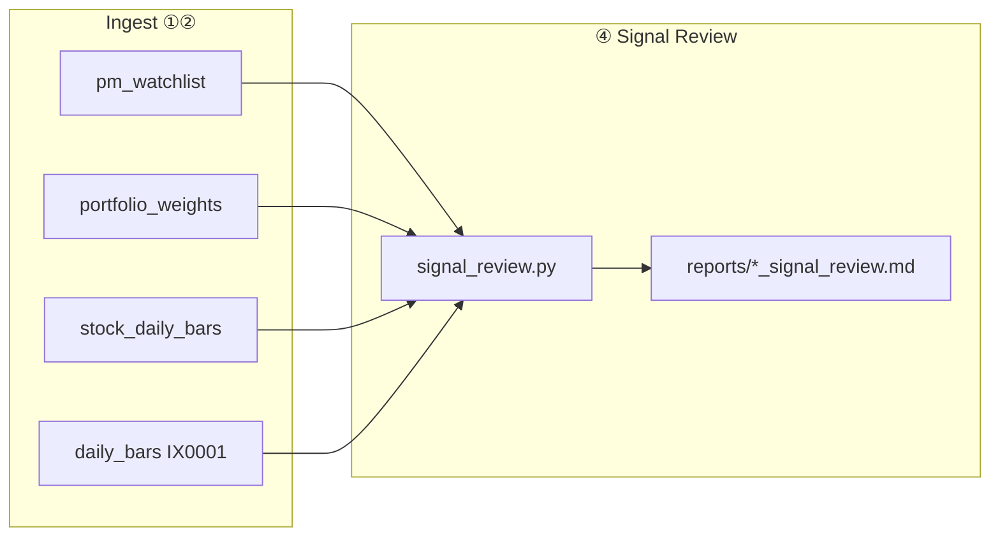

# PRD：④ ETF 策略回顧（Signal Review）

| 欄位 | 內容 |
|------|------|
| 版本 | 0.3 |
| 狀態 | v0.3 已實作（§0 Flow Attribution + flow_events 快照） |
| 層級 | Analytics Layer（只讀） |
| 入口 | `scripts/策略回顧.command` |
| 底層 | `src/signal_review.py` |
| 相關文件 | [PRD.md](./PRD.md)、[daily-operations.md](./daily-operations.md)、[architecture.md](./architecture.md) |
| 最後更新 | 2026-06 |

---

## 1. 摘要

**④ 策略回顧**為方案 C 第四支排程：在 **不修改** ② 收盤持股雷達的前提下，對過去 **7 個 signal-days** 的 `pm_watchlist` / `portfolio_weights` 做 **事後歸因（ex post signal evaluation）**。

v0.2 範圍：

- **Track 1 · Signal Attribution**：分桶表現、橫截面 IC、風控子集（R1–R5）
- **§2b Paper Portfolio**：**單一 10 萬、每日全換、T+1 close-to-close**
- **§2c Paper 持有天數曲線**：**方案 A 全窗口** — 每個 signal-day 一列，**H+1～H+5** 同一買入日（T 收盤）持有至 T+k 收盤

**v0.3 新增**：

- **§0 ETF Flow Attribution**：只讀 `flow_events` 快照（**不 replay** intent 規則）
- **Boss Gate**：H+3 / H+5 加碼組 CAPM α（敘述性通過／未通過）
- **Coverage Table**：Expected vs Available（Survivor Bias 警示）
- **Random Baseline**：**Fixed Seed Random Control**（`BASELINE_RANDOM_SEED=42` + `event_date`）

**不做（v0.3）**：有狀態持倉模擬（Track 2）、自動改 Score 權重、API 同步、塞進 `pipeline_evening.py`。

---

## 1b. v0.3 Flow Events 快照（Phase 0 · ② 寫入）

| 欄位 | 說明 |
|------|------|
| `event_date` / `prev_date` | 對齊 cohort 當日 |
| `stock_id` / `stock_name` | 標的 |
| `net_side` | add / reduce / mixed |
| `consensus` | STRONG / WEAK / SINGLE / FALSE |
| `intent` | BUILD_THEMATIC、ROTATION_PLAY、TRIM_CORE… |
| `conviction` | conviction_score |
| `implied_flow_ntd` | flow_ntd_total |
| `etf_count` | 參與 ETF 數 |
| **`source_etfs`** | **pipe 分隔**，例 `00929\|00940`（供 v0.4 單 ETF 歸因） |
| `flow_version` | `flow-v1` |

- **寫入時機**：② `print_cross_etf_flow_intent_report` 結尾（`sync_flow_events.persist_flow_events`）
- **讀取原則**：④ `flow_attribution` **只讀表**；日後 intent 規則變更不得改寫歷史列

### Baseline Method

| 方法 | 設定 |
|------|------|
| Random Control | `seed = SHA256(f"{BASELINE_RANDOM_SEED}:{event_date}")` |
| 原則 | 同資料重跑，Random 列必須完全一致 |

### Catalyst（v0.3 停權）

- `WEIGHT_CATALYST = 0`：`investment_score` 不計 catalyst 權重
- **保留** `catalyst` 子分寫入 `investment_scores`（未來 Catalyst Attribution）

---

## 2. 問題與目標

### 2.1 問題

①② 產出 **前瞻** 訊號（隔日 watchlist、建議配置），但缺少 **訊號事後量測** 閉環，無法回答：

- 「突破」桶隔日是否優於大盤？
- 風控規則（乖離過大、暫不進場）是否有效？
- 若每日依 `portfolio_weights` 配置 10 萬、T+1 全平，本週損益多少？

### 2.2 目標

| 目標 | 量測 |
|------|------|
| 訊號品質 | 分桶 Mean α、IC、單調性 |
| 模擬損益 | Paper Portfolio 7 日累計 NTD |
| 策略迭代證據 | 固定模板報告；樣本不足時 **不建議** 改 rule |

### 2.3 非目標

- 真實券商倉位 / Live Book P&L
- 交易成本、滑價、稅
- LLM 決策或自動調參
- 7 天累加不賣（持倉堆疊至 70 萬）

---

## 3. 學理依據

| 框架 | 出處／概念 | 本 PRD 對應 |
|------|------------|-------------|
| **Information Coefficient (IC)** | Grinold & Kahn, *Active Portfolio Management* | `investment_score` vs T+1 α 的 Spearman ρ |
| **Event Study** | MacKinlay (1997) | 訊號日 T，量測 T+1 異常報酬 |
| **Portfolio Sort** | Fama-French 因子建構 | 依 `pm_bucket` 分組平均 α |
| **Monotonicity** | 因子單調性檢視 | 突破 ≥ 觀察 ≥ 回避（敘述性） |
| **Paper / Shadow Portfolio** | 無 execution 時的 rule backtest | §2b 每日全換 10 萬；§2c 同權重 H+1～H+5 曲線 |
| **Data Mining 警示** | Harvey, Liu & Zhu (2016) | 樣本 < 20 signal-days 不輸出「建議改 rule」 |

**報告標籤**：**Signal Book · Gross · No transaction costs**（非 Live P&L）。

---

## 4. 方案 C+ 排程定位

| # | 名稱 | 時間 | 性質 |
|---|------|------|------|
| ① | 早盤風險哨 | 平日 08:30 | ingest + 前瞻 |
| ② | 收盤持股雷達 | 平日 16:30 | ingest + 前瞻 |
| ③ | 週日深度補庫 | 週日 20:00 | ingest（慢資料） |
| **④** | **策略回顧** | **隨時** | **analytics（只讀）** |

- 觸發：手動雙擊 `.command`；建議每週至少一次（非硬性 launchd）。
- 不依賴 ③；缺資料則優雅略過，exit 0。



---

## 5. 輸入／輸出

### 5.1 輸入（只讀 `stocks.db`）

| 表 | 用途 |
|----|------|
| `pm_watchlist` | 訊號：分桶、評分、entry、chip（T 日） |
| `portfolio_weights` | Paper：`suggested_ntd`、`portfolio_weight_pct`（T 日） |
| `stock_daily_bars` | 個股 T、T+1 close |
| `daily_bars`（`IX0001`） | 基準 T、T+1 close |
| `tech_risk_daily_snapshot`（可選） | R4 regime 分層 |

**前置**：② 已跑且 `RUN_SCORE_ENGINE=1`；`RUN_STOCK_MARKET_SYNC=1` 才有成分股 T+1。缺則單筆 skip。

### 5.2 參數

| 參數 | 預設 |
|------|------|
| `--lookback-trading-days` | `7`（最近 7 個 **有 pm_watchlist 的 as_of_date**） |
| `--score-version` | `p4-v2` |
| `--as-of` | 今日（窗口終點） |
| `--capital-ntd` | `100000`（`PORTFOLIO_CAPITAL_NTD` 同義） |

### 5.3 輸出

| 檔案 | 說明 |
|------|------|
| `reports/YYYYMMDD_signal_review.md` | 主報告 |
| `logs/signal_review_YYYYMMDD.log` | 執行 log |
| 終端 | 固定結構摘要（≤30 行） |

---

## 6. 量測定義

### 6.1 交易日對齊

- **訊號日** `T` = `pm_watchlist.as_of_date`
- **決策日** = T+1（下一個在 `stock_daily_bars` 與 `daily_bars` 皆存在的交易日）
- **持有期**：T close → T+1 close

### 6.2 報酬與 Alpha（並列）

| 符號 | 定義 |
|------|------|
| \(R_i\) | 個股 \((P_{T+1}-P_T)/P_T\) |
| \(R_m\) | IX0001 同窗口報酬 |
| \(\beta_i\) | `stock_beta`（缺值 **β=1**；估計 vs ^TWII） |
| **raw excess** | \(R_i - R_m\) |
| **CAPM α** | \(R_i - \beta_i R_m\) |

Paper 組合：**β_port** = Σ(`suggested_ntd`×β)/deployed；**CAPM α NTD** = P&L − capital×β_port×R_m。

### 6.3 分桶彙總（`pm_bucket`）

每組：**N、Mean raw、Mean CAPM α、Median CAPM α、CAPM Hit Rate**；IC 用 **CAPM α**。

**敘述性假設**（N≥5 才判定，否則標「樣本不足」）：

- H1：Mean α(突破) ≥ Mean α(觀察) ≥ Mean α(回避)
- H2：突破組 Mean α > 0
- H3：回避組 Mean α ≤ 觀察組

### 6.4 橫截面 IC

每個 T，當日 watchlist 上 Spearman(`investment_score`, `alpha_i`)；報告 Mean IC、IC>0 日比例。

### 6.5 風控子集（R1–R5）

| ID | 條件 | 檢驗 |
|----|------|------|
| R1 | `entry_signal = 乖離過大` | vs 突破組 α |
| R2 | `chip_tag = 外資賣超背離` | vs 同桶 |
| R3 | `pm_bucket = 回避` | Mean α ≤ 0 或 ≤ 大盤 |
| R4 | TSM ADR < −2% 的 session | 科技池 vs 非 regime 日 |
| R5 | L2 假共識 `consensus_level = FALSE` 且 `net_side = add` | vs 非 FALSE |

**R5 資料來源（v0.1）**：`consensus_level` **未持久化**；回顧時對每個 T **replay** `signal_engine` + `position_intent`（只讀 `etf_holdings`）。該日缺 T−1/T 持股 → 該日 R5 skip。

**v0.2（規劃）**：Score Engine 寫入 `investment_scores.metadata_json` 的 `consensus_level`。

### 6.6 出場統計（v0.1 輕量、無狀態機）

統計窗口內 **`暫不進場` / `回避` / weight→0** 次數，及該類標的 T+1 α 摘要（呼應賣出訊號，不實作 Paper Book）。

---

## 7. §2b Paper Portfolio（已認可）

### 7.1 模型

**單一 10 萬、每日全換、T+1 close-to-close**

| 步驟 | 規則 |
|------|------|
| 輸入 | `portfolio_weights`（`as_of_date=T`，`suggested_ntd > 0`） |
| 投入 | 當日實際投入 = \(\sum_i \text{suggested\_ntd}_i\)（通常 ≤ 100,000；餘額視為現金） |
| 持有 | T close → T+1 close |
| 當日損益 | \(\text{P\&L}_T = \sum_i \text{suggested\_ntd}_i \times R_i\) |
| 當日報酬 | \(\text{P\&L}_T / \text{deployed}_T\)（deployed = 當日 suggested_ntd 加總；若 0 則 P&L=0） |
| 7 日累計 | \(\sum_T \text{P\&L}_T\) |
| 基準 | 每日 **100,000 × \(R_m\)** 加總（IX0001 滿倉假設） |
| 超額 | Paper 累計 P&L − Benchmark 累計 P&L |

**禁止表述**：「70 萬本金報酬率」（7 日 turnover 名義 70 萬 ≠ 同時持倉）。

**隱含賣出**：每日全換 = T+1 收盤全部平倉，隔日依新 `portfolio_weights` 再配；不在目標內 = 不持有過夜。

### 7.2 後備

若某日缺 `portfolio_weights`：該日 Paper 列 skip；Track 1 分桶仍可用 `pm_watchlist` 等權近似（報告註明）。

### 7.3 報告表格

```markdown
## §2b Paper Portfolio（10 萬 · 每日全換 · T+1）

> Signal Book · 1-day hold · Gross · No costs

| signal-day | 投入 (NTD) | 當日損益 | 當日報酬 | 基準報酬 | alpha |
|------------|------------|----------|----------|----------|-------|
| 2026-06-03 | 85,000     | +1,200   | +1.41%   | +0.52%   | +890  |
| …          | …          | …        | …        | …        | …     |
| **7 日累計** | —        | **+X**   | **+Y% avg** | **+Z%** | **+W NTD** |
```

- **+Y% avg** = 有投入日的 `P&L_T / deployed_T` 算術平均
- 同期現金閒置部分不計入報酬分母

### 7.4 §2c Paper 持有天數曲線（方案 A · 全窗口）

**目的**：ETF 持股非純短線；在 **不改 §2b** 的前提下，對每個 signal-day 量測 **同一組 `portfolio_weights`** 若持有至 H+1…H+5 的損益曲線，供 PM 判斷「訊號是否值得多拿幾天」。

#### 模型

| 項目 | 規則 |
|------|------|
| 買入日 | signal-day **T**（與 §2b 同日 `portfolio_weights`） |
| 買入價 | **T 收盤** |
| 賣出價（H+k） | **T+k 收盤**（k = 1, 2, 3, 4, 5） |
| 權重 | 當日 `suggested_ntd`（與 §2b 相同投入） |
| 每格損益 | \(\text{P\&L}_{T,k} = \sum_i \text{suggested\_ntd}_i \times R_{i,T\to T+k}\) |
| 每格報酬 | \(\text{P\&L}_{T,k} / \text{deployed}_T\) |
| 基準 α | 每格 `P&L − 100,000 × R_m(T→T+k)`（IX0001） |

**與 §2b 關係**：同一 signal-day 的 **H+1** 應與 §2b 當日列一致（皆為 `compute_paper_hold(T, T+1)`）。§2b 是「每日獨立實驗、隔日全換」；§2c 是「同一買入日、多持有天數對照」，**不累加** 7 日 × 5 格為 35 筆同時持倉。

**缺資料**：若 `stock_daily_bars` 無 T+k 交易日 → 該格 `—`（`skip_no_date`）；缺 weights → 整列 `—`。

#### 報告表格

```markdown
## §2c Paper 持有天數曲線（10 萬 · 全窗口 · 同一買入日）

> 買入：T 收盤 · 賣出：T+k 收盤 · Gross · 每格：損益 NTD / 報酬%

| signal-day | 投入 (NTD) | H+1 | H+2 | H+3 | H+4 | H+5 |
|------------|------------|-----|-----|-----|-----|-----|
| 2026-06-03 | 85,000     | +1,200 / +1.41% | +2,100 / +2.47% | … | … | — |
| …          | …          | …   | …   | …   | …   | …   |

**窗口平均**
- H+1 平均報酬 +X.XX%（N=7 列）
- …
```

- 終端摘要印 **最新 signal-day** 的 H+1…H+5 報酬%
- **窗口平均** = 各 H+k 有 complete 列之 `return_pct` 算術平均

---

## 8. 報告完整結構

```markdown
# Signal Attribution Report（窗口：…）

> Signal Book · 非 Live P&L · Score p4-v2 · 基準 IX0001

## §1 資料覆蓋
## §2 分桶表現（Portfolio Sort）
## §3 Monotonicity 檢視
## §4 橫截面 IC
## §5 風控規則子集（R1–R5）
## §6 異常個案（Top ±α）
## §2b Paper Portfolio（10 萬 · 每日全換 · T+1）
## §2c Paper 持有天數曲線（10 萬 · 全窗口 · 同一買入日）
## §7 出場訊號統計（輕量）
## §8 策略調整備忘（人工）
  - [ ] 樣本 < 20 signal-days：不建議改 rule
## §9 參考文獻（見本 PRD §3）
```

§8 程式只印 checkbox，**不**自動建議改 `score_engine`。

---

## 9. 執行流程

```
1. 雙擊 策略回顧.command
2. signal_review.py --lookback-trading-days 7
3. 列舉最近 7 個 distinct pm_watchlist.as_of_date（≤ as_of）
4. 對每個 T：載入訊號、解析 T+1、計算 R_i、α_i、§2b Paper P&L、§2c H+1～H+5 曲線
5. 彙總 IC、分桶、R1–R5（R5 replay signal）
6. 寫 reports/YYYYMMDD_signal_review.md + log
7. exit 0（無資料亦成功）
```

耗時目標：< 5 秒（純 SQLite）。

---

## 10. 邊界與限制

| 限制 | 說明 |
|------|------|
| 小樣本 | 每週約 5 日 × 每桶 ≤8 檔；統計檢定力弱 |
| 多重檢定 | 同窗口多條 rule，僅敘述、不報 p-value |
| 無交易成本 | alpha / Paper P&L 為 gross |
| 無 execution | 無法量測「是否照做」 |
| 前視偏差 | 嚴禁用 T+1 資料回寫 T 日 score |

---

## 11. 驗收標準

| # | 條件 |
|---|------|
| 1 | 零 API；只讀 DB |
| 2 | 認可之 Paper 模型：§7 公式與表格 |
| 3 | 基準 IX0001；T+1 close-to-close |
| 4 | 7 signal-days 窗口 |
| 5 | 無 pm_watchlist 時優雅說明 |
| 6 | 缺 T+1 K 線單筆 skip |
| 7 | 樣本 < 20 signal-days 預設「不建議改 rule」 |
| 8 | 單元測試：alpha、IC、Paper P&L、分桶 |

---

## 12. 模組邊界

| 模組 | 關係 |
|------|------|
| `pipeline_evening.py` | **不掛鉤** |
| `daily_sync.sh` / `weekly_sync.sh` | **不掛鉤** |
| `operational_brief.py` | R1–R5 語意對齊 |
| `portfolio_engine.py` | 讀 `portfolio_weights` |
| `score_engine.py` | `SCORE_VERSION` 一致 |

---

## 13. 後續擴展（Out of Scope v0.1）

| 項目 | 說明 |
|------|------|
| Track 2 · 有狀態 10 萬 Paper Book | 連續持倉至出場訊號；≥3 週資料後評估 |
| `signal_outcomes` 表 | 持久化每筆 outcome |
| `consensus_level` 寫入 metadata | 簡化 R5 |
| Formal bootstrap | 樣本 > 60 signal-days |
| Live Book 對帳 | 需 Execution Layer |

---

## 14. 已確認決策

| 項目 | 決策 |
|------|------|
| 基準 | **IX0001** |
| 持有期（Track 1 / §2b） | **T+1 close-to-close** |
| §2c 持有曲線 | **H+1～H+5**，同一 T 收盤買入（方案 A 全窗口） |
| 窗口 | **7 個 signal-days** |
| Paper 模型 | **§2b** 單一 10 萬每日全換；**§2c** 同權重多 horizon |
| R5 | v0.1 **replay signal_engine** |
| 報告命名 | `reports/YYYYMMDD_signal_review.md` |
| 收盤雷達 | **不修改** |

---

## 15. 參考文獻

1. Grinold, R. & Kahn, R. — *Active Portfolio Management*
2. MacKinlay, A. C. (1997) — Event Studies in Economics and Finance
3. Fama, E. & French, K. — Portfolio sorts / factor construction
4. Perold, A. (1988) — Implementation Shortfall
5. Harvey, Liu & Zhu (2016) — …and the Cross-Section of Expected Returns
6. Campbell, Lo & MacKinlay — *The Econometrics of Financial Markets*

---

## 16. 實作清單（§22 對照）

| # | 項目 | 狀態 |
|---|------|------|
| 1 | `docs/signal-review-PRD.md` | ✅ |
| 2 | `src/signal_review.py` | ✅ |
| 3 | `scripts/策略回顧.command` | ✅ |
| 4 | `tests/test_signal_review.py`（含 §2c horizon） | ✅ |
| 5 | `daily-operations.md` ④ 速查 | ✅ |
| 6 | `architecture.md` Analytics ④ | ✅ |
| 7 | §2c Paper 持有天數曲線（v0.2） | ✅ |
| 8 | `flow_events` 表 + `sync_flow_events.py`（含 `source_etfs`） | ✅ |
| 9 | `flow_attribution.py` + §0 報告（Coverage · Fixed Seed · Boss Gate） | ✅ |
| 10 | `WEIGHT_CATALYST=0`（保留 catalyst 子分） | ✅ |
| 11 | `tests/test_sync_flow_events.py` · `tests/test_flow_attribution.py` | ✅ |
