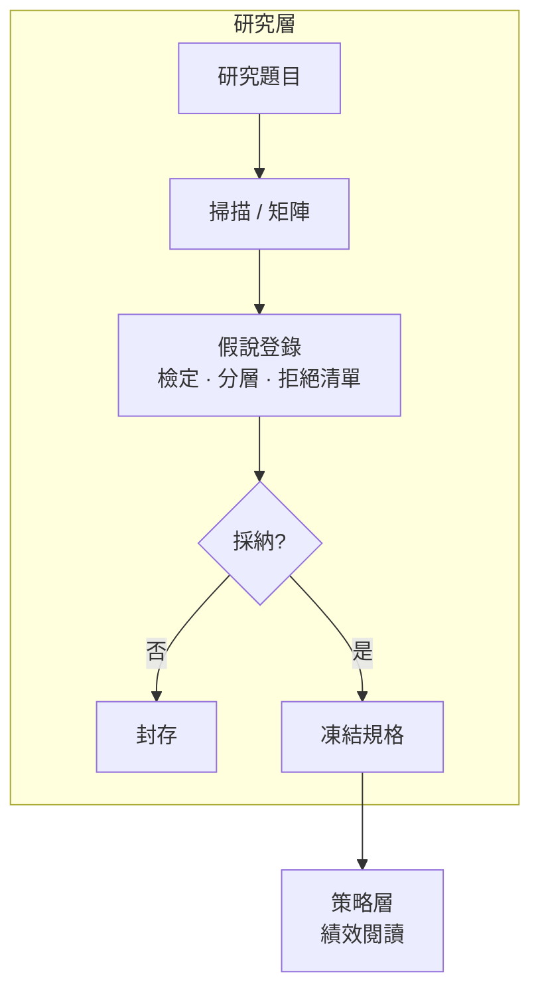

# 研究層

**研究層** 為 **探索性** 工作區：參數掃描 · 矩陣回測 · 假說檢定。結論可推翻；僅 **採納** 後寫入 **策略層** 者成為 **凍結規格**。

| 項目 | 說明 |
|------|------|
| **角色** | 探索 · 掃描 · 假說檢定 |
| **採納去向** | [策略層](layer_strategy) · [策略目錄](strategy_catalog) |
| **網站** | 本頁 + 下方示範案例 |

---

## 研究層怎麼運作

### 與策略層的分工

| | 研究層 | 策略層 |
|---|--------|--------|
| **問題** | 哪組參數／假說有效？ | 鎖定後如何執行、如何讀績效？ |
| **狀態** | 探索 · 可改 | **凍結** · 變更需新一輪回測 |
| **網站** | 本頁 + 示範案例 | [策略目錄](strategy_catalog) + 策略頁 |
| **合成** | 不做 | 不做（僅並行） |

### 標準流程（五步法）

1. **題目登錄** — 定義問題、回測窗口、產出類型  
2. **掃描／矩陣** — 固定 **訊號日僅用當日及以前資料（PIT）**  
3. **主要／次要終點** — 事前定義（例：跟單累計超額 vs 單池實現超額不可混談）  
4. **假說檢定** — 拒絕與採納同等重要  
5. **採納** — 通過門檻 → 凍結規格；否則封存  

### 採納門檻

- 回測可重現 · 批次可稽核  
- 採納理由可指到具體表格列  
- 相近假說之拒絕已記錄  

---

## 現行研究題目

| 題目 | 狀態 | 產出 | 採納策略 |
|------|------|------|----------|
| 跟單進場×持有假說矩陣 | 進行中 | 100 格 · 濾網假說 | [ETF00981A 跟單策略](strategy_00981a_l1h9) |
| VCP選股策略 Minervini 掃描 | 進行中 | ~864 組合 | [VCP 突破確認](strategy_vcp_pivot_gate) · [VCP 訊號收盤](strategy_vcp_coil_close) |
| RRG 廣度分層 | 進行中 | 持有期／槽位 · 廣度分層 | [RRG 單軌](strategy_rrg_mono_hold7) |
| 廣度動量 SEPA 對照 | 進行中 | 外部策略對照 | [Minervini SEPA](strategy_minervini_sepa_basket) |
| 廣度脈衝驗證 | 進行中 | 市場環境 | （[環境層](layer_regime) · 非策略） |
| 因子分層驗證 | 探索中 | 因子 IC | — |
| 外部策略比較 | 探索中 | 與隔日開盤對照 | — |

---

## 示範案例

策略頁保留 **凍結規格** 與 [績效對照](strategy_catalog#績效對照)；**研究過程** 見下表。

| 案例 | 研究問題 | 方法 | 採納產物 |
|------|----------|------|----------|
| [跟單研究案例](research_case_copytrade) | 進場×持有可執行性與超額 · 能否加濾網？ | 100 格矩陣 · 持有期衰減 | [ETF00981A 跟單策略](strategy_00981a_l1h9) |
| [RRG 研究案例](research_case_rrg_mono) | 單軌軌跡 · 持有／槽位 · 廣度 | 參數格 · **廣度分區** 分層 | [RRG 單軌](strategy_rrg_mono_hold7) |
| [VCP 研究案例](research_case_vcp_funnel) | 漏斗參數能否達 RRG 對照基準？ | ~864 組 sweep | [VCP 突破確認](strategy_vcp_pivot_gate) · [VCP 訊號收盤](strategy_vcp_coil_close) |
| [Minervini 研究案例](research_case_minervini_sepa) | 月末Stage 2籃 vs 其他動量規則 | 廣度動量對照實驗 | [Minervini SEPA](strategy_minervini_sepa_basket) |

示範案例內表格區塊隨回測批次更新。

---

## 研究 ≠ 策略

- 掃描結果 **不是** 凍結規格  
- [環境層](layer_regime) 四軸市場環境與 [市場環境日報](/) 搭配閱讀  
- [最新 VCP 探索](/) 與凍結 VCP 策略參數對齊但 **層級不同**
