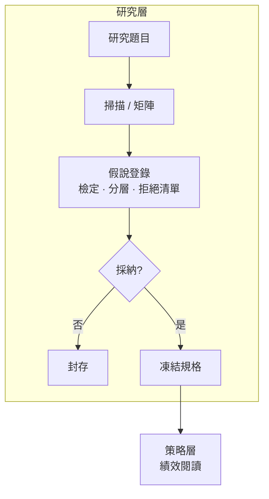

# 研究層

**研究層** 為 **探索性** 工作區：參數掃描 · 矩陣回測 · 假說檢定。結論可推翻；僅 **採納** 後寫入 **策略層** 者成為 **凍結規格**。

| 項目 | 說明 |
|------|------|
| **角色** | 探索 · 掃描 · 假說檢定 |
| **採納去向** | [策略層](layer_strategy) · [策略目錄](strategy_catalog) |
| **公開站** | 本頁方法論（**关于** 附錄）· sweep 大表在 **採納報告**（策略頁第二 tab） |

**勿作** 公開站主 nav 或「研究案例索引」入口 — 讀者從 [策略目錄](strategy_catalog) → 各軌 **採納報告** 進入統計證明表。

---

## 研究層怎麼運作

```mermaid
flowchart TB
  subgraph R[研究層]
    T[研究題目] --> S[掃描 / 矩陣]
    S --> H[假說登錄<br/>檢定 · 分層 · 拒絕清單]
    H --> G{採納?}
    G -->|否| X[封存]
    G -->|是| Y[凍結規格]
  end
  Y --> ST[策略層<br/>績效閱讀]
```

### 與策略層的分工

| | 研究層 | 策略層 |
|---|--------|--------|
| **問題** | 哪組參數／假說有效？ | 鎖定後如何執行、如何讀績效？ |
| **狀態** | 探索 · 可改 | **凍結** · 變更需新一輪回測 |
| **網站** | 方法論（本頁） | [策略目錄](strategy_catalog) · 凍結規格 · 採納報告 |
| **合成** | 不做 | 不做（僅並行） |

**邊界提醒（VCP）**：`VCP 漏斗研究` 屬研究層（可調參）；`VCP 突破確認 / VCP 訊號收盤` 屬策略層（已採納）。

### 標準流程（五步法）

1. **題目登錄** — 定義問題、回測窗口、產出類型  
2. **掃描／矩陣** — 固定 **訊號日僅用當日及以前資料（PIT）**  
3. **主要／次要終點** — 事前定義  
4. **假說檢定** — 拒絕與採納同等重要  
5. **採納** — 通過門檻 → 凍結規格；否則封存  

---

## 已採納策略 · 統計證明在哪讀

| strategy_id | 採納報告（含 AUTO 大表） | 凍結規格 |
|-------------|--------------------------|----------|
| `00981a-l1h9` | 策略頁 **採納報告** tab · L×H 100 格 | [ETF00981A 跟單策略](strategy_00981a_l1h9) |
| `rrg-mono-hold7` | 同上 · 廣度分區分層 | [RRG 市場輪動圖選股策略](strategy_rrg_mono_hold7) |
| `rrg-mono-swap-accel` | 同上 · C18acc sweep | [RRG 四日加速換倉](strategy_rrg_mono_swap_accel) |
| `vcp-pivot-gate` / `vcp-coil-close` | 同上 · ~864 組 sweep Top 25 | [VCP 突破確認](strategy_vcp_pivot_gate) · [VCP 訊號收盤](strategy_vcp_coil_close) |

本機探索 topic（未採納）留在 `config/research.yaml` · `reports/research/`，**不**進公開 nav。

---

## 研究 ≠ 策略

- 掃描結果 **不是** 凍結規格  
- [環境層](layer_regime) 四軸與 [市場環境日報](/) 搭配閱讀  
- [最新 VCP 漏斗研究](/) 與凍結 VCP 策略 **層級不同**
